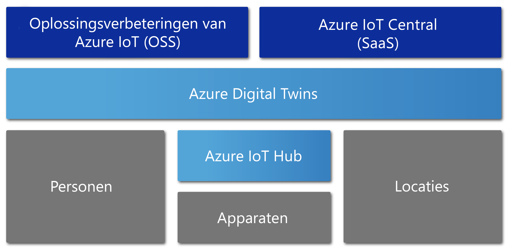

# Overzicht van Azure Digital Twins

Azure Digital Twins is een Azure IoT-service waarmee uitgebreide modellen van de fysieke omgeving worden gemaakt. Er kunnen grafieken voor ruimtelijke intelligentie mee worden gemaakt voor het modelleren van de relaties en interacties tussen personen, ruimten en apparaten.

Met Azure Digital Twins kunt u gegevens opvragen van een fysieke ruimte in plaats van uit veel verschillende sensoren. Deze service helpt u om herbruikbare, zeer schaalbare, ruimtebewuste functionaliteit te bouwen die streaminggegevens uit de digitale en fysieke wereld koppelt. Uw apps worden verbeterd door deze uniek relevante, contextuele functies. Azure Digital Twins kan in de volgende voorbeeldtaken worden gebruikt voor:

- Voorspellen van onderhoudsbehoeften voor een fabriek.
- Analyseren van realtime energiebehoeften van een elektriciteitsnet.
- Optimaliseren van het gebruik van beschikbare ruimte voor een kantoorgebouw.

Azure Digital Twins is van toepassing op allerlei typen omgevingen. Magazijnen, kantoren, scholen, ziekenhuizen en banken zijn slechts enkele voorbeelden. Het kan ook worden gebruikt voor stadions, fabrieken, parkeerplaatsen, parken, smart grids en steden. Azure Digital Twins kan ook in de volgende voorbeeldscenario's worden gebruikt voor:
 
- Volgen van de dagelijkse temperatuur voor meerdere locaties. 
- Bewaken van vliegroutes met intensief droneverkeer.
- Identificeren van zelfrijdende voertuigen. 
- Analyseren van de bezettingsgraad van een gebouw. 
- Vinden van de meestgebruikte kassa in uw winkel. 

Wat uw bedrijfsscenario ook is, er kan een overeenkomstig digitaal exemplaar worden ingericht via Azure Digital Twins.

In de volgende video wordt nader ingegaan op Azure Digital Twins.

> [!VIDEO https://www.youtube.com/embed/TvN_NxpgyzQ]

## Belangrijkste mogelijkheden

Azure Digital Twins biedt de volgende belangrijke mogelijkheden.

### Grafiek voor ruimtelijke intelligentie

De [*grafiek voor ruimtelijke intelligentie*](./concepts-objectmodel-spatialgraph.md), of *ruimtelijke grafiek*, is een virtuele voorstelling van de fysieke omgeving. U kunt het gebruiken om relaties tussen personen, plaatsen en apparaten te modelleren.

Denk eens aan een slimme app voor nutsvoorzieningen waarbij verschillende elektriciteitsmeters in een omgeving zijn betrokken. Het nutsbedrijf moet het elektriciteitsgebruik en de facturering nauwkeurig bijhouden en voorspellen. Elk apparaat en elke sensor moeten worden gemodelleerd met context over de locatie en over de te factureren klant. U kunt de grafiek voor ruimtelijke intelligentie gebruiken om dit soort complexe relaties te modelleren.

### Digital Twin-objectmodellen

[Digital Twin-objectmodellen](./concepts-objectmodel-spatialgraph.md) zijn vooraf gedefinieerde apparaatprotocollen en gegevensschema's. Hiermee worden de domeinspecifieke behoeften van uw oplossing met elkaar in overeenstemming gebracht om het ontwikkelen te versnellen en vereenvoudigen.

Een toepassing voor de bezetting van een ruimte kan bijvoorbeeld vooraf gedefinieerde ruimtetypen gebruiken, zoals een campus, gebouw, verdieping en ruimte.

### Meerdere en geneste tenants

U kunt oplossingen bouwen die veilig schalen en kunnen worden hergebruikt voor meerdere tenants. U kunt ook meerdere subtenants maken die op een geïsoleerde en veilige manier kunnen worden geopend en gebruikt.

Een voorbeeld is een app voor ruimtegebruik die zodanig is geconfigureerd dat de gegevens van een bepaalde tenant binnen één gebouw gescheiden worden van die van andere tenants. De app kan ook worden gebruikt om gegevens voor één tenant met meerdere gebouwen te combineren.

### Geavanceerde rekenmogelijkheden

Met [door de gebruiker gedefinieerde functies](./concepts-user-defined-functions.md) kunt u aangepaste functies definiëren en uitvoeren op basis van binnenkomende [apparaatgegevens](./concepts-device-ingress.md) om signalen te verzenden naar vooraf gedefinieerde eindpunten. Deze geavanceerde functie verbetert de aanpassing en automatisering van apparaattaken.

Een voorbeeld is een slimme landbouwtoepassing met een door de gebruiker gedefinieerde functie voor het weerbericht en voor het aflezen van de meetgegevens van een sensor voor bodemvochtigheid. De app verzendt vervolgens signalen over de behoefte aan irrigatie.

### Ingebouwd toegangsbeheer

Door gebruik te maken van toegangs- en identiteitsbeheerfuncties, zoals [op rollen gebaseerd toegangsbeheer](./security-role-based-access-control.md) en [Azure Active Directory](./security-authenticating-apis.md), kunt u de toegang voor personen en apparaten veilig beheren.

Een voorbeeld is een app voor faciliteitenbeheer die zodanig is geconfigureerd dat de aanwezigen in een ruimte de temperatuur binnen een bepaald bereik kunnen instellen. Facilitymanagers mogen de temperatuur in elke ruimte op een willekeurige waarde instellen.

### Ecosysteem

U kunt een exemplaar van Azure Digital Twins aan talloze Azure-services koppelen. Deze services zijn onder meer Azure Stream Analytics, Azure AI en Azure Storage. Hieronder vallen ook Azure Maps, Microsoft Mixed Reality, Dynamics 365 en Office 365.

Een voorbeeld is een slimme toepassing voor kantoorgebouwen die gebruikmaakt van Azure Digital Twins om teams en apparaten op een groot aantal verdiepingen te vertegenwoordigen. Als apparaten live-gegevens naar het ingerichte Digital Twin-exemplaar streamen, kan Stream Analytics die gegevens verwerken om tot belangrijke conclusies te komen waarop actie kan worden ondernomen. De gegevens worden opgeslagen in Azure Storage en geconverteerd naar een deelbare bestandsindeling. Het bestand wordt via Office 365 gedistribueerd over de hele organisatie.

## Oplossingen die profiteren van Azure Digital Twins

Azure Digital Twins is geschikt om een voorstelling te maken van de fysieke wereld en de talloze relaties ervan. Het maakt IoT-modellering, gegevensverwerking, gebeurtenisafhandeling en apparaattracking eenvoudiger. Hieronder volgen enkele scenario's in diverse branches. Deze profiteren om de volgende redenen van Azure Digital Twins:

* Weergeven van de bezettingsgraad van een ruimte gedurende een langere periode voor een vastgoedbeheerbedrijf, om inzichten te verzamelen over de beste manieren om het kantoorgebouw te configureren.
* Tickets voor werkorders voor een mobiele app activeren. Beveiligingspersoneel eropuit sturen en conciërge- en overige diensten plannen in winkels of sportzalen.
* Realtime weergeven welke ruimten in een gebouw bezet zijn. Vervolgens de gebruikers de gewenste ruimten helpen reserveren.
* Bijhouden waar bedrijfsmiddelen zich in een ruimte bevinden.
* Opladen van elektrische voertuigen optimaliseren door gebruikersvoorkeuren en beperkingen van het energienetwerk te modelleren.

## Azure Digital Twins in de context van andere IoT-services

Azure Digital Twins gebruikt Azure IoT Hub om een verbinding tot stand te brengen tussen de IoT-apparaten en sensoren die alles up-to-date houden met de fysieke wereld. In het volgende diagram ziet u hoe Azure Digital Twins zich verhoudt tot andere Azure IoT-services.

Zie [Azure IoT-technologieën en -oplossingen](https://docs.microsoft.com/azure/iot-fundamentals/iot-services-and-technologies) voor meer informatie over IoT.

## Volgende stappen

Ga naar een korte demo over Azure Digital Twins:

> [!div class="nextstepaction"]
> [Snelstart: beschikbare ruimten zoeken met behulp van Azure Digital Twins](./quickstart-view-occupancy-dotnet.md)

Kijk eens nauwkeuriger naar een toepassing voor faciliteitenbeheer met behulp van Azure Digital Twins:

> [!div class="nextstepaction"]
> [Zelfstudie: Azure Digital Twins implementeren en een ruimtelijke grafiek configureren](./tutorial-facilities-setup.md)

Meer informatie over de basisconcepten van Azure Digital Twins:

> [!div class="nextstepaction"]
> [Informatie over het objectmodel en de grafiek voor ruimtelijke intelligentie van Digital Twins](./concepts-objectmodel-spatialgraph.md)
