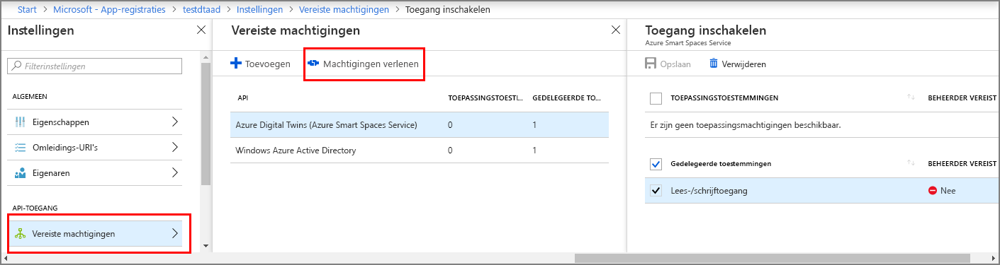

# <a name="how-to-configure-postman-for-azure-digital-twins"></a>Postman voor digitale dubbels voor Azure configureren

In dit artikel wordt beschreven hoe het configureren van de Postman-REST-client om te communiceren met en het testen van de Azure digitale dubbels Management API's. Het beschrijft met name:

* Klik hier voor meer informatie over het configureren van een Azure Active Directory-toepassing voor het gebruik van de stroom van de impliciete goedkeuring voor OAuth 2.0.
* Het gebruik van de Postman-REST-client HTTP-aanvragen voor token-invloed aanbrengen in uw beheer-API's.
* Het gebruik van Postman meerdelige POST-verzoeken aanbrengen in uw beheer-API's.

## <a name="postman-summary"></a>Postman samenvatting

Aan de slag op digitale dubbels van Azure met behulp van een REST-clienthulpprogramma, zoals [Postman](https://www.getpostman.com/) voorbereiden van uw lokale omgeving voor testen. De Postman-client helpt snel complexe HTTP-aanvragen kunt maken. De bureaubladversie van de Postman-client downloaden door te gaan naar [www.getpostman.com/apps](https://www.getpostman.com/apps).

[Postman](https://www.getpostman.com/) is een op REST hulpprogramma waarmee belangrijke functies van HTTP-aanvraag in een handig desktop en GUI-invoegtoepassing op basis van testen. 

Via de Postman-client, oplossingen voor ontwikkelaars kunnen opgeven welk type HTTP-aanvraag (*POST*, *ophalen*, *UPDATE*, *PATCH*, en  *Verwijder*), API-eindpunt om aan te roepen, en het gebruik van SSL. Postman biedt ook ondersteuning voor HTTP-aanvraagheaders toe te voegen, parameters, formuliergegevens en instanties.

## <a name="configure-azure-active-directory-to-use-the-oauth-20-implicit-grant-flow"></a>Azure Active Directory voor het gebruik van de stroom voor OAuth 2.0-impliciete goedkeuring configureren

Configureer uw app in Azure Active Directory voor het gebruik van de stroom van de impliciete goedkeuring voor OAuth 2.0.

1. Volg de stappen in [in deze snelstartgids](https://docs.microsoft.com/azure/active-directory/develop/quickstart-v1-integrate-apps-with-azure-ad) te maken van een Azure AD-toepassing van het type native modus. Of u een bestaande systeemeigen app-registratie opnieuw kunt gebruiken.

1. Onder **vereiste machtigingen**, selecteer **toevoegen** en voer **Azure digitale dubbels** onder **API-toegang toevoegen**. Als de API met uw zoekopdracht niet wordt gevonden, zoekt u in plaats daarvan **Azure Smart Spaces**. Selecteer **machtigingen verlenen > gedelegeerde machtigingen** en **gedaan**.

    

1. Klik op **Manifest** manifest voor de toepassing voor uw app te openen. Stel *oauth2AllowImplicitFlow* naar `true`.

      ![Azure Active Directory-impliciete stroom][1]

1. Configureer een **antwoord-URL** naar `https://www.getpostman.com/oauth2/callback`.

      ![Azure Active Directory-antwoord-URL][2]

1. Kopiëren en houd de **toepassings-ID** van uw app in Azure Active Directory. Het wordt gebruikt in de volgende stappen.

## <a name="obtain-an-oauth-20-token"></a>Een OAuth 2.0-token verkrijgen

Vervolgens instellen en configureren van Postman als u wilt een Azure Active Directory-token verkrijgen. Daarna moet u een geverifieerde HTTP-aanvraag voor digitale dubbels van Azure met behulp van het verkregen token:

1. Ga naar [www.getpostman.com](https://www.getpostman.com/) om de app te downloaden.
1. Controleer uw **autorisatie-URL** juist is. Het duurt de indeling:

    ```plaintext
    https://login.microsoftonline.com/YOUR_AZURE_TENANT.onmicrosoft.com/oauth2/authorize?resource=0b07f429-9f4b-4714-9392-cc5e8e80c8b0
    ```

    | Name  | Vervangen door | Voorbeeld |
    |---------|---------|---------|
    | YOUR_AZURE_TENANT | De naam van uw tenant of organisatie | `microsoft` |

1. Selecteer de **autorisatie** tabblad **OAuth 2.0**, en selecteer vervolgens **nieuwe Access Token ophalen**.

    | Veld  | Waarde |
    |---------|---------|
    | Toekenningstype | `Implicit` |
    | URL voor terugbellen | `https://www.getpostman.com/oauth2/callback` |
    | Auth.-URL | Gebruik de **autorisatie-URL** uit stap 2 |
    | Client-id | Gebruik de **toepassings-ID** voor de Azure Active Directory-app die is gemaakt of nieuwe bestemming krijgen uit de vorige sectie |
    | Bereik | Leeg laten |
    | Status | Leeg laten |
    | Clientverificatie | `Send as Basic Auth header` |

1. De client wordt nu weergegeven als:

   ![Voorbeeld van de postman-client][3]

1. Selecteer **Token aanvragen**.

    >[!TIP]
    >Als u ontvangt het foutbericht 'OAuth 2 kan niet worden voltooid', probeert u het volgende:
    > * Postman, sluit en opent u het opnieuw en probeer het opnieuw.
  
1. Schuif omlaag en selecteer **gebruik Token**.

<div id="multi"></div>

## <a name="make-a-multipart-post-request"></a>Maken van een meerdelige POST-aanvraag

Na het voltooien van de vorige stappen, Postman als u wilt maken van een geverifieerde HTTP meerdelige POST-aanvraag te configureren:

1. Onder de **Header** tabblad, voegt u een HTTP-aanvraagheader sleutel **Content-Type** met waarde `multipart/mixed`.

   ![Inhoudstype meerdelig/gemengd][4]

1. Niet-tekstuele gegevens serialiseren naar bestanden. JSON-gegevens wordt opgeslagen als JSON-bestand.
1. Onder de **hoofdtekst** tabblad, voegt u elk bestand door toe te wijzen een **sleutel** naam selecteren `file` of `text`.
1. Selecteer vervolgens het bestand via de **bestand kiezen** knop.

   ![Voorbeeld van de postman-client][5]

   >[!NOTE]
   > * De Postman-client vereist niet dat meerdelige segmenten een handmatig toegewezen hebben **Content-Type** of **Content-Disposition**.
   > * U hoeft niet om op te geven die kopteksten voor elk onderdeel.
   > * U moet selecteren `multipart/mixed` of een andere correcte **Content-Type** voor de hele aanvraag.

1. Klik ten slotte **verzenden** uw meerdelige HTTP POST-aanvraag indienen.

## <a name="next-steps"></a>Volgende stappen

- Lees voor meer informatie over de digitale dubbels beheer-API's en het gebruik ervan, [over het gebruik van Azure digitale dubbels beheer-API's](how-to-navigate-apis.md).

- Gebruik meerdelige aanvragen voor [blobs toevoegen aan Azure digitale dubbels entiteiten](./how-to-add-blobs.md).

- Lees voor meer informatie over verificatie met de Management API's, [verifiëren met API's](./security-authenticating-apis.md).

<!-- Images -->
[1]: media/how-to-configure-postman/implicit-flow.png
[2]: media/how-to-configure-postman/reply-url.png
[3]: media/how-to-configure-postman/postman-oauth-token.png
[4]: media/how-to-configure-postman/content-type.png
[5]: media/how-to-configure-postman/form-body.png