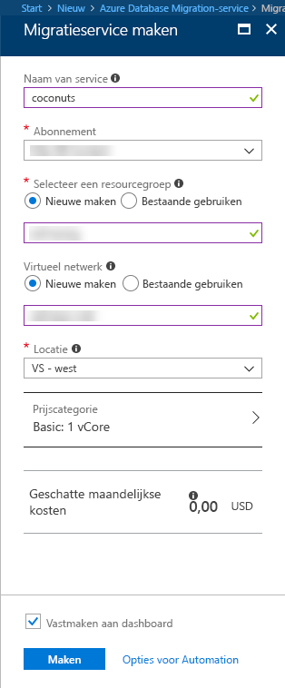

# Maak een Database migratie-Service-exemplaar met de Azure portal
In deze snel starten gebruikt u de Azure portal een exemplaar van de migratie van Azure databaseservice te maken.  Nadat u de service hebt gemaakt, kunt u zich kunt gebruiken om te migreren van gegevens uit SQL Server on-premises naar een Azure SQL database.

Als u nog geen Azure-abonnement hebt, maakt u een [gratis account](https://azure.microsoft.com/free/) voordat u begint.

## Aanmelden bij Azure Portal
Open uw webbrowser en ga naar de [Microsoft Azure Portal](https://portal.azure.com/). Voer uw referenties in om u aan te melden bij de portal. De standaardweergave is uw service-dashboard.

## Migratie-Service van Azure-Database maken
1. Klik op  **+**  een nieuwe service maken.  Migratie-database-Service is nog in preview.  

1. Zoek de marketplace 'migreren', 'Database migratie Service (preview)' selecteren en klik op **maken**.

    

    - Kies een **servicenaam** die gemakkelijk te onthouden en uniek is voor het identificeren van uw Azure-Database migratie Service-exemplaar is.
    - Selecteer uw Azure **abonnement** in die u wilt maken van de Database-Service voor migratie.
    - Maak een nieuwe **netwerk** met een unieke naam.
    - Kies de **locatie** die zich het dichtst bij de bron- of -server.
    - Selecteer Basic: 1 vCore voor de **prijscategorie**.

1. Klik op **Create**.

Na enkele ogenblikken uw Migratieservice voor Azure-Database worden gemaakt en klaar voor gebruik.  U ziet de databaseservice migratie zoals weergegeven in de afbeelding.

## Resources opschonen
U kunt opschonen van de resources die u in de Quick Start hebt gemaakt door het verwijderen van de [Azure-resourcegroep](../azure-resource-manager/resource-group-overview.md).  Als u wilt verwijderen van de resourcegroep, navigeer naar de Database migratie-Service die u hebt gemaakt, klikt u op de **resourcegroep** een naam geven en selecteer vervolgens **resourcegroep verwijderen**.  Deze actie verwijdert alle activa in de resourcegroep, evenals de groep zelf.

## Volgende stappen
> [!div class="nextstepaction"]
> [Migreren van SQL Server on-premises naar Azure SQL-database](tutorial-sql-server-to-azure-sql.md)