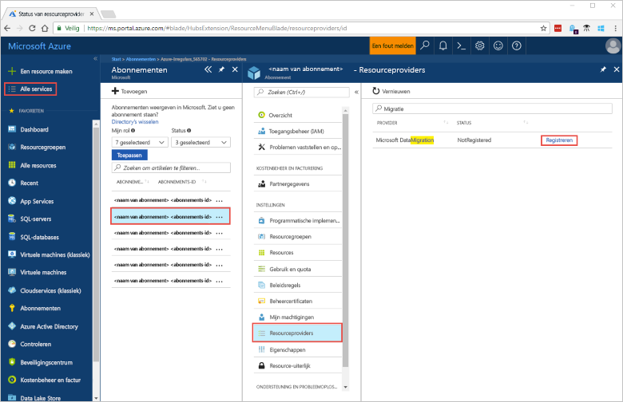
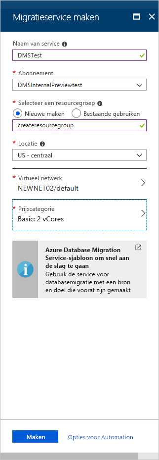
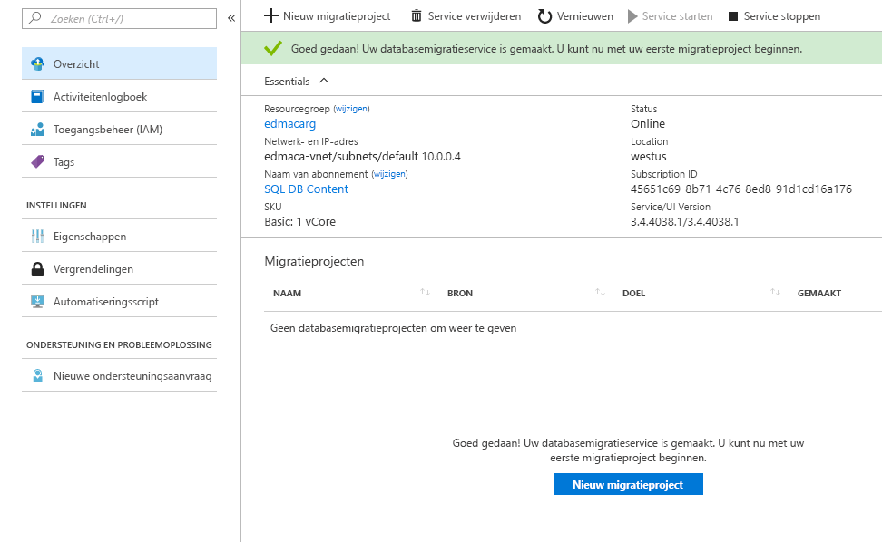

# Quickstart: Een Azure Database Migration Service-exemplaar maken met behulp van Azure Portal
In deze QuickStart maakt u gebruik van Azure Portal om een Azure Database Migration Service-exemplaar te maken.  Nadat u de service hebt gemaakt, kunt u deze gebruiken om gegevens vanuit een on-premises SQL-server te migreren naar een Azure SQL-database.

Als u nog geen Azure-abonnement hebt, maakt u een [gratis account](https://azure.microsoft.com/free/) voordat u begint.

## Aanmelden bij Azure Portal
Open de webbrowser, navigeer naar [Microsoft Azure Portal](https://portal.azure.com/), en voer vervolgens uw referenties in om u aan te melden bij de portal.

De standaardweergave is uw service-dashboard.

## De resourceprovider registreren
Registreer de Microsoft.DataMigration-resourceprovider voordat u uw eerste Database Migration Service-exemplaar maakt.

1. Selecteer in Azure Portal de optie **Alle services** en vervolgens **Abonnementen**.

2. Selecteer het abonnement waarin u het Azure Database Migration Service-exemplaar wilt maken en selecteer vervolgens **Resourceproviders**.

3. Zoek naar migratie en selecteer rechts van **Microsoft.DataMigration** de optie **Registreren**.

    

## Een exemplaar van de service maken
1. Selecteer **+ Een resource maken** om een exemplaar te maken van de Azure Database Migration Service.

2. Zoek in de marketplace naar 'migration', selecteer **Azure Database Migration Service** en selecteer vervolgens in het scherm **Azure Database Migration Service**  de optie **Maken**.

3. Ga in het scherm **Migratieservice maken** als volgt te werk: 

    - Kies een unieke en gemakkelijk te onthouden **Servicenaam** om uw Azure Database Migration Service-exemplaar te identificeren.
    - Selecteer het Azure-**abonnement** waarin u het exemplaar wilt maken.
    - Selecteer een bestaande **Resourcegroep** of maak een nieuwe.
    - Kies de **locatie** die zich het dichtst bij uw bron- of doelserver bevindt.
    - Selecteer een bestaand **Virtueel netwerk** (VNET) of maak een nieuwe.

        Het VNET biedt de Azure Database Migration Service toegang tot de brondatabase en doelomgeving.

        Zie het artikel [Een virtueel netwerk maken met de Azure-portal](https://aka.ms/vnet) voor meer informatie over het maken van een VNET in Azure Portal.

    - Selecteer Basic: 1 vCore als **prijscategorie**.

        

4. Selecteer **Maken**.

    Na enkele ogenblikken is uw Azure Database Migration Service-exemplaar gemaakt en klaar voor gebruik. De Database Migration Service wordt weergegeven zoals in de volgende afbeelding:

    

## Resources opschonen
Alle resources die u in deze QuickStart hebt gemaakt, kunt u verwijderen door de [Azure-resourcegroep](../azure-resource-manager/resource-group-overview.md) te verwijderen. U verwijdert de resourcegroep door te navigeren naar het Azure Database Migration Service-exemplaar dat u hebt gemaakt. Selecteer bij **Resourcegroep** de naam van de resourcegroep en selecteer vervolgens **Resourcegroep verwijderen**. Door deze actie worden alle items in de resourcegroep verwijderd, evenals de groep zelf.

## Volgende stappen
> [!div class="nextstepaction"]
> [Een on-premises SQL-server migreren naar Azure SQL Database](tutorial-sql-server-to-azure-sql.md)