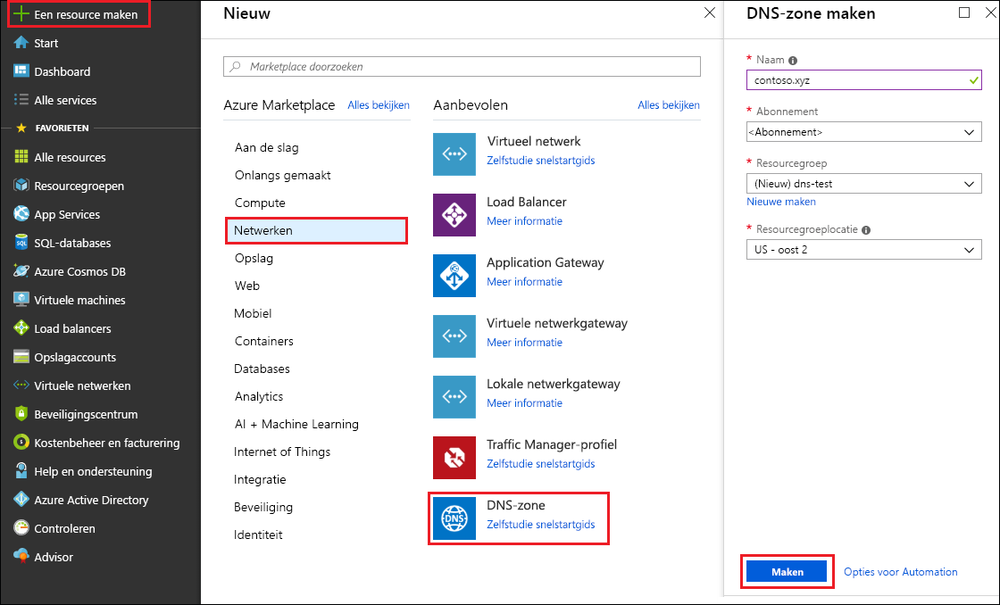
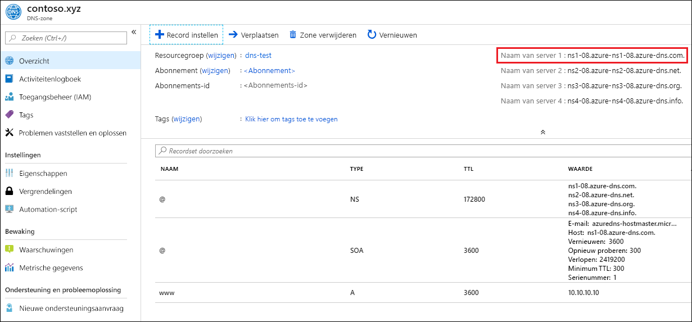

# Aan de slag met Azure DNS met behulp van Azure Portal

> [!div class="op_single_selector"]
> * [Azure Portal](dns-getstarted-portal.md)
> * [PowerShell](dns-getstarted-powershell.md)
> * [Azure CLI 2.0](dns-getstarted-cli.md)

Dit artikel leidt u stapsgewijs door de procedure voor het maken van uw eerste DNS-zone en -record met behulp van Azure Portal. U kunt deze stappen ook uitvoeren met Azure PowerShell of de platformoverschrijdende Azure CLI.

Een DNS-zone wordt gebruikt om de DNS-records voor een bepaald domein te hosten. Als u uw domein wilt hosten in Azure DNS, moet u een DNS-zone maken voor die domeinnaam. Alle DNS-records voor uw domein worden vervolgens gemaakt binnen deze DNS-zone. Tot slot moet u de naamservers voor het domein configureren om de DNS-zone te publiceren naar internet. Deze stappen worden hieronder afzonderlijk beschreven.

## Een DNS-zone maken

1. Aanmelden bij Azure Portal
2. Klik in het menu Hub en klik op **Nieuw > Netwerken >** en klik vervolgens op **DNS-zone** om de pagina **DNS-zone maken** te openen.

    

4. Voer op de pagina **DNS-zone maken** de volgende waarden in en klik op **Maken**:

   | **Instelling** | **Waarde** | **Details** |
   |---|---|---|
   |**Naam**|contoso.com|De naam van de DNS-zone|
   |**Abonnement**|[Uw abonnement]|Selecteer een abonnement waarin de DNS-zone moet worden gemaakt.|
   |**Resourcegroep**|**Nieuwe maken:** contosoDNSRG|Maak een resourcegroep. De naam van de resourcegroep moet uniek zijn binnen het abonnement dat u hebt geselecteerd. Lees het overzichtsartikel over [Resource Manager](../azure-resource-manager/resource-group-overview.md?toc=%2fazure%2fdns%2ftoc.json#resource-groups) voor meer informatie over resourcegroepen.|
   |**Locatie**|VS - west||

> [!NOTE]
> De resourcegroep verwijst naar de locatie van de resourcegroep en heeft geen invloed op de DNS-zone. De locatie van de DNS-zone is altijd 'global' en wordt niet weergegeven.

## Een DNS-record maken

In het volgende voorbeeld ziet u hoe de nieuwe 'A'-record wordt gemaakt. Voor andere typen en voor het wijzigen van bestaande records, raadpleegt u [Manage DNS records and record sets by using the Azure portal](dns-operations-recordsets-portal.md) (DNS-records en -recordsets beheren met behulp van Azure Portal). 

1. Nu de DNS-zone is gemaakt, klikt u in het deelvenster **Favorieten** van Azure Portal op **Alle resources**. Klik op de pagina Alle resources op de DNS-zone **contoso.com**. Als het abonnement dat u hebt geselecteerd, al verschillende resources heeft, kunt u **contoso.com** invoeren in het vak **Filteren op naam...** voor eenvoudige toegang tot de DNS-zone.

1. Selecteer boven in de pagina **DNS-zone** de optie **+ Recordset** om de pagina **Recordset toevoegen** te openen.

1. Voer op de pagina **Recordset toevoegen** de volgende waarden in en klik op **OK**: In dit voorbeeld maakt u een A-record.

   |**Instelling** | **Waarde** | **Details** |
   |---|---|---|
   |**Naam**|www|Naam van de record|
   |**Type**|A| Type DNS-record dat u wilt maken; toegestane waarden zijn A, AAAA, CNAME MX, NS, SRV, TXT en PTR.  Voor meer informatie over recordtypen gaat u naar [Overview of DNS zones and records](dns-zones-records.md) (Overzicht van DNS-zones en -records)|
   |**TTL**|1|Time-to-Live van de DNS-aanvraag.|
   |**TTL-eenheid**|Uren|Maateenheid van de TTL-waarde.|
   |**IP-adres**|ipAddressValue| Dit is het IP-adres dat de DNS-record oplost.|

## Records weergeven

In het onderste gedeelte van de pagina van de DNS-zone ziet u de records voor de DNS-zone. U ziet de standaardrecords voor DNS en SOA, die in elke zone worden gemaakt, plus alle nieuwe records die u hebt gemaakt.

## Naamservers bijwerken

Wanneer uw DNS-zone en -records correct zijn ingesteld, moet u uw domeinnaam configureren voor het gebruik van de Azure DNS-naamservers . Op die manier kunnen andere gebruikers op internet uw DNS-records vinden.

De naamservers voor de zone worden verstrekt in Azure Portal:

Deze naamservers moeten worden geconfigureerd met de domeinnaamregistrar (waar u de domeinnaam hebt gekocht). Uw registrar biedt u de mogelijkheid om de naamservers voor het domein in te stellen. Zie [Uw domein delegeren naar Azure DNS](dns-domain-delegation.md) voor meer informatie.

## Alle resources verwijderen

Als u alle resources wilt verwijderen die u in dit artikel hebt gemaakt, voert u de volgende stappen uit:

1. Klik in het deelvenster **Favorieten** van Azure Portal op **Alle resources**. Klik op de pagina Alle resources op de resourcegroep **MyResourceGroup**. Als het abonnement dat u hebt geselecteerd, al verschillende resources heeft, kunt u **MyResourceGroup** invoeren in het vak **Filteren op naam...** voor eenvoudige toegang tot de resourcegroep.
1. Klik op de pagina **MyResourceGroup** op de knop **Verwijderen**.
1. De portal vereist dat u de naam van de resourcegroep typt om te bevestigen dat u deze wilt verwijderen. Klik op **Verwijderen**, typ *MyResourceGroup* als naam van de resourcegroep en klik op **Verwijderen**. Als u een resourcegroep verwijdert, worden alle resources binnen de resourcegroep verwijderd. Zorg er dus altijd voor dat u de inhoud van een resourcegroep bevestigt, voordat u deze verwijdert. Alle resources die zich in de resourcegroep bevinden en de resourcegroep zelf worden verwijderd. Dit proces duurt enkele minuten.

## Volgende stappen

Zie [Azure DNS Overview](dns-overview.md) (Overzicht van Azure DNS) voor meer informatie over Azure DNS.

Zie [Manage DNS records and record sets in Azure DNS using the Azure portal](dns-operations-recordsets-portal.md) (DNS-records en -recordsets in Azure DNS beheren met behulp van Azure Portal) voor meer informatie over het beheren van DNS-records in Azure DNS.

