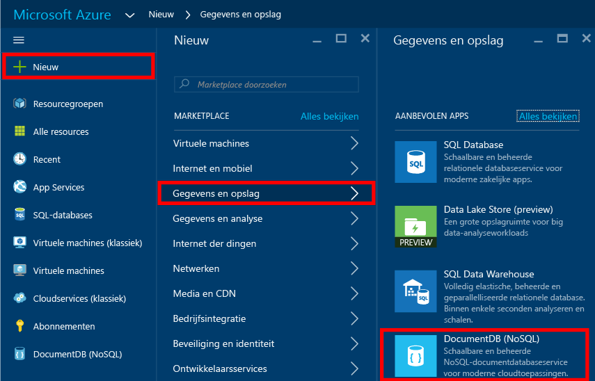
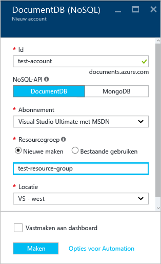
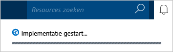
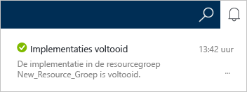
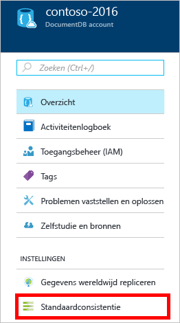
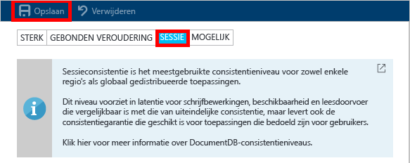

<properties
    pageTitle="Een DocumentDB-account maken met Azure Portal | Microsoft Azure"
    description="Bouw een NoSQL-database met Azure DocumentDB. Volg deze instructies om een DocumentDB-account te maken en bouw uw razendsnelle, wereldwijde NoSQL-database." 
    keywords="een database maken"
    services="documentdb"
    documentationCenter=""
    authors="mimig1"
    manager="jhubbard"
    editor="monicar"/>

<tags
    ms.service="documentdb"
    ms.workload="data-services"
    ms.tgt_pltfrm="na"
    ms.devlang="na"
    ms.topic="get-started-article"
    ms.date="09/12/2016"
    ms.author="mimig"/>

# Een DocumentDB NoSQL-account maken met Azure Portal

> [AZURE.SELECTOR]
- [Azure Portal](documntdb-create-account.md)
- [Azure CLI en Azure Resource Manager](documentdb-automation-resource-manager-cli.md)

Als u een database met Microsoft Azure DocumentDB wilt maken, moet u:

- Een Azure-account hebben. Als u nog geen account hebt, kunt u een [gratis Azure-account](https://azure.microsoft.com/free) krijgen. 
- Een DocumentDB-account maken.  

U kunt een DocumentDB-account maken met Azure Portal, Azure Resource Manager-sjablonen of Azure CLI (Command-Line Interface; opdrachtregelinterface). In dit artikel wordt uitgelegd hoe u een DocumentDB-account maakt met Azure Portal. Zie [Het maken van een DocumentDB-databaseaccount automatiseren](documentdb-automation-resource-manager-cli.md) voor informatie over het maken van een account met Azure Resource Manager of Azure CLI.

Bent u niet bekend met DocumentDB? Bekijk [deze](https://azure.microsoft.com/documentation/videos/create-documentdb-on-azure/) vier minuten durende video van Scott Hanselman om te zien hoe u de meest algemene taken in de online portal uitvoert.

1.  Meld u aan bij de [Azure-portal](https://portal.azure.com/).
2.  Klik in de snelbalk achtereenvolgens op **Nieuw**, **Gegevens en opslag** en **DocumentDB (NoSQL)**.

      

3. In de blade **Nieuw account** geeft u de gewenste configuratie op voor het DocumentDB-account.

    

    - In het vak **Id** typt u de naam die het DocumentDB-account aanduidt.  Wanneer de **id** is gevalideerd, verschijnt een groen vinkje in het vak **Id**. De waarde van **Id** wordt de hostnaam binnen de URI. De **id** mag alleen kleine letters, cijfers en het minteken ('-') bevatten, en moet tussen de 3 en 50 tekens zijn. Houd er rekening mee dat *documents.azure.com* wordt toegevoegd aan de eindpuntnaam die u kiest. Het resultaat hiervan wordt het eindpunt van uw DocumentDB-account.

    - Selecteer in het vak **NoSQL-API** het programmeermodel dat u wilt gebruiken:
        - **DocumentDB**: de API van DocumentDB is beschikbaar via .NET-, Java-, Node.js-, Python- en JavaScript-[SDK's](documentdb-sdk-dotnet.md), evenals HTTP [REST](https://msdn.microsoft.com/library/azure/dn781481.aspx), en biedt programmatische toegang tot alle functionaliteit van DocumentDB. 
       
        - **MongoDB**: DocumentDB biedt ook [ondersteuning op protocolniveau](documentdb-protocol-mongodb.md) voor **MongoDB**-API's. Als u de optie MongoDB-API kiest, kunt u bestaande MongoDB-SDK's en [hulpmiddelen](documentdb-mongodb-mongochef.md) gebruiken voor communicatie met DocumentDB. U kunt uw bestaande MongoDB-apps [zonder codewijzigingen](documentdb-connect-mongodb-account.md) [verplaatsen](documentdb-import-data.md) om DocumentDB te gebruiken. U kunt dan profiteren van een volledig beheerde database als een service, met onbeperkte schaal, globale replicatie en andere functies.

    - Selecteer als **Abonnement** het Azure-abonnement dat u voor het DocumentDB-account wilt gebruiken. Als uw account slechts één abonnement heeft, wordt dit account standaard geselecteerd.

    - In **Resourcegroep** selecteert of maakt u een resourcegroep voor uw DocumentDB-account.  Standaard wordt een nieuwe resourcegroep gemaakt. Zie [Using the Azure portal to manage your Azure resources](../articles/azure-portal/resource-group-portal.md) (De Azure-portal gebruiken om uw Azure-resources te beheren) voor meer informatie.

    - Gebruik **Locatie** om de geografische locatie op te geven waar uw DocumentDB-account moet worden gehost. 

4.  Zodra de opties voor het nieuwe DocumentDB-account zijn geconfigureerd, klikt u op **Maken**. Controleer de hub Meldingen als u de status van de implementatie wilt bekijken.  

      

    

5.  Nadat het DocumentDB-account is gemaakt, kan het met de standaardinstellingen worden gebruikt. De standaardconsistentie van het DocumentDB-account is ingesteld op **Sessie**.  U kunt de standaardconsistentie aanpassen door in het resourcemenu op **Standaardconsistentie** te klikken. Zie [Consistency levels in DocumentDB](documentdb-consistency-levels.md) (Consistentieniveaus in DocumentDB) voor meer informatie over de consistentieniveaus die DocumentDB te bieden heeft.

      

      

[Procedure: een DocumentDB-account maken]: #Howto
[Volgende stappen]: #NextSteps
[documentdb-manage]:../articles/documentdb/documentdb-manage.md

## Volgende stappen

Nu u een DocumentDB-account hebt, gaat u in de volgende stap de DocumentDB-database bouwen. 

Gebruik een van de volgende manieren om een database te bouwen:

- Met de Azure-portal, zoals is beschreven in [Create a DocumentDB database using the Azure portal](documentdb-create-database.md) (Een DocumentDB-database maken met de Azure-portal).
- Met de allesomvattende zelfstudies, die ook voorbeeldgegevens bevatten: [.NET](documentdb-get-started.md), [.NET MVC](documentdb-dotnet-application.md), [Java](documentdb-java-application.md), [Node.js](documentdb-nodejs-application.md) of [Python](documentdb-python-application.md).
- Met de [.NET](documentdb-dotnet-samples.md#database-examples)-, [Node.js](documentdb-nodejs-samples.md#database-examples)- of [Python](documentdb-python-samples.md#database-examples)-voorbeeldcode die beschikbaar is in GitHub.
- Met de [.NET](documentdb-sdk-dotnet.md)-, [Node.js](documentdb-sdk-node.md)-, [Java](documentdb-sdk-java.md)-, [Python](documentdb-sdk-python.md)- en [REST](https://msdn.microsoft.com/library/azure/mt489072.aspx)-SDK's.

Nadat de database is gemaakt, moet u [een of meer verzamelingen toevoegen ](documentdb-create-collection.md) aan de database en vervolgens [documenten toevoegen](documentdb-view-json-document-explorer.md) aan de verzamelingen.

Wanneer er documenten in een verzameling staan, kunt u [DocumentDB SQL](documentdb-sql-query.md) gebruiken om [query's uit te voeren](documentdb-sql-query.md#executing-queries) voor uw documenten. U kunt query's uitvoeren met behulp van de [Queryverkenner](documentdb-query-collections-query-explorer.md) in de portal, de [REST-API](https://msdn.microsoft.com/library/azure/dn781481.aspx) of een van de [SDK's](documentdb-sdk-dotnet.md).

### Meer informatie

Raadpleeg de volgende informatie voor meer informatie over DocumentDB:

-   [Leertraject voor DocumentDB](https://azure.microsoft.com/documentation/learning-paths/documentdb/)
-   [Hiërarchisch DocumentDB-resourcemodel en -concepten](documentdb-resources.md)

<!---HONumber=Sep16_HO3-->

