# <a name="create-and-route-blob-storage-events-with-the-azure-portal-and-event-grid"></a>Blob-opslaggebeurtenissen maken en routeren met Azure Portal en Event Grid

Azure Event Grid is een gebeurtenisservice voor de cloud. In dit artikel gebruikt u Azure Portal om een Blob-opslagaccount te maken, u aan te melden bij gebeurtenissen voor die blob-opslag en een gebeurtenis te activeren om het resultaat weer te geven. Normaal gesproken verzendt u gebeurtenissen naar een eindpunt dat de gebeurtenisgegevens verwerkt en vervolgens in actie komt. Ter vereenvoudiging van dit artikel stuurt u hier de gebeurtenissen echter naar een web-app die de berichten verzamelt en weergeeft.

[!INCLUDE [quickstarts-free-trial-note.md](../../includes/quickstarts-free-trial-note.md)]

Wanneer u klaar bent, ziet u dat de gebeurtenisgegevens naar de web-app zijn verzonden.

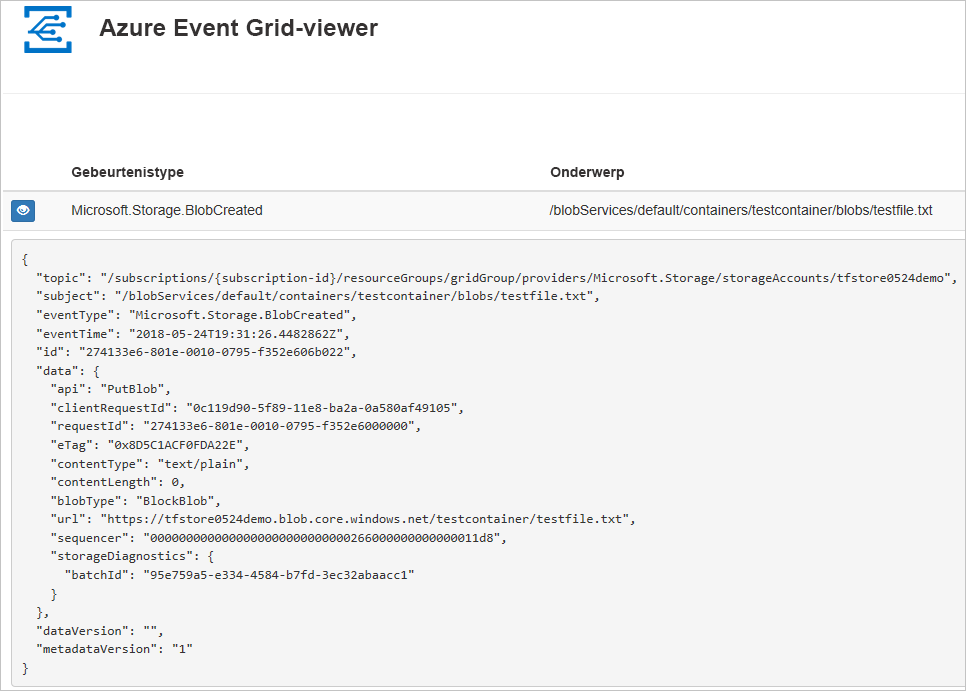

## <a name="create-a-storage-account"></a>Create a storage account

1. Meld u aan bij de [Azure-portal](https://portal.azure.com/).

1. Selecteer **Een resource maken** als u een Blob-opslag wilt maken. 

   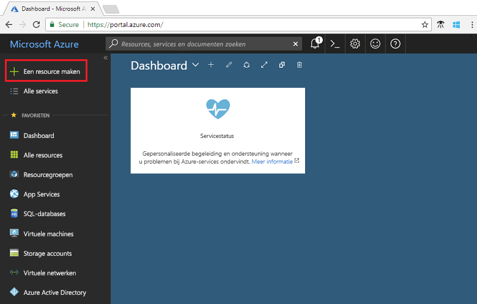

1. Selecteer **Opslag** als u de beschikbare opties wilt filteren en selecteer **Storage-account - blob, file, table, queue**.

   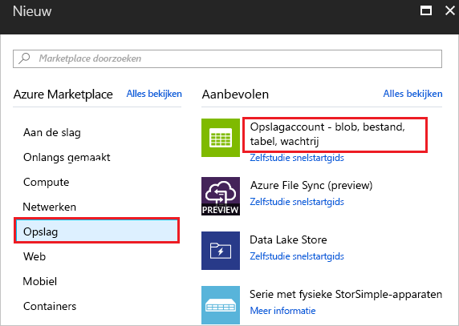

1. Voor gebeurtenissen moet u een [Blob-opslagaccount](../storage/common/storage-create-storage-account.md?toc=%2fazure%2fstorage%2fblobs%2ftoc.json#blob-storage-accounts) of een [algemeen v2-opslagaccount](../storage/common/storage-account-options.md#general-purpose-v2-accounts) maken. Voor toepassingen die alleen blok- of toevoeg-blob-opslag nodig hebben, wordt het gebruik van Blob-opslagaccounts aangeraden. Geef waarden op voor het Blob- of StorageV2-account. Geef een unieke naam op voor het account. Wanneer u klaar bent met het opgeven van waarden, klikt u op **Maken**.

   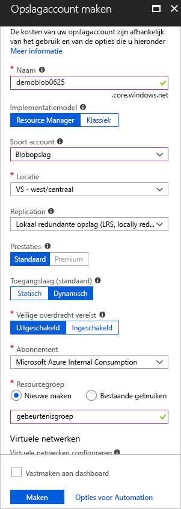

## <a name="create-a-message-endpoint"></a>Het eindpunt van een bericht maken

Voordat u zich kunt abonneren op gebeurtenissen voor de Blob-opslag, moet u het eindpunt voor het gebeurtenisbericht maken. Het eindpunt onderneemt normaal gesproken actie op basis van de gebeurtenisgegevens. Ter vereenvoudiging van deze snelstart gaat u een [vooraf gebouwde web-app](https://github.com/dbarkol/azure-event-grid-viewer) implementeren waarmee de gebeurtenisberichten worden weergegeven. De geïmplementeerde oplossing omvat een App Service-plan, een App Service-web-app en broncode van GitHub.

1. Selecteer **Implementeren in Azure** om de oplossing voor uw abonnement te implementeren. Geef in Azure Portal waarden op voor de parameters.

   <a href="https://portal.azure.com/#create/Microsoft.Template/uri/https%3A%2F%2Fraw.githubusercontent.com%2Fdbarkol%2Fazure-event-grid-viewer%2Fmaster%2Fazuredeploy.json" target="_blank"></a>

1. De implementatie kan enkele minuten duren. Controleer of uw web-app wordt uitgevoerd nadat de implementatie is voltooid. Navigeer in een webbrowser naar: `https://<your-site-name>.azurewebsites.net`

1. De site wordt weergegeven, maar er zijn nog geen gebeurtenissen op gepubliceerd.

   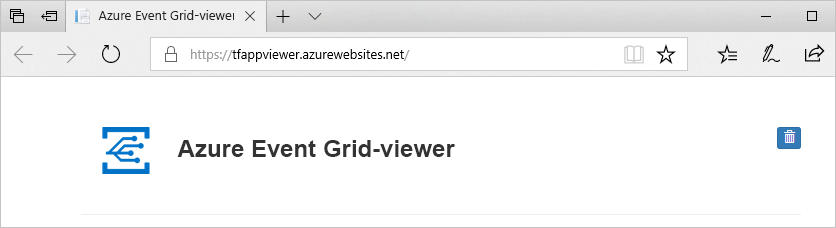

[!INCLUDE [event-grid-register-provider-portal.md](../../includes/event-grid-register-provider-portal.md)]

## <a name="subscribe-to-the-blob-storage"></a>Abonneren op de Blob-opslag

U abonneert u op een onderwerp om Event Grid te laten weten welke gebeurtenissen u wilt traceren en waar de gebeurtenissen naartoe moeten worden gestuurd.

1. Selecteer de blob-opslag in de portal en selecteer **Gebeurtenissen**.

   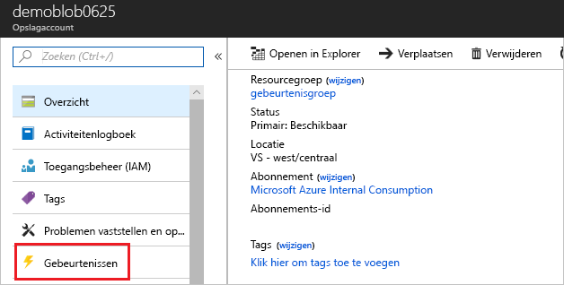

1. Gebruik een webhook voor het eindpunt als u gebeurtenissen naar uw viewer-app wilt verzenden. Selecteer **Meer opties** en **Webhook**.

   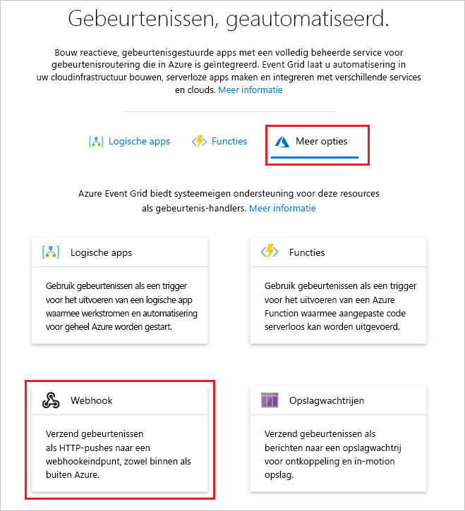

1. Het gebeurtenisabonnement wordt vooraf gevuld met waarden voor de Blob-opslag. Voor het webhookeindpunt geeft u de URL van uw web-app op en voegt u `api/updates` toe aan de URL van de startpagina. Geef het abonnement een beschrijvende naam. Wanneer u klaar bent, selecteert u **Maken**.

   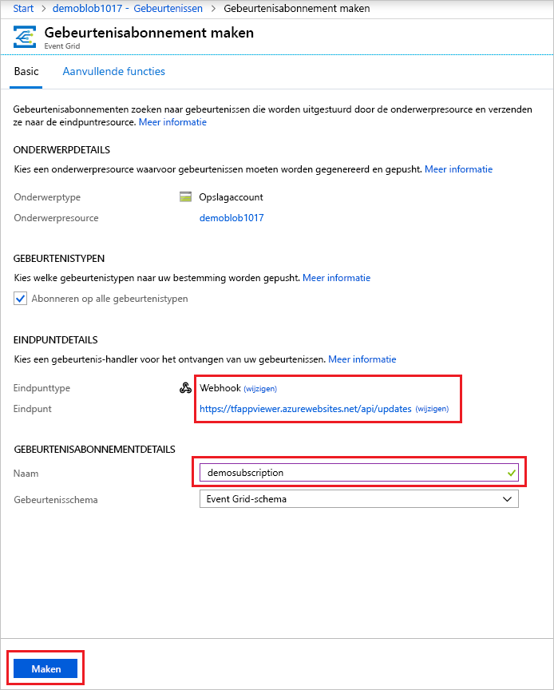

1. Bekijk opnieuw uw web-app en u zult zien dat er een validatiegebeurtenis voor een abonnement naartoe is verzonden. Selecteer het oogpictogram om de gebeurtenisgegevens uit te breiden. Via Event Grid wordt de validatiegebeurtenis verzonden zodat het eindpunt kan controleren of de gebeurtenisgegevens in aanmerking komen om ontvangen te worden. De web-app bevat code waarmee het abonnement kan worden gevalideerd.

   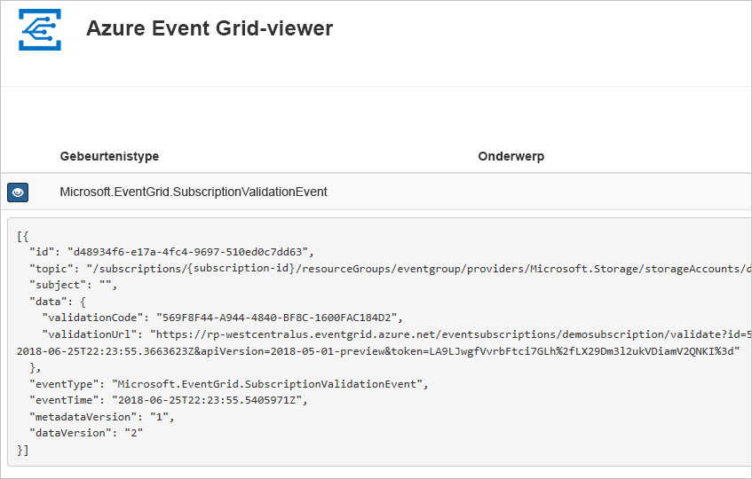

Nu gaan we een gebeurtenis activeren om te zien hoe het bericht via Event Grid naar het eindpunt wordt gedistribueerd.

## <a name="send-an-event-to-your-endpoint"></a>Een gebeurtenis verzenden naar het eindpunt

U activeert een gebeurtenis voor de Blob-opslag door een bestand te uploaden. Het bestand heeft geen specifieke inhoud nodig. In de artikelen wordt ervan uitgegaan dat u een bestand met de naam testfile.txt hebt, maar het bestand kan elke willekeurige naam hebben.

1. Selecteer **Blobs** voor de Blob-opslag.

   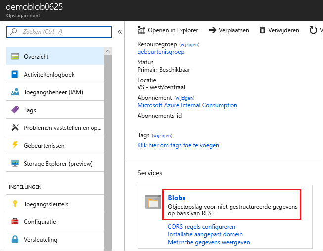

1. Selecteer **+ Container**. Geef de container een naam en gebruik een willekeurig toegangsniveau.

   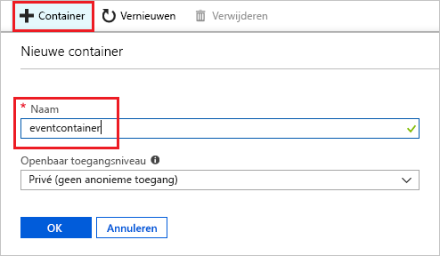

1. Selecteer de nieuwe container.

   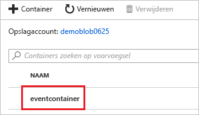

1. Als u een bestand wilt uploaden, selecteert u **Uploaden**.

   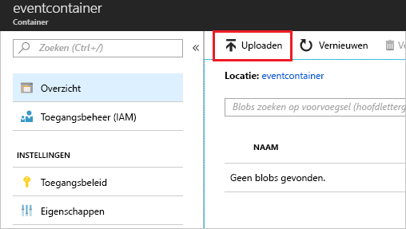

1. Blader naar het testbestand en upload het.

1. U hebt de gebeurtenis geactiveerd en Event Grid heeft het bericht verzonden naar het eindpunt dat u hebt geconfigureerd toen u zich abonneerde. Bekijk uw web-app en u ziet dat er een gebeurtenis Blob gemaakt is ontvangen. 

  ```json
  {
    "topic": "/subscriptions/{subscription-id}/resourceGroups/eventgroup/providers/Microsoft.Storage/storageAccounts/demoblob0625",
    "subject": "/blobServices/default/containers/eventcontainer/blobs/testfile.txt",
    "eventType": "Microsoft.Storage.BlobCreated",
    "eventTime": "2018-06-25T22:50:41.1823131Z",
    "id": "89a2f9da-c01e-00bb-13d6-0c599506e4e3",
    "data": {
      "api": "PutBlockList",
      "clientRequestId": "41341a9b-e977-4a91-9000-c64125039047",
      "requestId": "89a2f9da-c01e-00bb-13d6-0c5995000000",
      "eTag": "0x8D5DAEE13C8F9ED",
      "contentType": "text/plain",
      "contentLength": 4,
      "blobType": "BlockBlob",
      "url": "https://demoblob0625.blob.core.windows.net/eventcontainer/testfile.txt",
      "sequencer": "00000000000000000000000000001C24000000000004712b",
      "storageDiagnostics": {
        "batchId": "ef633252-32fd-464b-8f5a-0d10d68885e6"
      }
    },
    "dataVersion": "",
    "metadataVersion": "1"
  }
  ```

## <a name="clean-up-resources"></a>Resources opschonen

Als u verder wilt werken met deze gebeurtenis, schoon dan de resources die u in dit artikel hebt gemaakt, niet op. Verwijder anders de resources die u in dit artikel hebt gemaakt.

Selecteer de resourcegroep en klik op **Resourcegroep verwijderen**.

## <a name="next-steps"></a>Volgende stappen

U weet nu hoe u aangepaste onderwerpen maakt en hoe u zich abonneert op een gebeurtenis. Kijk waar Event Grid u nog meer bij kan helpen:

- [Over Event Grid](overview.md)
- [Blob Storage-gebeurtenissen naar een aangepast eindpunt op het web routeren](../storage/blobs/storage-blob-event-quickstart.md?toc=%2fazure%2fevent-grid%2ftoc.json)
- [Monitor virtual machine changes with Azure Event Grid and Logic Apps](monitor-virtual-machine-changes-event-grid-logic-app.md) (Wijzigingen in virtuele machines bewaken met Azure Event Grid en Logic Apps)
- [Big data streamen naar een datawarehouse](event-grid-event-hubs-integration.md)
