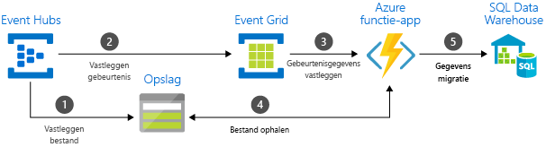

# Kiezen tussen Azure-services die berichten te leveren

Azure biedt drie services die u helpen met het leveren van de event-berichten in een oplossing. Deze services zijn:

* [Gebeurtenis raster](/azure/event-grid/)
* [Event Hubs](/azure/event-hubs/)
* [Service Bus](/azure/service-bus-messaging/)

Hoewel ze een aantal overeenkomsten hebben, wordt elke service is ontworpen voor bepaalde scenario's. Dit artikel worden de verschillen tussen deze services en geeft die u inzicht te kiezen voor uw toepassing. In veel gevallen worden de messaging-services zijn aanvullende en kunnen samen worden gebruikt.

## Gebeurtenis versus bericht services

Er is een belangrijk verschil tussen services kunnen een gebeurtenis bieden en services die ervoor zorgen dat een bericht gemeld.

### Gebeurtenis

Een gebeurtenis is een lichtgewicht melding van een actie of een statuswijziging. De gebeurtenisgegevens bevat informatie over wat er gebeurd is, maar heeft geen gegevens waarvoor de gebeurtenis. Bijvoorbeeld, een gebeurtenis ontvangt een melding abonnees of een bestand is gemaakt. Deze algemene informatie over het bestand mogelijk, maar het bevat niet het bestand zelf. Gebeurtenissen activeren in het algemeen gebeurtenis-handlers om te fungeren als realtime.

### Bericht

Een bericht is onbewerkte gegevens geproduceerd door de service moet worden gebruikt of elders opgeslagen. Het bericht bevat de gegevens waarmee de pijplijn bericht is geactiveerd. Dit bericht kan van alles uit een e-commerce order naar telemetrie van de gebruiker zijn. In tegenstelling tot een gebeurtenismelding kan de uitgever van een bericht een antwoord verwachten. Bijvoorbeeld, een bericht bevat de onbewerkte gegevens maar het volgende gedeelte van het systeem een bestand te maken van die gegevens verwacht.

## Vergelijking van services

| Service | Doel | Type | Wanneer gebruikt u dit? |
| ------- | ------- | ---- | ----------- |
| Event Grid | Reactieve programmering | Gebeurtenisdistributie | Reageren op statuswijzigingen |
| Event Hubs | BIG data-pipeline | Streaming-gebeurtenis | Telemetrie- en gedistribueerde gegevensstromen |
| Service Bus | Berichtenverzending voor bedrijven in hoogwaardige | Bericht | Verwerking en financiële transacties |

### Event Grid

Gebeurtenis raster is een eventing backplane waarmee gebeurtenisafhankelijke, reactieve programmering. Hierbij publiceren-abonneren model. Uitgevers verzenden van gebeurtenissen, maar hebben geen verwachting over welke gebeurtenissen worden verwerkt. Abonnees bepalen welke gebeurtenissen te verwerken.

Gebeurtenis raster is nauw geïntegreerd met Azure-services en kan worden geïntegreerd met services van derden. Het vereenvoudigt het verbruik van de gebeurtenis en verlaagt de kosten door hoeft u de constante polling. Gebeurtenis raster routeert efficiënt en betrouwbaar gebeurtenissen van Azure en niet-Azure-resources. Deze distribueert gebeurtenissen aan geregistreerde abonneeserver eindpunten. Het gebeurtenisbericht bevat informatie die u nodig hebt om te reageren op wijzigingen in de services en toepassingen. Raster gebeurtenis is niet een gegevens-pijplijn en levert niet het werkelijke object dat is bijgewerkt.

Deze heeft de volgende kenmerken:

* dynamisch schaalbare
* Lage kosten
* Zonder server

### Event Hubs

Azure Event Hubs is een big data-pijplijn. Dit vereenvoudigt de vastleggen, bewaren en replay van Telemetrie en gebeurtenis stroomgegevens. De gegevens kunnen afkomstig zijn van veel gelijktijdige bronnen. Event Hubs kunnen Telemetrie en gebeurtenis gegevens worden voor tal van stroom verwerking infrastructuren en analyses services beschikbaar worden gesteld. Het is beschikbaar als gegevensstromen of gebundelde gebeurtenis batches. Deze service biedt één oplossing waarmee u snel gegevens ophalen voor realtime verwerking, evenals herhaalde replay van opgeslagen onbewerkte gegevens. Dit kan de streaming gegevens vastgelegd in een bestand voor verwerking en analyse.

Deze heeft de volgende kenmerken:

* lage latentie
* kunnen worden ontvangen en verwerken van miljoenen gebeurtenissen per seconde

### Service Bus

Service Bus is bedoeld voor traditionele bedrijfstoepassingen. Deze bedrijfstoepassingen vereisen transacties, rangschikken, detectie van duplicaten en onmiddellijk consistentie. Service Bus kunnen cloud-systeemeigen toepassingen bieden betrouwbare statusbeheer overgang voor bedrijfsprocessen. Gebruik Azure Service Bus bij de verwerking van hoge waarde berichten die kunnen worden verbroken en kan worden gedupliceerd. Service Bus ook kunt u maximaal beveiligde communicatie in hybride cloud-oplossingen en verbinding maken met bestaande on-premises systemen naar cloudoplossingen.

Service Bus is een brokered messaging-systeem. Opgeslagen berichten in een 'broker' (bijvoorbeeld een wachtrij) totdat de verbruikende partij gereed is om de berichten te ontvangen.

Deze heeft de volgende kenmerken:

* betrouwbare asynchrone levering van berichten (enterprise messaging als een service) waarvoor u polling
* geavanceerde-functies, zoals FIFO-principe, batchverwerking/sessies, transacties, verwerking van onbestelbare berichten, tijdelijke controle, doorsturen en filteren en detectie van duplicaten

## De services samen gebruiken

In sommige gevallen kunt u de services naast elkaar gebruiken om te voldoen aan verschillende rollen. Een e-commerce-site kunt Service Bus bijvoorbeeld gebruiken voor het verwerken van de volgorde, Event Hubs om vast te leggen telemetrie van de site en gebeurtenis raster om te reageren op gebeurtenissen, zoals een item is verzonden.

In andere gevallen wordt koppelen u zodat ze samen vormen een pijplijn gebeurtenis en gegevens. U gebeurtenis raster gebruiken om te reageren op gebeurtenissen in de andere services. Zie voor een voorbeeld van het gebruik van gebeurtenis raster met Event Hubs om gegevens te migreren naar een datawarehouse [Stream big data in een datawarehouse](event-grid-event-hubs-integration.md). De volgende afbeelding ziet u de werkstroom voor het streamen van de gegevens.

## Volgende stappen

* Voor meer informatie over de Azure-services, Zie het blogbericht [gebeurtenissen, gegevenspunten en berichten - rechts Azure messaging-service voor uw gegevens kiezen](https://azure.microsoft.com/blog/events-data-points-and-messages-choosing-the-right-azure-messaging-service-for-your-data/).
* Zie voor een inleiding tot gebeurtenis raster, [over gebeurtenis raster](overview.md).
* Als u wilt beginnen met de gebeurtenis raster, Zie [maken en route aangepaste gebeurtenissen met Azure Event raster](custom-event-quickstart.md).
* Om aan de slag met Event Hubs, Zie [een Event Hubs-naamruimte en een event hub met de Azure portal maken](../event-hubs/event-hubs-create.md).
* Als u wilt beginnen met de Service Bus, Zie [maken van een Service Bus-naamruimte met behulp van de Azure-portal](../service-bus-messaging/service-bus-create-namespace-portal.md).