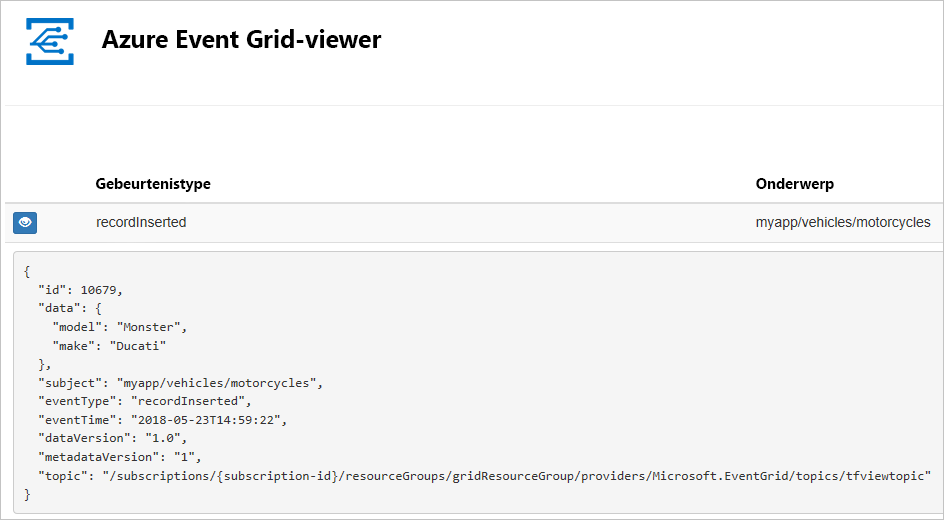
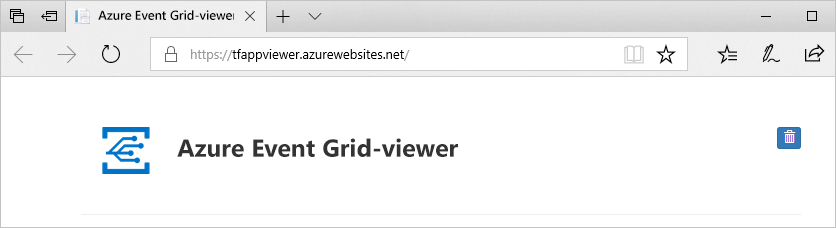
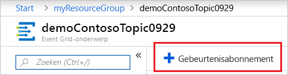
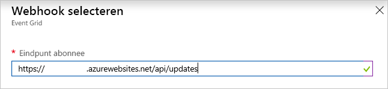
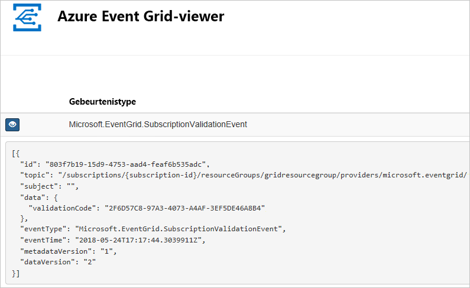

# <a name="quickstart-route-custom-events-to-web-endpoint-with-the-azure-portal-and-event-grid"></a>Snelstartgids: Aangepaste gebeurtenissen routeren naar het webeindpunt met behulp van Azure Portal en Event Grid

Azure Event Grid is een gebeurtenisservice voor de cloud. In dit artikel gebruikt u Azure Portal om een aangepast onderwerp te maken, u op het aangepaste onderwerp te abonneren, en de gebeurtenis te activeren om het resultaat weer te geven. Normaal gesproken verzendt u gebeurtenissen naar een eindpunt dat de gebeurtenisgegevens verwerkt en vervolgens in actie komt. Ter vereenvoudiging van dit artikel stuurt u hier de gebeurtenissen echter naar een web-app die de berichten verzamelt en weergeeft.

Wanneer u klaar bent, ziet u dat de gebeurtenisgegevens naar de web-app zijn verzonden.



[!INCLUDE [updated-for-az](../../includes/updated-for-az.md)]

[!INCLUDE [quickstarts-free-trial-note.md](../../includes/quickstarts-free-trial-note.md)]

[!INCLUDE [event-grid-register-provider-portal.md](../../includes/event-grid-register-provider-portal.md)]

## <a name="create-a-custom-topic"></a>Een aangepast onderwerp maken

Een Event Grid-onderwerp biedt een door de gebruiker gedefinieerd eindpunt waarop u de gebeurtenissen kunt posten. 

1. Meld u aan bij de [Azure-portal](https://portal.azure.com/).

1. Selecteer **Een resource maken** om een aangepast onderwerp te maken. 

   

1. Zoek naar *Event Grid-onderwerp* en selecteer dat uit de beschikbare opties.

   

1. Selecteer **Maken**.

   

1. Geef een unieke naam op voor het aangepaste onderwerp. De onderwerpnaam moet uniek zijn omdat deze wordt vertegenwoordigd door een DNS-vermelding. Gebruik niet de naam die in de afbeelding wordt weergegeven. Maak in plaats daarvan uw eigen naam - deze moet tussen 3 en 50 tekens lang zijn en mag alleen de waarden a-z, A-Z, 0-9 en '-' bevatten. Geef een naam op voor de resourcegroep. Selecteer **Maken**.

   

1. Nadat het aangepaste onderwerp is gemaakt, ziet u een melding dat de implementatie gelukt is.

   

   Is de implementatie mislukt, ga dan na waardoor de fout werd veroorzaakt. Selecteer **Implementatie mislukt**.

   

   Selecteer het foutbericht.

   

   De volgende afbeelding toont een implementatie die is mislukt omdat de naam van het aangepaste onderwerp al in gebruik is. Als u deze fout ziet, voert u de implementatie opnieuw uit met een andere naam.

   

## <a name="create-a-message-endpoint"></a>Het eindpunt van een bericht maken

Voordat u zich abonneert op het aangepaste onderwerp, gaan we het eindpunt voor het gebeurtenisbericht maken. Het eindpunt onderneemt normaal gesproken actie op basis van de gebeurtenisgegevens. Ter vereenvoudiging van deze snelstart gaat u een [vooraf gebouwde web-app](https://github.com/Azure-Samples/azure-event-grid-viewer) implementeren waarmee de gebeurtenisberichten worden weergegeven. De geïmplementeerde oplossing omvat een App Service-plan, een App Service-web-app en broncode van GitHub.

1. Selecteer **Implementeren in Azure** om de oplossing voor uw abonnement te implementeren. Geef in Azure Portal waarden op voor de parameters.

   <a href="https://portal.azure.com/#create/Microsoft.Template/uri/https%3A%2F%2Fraw.githubusercontent.com%2FAzure-Samples%2Fazure-event-grid-viewer%2Fmaster%2Fazuredeploy.json" target="_blank"></a>

1. De implementatie kan enkele minuten duren. Controleer of uw web-app wordt uitgevoerd nadat de implementatie is voltooid. Navigeer in een webbrowser naar: `https://<your-site-name>.azurewebsites.net`

1. De site wordt weergegeven, maar er zijn nog geen gebeurtenissen op gepubliceerd.

   

## <a name="subscribe-to-custom-topic"></a>Abonneren op aangepast onderwerp

U abonneert u op een Event Grid-onderwerp om Event Grid te laten weten welke gebeurtenissen u wilt traceren en waar de gebeurtenissen naartoe moeten worden gestuurd.

1. Selecteer het aangepaste onderwerp in de portal.

   

1. Selecteer **+ Gebeurtenisabonnement**.

   

1. Selecteer **Webhook** voor het eindpunttype. Geef een naam op voor het gebeurtenisabonnement.

   

1. Selecteer **Select an endpoint** (Een eindpunt selecteren). 

1. Voor het webhookeindpunt geeft u de URL van uw web-app op en voegt u `api/updates` toe aan de URL van de startpagina. Selecteer **Confirm Selection** (Selectie bevestigen).

   

1. Wanneer u klaar bent het opgeven van de waarden voor het gebeurtenisabonnement, selecteert u **Create** (Maken).

Bekijk opnieuw uw web-app en u zult zien dat er een validatiegebeurtenis voor een abonnement naartoe is verzonden. Selecteer het oogpictogram om de gebeurtenisgegevens uit te breiden. Via Event Grid wordt de validatiegebeurtenis verzonden zodat het eindpunt kan controleren of de gebeurtenisgegevens in aanmerking komen om ontvangen te worden. De web-app bevat code waarmee het abonnement kan worden gevalideerd.



## <a name="send-an-event-to-your-topic"></a>Een gebeurtenis verzenden naar het onderwerp

Nu gaan we een gebeurtenis activeren om te zien hoe het bericht via Event Grid naar het eindpunt wordt gedistribueerd. Gebruik Azure CLI of PowerShell om een testgebeurtenis te verzenden naar uw aangepaste onderwerp. Meestal worden de gebeurtenisgegevens verzonden via een toepassing of Azure-service.

Het eerste voorbeeld maakt gebruik van Azure CLI. In dit voorbeeld worden de URL en de sleutel voor het aangepaste onderwerp, plus de voorbeeldgegevens van de gebeurtenis opgehaald. Gebruik de naam van het aangepaste onderwerp voor `<topic_name>`. Hiermee worden voorbeeldgebeurtenisgegevens gemaakt. Het element `data` van de JSON is de nettolading van de gebeurtenis. Elke juist opgemaakte JSON kan in dit veld worden ingevoerd. U kunt het onderwerpveld ook gebruiken voor geavanceerd routeren en filteren. CURL is een hulpprogramma waarmee HTTP-aanvragen worden verzonden.

```azurecli-interactive
endpoint=$(az eventgrid topic show --name <topic_name> -g myResourceGroup --query "endpoint" --output tsv)
key=$(az eventgrid topic key list --name <topic_name> -g myResourceGroup --query "key1" --output tsv)

event='[ {"id": "'"$RANDOM"'", "eventType": "recordInserted", "subject": "myapp/vehicles/motorcycles", "eventTime": "'`date +%Y-%m-%dT%H:%M:%S%z`'", "data":{ "make": "Ducati", "model": "Monster"},"dataVersion": "1.0"} ]'

curl -X POST -H "aeg-sas-key: $key" -d "$event" $endpoint
```

In het tweede voorbeeld wordt PowerShell gebruikt om gelijksoortige stappen uit te voeren.

```azurepowershell-interactive
$endpoint = (Get-AzEventGridTopic -ResourceGroupName gridResourceGroup -Name <topic-name>).Endpoint
$keys = Get-AzEventGridTopicKey -ResourceGroupName gridResourceGroup -Name <topic-name>

$eventID = Get-Random 99999

#Date format should be SortableDateTimePattern (ISO 8601)
$eventDate = Get-Date -Format s

#Construct body using Hashtable
$htbody = @{
    id= $eventID
    eventType="recordInserted"
    subject="myapp/vehicles/motorcycles"
    eventTime= $eventDate   
    data= @{
        make="Ducati"
        model="Monster"
    }
    dataVersion="1.0"
}

#Use ConvertTo-Json to convert event body from Hashtable to JSON Object
#Append square brackets to the converted JSON payload since they are expected in the event's JSON payload syntax
$body = "["+(ConvertTo-Json $htbody)+"]"

Invoke-WebRequest -Uri $endpoint -Method POST -Body $body -Headers @{"aeg-sas-key" = $keys.Key1}
```

U hebt de gebeurtenis geactiveerd en Event Grid heeft het bericht verzonden naar het eindpunt dat u hebt geconfigureerd toen u zich abonneerde. Bekijk uw web-app om de gebeurtenis te zien die u zojuist hebt verzonden.

```json
[{
  "id": "1807",
  "eventType": "recordInserted",
  "subject": "myapp/vehicles/motorcycles",
  "eventTime": "2017-08-10T21:03:07+00:00",
  "data": {
    "make": "Ducati",
    "model": "Monster"
  },
  "dataVersion": "1.0",
  "metadataVersion": "1",
  "topic": "/subscriptions/{subscription-id}/resourceGroups/{resource-group}/providers/Microsoft.EventGrid/topics/{topic}"
}]
```


## <a name="clean-up-resources"></a>Resources opschonen

Als u verder wilt werken met deze gebeurtenis, schoon dan de resources die u in dit artikel hebt gemaakt, niet op. Verwijder anders de resources die u in dit artikel hebt gemaakt.

Selecteer de resourcegroep en klik op **Resourcegroep verwijderen**.

## <a name="next-steps"></a>Volgende stappen

U weet nu hoe u aangepaste onderwerpen maakt en hoe u zich abonneert op een gebeurtenis. Kijk waar Event Grid u nog meer bij kan helpen:

- [Over Event Grid](overview.md)
- [Blob Storage-gebeurtenissen naar een aangepast eindpunt op het web routeren](../storage/blobs/storage-blob-event-quickstart.md?toc=%2fazure%2fevent-grid%2ftoc.json)
- [Monitor virtual machine changes with Azure Event Grid and Logic Apps](monitor-virtual-machine-changes-event-grid-logic-app.md) (Wijzigingen in virtuele machines bewaken met Azure Event Grid en Logic Apps)
- [Big data streamen naar een datawarehouse](event-grid-event-hubs-integration.md)
