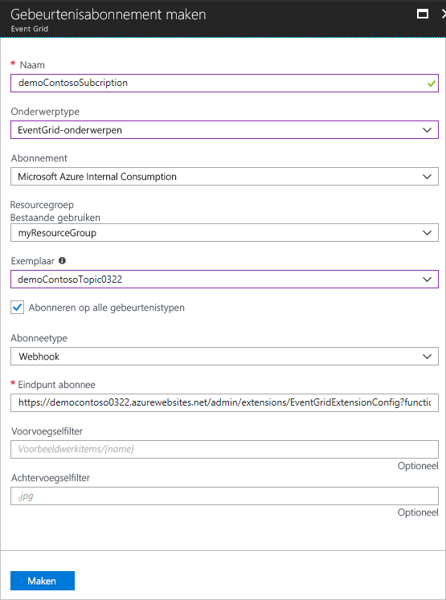

# <a name="create-and-route-custom-events-with-the-azure-portal-and-event-grid"></a>Aangepaste gebeurtenissen maken en routeren met behulp van Azure Portal en Event Grid

Azure Event Grid is een gebeurtenisservice voor de cloud. In dit artikel gebruikt u Azure Portal om een aangepast onderwerp te maken, u op het onderwerp te abonneren, en de gebeurtenis te activeren om het resultaat weer te geven. Meestal stuurt u gebeurtenissen naar een eindpunt dat reageert op de gebeurtenis, zoals een webhook of Azure-functie. Ter vereenvoudiging van dit artikel stuurt u hier de gebeurtenissen echter naar een URL via welke de berichten alleen maar worden verzameld. U maakt deze URL met behulp van een open source-hulpprogramma van derden, met de naam [RequestBin](https://requestb.in/).

>[!NOTE]
>**RequestBin** is een open source-hulpprogramma dat niet is bedoeld voor gebruik met een hoge doorvoer. Het gebruik van het hulpprogramma hier is alleen om de mogelijkheden aan te tonen. Als u meer dan een gebeurtenis tegelijk pusht, ziet u mogelijk niet alle gebeurtenissen in het hulpprogramma.

Wanneer u klaar bent, ziet u dat de gebeurtenisgegevens naar een eindpunt zijn verzonden.


[!INCLUDE [quickstarts-free-trial-note.md](../../includes/quickstarts-free-trial-note.md)]

## <a name="create-a-resource-group"></a>Een resourcegroep maken

Event Grid-onderwerpen zijn Azure-resources en moeten in een Azure-resourcegroep worden geplaatst. De resourcegroep is een logische verzameling waarin Azure-resources worden geïmplementeerd en beheerd.

1. Selecteer in het linkernavigatievenster de optie **Resourcegroepen**. Selecteer vervolgens **Toevoegen**.

   

1. Stel de naam van de resourcegroep in op *gridResourceGroup* en de locatie op *westus2*. Selecteer **Maken**.

   

## <a name="create-a-custom-topic"></a>Een aangepast onderwerp maken

Een onderwerp biedt een door de gebruiker gedefinieerd eindpunt waarop u de gebeurtenissen kunt posten. 

1. Selecteer **Meer services** en ga naar *Event Grid* om een onderwerp te maken voor de resourcegroep. Selecteer **Event Grid-onderwerpen** uit de beschikbare opties.

   

1. Selecteer **Toevoegen**.

   

1. Geef een naam op voor het onderwerp. De onderwerpnaam moet uniek zijn omdat deze wordt vertegenwoordigd door een DNS-vermelding. Voor de preview-versie ondersteunt Event Grid de locaties **westus2** en **westcentralus**. Selecteer de resourcegroep die u eerder hebt gemaakt. Selecteer **Maken**.

   

1. Nadat het onderwerp is gemaakt, selecteert u **Vernieuwen** om het onderwerp te zien.

   

## <a name="create-a-message-endpoint"></a>Het eindpunt van een bericht maken

Voordat u zich abonneert op het onderwerp, gaan we het eindpunt voor het gebeurtenisbericht maken. In plaats van code te schrijven om op de gebeurtenis te reageren, maken we een eindpunt waarop de berichten worden verzameld, zodat u ze kunt weergeven. RequestBin is een open source-hulpprogramma van derden waarmee u een eindpunt kunt maken en aanvragen kunt weergeven die naar dit eindpunt worden verzonden. Ga naar [RequestBin](https://requestb.in/) en klik op **Een RequestBin maken**.  Kopieer de URL. U hebt deze nodig wanneer u zich abonneert op het onderwerp.

## <a name="subscribe-to-a-topic"></a>Abonneren op een onderwerp

U abonneert u op een onderwerp om Event Grid te laten weten welke gebeurtenissen u wilt traceren. 

1. Selecteer opnieuw **Meer services** en ga naar *Event Grid* om een Event Grid-abonnement te maken. Selecteer **Event Grid-abonnementen** uit de beschikbare opties.

   

1. Selecteer **+ Gebeurtenisabonnement**.

   

1. Geef een unieke naam op voor het gebeurtenisabonnement. Selecteer als onderwerptype **Event Grid-onderwerpen**. Selecteer voor het exemplaar het aangepaste onderwerp dat u hebt gemaakt. Geef de URL van RequestBin op als eindpunt voor gebeurtenismeldingen. Als u klaar bent het opgeven van de waarden, klikt u op **Maken**.

   

Nu gaan we een gebeurtenis activeren om te zien hoe het bericht via Event Grid naar het eindpunt wordt gedistribueerd. Gebruik ter vereenvoudiging van dit artikel Cloud Shell om voorbeeldgebeurtenisgegevens naar het onderwerp te verzenden. Meestal worden de gebeurtenisgegevens verzonden via een toepassing of Azure-service.

[!INCLUDE [cloud-shell-try-it.md](../../includes/cloud-shell-try-it.md)]

## <a name="send-an-event-to-your-topic"></a>Een gebeurtenis verzenden naar het onderwerp

Eerst gaan we de URL en de sleutel voor het onderwerp ophalen. Gebruik de onderwerpnaam voor `<topic_name>`.

```azurecli-interactive
endpoint=$(az eventgrid topic show --name <topic_name> -g gridResourceGroup --query "endpoint" --output tsv)
key=$(az eventgrid topic key list --name <topic_name> -g gridResourceGroup --query "key1" --output tsv)
```

In het volgende voorbeeld worden de voorbeeldgebeurtenisgegevens opgehaald:

```azurecli-interactive
body=$(eval echo "'$(curl https://raw.githubusercontent.com/Azure/azure-docs-json-samples/master/event-grid/customevent.json)'")
```

Als u `echo "$body"` kunt u de volledige gebeurtenis zien. Het element `data` van de JSON is de nettolading van de gebeurtenis. Elke juist opgemaakte JSON kan in dit veld worden ingevoerd. U kunt het onderwerpveld ook gebruiken voor geavanceerd routeren en filteren.

CURL is een hulpprogramma waarmee HTTP-aanvragen worden uitgevoerd. In dit artikel gebruiken we CURL om de gebeurtenis naar het onderwerp te verzenden. 

```azurecli-interactive
curl -X POST -H "aeg-sas-key: $key" -d "$body" $endpoint
```

U hebt de gebeurtenis geactiveerd, en de gebeurtenis is via Event Grid verzonden naar het eindpunt dat u hebt geconfigureerd toen u zich abonneerde. Blader naar de RequestBin-URL die u eerder hebt gemaakt. Of klik in het geopende RequestBin-browservenster op Vernieuwen. U ziet de gebeurtenis die u zojuist hebt verzonden.

```json
[{
  "id": "1807",
  "eventType": "recordInserted",
  "subject": "myapp/vehicles/motorcycles",
  "eventTime": "2017-08-10T21:03:07+00:00",
  "data": {
    "make": "Ducati",
    "model": "Monster"
  },
  "topic": "/subscriptions/{subscription-id}/resourceGroups/{resource-group}/providers/Microsoft.EventGrid/topics/{topic}"
}]
```

## <a name="clean-up-resources"></a>Resources opschonen

Als u verder wilt werken met deze gebeurtenis, schoont u de resources die u hebt gemaakt in dit artikel, niet op. Als u niet verder wilt werken, verwijdert u de resources die u in dit artikel hebt gemaakt.

Selecteer de resourcegroep en klik op **Resourcegroep verwijderen**.

## <a name="next-steps"></a>Volgende stappen

U weet nu hoe u onderwerpen maakt en hoe u zich abonneert op een gebeurtenis. Kijk waar Event Grid u nog meer bij kan helpen:

- [Over Event Grid](overview.md)
- [Blob Storage-gebeurtenissen naar een aangepast eindpunt op het web routeren](../storage/blobs/storage-blob-event-quickstart.md?toc=%2fazure%2fevent-grid%2ftoc.json)
- [Monitor virtual machine changes with Azure Event Grid and Logic Apps](monitor-virtual-machine-changes-event-grid-logic-app.md) (Wijzigingen in virtuele machines bewaken met Azure Event Grid en Logic Apps)
- [Big data streamen naar een datawarehouse](event-grid-event-hubs-integration.md)
