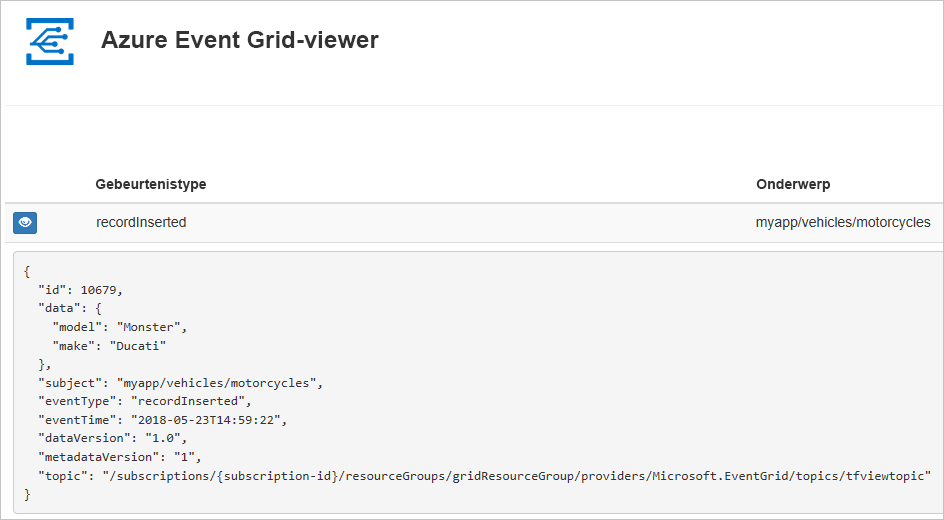
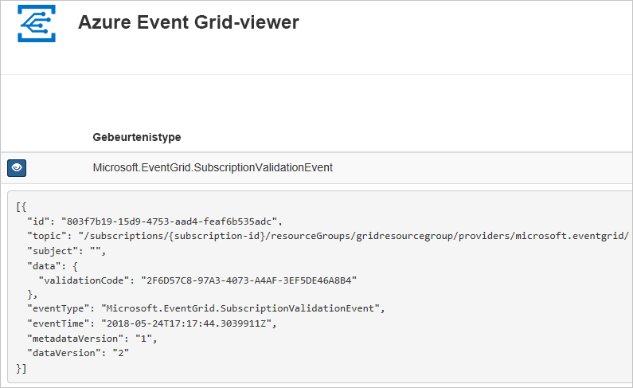

# <a name="quickstart-route-custom-events-to-web-endpoint-with-azure-cli-and-event-grid"></a>Snelstartgids: Aangepaste gebeurtenissen naar het webeindpunt routeren met behulp van Azure CLI en Event Grid

Azure Event Grid is een gebeurtenisservice voor de cloud. In dit artikel gebruikt u de Azure CLI om een aangepast onderwerp te maken, u op het aangepaste onderwerp te abonneren en de gebeurtenis te activeren om het resultaat weer te geven. Normaal gesproken verzendt u gebeurtenissen naar een eindpunt dat de gebeurtenisgegevens verwerkt en vervolgens in actie komt. Ter vereenvoudiging van dit artikel stuurt u hier de gebeurtenissen echter naar een web-app die de berichten verzamelt en weergeeft.

Wanneer u klaar bent, ziet u dat de gebeurtenisgegevens naar de web-app zijn verzonden.



[!INCLUDE [quickstarts-free-trial-note.md](../../includes/quickstarts-free-trial-note.md)]

[!INCLUDE [cloud-shell-try-it.md](../../includes/cloud-shell-try-it.md)]

Als u ervoor kiest om de CLI lokaal te installeren en te gebruiken, moet u voor dit artikel de nieuwste versie van Azure CLI (2.0.24 of hoger) uitvoeren. Voer `az --version` uit om de versie te bekijken. Zie [Azure CLI installeren](/cli/azure/install-azure-cli) als u de CLI wilt installeren of een upgrade wilt uitvoeren.

Als u Cloud Shell niet gebruikt, moet u zich eerst aanmelden met `az login`.

## <a name="create-a-resource-group"></a>Een resourcegroep maken

Event Grid-onderwerpen zijn Azure-resources en moeten in een Azure-resourcegroep worden geplaatst. De resourcegroep is een logische verzameling waarin Azure-resources worden geïmplementeerd en beheerd.

Een resourcegroep maken met de opdracht [az group create](/cli/azure/group#az-group-create). 

In het volgende voorbeeld wordt een resourcegroep met de naam *gridResourceGroup* gemaakt op de locatie *westus2*.

```azurecli-interactive
az group create --name gridResourceGroup --location westus2
```

[!INCLUDE [event-grid-register-provider-cli.md](../../includes/event-grid-register-provider-cli.md)]

## <a name="create-a-custom-topic"></a>Een aangepast onderwerp maken

Een Event Grid-onderwerp biedt een door de gebruiker gedefinieerd eindpunt waarop u de gebeurtenissen kunt posten. In het volgende voorbeeld wordt het aangepaste onderwerp in uw resourcegroep gemaakt. Vervang `<your-topic-name>` door een unieke naam voor het onderwerp. De aangepaste onderwerpnaam moet uniek zijn omdat deze deel uitmaakt van de DNS-vermelding. Daarnaast moet deze tussen 3 en 50 tekens lang zijn en mag deze alleen de waarden a-z, A-Z, 0-9 en '-' bevatten

```azurecli-interactive
topicname=<your-topic-name>

az eventgrid topic create --name $topicname -l westus2 -g gridResourceGroup
```

## <a name="create-a-message-endpoint"></a>Het eindpunt van een bericht maken

Voordat u zich abonneert op het aangepaste onderwerp, gaan we het eindpunt voor het gebeurtenisbericht maken. Het eindpunt onderneemt normaal gesproken actie op basis van de gebeurtenisgegevens. Ter vereenvoudiging van deze snelstart gaat u een [vooraf gebouwde web-app](https://github.com/Azure-Samples/azure-event-grid-viewer) implementeren waarmee de gebeurtenisberichten worden weergegeven. De geïmplementeerde oplossing omvat een App Service-plan, een App Service-web-app en broncode van GitHub.

Vervang `<your-site-name>` door een unieke naam voor de web-app. De naam van de web-app moet uniek zijn omdat deze deel uitmaakt van de DNS-vermelding.

```azurecli-interactive
sitename=<your-site-name>

az group deployment create \
  --resource-group gridResourceGroup \
  --template-uri "https://raw.githubusercontent.com/Azure-Samples/azure-event-grid-viewer/master/azuredeploy.json" \
  --parameters siteName=$sitename hostingPlanName=viewerhost
```

De implementatie kan enkele minuten duren. Controleer of uw web-app wordt uitgevoerd nadat de implementatie is voltooid. Navigeer in een webbrowser naar: `https://<your-site-name>.azurewebsites.net`

Op de site zouden momenteel geen berichten moeten wijn weergeven.

## <a name="subscribe-to-a-custom-topic"></a>Abonneren op een aangepast onderwerp

U abonneert u op een Event Grid-onderwerp om Event Grid te laten weten welke gebeurtenissen u wilt traceren en waar deze gebeurtenissen naartoe moeten worden gestuurd. In het volgende voorbeeld ziet u hoe u zich abonneert op het aangepaste onderwerp dat u hebt gemaakt, en hoe de URL van uw web-app wordt doorgegeven als het eindpunt voor de gebeurtenismelding.

Het eindpunt voor uw web-app moet het achtervoegsel `/api/updates/` bevatten.

```azurecli-interactive
endpoint=https://$sitename.azurewebsites.net/api/updates

az eventgrid event-subscription create \
  -g gridResourceGroup \
  --topic-name $topicname \
  --name demoViewerSub \
  --endpoint $endpoint
```

Bekijk opnieuw uw web-app en u zult zien dat er een validatiegebeurtenis voor een abonnement naartoe is verzonden. Selecteer het oogpictogram om de gebeurtenisgegevens uit te breiden. Via Event Grid wordt de validatiegebeurtenis verzonden zodat het eindpunt kan controleren of de gebeurtenisgegevens in aanmerking komen om ontvangen te worden. De web-app bevat code waarmee het abonnement kan worden gevalideerd.



## <a name="send-an-event-to-your-custom-topic"></a>Een gebeurtenis verzenden naar het aangepaste onderwerp

We activeren een gebeurtenis om te zien hoe het bericht via Event Grid naar het eindpunt wordt gedistribueerd. Eerst gaan we de URL en de sleutel voor het aangepaste onderwerp ophalen.

```azurecli-interactive
endpoint=$(az eventgrid topic show --name $topicname -g gridResourceGroup --query "endpoint" --output tsv)
key=$(az eventgrid topic key list --name $topicname -g gridResourceGroup --query "key1" --output tsv)
```

Om dit artikel zo eenvoudig mogelijk te maken, gebruikt u voorbeeldgebeurtenisgegevens om naar het aangepaste onderwerp te verzenden. Meestal worden de gebeurtenisgegevens verzonden via een toepassing of Azure-service. In het volgende voorbeeld worden voorbeeldgebeurtenisgegevens gemaakt:

```azurecli-interactive
event='[ {"id": "'"$RANDOM"'", "eventType": "recordInserted", "subject": "myapp/vehicles/motorcycles", "eventTime": "'`date +%Y-%m-%dT%H:%M:%S%z`'", "data":{ "make": "Ducati", "model": "Monster"},"dataVersion": "1.0"} ]'
```

Het element `data` van de JSON is de nettolading van de gebeurtenis. Elke juist opgemaakte JSON kan in dit veld worden ingevoerd. U kunt het onderwerpveld ook gebruiken voor geavanceerd routeren en filteren.

CURL is een hulpprogramma waarmee HTTP-aanvragen worden verzonden. In dit artikel gebruiken we CURL om de gebeurtenis naar het onderwerp te verzenden. 

```azurecli-interactive
curl -X POST -H "aeg-sas-key: $key" -d "$event" $endpoint
```

U hebt de gebeurtenis geactiveerd en Event Grid heeft het bericht verzonden naar het eindpunt dat u hebt geconfigureerd toen u zich abonneerde. Bekijk uw web-app om de gebeurtenis te zien die u zojuist hebt verzonden.

```json
[{
  "id": "1807",
  "eventType": "recordInserted",
  "subject": "myapp/vehicles/motorcycles",
  "eventTime": "2017-08-10T21:03:07+00:00",
  "data": {
    "make": "Ducati",
    "model": "Monster"
  },
  "dataVersion": "1.0",
  "metadataVersion": "1",
  "topic": "/subscriptions/{subscription-id}/resourceGroups/{resource-group}/providers/Microsoft.EventGrid/topics/{topic}"
}]
```

## <a name="clean-up-resources"></a>Resources opschonen
Als u verder wilt werken met deze gebeurtenis of met de logboeken-app, schoont u de resources die u in dit artikel hebt gemaakt, niet op. Gebruik anders de volgende opdracht om de resources te verwijderen die u in dit artikel hebt gemaakt.

```azurecli-interactive
az group delete --name gridResourceGroup
```

## <a name="next-steps"></a>Volgende stappen

U weet nu hoe u onderwerpen maakt en hoe u zich abonneert op een gebeurtenis. Kijk waar Event Grid u nog meer bij kan helpen:

- [Over Event Grid](overview.md)
- [Blob Storage-gebeurtenissen naar een aangepast eindpunt op het web routeren](../storage/blobs/storage-blob-event-quickstart.md?toc=%2fazure%2fevent-grid%2ftoc.json)
- [Monitor virtual machine changes with Azure Event Grid and Logic Apps](monitor-virtual-machine-changes-event-grid-logic-app.md) (Wijzigingen in virtuele machines bewaken met Azure Event Grid en Logic Apps)
- [Big data streamen naar een datawarehouse](event-grid-event-hubs-integration.md)
