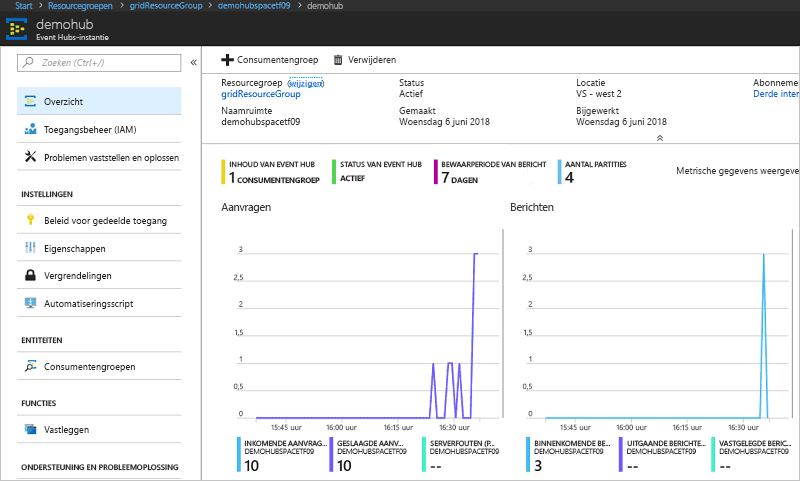

# <a name="quickstart-route-custom-events-to-azure-event-hubs-with-azure-cli-and-event-grid"></a>Snelstart: Aangepaste gebeurtenissen naar Azure Event Hubs routeren met behulp van Azure CLI en Event Grid

Azure Event Grid is een gebeurtenisservice voor de cloud. Azure Event Hubs is een van de ondersteunde gebeurtenishandlers. In dit artikel gebruikt u de Azure CLI om een aangepast onderwerp te maken, u op het aangepaste onderwerp te abonneren en de gebeurtenis te activeren om het resultaat weer te geven. U verzendt de gebeurtenissen naar een event hub.

[!INCLUDE [quickstarts-free-trial-note.md](../../includes/quickstarts-free-trial-note.md)]

## <a name="create-a-resource-group"></a>Een resourcegroep maken

Event Grid-onderwerpen zijn Azure-resources en moeten in een Azure-resourcegroep worden geplaatst. De resourcegroep is een logische verzameling waarin Azure-resources worden geïmplementeerd en beheerd.

Een resourcegroep maken met de opdracht [az group create](/cli/azure/group#az-group-create). 

In het volgende voorbeeld wordt een resourcegroep met de naam *gridResourceGroup* gemaakt op de locatie *westus2*.

```azurecli-interactive
az group create --name gridResourceGroup --location westus2
```

[!INCLUDE [event-grid-register-provider-cli.md](../../includes/event-grid-register-provider-cli.md)]

## <a name="create-a-custom-topic"></a>Een aangepast onderwerp maken

Een Event Grid-onderwerp biedt een door de gebruiker gedefinieerd eindpunt waarop u de gebeurtenissen kunt posten. In het volgende voorbeeld wordt het aangepaste onderwerp in uw resourcegroep gemaakt. Vervang `<your-topic-name>` door een unieke naam voor uw aangepaste onderwerp. De aangepaste onderwerpnaam moet uniek zijn omdat deze wordt vertegenwoordigd door een DNS-vermelding.

```azurecli-interactive
topicname=<your-topic-name>
az eventgrid topic create --name $topicname -l westus2 -g gridResourceGroup
```

## <a name="create-event-hub"></a>Event hub maken

Voordat u zich abonneert op het aangepaste onderwerp, gaan we het eindpunt voor het gebeurtenisbericht maken. U maakt een event hub voor het verzamelen van de gebeurtenissen.

```azurecli-interactive
namespace=<unique-namespace-name>
hubname=demohub

az eventhubs namespace create --name $namespace --resource-group gridResourceGroup
az eventhubs eventhub create --name $hubname --namespace-name $namespace --resource-group gridResourceGroup
```

## <a name="subscribe-to-a-custom-topic"></a>Abonneren op een aangepast onderwerp

U abonneert u op een Event Grid-onderwerp om Event Grid te laten weten welke gebeurtenissen u wilt traceren. In het volgende voorbeeld ziet u hoe u zich abonneert op het aangepaste onderwerp dat u hebt gemaakt, en hoe de resource-id van de Event Hub wordt doorgegeven voor het eindpunt. Het eindpunt heeft deze indeling:

`/subscriptions/<subscription-id>/resourceGroups/<resource-group-name>/providers/Microsoft.EventHub/namespaces/<namespace-name>/eventhubs/<hub-name>`

Met het volgende script wordt de resource-id voor de Event Hub opgehaald en wordt u geabonneerd op een Event Grid-onderwerp. Het type eindpunt wordt ingesteld op `eventhub` en de Event Hub-id wordt gebruikt voor het eindpunt.

```azurecli-interactive
hubid=$(az eventhubs eventhub show --name $hubname --namespace-name $namespace --resource-group gridResourceGroup --query id --output tsv)

az eventgrid event-subscription create \
  --topic-name $topicname \
  -g gridResourceGroup \
  --name subtoeventhub \
  --endpoint-type eventhub \
  --endpoint $hubid
```

Het account dat wordt gemaakt van het gebeurtenisabonnement, moet schrijftoegang tot de Event Hub hebben.

## <a name="send-an-event-to-your-custom-topic"></a>Een gebeurtenis verzenden naar het aangepaste onderwerp

We activeren een gebeurtenis om te zien hoe het bericht via Event Grid naar het eindpunt wordt gedistribueerd. Eerst gaan we de URL en de sleutel voor het aangepaste onderwerp ophalen.

```azurecli-interactive
endpoint=$(az eventgrid topic show --name $topicname -g gridResourceGroup --query "endpoint" --output tsv)
key=$(az eventgrid topic key list --name $topicname -g gridResourceGroup --query "key1" --output tsv)
```

Om dit artikel zo eenvoudig mogelijk te maken, gebruikt u voorbeeldgebeurtenisgegevens om naar het aangepaste onderwerp te verzenden. Meestal worden de gebeurtenisgegevens verzonden via een toepassing of Azure-service. CURL is een hulpprogramma waarmee HTTP-aanvragen worden verzonden. In dit artikel gebruiken we CURL om de gebeurtenis naar het aangepaste onderwerp te verzenden.  In het volgende voorbeeld worden drie gebeurtenissen verstuurd naar het onderwerp van Event Grid:

```azurecli-interactive
for i in 1 2 3
do
   event='[ {"id": "'"$RANDOM"'", "eventType": "recordInserted", "subject": "myapp/vehicles/motorcycles", "eventTime": "'`date +%Y-%m-%dT%H:%M:%S%z`'", "data":{ "make": "Ducati", "model": "Monster"},"dataVersion": "1.0"} ]'
   curl -X POST -H "aeg-sas-key: $key" -d "$event" $endpoint
done
```

Navigeer naar de event hub in de portal en u ziet dat Event Grid deze drie gebeurtenissen naar de event hub heeft verzonden.



Doorgaans wordt er een toepassing gemaakt die de gebeurtenissen ophaalt uit de event hub. Voor het maken van een toepassing die berichten van een event hub ontvangt, zie:

* [Aan de slag met het ontvangen van berichten met de Event Processor Host in .NET Standard](../event-hubs/event-hubs-dotnet-standard-getstarted-receive-eph.md)
* [Gebeurtenissen ontvangen van Azure Event Hubs met behulp van Java](../event-hubs/event-hubs-java-get-started-receive-eph.md)
* [Gebeurtenissen ontvangen van Event Hubs met behulp van Apache Storm](../event-hubs/event-hubs-storm-getstarted-receive.md)

## <a name="clean-up-resources"></a>Resources opschonen
Als u verder wilt werken met deze gebeurtenis, schoon dan de resources die u in dit artikel hebt gemaakt, niet op. Gebruik anders de volgende opdracht om de resources te verwijderen die u in dit artikel hebt gemaakt.

```azurecli-interactive
az group delete --name gridResourceGroup
```

## <a name="next-steps"></a>Volgende stappen

U weet nu hoe u onderwerpen maakt en hoe u zich abonneert op een gebeurtenis. Kijk waar Event Grid u nog meer bij kan helpen:

- [Over Event Grid](overview.md)
- [Blob Storage-gebeurtenissen naar een aangepast eindpunt op het web routeren](../storage/blobs/storage-blob-event-quickstart.md?toc=%2fazure%2fevent-grid%2ftoc.json)
- [Monitor virtual machine changes with Azure Event Grid and Logic Apps](monitor-virtual-machine-changes-event-grid-logic-app.md) (Wijzigingen in virtuele machines bewaken met Azure Event Grid en Logic Apps)
- [Big data streamen naar een datawarehouse](event-grid-event-hubs-integration.md)
