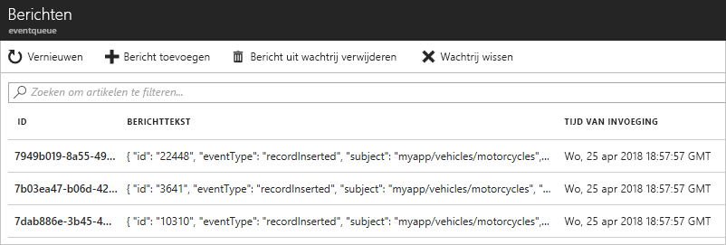

# <a name="route-custom-events-to-azure-queue-storage-with-azure-cli-and-event-grid"></a>Aangepaste gebeurtenissen naar Azure Queue Storage routeren met behulp van Azure CLI en Event Grid

Azure Event Grid is een gebeurtenisservice voor de cloud. Azure Queue Storage is een van de ondersteunde gebeurtenis-handlers. In dit artikel gebruikt u de Azure CLI om een aangepast onderwerp te maken, u op het onderwerp te abonneren, en de gebeurtenis te activeren om het resultaat weer te geven. U verstuurt de gebeurtenissen naar de opslagwachtrij.

[!INCLUDE [quickstarts-free-trial-note.md](../../includes/quickstarts-free-trial-note.md)]

[!INCLUDE [event-grid-preview-feature-note.md](../../includes/event-grid-preview-feature-note.md)]

## <a name="create-a-resource-group"></a>Een resourcegroep maken

Event Grid-onderwerpen zijn Azure-resources en moeten in een Azure-resourcegroep worden geplaatst. De resourcegroep is een logische verzameling waarin Azure-resources worden geïmplementeerd en beheerd.

Een resourcegroep maken met de opdracht [az group create](/cli/azure/group#az_group_create). 

In het volgende voorbeeld wordt een resourcegroep met de naam *gridResourceGroup* gemaakt op de locatie *westus2*.

```azurecli-interactive
az group create --name gridResourceGroup --location westus2
```

[!INCLUDE [event-grid-register-provider-cli.md](../../includes/event-grid-register-provider-cli.md)]

## <a name="create-a-custom-topic"></a>Een aangepast onderwerp maken

Een Event Grid-onderwerp biedt een door de gebruiker gedefinieerd eindpunt waarop u de gebeurtenissen kunt posten. In het volgende voorbeeld wordt het aangepaste onderwerp in uw resourcegroep gemaakt. Vervang `<topic_name>` door een unieke naam voor het onderwerp. De onderwerpnaam moet uniek zijn omdat deze wordt vertegenwoordigd door een DNS-vermelding.

```azurecli-interactive
# if you have not already installed the extension, do it now.
# This extension is required for preview features.
az extension add --name eventgrid

az eventgrid topic create --name <topic_name> -l westus2 -g gridResourceGroup
```

## <a name="create-queue-storage"></a>Opslagwachtrij maken

Voordat u zich abonneert op het onderwerp, gaan we het eindpunt voor het gebeurtenisbericht maken. U maakt een opslagwachtrij voor het verzamelen van de gebeurtenissen.

```azurecli-interactive
storagename="<unique-storage-name>"
queuename="eventqueue"

az storage account create -n $storagename -g gridResourceGroup -l westus2 --sku Standard_LRS
az storage queue create --name $queuename --account-name $storagename
```

## <a name="subscribe-to-a-topic"></a>Abonneren op een onderwerp

U abonneert u op een onderwerp om Event Grid te laten weten welke gebeurtenissen u wilt traceren. In het volgende voorbeeld ziet u hoe u zich abonneert op het onderwerp dat u hebt gemaakt, en hoe de resource-id van de opslagwachtrij wordt doorgegeven voor het eindpunt. Met Azure CLI geeft u de opslag-id van Queue door als het eindpunt. Het eindpunt heeft deze indeling:

`/subscriptions/<subscription-id>/resourcegroups/<resource-group-name>/providers/Microsoft.Storage/storageAccounts/<storage-name>/queueservices/default/queues/<queue-name>`

Met het volgende script wordt de resource-id van het opslagaccount voor de wachtrij opgehaald. Het script maakt de id voor de opslagwachtrij en neemt vervolgens een abonnement op een onderwerp van Event Grid. Het type eindpunt wordt ingesteld op `storagequeue` en de wachtrij-id wordt gebruikt voor het eindpunt.

```azurecli-interactive
storageid=$(az storage account show --name $storagename --resource-group gridResourceGroup --query id --output tsv)
queueid="$storageid/queueservices/default/queues/$queuename"

az eventgrid event-subscription create \
  --topic-name <topic_name> \
  -g gridResourceGroup \
  --name <event_subscription_name> \
  --endpoint-type storagequeue \
  --endpoint $queueid
```

Als u de REST-API gebruikt om het abonnement te maken, geeft u de id van het opslagaccount en de naam van de wachtrij als een afzonderlijke parameter door.

```json
"destination": {
  "endpointType": "storagequeue",
  "properties": {
    "queueName":"eventqueue",
    "resourceId": "/subscriptions/<subscription-id>/resourcegroups/<resource-group-name>/providers/Microsoft.Storage/storageAccounts/<storage-name>"
  }
  ...
```

## <a name="send-an-event-to-your-topic"></a>Een gebeurtenis verzenden naar het onderwerp

We activeren een gebeurtenis om te zien hoe het bericht via Event Grid naar het eindpunt wordt gedistribueerd. Eerst gaan we de URL en de sleutel voor het aangepaste onderwerp ophalen. Gebruik opnieuw de onderwerpnaam voor `<topic_name>`.

```azurecli-interactive
endpoint=$(az eventgrid topic show --name <topic_name> -g gridResourceGroup --query "endpoint" --output tsv)
key=$(az eventgrid topic key list --name <topic_name> -g gridResourceGroup --query "key1" --output tsv)
```

Ter vereenvoudiging van dit artikel gebruikt u voorbeeldgebeurtenisgegevens om naar het onderwerp te verzenden. Meestal worden de gebeurtenisgegevens verzonden via een toepassing of Azure-service. CURL is een hulpprogramma waarmee HTTP-aanvragen worden verzonden. In dit artikel gebruiken we CURL om de gebeurtenis naar het onderwerp te verzenden.  In het volgende voorbeeld worden drie gebeurtenissen verstuurd naar het onderwerp van Event Grid:

```azurecli-interactive
for i in 1 2 3
do
   body=$(eval echo "'$(curl https://raw.githubusercontent.com/Azure/azure-docs-json-samples/master/event-grid/customevent.json)'")
   curl -X POST -H "aeg-sas-key: $key" -d "$body" $endpoint
done
```

Navigeer naar de opslagwachtrij in de portal en u ziet dat Event Grid deze drie gebeurtenissen naar de wachtrij heeft verzonden.




## <a name="clean-up-resources"></a>Resources opschonen
Als u verder wilt werken met deze gebeurtenis, schoon dan de resources die u in dit artikel hebt gemaakt, niet op. Gebruik anders de volgende opdracht om de resources te verwijderen die u in dit artikel hebt gemaakt.

```azurecli-interactive
az group delete --name gridResourceGroup
```

## <a name="next-steps"></a>Volgende stappen

U weet nu hoe u onderwerpen maakt en hoe u zich abonneert op een gebeurtenis. Kijk waar Event Grid u nog meer bij kan helpen:

- [Over Event Grid](overview.md)
- [Blob Storage-gebeurtenissen naar een aangepast eindpunt op het web routeren](../storage/blobs/storage-blob-event-quickstart.md?toc=%2fazure%2fevent-grid%2ftoc.json)
- [Monitor virtual machine changes with Azure Event Grid and Logic Apps](monitor-virtual-machine-changes-event-grid-logic-app.md) (Wijzigingen in virtuele machines bewaken met Azure Event Grid en Logic Apps)
- [Big data streamen naar een datawarehouse](event-grid-event-hubs-integration.md)
