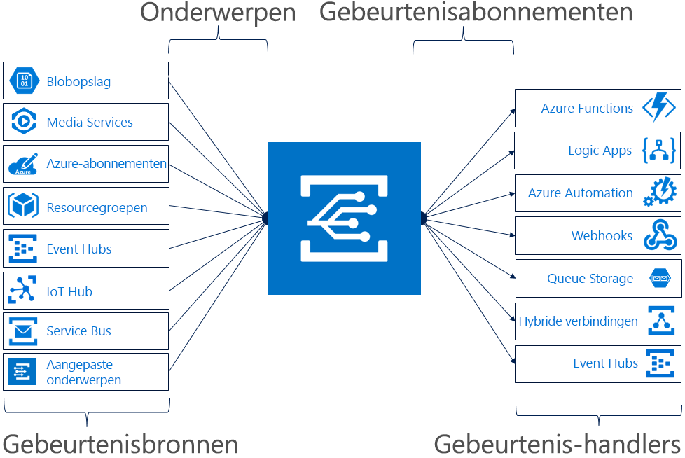

# Een inleiding tot Azure Event Grid

Met Azure Event Grid kunt u eenvoudig toepassingen bouwen met op gebeurtenissen gebaseerde architecturen. Selecteer eerst de Azure-resource waarop u zich wilt abonneren en geef vervolgens de gebeurtenis-handler of het WebHook-eindpunt op waarnaar de gebeurtenis moet worden verzonden. Event Grid bevat ingebouwde ondersteuning voor gebeurtenissen die afkomstig zijn van Azure-services, zoals storage-blobs en resourcegroepen. Event Grid biedt ook ondersteuning voor uw eigen gebeurtenissen, met behulp van aangepaste onderwerpen. 

U kunt filters gebruiken voor het doorsturen van specifieke gebeurtenissen naar verschillende eindpunten, multicasting uitvoeren naar meerdere eindpunten en ervoor zorgen dat uw gebeurtenissen op betrouwbare wijze worden bezorgd.

Azure Event Grid is momenteel beschikbaar in alle openbare regio's. Het is nog niet beschikbaar in de Azure Duitsland-, Azure China- of Azure Government-clouds.

In dit artikel vindt u een overzicht van Azure Event Grid. Zie [Aangepaste gebeurtenissen maken en routeren met behulp van Azure Event Grid](custom-event-quickstart.md) als u aan de slag wilt met Azure Event Grid. 

Let op: deze afbeelding laat zien hoe Event Grid bronnen en handlers verbindt, maar biedt geen uitgebreide lijst met ondersteunde integraties.

## Gebeurtenisbronnen

Zie [gebeurtenisbronnen](event-sources.md) voor meer informatie over de mogelijkheden van elke bron, evenals de gerelateerde artikelen. Op dit moment ondersteunen de volgende Azure-services het verzenden van gebeurtenissen naar Event Grid:

* Azure-abonnementen (beheerbewerkingen)
* Container Registry
* Aangepaste onderwerpen
* Event Hubs
* IoT Hub
* Media Services
* Resourcegroepen (beheerbewerkingen)
* Service Bus
* Storage Blob
* Storage voor algemene doeleinden v2 (GPv2)

## Event Handlers

Zie [gebeurtenis-handlers](event-handlers.md) voor meer informatie over de mogelijkheden van elke handler, evenals de gerelateerde artikelen. Op dit moment ondersteunen de volgende Azure-services handling-gebeurtenissen uit Event Grid: 

* Azure Automation
* Azure Functions
* Event Hubs
* Hybride verbindingen
* Logic Apps
* Microsoft Flow
* Queue Storage
* WebHooks

## Concepten

Azure Event Grid bevat vijf concepten waarmee u aan de slag kunt:

* **Gebeurtenissen**: wat er is gebeurd.
* **Gebeurtenisbronnen**: waar de gebeurtenis heeft plaatsgevonden.
* **Onderwerpen**: het eindpunt waarnaar uitgevers gebeurtenissen verzenden.
* **Gebeurtenisabonnementen**: het eindpunt of ingebouwde mechanisme voor het routeren van gebeurtenissen, soms naar meerdere handlers. Abonnementen worden ook gebruikt door handlers om binnenkomende gebeurtenissen op een slimme manier te filteren.
* **Gebeurtenis-handlers**: de app of de service die op de gebeurtenis reageert.

Zie [Concepten in Azure Event Grid](concepts.md) voor meer informatie over deze concepten.

## Functionaliteit

Hier volgt een aantal essentiële functies van Azure Event Grid:

* **Eenvoud**: wijs en klik om gebeurtenissen uit uw Azure-resource te richten op een gebeurtenis-handler of eindpunt.
* **Geavanceerde filters**: filter op gebeurtenistype of gebeurtenispublicatiepad om ervoor te zorgen dat gebeurtenis-handlers alleen relevante gebeurtenissen ontvangen.
* **Fanout**: abonneer u op meerdere eindpunten op dezelfde gebeurtenis om kopieën van de gebeurtenis te verzenden naar zoveel plaatsen als nodig is.
* **Betrouwbaarheid**: maak gebruik van na 24 uur opnieuw proberen met exponentieel uitstel om er zeker van te zijn dat gebeurtenissen zijn bezorgd.
* **Betalen per gebeurtenis**: betaal alleen voor het bedrag waarvoor u Event Grid gebruikt.
* **Hoge doorvoer**: maak workloads met een hoog volume in Event Grid met ondersteuning voor miljoenen gebeurtenissen per seconde.
* **Ingebouwde gebeurtenissen**: ga snel aan de slag met voor resources gedefinieerde ingebouwde gebeurtenissen.
* **Aangepaste gebeurtenissen**: gebruik Event Grid om aangepaste gebeurtenissen op een betrouwbare manier te routeren, filteren en af te leveren.

Zie [Een keuze maken tussen Azure-services die berichten bezorgen](compare-messaging-services.md) voor een vergelijking van Event Grid, Event Hubs en Service Bus.

## Wat kan ik doen met Event Grid?

Azure Event Grid biedt verschillende mogelijkheden die serverloos, automatisering van bewerkingen en integratiewerkzaamheden aanzienlijk verbeteren: 

### Architecturen voor serverloze toepassingen

Event Grid verbindt gegevensbronnen en gebeurtenis-handlers. Gebruik Event Grid bijvoorbeeld om direct een serverloze functie te triggeren voor het uitvoeren van beeldanalyse zodra er een nieuwe foto wordt toegevoegd aan de container voor blob-opslag. 

### Automatisering van bewerkingen

Met Event Grid kunt u sneller automatiseren en gemakkelijker beleid afdwingen. Zo kan Event Grid een melding sturen naar Azure Automation wanneer er een virtuele machine is gemaakt of wanneer er een SQL-database in gebruik wordt genomen. Deze gebeurtenissen kunnen worden gebruikt om automatisch te controleren of serviceconfiguraties compatibel zijn, metagegevens aan te bieden aan tools voor bewerkingen, virtuele machines te taggen of werkitems te archiveren.

### Integratie van toepassingen

Event Grid verbindt uw app met andere services. Maak bijvoorbeeld een aangepast onderwerp om de gebeurtenisgegevens van uw app naar Event Grid te versturen en zo uw voordeel te doen met de betrouwbare bezorging, geavanceerde routering en directe integratie met Azure. U kunt Event Grid ook gebruiken met Logic Apps om op elke locatie gegevens te verwerken, zonder dat u hiervoor code hoeft te schrijven. 

## Wat kost Event Grid?

Azure Event Grid maakt gebruik van een prijsmodel voor betalen per gebeurtenis, zodat u alleen betaalt voor wat u gebruikt. De eerste 100.000 bewerkingen per maand zijn gratis. Bewerkingen worden gedefinieerd als inkomende gebeurtenissen, bezorgingspogingen voor abonnementen, beheeroproepen, en filteren op achtervoegsels van onderwerpen. Zie de [prijzenpagina](https://azure.microsoft.com/pricing/details/event-grid/) voor meer informatie.

## Volgende stappen

* [Storage Blob-gebeurtenissen routeren](../storage/blobs/storage-blob-event-quickstart.md?toc=%2fazure%2fevent-grid%2ftoc.json)  
  Reageer op Storage Blob-gebeurtenissen met Event Grid.
* [Aangepaste gebeurtenissen maken en u er op abonneren](custom-event-quickstart.md)  
  Begin meteen met het verzenden van uw eigen aangepaste gebeurtenissen naar een willekeurig eindpunt met behulp van de Azure Event Grid-quickstart.
* [Logic Apps als een gebeurtenis-handler gebruiken](monitor-virtual-machine-changes-event-grid-logic-app.md)  
  Een zelfstudie over het bouwen van een app met Logic Apps om te reageren op gebeurtenissen die door Event Grid zijn gepusht.
* [Big data streamen naar een datawarehouse](event-grid-event-hubs-integration.md)  
  Een zelfstudie die gebruikmaakt van Azure Functions om gegevens uit Event Hubs te streamen naar SQL Data Warehouse.
* [Naslaginformatie over de REST-API voor Event Grid](/rest/api/eventgrid)  
  Biedt meer technische informatie over Azure Event Grid en naslaginformatie voor het beheren van gebeurtenisabonnementen, routering en filtering.
