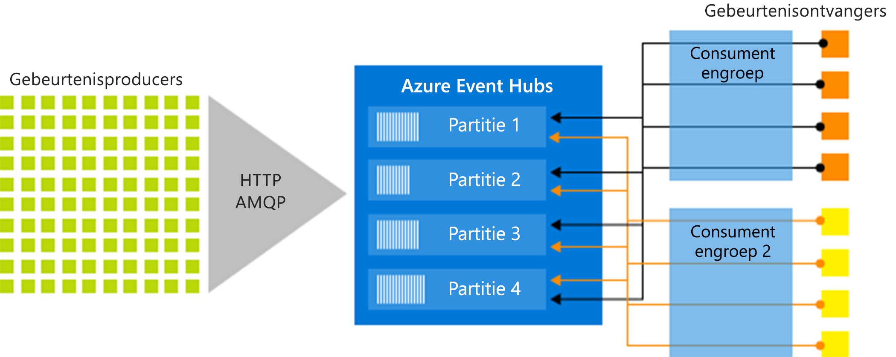

# Azure Event Hubs - Een streamingplatform en service voor het opnemen van big data

Azure Event Hubs is een big data-platform voor het streamen van gegevens en een gebeurtenisopneemservice die miljoenen gebeurtenissen per seconde kan opnemen en verwerken. Event Hubs kan gebeurtenissen, gegevens of telemetrie die wordt geproduceerd door gedistribueerde software en apparaten verwerken en opslaan. Gegevens die naar een Event Hub worden verzonden, kunnen worden omgezet en opgeslagen via een provider voor realtime analytische gegevens of batchverwerking/opslagadapters. 

Event Hubs wordt gebruikt in enkele van de volgende veel voorkomende scenario's:

- Anomaliedetectie (fraude/uitbijters)
- Toepassingslogboeken
- Analysepijplijnen, zoals clickstreams
- Live dashboards
- Archiveren van gegevens
- Transactieverwerking
- Gebruikerstelemetrieverwerking
- Telemetrie van apparaten streamen 

## Het nut van Event Hubs

Gegevens zijn alleen waardevol als er een gemakkelijke manier is om gegevens uit bronnen te verwerken en tijdig inzichten te verkrijgen. Event Hubs biedt een gedistribueerd stroomverwerkingsplatform met lage latentie en naadloze integratie met gegevens- en analyseservices binnen en buiten Azure om uw ​​complete big data-pipeline te bouwen.

De rol die Event Hubs speelt, is die van 'voordeur' van een gebeurtenispijplijn. In oplossingsarchitecturen wordt dit vaak een *event ingestor* genoemd. Een event ingestor is een onderdeel dat of een service die zich tussen gebeurtenisuitgever en gebeurtenisconsumer bevindt en de productie van de gebeurtenisstroom loskoppelt van het gebruik van de betreffende gebeurtenissen. Event Hubs biedt een geïntegreerd streamingplatform met tijdbuffer, waarmee de gebeurtenisproducenten worden ontkoppeld van gebeurtenisconsumers. 

In de volgende secties worden de belangrijkste functies van de Azure Event Hubs-service beschreven: 

## Volledig beheerde PaaS 

Event Hubs is een beheerde service met weinig overheadkosten voor configuratie of beheer, zodat u zich kunt concentreren op uw bedrijfsoplossingen. [Event Hubs voor Apache Kafka-ecosystemen](event-hubs-for-kafka-ecosystem-overview.md) bieden u de PaaS Kafka-ervaring zonder dat u uw clusters hoeft te beheren, te configureren of uit te voeren.

## Ondersteuning voor realtime- en batchverwerking

U kunt uw stroom in realtime opnemen, bufferen, opslaan en verwerken om bruikbare inzichten te krijgen. Event Hubs maakt gebruik van een [gepartitioneerd consumentenmodel](event-hubs-features.md#partitions), waardoor meerdere toepassingen de stroom gelijktijdig kunnen verwerken en u de verwerkingssnelheid kunt regelen.

[Leg uw gegevens bijna in realtime vast](event-hubs-capture-overview.md) in een [ Azure Blob-opslag](https://azure.microsoft.com/services/storage/blobs/) of [Azure Data Lake Store](https://azure.microsoft.com/services/data-lake-store/)  voor langdurige bewaring of microbatchverwerking. U kunt dit bereiken op dezelfde stroom die u gebruikt voor het afleiden van realtime analyses. Het instellen van Capture instellen gaat snel, er zijn geen beheerkosten om het uit te voeren en het schaalt automatisch met Event Hubs- [ doorvoereenheden ](event-hubs-features.md#throughput-units). Met Event Hubs Capture kunt u zich richten op gegevensverwerking in plaats van gegevensregistratie.

Azure Event Hubs kan ook worden geïntegreerd met [Azure Functions](/azure/azure-functions/) voor een serverloze architectuur.

## Schaalbaar 

Met Event Hubs kunt u beginnen met gegevensstromen van megabytes en uitgroeien tot gigabytes of terabytes. De functie [Automatisch vergroten](event-hubs-auto-inflate.md) is een van de vele beschikbare opties voor het schalen van het aantal doorvoereenheden om aan uw verbruiksbehoeften te voldoen. 

## Rijk ecosysteem

Met [Event Hubs voor Apache Kafka-ecosystemen](event-hubs-for-kafka-ecosystem-overview.md) kunnen [Apache Kafka](https://kafka.apache.org/)-clients (1.0 en later) en -toepassingen communiceren met Event Hubs zonder clusters te hoeven beheren.
 
Met een breed ecosysteem beschikbaar in verschillende [talen (.NET, Java, Python, Go, Node.js)](https://github.com/Azure/azure-event-hubs), kunt u gemakkelijk beginnen met het verwerken van uw stromen vanuit Event Hubs. Alle ondersteunde clienttalen bieden integratie op laag niveau. Het ecosysteem biedt u ook naadloze integratie met Azure-services zoals Stream Analytics en Azure Functions, zodat u serverloze architecturen kunt bouwen.

## Belangrijkste onderdelen van de architectuur

Event Hubs biedt de mogelijkheid voor het verwerken van een berichtenstroom, maar sommige van de kenmerken wijken af van wat u gewend bent bij traditionele zakelijke tools voor berichtenverzending. De mogelijkheden van Event Hubs zijn gebaseerd op maximale doorvoer en scenario's voor de verwerking van gebeurtenissen. Event Hubs bevat de volgende [belangrijke onderdelen](event-hubs-features.md):

- **Gebeurtenisproducenten**: elke entiteit die gegevens naar een Event Hub verzendt. Gebeurtenisuitgevers kunnen gebeurtenissen publiceren met HTTPS, AMQP 1.0 of Apache Kafka (1.0 of hoger)
- **Partities**: elke consument leest slechts een specifieke subset, of partitie, van de berichtenstroom.
- **Consumentengroepen**: een weergave (status, positie of offset) van een volledige Event Hub. Consumergroepen maken het mogelijk dat meerdere consumerende toepassingen beschikken over een afzonderlijke weergave van de gebeurtenisstroom. De toepassingen kunnen de stroom onafhankelijk, in hun eigen tempo en met hun eigen offsets lezen.
- **Doorvoereenheden**: vooraf gekochte eenheden van capaciteit die de doorvoercapaciteit van Event Hubs regelen.
- **Gebeurtenisontvangers**: elke entiteit die gebeurtenisgegevens van een Event Hub leest. Alle Event Hubs-consumers maken verbinding via de AMQP 1.0-sessie, en gebeurtenissen worden via de sessie geleverd zodra deze beschikbaar komen. Alle Kafka-consumers maken verbinding via het protocol Kafka 1.0 of hoger.

In de volgende afbeelding ziet u de architectuur voor de verwerking van stromen van Event Hubs:

## Volgende stappen

Zie de volgende artikelen om aan de slag te gaan met Event Hubs:

1. **Een Event Hub maken**: [Azure Portal](event-hubs-create.md), [Azure CLI](event-hubs-quickstart-cli.md), [Azure PowerShell](event-hubs-quickstart-powershell.md), [Azure Resource Manager-sjabloon](event-hubs-resource-manager-namespace-event-hub.md)
2. **Gebeurtenissen verzenden naar een event hub**: [.NET Core](event-hubs-dotnet-standard-getstarted-send.md), [.NET Framework](event-hubs-dotnet-framework-getstarted-send.md), [Java](event-hubs-java-get-started-send.md), [Python](event-hubs-python-get-started-send.md), [Node.js](event-hubs-node-get-started-send.md), [Go](event-hubs-go-get-started-send.md) en [C](event-hubs-c-getstarted-send.md)
3. **Gebeurtenissen uit een event hub ontvangen**: [.NET Core](event-hubs-dotnet-standard-getstarted-receive-eph.md), [.NET Framework](event-hubs-dotnet-framework-getstarted-receive-eph.md), [Java](event-hubs-java-get-started-receive-eph.md), [Python](event-hubs-python-get-started-receive.md), [Node.js](event-hubs-node-get-started-receive.md), [Go](event-hubs-go-get-started-receive-eph.md) en [Apache Storm](event-hubs-storm-getstarted-receive.md)   

Raadpleeg de volgende artikelen voor meer informatie over Event Hubs:

- [Overzicht van functies van Event Hubs](event-hubs-features.md)
- [Veelgestelde vragen](event-hubs-faq.md).

