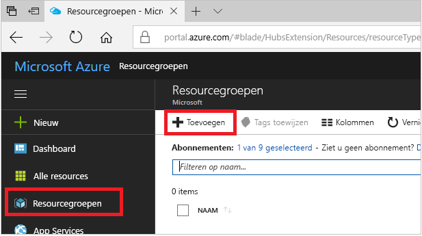
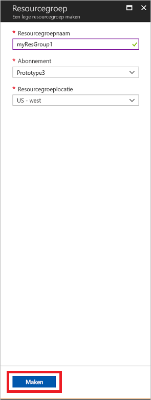
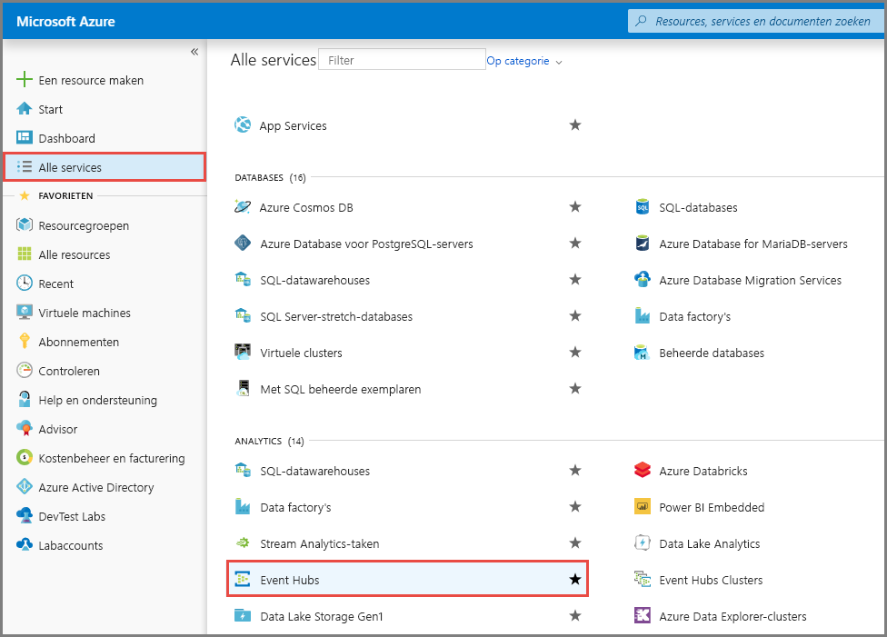
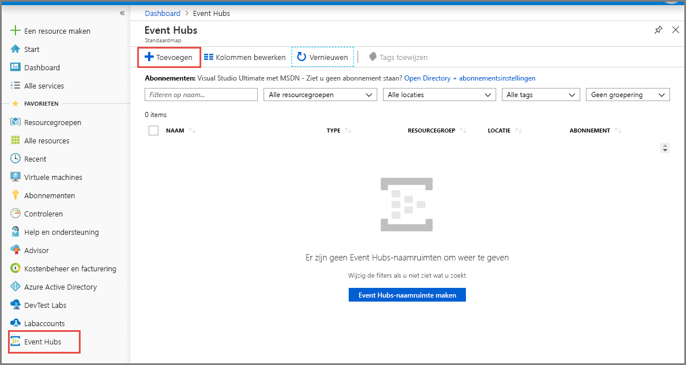
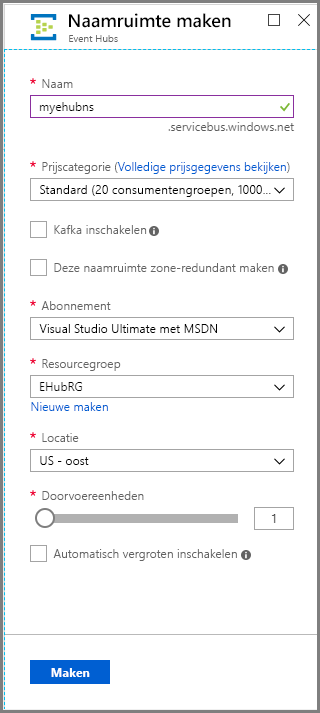
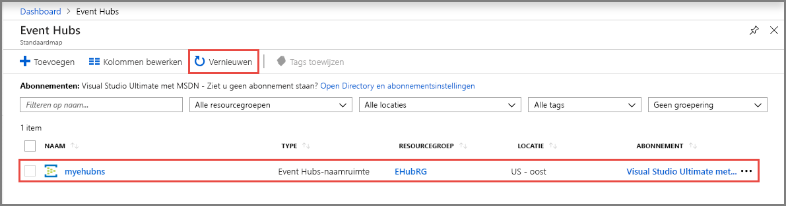
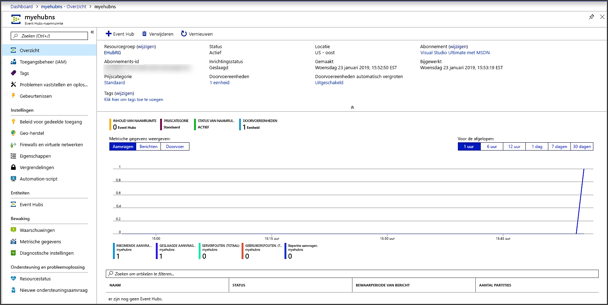
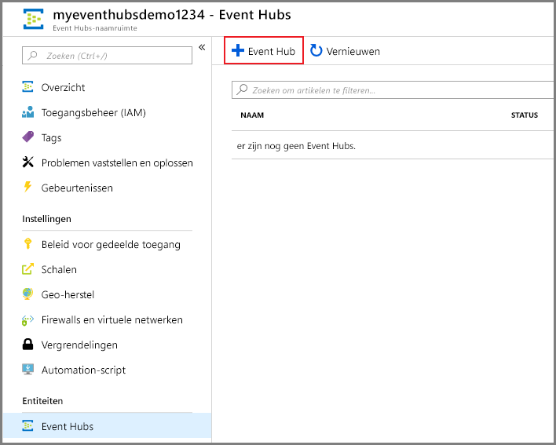
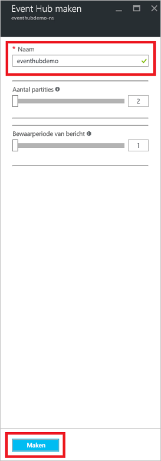
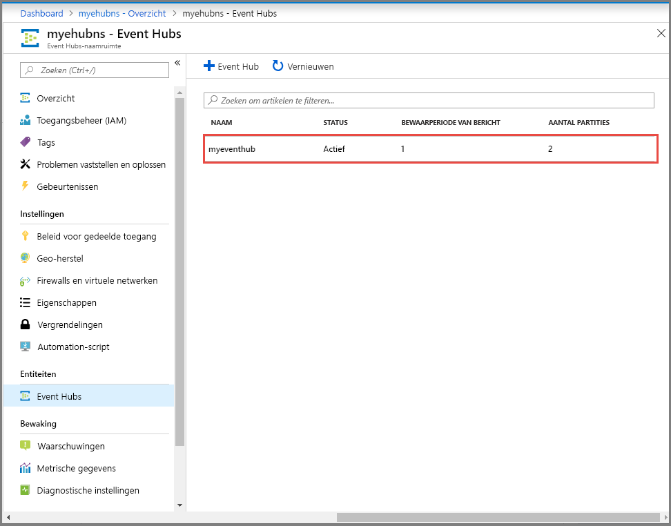

# Snelstartgids: Een event hub maken met behulp van Azure Portal
Azure Event Hubs is een big data-platform voor het streamen van gegevens en een gebeurtenisopneemservice die miljoenen gebeurtenissen per seconde kan opnemen en verwerken. Event Hubs kan gebeurtenissen, gegevens of telemetrie die wordt geproduceerd door gedistribueerde software en apparaten verwerken en opslaan. Gegevens die naar een Event Hub worden verzonden, kunnen worden omgezet en opgeslagen via een provider voor realtime analytische gegevens of batchverwerking/opslagadapters. Zie [Overzicht van Event Hubs](event-hubs-about.md) en [Functies van Event Hubs](event-hubs-features.md) voor een gedetailleerd overzicht van Event Hubs.

In deze snelstart maakt u een Event Hub met behulp van de [Azure-portal](https://portal.azure.com).

## Vereisten

Zorg ervoor dat u over het volgende beschikt om deze snelstart te voltooien:

- Azure-abonnement. Als u nog geen abonnement hebt, [maakt u een gratis account](https://azure.microsoft.com/free/) voordat u begint.
- [Visual Studio 2017 update 3 (versie 15.3, 26730.01)](https://www.visualstudio.com/vs) of hoger.
- [.NET Standard SDK](https://www.microsoft.com/net/download/windows), versie 2.0 of later.

## Een resourcegroep maken

Een resourcegroep is een logische verzameling Azure-resources. Alle resources worden geïmplementeerd en beheerd in een resourcegroep. Een resourcegroep maken:

1. Meld u aan bij [Azure Portal](https://portal.azure.com).
2. Kik in het linkernavigatievenster op **Resourcegroepen**. Klik vervolgens op **Toevoegen**.

   

2. Klik bij **Abonnement** op de naam van het Azure-abonnement waarin u de resourcegroep wilt maken.
3. Typ een unieke **naam voor de resourcegroep**. Het systeem controleert onmiddellijk of de naam beschikbaar is in het momenteel geselecteerde Azure-abonnement.
4. Selecteer een **regio** voor de resourcegroep.
5. Selecteer **Controleren + maken**.

   
6. Selecteer op de pagina **Controleren + maken** de optie **Maken**. 

## Een Event Hubs-naamruimte maken

Een Event Hubs-naamruimte biedt een unieke scopingcontainer, waarnaar wordt verwezen met de volledig gekwalificeerde domeinnaam (FQDN), waarin u een of meer Event Hubs maakt. Ga als volgt te werk om een ​​naamruimte in uw resourcegroep te maken met behulp van de portal:

1. Open de Azure-portal en klik op **Een resource maken** linksboven in het scherm.
2. Selecteer **Alle services** in het menu aan de linkerkant en selecteer de **ster (`*`)** naast **Event Hubs** in de categorie **Analyse**. Controleer of **Event Hubs** is toegevoegd aan **FAVORIETEN** in het navigatiemenu aan de linkerkant. 
    
   
3. Selecteer **Event Hubs** onder **FAVORIETEN** in het navigatiemenu links en selecteer **Toevoegen** op de werkbalk.

   
4. Voer op de pagina **Naamruimte maken** de volgende stappen uit:
    1. Voer een naam in voor de naamruimte. In het systeem wordt onmiddellijk gecontroleerd of de naam beschikbaar is.
    2. Kies de prijscategorie (Basic of Standard).
    3. Selecteer het **abonnement** waarin u de naamruimte wilt maken.
    4. Selecteer een **locatie** voor de naamruimte.
    5. Selecteer **Maken**. U moet een paar minuten wachten voordat het systeem de resources volledig heeft ingericht.

       
5. Vernieuw de **Event Hubs**-pagina. De Event Hub-naamruimte wordt dan weergegeven. U kunt de status van het Event Hub-creatieproces bekijken in de waarschuwingen. 

    
6. Selecteer de naamruimte. U ziet in de portal de startpagina van uw **Event Hubs-naamruimte**. 

   
    
## Een Event Hub maken

Ga als volgt te werk om een Event Hub in de naamruimte te maken:

1. Op de pagina Event Hubs-naamruimte selecteert u **Event Hubs** in het menu links.
1. Klik op **+ Event Hub** bovenaan in het venster.
   
    
1. Typ een naam voor uw Event Hub en klik vervolgens op **Maken**.
   
    
4. U kunt de status van het Event Hub-creatieproces bekijken in de waarschuwingen. Wanneer de Event Hub is gemaakt, wordt deze weergegeven in de lijst Event Hubs, zoals in de volgende afbeelding is te zien:

    

Gefeliciteerd! U hebt de portal gebruikt om een ​​Event Hubs-naamruimte en een Event Hub binnen die naamruimte te maken. 

## Volgende stappen

In dit artikel hebt u een resourcegroep, een Event Hubs-naamruimte en een Event Hub gemaakt. Zie de volgende zelfstudies voor stapsgewijze instructies voor het verzenden van gebeurtenissen naar of ontvangen van gebeurtenissen vanuit een Event Hub:  

- **Gebeurtenissen verzenden naar een event hub**: [.NET Core](event-hubs-dotnet-standard-getstarted-send.md), [.NET Framework](event-hubs-dotnet-framework-getstarted-send.md), [Java](event-hubs-java-get-started-send.md), [Python](event-hubs-python-get-started-send.md), [Node.js](event-hubs-node-get-started-send.md), [Go](event-hubs-go-get-started-send.md) en [C](event-hubs-c-getstarted-send.md)
- **Gebeurtenissen uit een event hub ontvangen**: [.NET Core](event-hubs-dotnet-standard-getstarted-receive-eph.md), [.NET Framework](event-hubs-dotnet-framework-getstarted-receive-eph.md), [Java](event-hubs-java-get-started-receive-eph.md), [Python](event-hubs-python-get-started-receive.md), [Node.js](event-hubs-node-get-started-receive.md), [Go](event-hubs-go-get-started-receive-eph.md) en [Apache Storm](event-hubs-storm-getstarted-receive.md)

[Azure portal]: https://portal.azure.com/
[3]: ./media/event-hubs-quickstart-portal/sender1.png
[4]: ./media/event-hubs-quickstart-portal/receiver1.png
