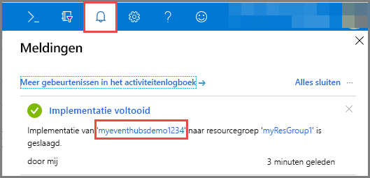
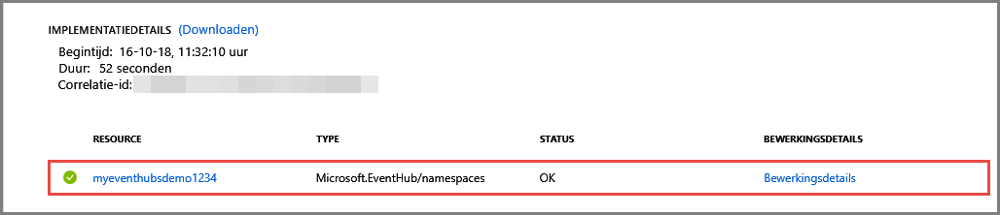

# Snelstart: Een event hub maken met behulp van Azure Portal
Azure Event Hubs is een big data-platform voor het streamen van gegevens en een gebeurtenisopneemservice die miljoenen gebeurtenissen per seconde kan opnemen en verwerken. Event Hubs kan gebeurtenissen, gegevens of telemetrie die wordt geproduceerd door gedistribueerde software en apparaten verwerken en opslaan. Gegevens die naar een Event Hub worden verzonden, kunnen worden omgezet en opgeslagen via een provider voor realtime analytische gegevens of batchverwerking/opslagadapters. Zie [Overzicht van Event Hubs](event-hubs-about.md) en [Functies van Event Hubs](event-hubs-features.md) voor een gedetailleerd overzicht van Event Hubs.

In deze snelstart maakt u een Event Hub met behulp van de [Azure-portal](https://portal.azure.com).

## Vereisten

Zorg ervoor dat u over het volgende beschikt om deze snelstart te voltooien:

- Azure-abonnement. Als u nog geen abonnement hebt, [maakt u een gratis account](https://azure.microsoft.com/free/) voordat u begint.
- [Visual Studio 2017 update 3 (versie 15.3, 26730.01)](http://www.visualstudio.com/vs) of hoger.
- [.NET Standard SDK](https://www.microsoft.com/net/download/windows), versie 2.0 of later.

## Een resourcegroep maken

Een resourcegroep is een logische verzameling Azure-resources. Alle resources worden geïmplementeerd en beheerd in een resourcegroep. Ga als volgt te werk om een resourcegroep te maken:

1. Meld u aan bij [Azure Portal](https://portal.azure.com).
2. Kik in het linkernavigatievenster op **Resourcegroepen**. Klik vervolgens op **Toevoegen**.

   

2. Typ een unieke naam voor de resourcegroep. Het systeem controleert onmiddellijk of de naam beschikbaar is in het momenteel geselecteerde Azure-abonnement.

3. Klik in **Abonnement** op de naam van het Azure-abonnement waarin u de resourcegroep wilt maken.

4. Selecteer een geografische locatie voor de resourcegroep.

5. Klik op **Create**.

   

## Een Event Hubs-naamruimte maken

Een Event Hubs-naamruimte biedt een unieke scopingcontainer, waarnaar wordt verwezen met de volledig gekwalificeerde domeinnaam (FQDN), waarin u een of meer Event Hubs maakt. Ga als volgt te werk om een ​​naamruimte in uw resourcegroep te maken met behulp van de portal:

1. Open de Azure-portal en klik op **Een resource maken** linksboven in het scherm.

2. Klik op **Internet of Things** en vervolgens op **Event Hubs**.

3. Voer in **Naamruimte maken** een naam in voor de naamruimte. In het systeem wordt onmiddellijk gecontroleerd of de naam beschikbaar is.

   

4. Nadat u hebt gecontroleerd of de naam van de naamruimte beschikbaar is, kiest u de prijscategorie (Basic of Standard). Kies ook een Azure-abonnement, resourcegroep en locatie voor het maken van de resource.
 
5. Klik op **Maken** om de naamruimte te maken. U moet een paar minuten wachten voordat het systeem de resources volledig heeft ingericht.
6. Selecteer **Waarschuwingen** en selecteer dan de **implementatie** met dezelfde naam als de Event Hub-naamruimte. 

   
6. Selecteer de Event Hub-naamruimte uit de lijst resources die u tijdens het implementeren hebt gemaakt. 

   
7. Op de pagina **Event Hubs-naamruimte** selecteert u **Beleid voor gedeelde toegang** en vervolgens klikt u op **RootManageSharedAccessKey**.
    
8. Klik op de knop voor kopiëren om de verbindingsreeks **RootManageSharedAccessKey** naar het Klembord te kopiëren. Bewaar deze verbindingsreeks op een tijdelijke locatie, zoals Kladblok, om later te gebruiken.
    
## Een Event Hub maken

Ga als volgt te werk om een Event Hub in de naamruimte te maken:

1. Op de pagina Event Hubs-naamruimten selecteert u **Event Hubs**.
   
    

1. Klik op **+ Event Hub** bovenaan in het venster.
   
    
1. Typ een naam voor uw Event Hub en klik vervolgens op **Maken**.
   
    

Gefeliciteerd! U hebt de portal gebruikt om een ​​Event Hubs-naamruimte en een Event Hub binnen die naamruimte te maken. 

## Volgende stappen

In dit artikel hebt u een resourcegroep, een Event Hubs-naamruimte en een Event Hub gemaakt. Zie de volgende zelfstudies voor stapsgewijze instructies voor het verzenden van gebeurtenissen naar of ontvangen van gebeurtenissen vanuit een Event Hub:  

- **Gebeurtenissen verzenden naar een Event Hub**: [.NET Standard](event-hubs-dotnet-standard-getstarted-send.md), [.NET Framework](event-hubs-dotnet-framework-getstarted-send.md), [Java](event-hubs-java-get-started-send.md), [Python](event-hubs-python-get-started-send.md), [Node.js](event-hubs-node-get-started-send.md), [Go](event-hubs-go-get-started-send.md), [C](event-hubs-c-getstarted-send.md)
- **Gebeurtenissen ontvangen vanuit een Event Hub**: [.NET Standard](event-hubs-dotnet-standard-getstarted-receive-eph.md), [.NET Framework](event-hubs-dotnet-framework-getstarted-receive-eph.md), [Java](event-hubs-java-get-started-receive-eph.md), [Python](event-hubs-python-get-started-receive.md), [Node.js](event-hubs-node-get-started-receive.md), [Go](event-hubs-go-get-started-receive-eph.md), [Apache Storm](event-hubs-storm-getstarted-receive.md)

[Azure portal]: https://portal.azure.com/
[3]: ./media/event-hubs-quickstart-portal/sender1.png
[4]: ./media/event-hubs-quickstart-portal/receiver1.png
