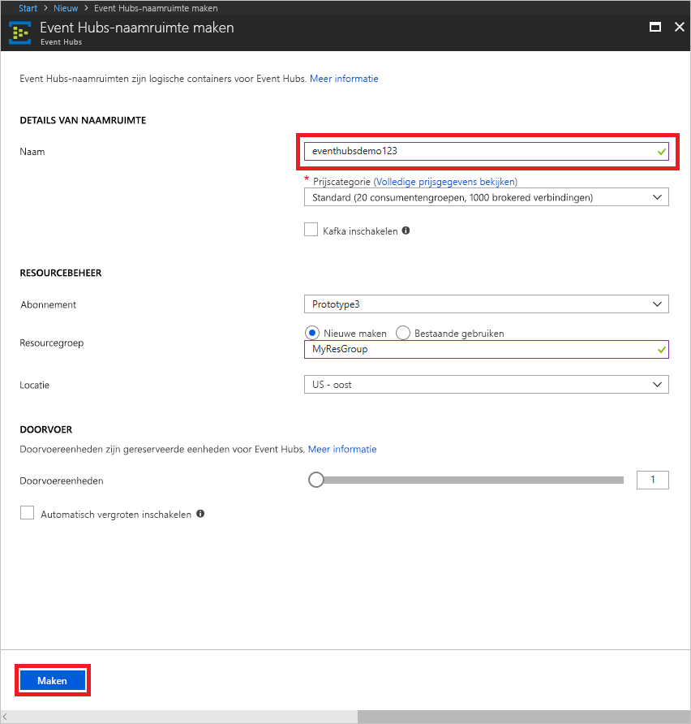

# Een Event Hubs-naamruimte en een event hub met de Azure portal maken

## Een Event Hubs-naamruimte maken
1. Meld u aan bij de [Azure-portal][Azure portal], en klik op **maken van een resource** op linksboven op het scherm.
1. Klik op **Internet der dingen**, en klik vervolgens op **Event Hubs**.
   
    
1. In **naamruimte maken**, voer de naam van een naamruimte. In het systeem wordt onmiddellijk gecontroleerd of de naam beschikbaar is.
   
    
1. Nadat u hebt gecontroleerd of de naam van de naamruimte beschikbaar is, kiest u de prijscategorie (Basic of Standard). Kies ook een Azure-abonnement, resourcegroep en locatie voor het maken van de resource. 
1. Klik op **Maken** om de naamruimte te maken. U moet wacht een paar minuten voordat het systeem om de resources volledig inrichten.
2. Klik in de portal lijst met naamruimten op de zojuist gemaakte naamruimte.
2. Klik op **gedeeld toegangsbeleid**, en klik vervolgens op **RootManageSharedAccessKey**.
    
    

3. Klik op de knop voor kopiëren om de verbindingsreeks **RootManageSharedAccessKey** naar het Klembord te kopiëren. Sla deze verbindingsreeks in een tijdelijke locatie, zoals Kladblok voor later gebruik.
    
    

## Een Event Hub maken

1. Klik op de zojuist gemaakte naamruimte in de lijst van de naamruimte Event Hubs.      
   
     

2. Klik op de blade Naamruimte op **Event Hubs**.
   
    

1. Klik op **Event Hub toevoegen** boven aan de blade.
   
    
1. Typ een naam voor uw event hub en klik vervolgens op **maken**.
   
    

Uw event hub is nu gemaakt en u hebt de verbindingsreeksen die u wilt verzenden en ontvangen van gebeurtenissen.

## Volgende stappen
Voor meer informatie over Event Hubs, gaat u naar deze koppelingen:

* [Event Hubs-overzicht](event-hubs-what-is-event-hubs.md)
* [Event Hubs-API-overzicht](event-hubs-api-overview.md)

[Azure portal]: https://portal.azure.com/