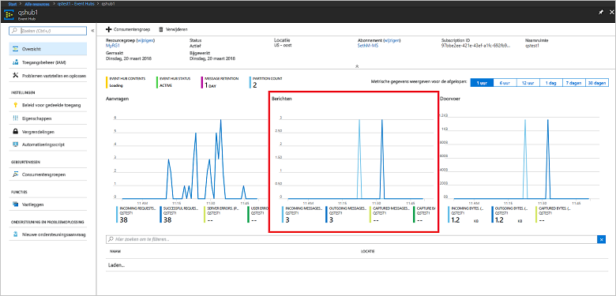

# <a name="quickstart-create-an-event-hub-using-azure-cli"></a>Snelstart: Een event hub maken met behulp van de Azure CLI

Azure Event Hubs is een uiterst schaalbaar platform voor het streamen van gegevens en een opneemservice die miljoenen gebeurtenissen per seconde kan opnemen en verwerken. Deze snelstart laat zien hoe u Event Hubs-resources kunt maken met behulp van de Azure CLI, en vervolgens gebeurtenisstromen van een Event Hub met behulp van Java-code kunt verzenden en ontvangen.

U hebt een Azure-abonnement nodig om deze snelstart te voltooien. Als u nog geen abonnement hebt, [maakt u een gratis account][] voordat u begint.

## <a name="prerequisites"></a>Vereisten

[!INCLUDE [cloud-shell-try-it.md](../../includes/cloud-shell-try-it.md)]

Als u ervoor kiest om de Azure CLI lokaal te installeren en te gebruiken, moet u voor deze zelfstudie de Azure CLI 2.0.4 of hoger uitvoeren. Voer `az --version` uit om uw versie te controleren. Als u Azure CLI 2.0 wilt installeren of upgraden, raadpleegt u [Azure CLI 2.0 installeren]( /cli/azure/install-azure-cli).

## <a name="log-on-to-azure"></a>Aanmelden bij Azure

De volgende stappen zijn niet vereist als u opdrachten in Cloud Shell uitvoert. Als u de CLI lokaal uitvoert, moet u de volgende stappen uitvoeren om u aan te melden bij Azure en uw huidige abonnement in te stellen:

Voer de volgende opdracht uit om u aan te melden bij Azure:

```azurecli-interactive
az login
```

Stel de context van het huidige abonnement in. Vervang `MyAzureSub` door de naam van het Azure-abonnement dat u wilt gebruiken:

```azurecli-interactive
az account set --subscription MyAzureSub
``` 

## <a name="provision-resources"></a>Resources inrichten

Gebruik de volgende opdrachten voor het inrichten van Event Hubs-resources. Zorg dat u de tijdelijke aanduidingen `myResourceGroup`, `namespaceName`, `eventHubName` en `storageAccountName`vervangt door de juiste waarden:

```azurecli-interactive
# Create a resource group
az group create --name myResourceGroup --location eastus

# Create an Event Hubs namespace
az eventhubs namespace create --name namespaceName --resource-group myResourceGroup -l eastus2

# Create an event hub
az eventhubs eventhub create --name eventHubName --resource-group myResourceGroup --namespace-name namespaceName

# Create a general purpose standard storage account
az storage account create --name storageAccountName --resource-group myResourceGroup --location eastus2 --sku Standard_RAGRS --encryption blob

# List the storage account access keys
az storage account keys list --resource-group myResourceGroup --account-name storageAccountName

# Get namespace connection string
az eventhubs namespace authorization-rule keys list --resource-group myResourceGroup --namespace-name namespaceName --name RootManageSharedAccessKey
```

Knip en plak de verbindingsreeks naar een tijdelijke locatie, zoals Kladblok, om later te gebruiken.

## <a name="stream-into-event-hubs"></a>Streamen in Event Hubs

De volgende stap is het downloaden van de voorbeeldcode die gebeurtenissen naar een Event Hub streamt, en deze gebeurtenissen ontvangt met behulp van de Event Processor Host. Verzend eerst de berichten:

Kloon de [Event Hubs GitHub-opslagplaats](https://github.com/Azure/azure-event-hubs) met behulp van de volgende opdracht:

```bash
git clone https://github.com/Azure/azure-event-hubs.git
```

Navigeer naar de map **SimpleSend**: `\azure-event-hubs\samples\Java\Basic\SimpleSend\src\main\java\com\microsoft\azure\eventhubs\samples\SimpleSend`. Open het bestand SimpleSend.java en vervang de tekenreeks `"Your Event Hubs namaspace name"` door de Event Hubs-naamruimte die u hebt verkregen in de sectie 'Een Event Hubs-naamruimte maken' van dit artikel.

Vervang `"Your event hub"` door de naam van de Event Hub die u in die naamruimte hebt gemaakt en vervang `"Your policy name"` door de naam van het gedeelde toegangsbeleid voor de naamruimte. Tenzij u een nieuw beleid hebt gemaakt, is **RootManageSharedAccessKey** de standaard. 

Vervang tot slot `"Your primary SAS key"` door de waarde van de SAS-sleutel voor het beleid in de vorige stap.

### <a name="build-the-application"></a>De toepassing bouwen 

Ga terug naar de map `\azure-event-hubs\samples\Java\Basic\SimpleSend` en geef volgende buildopdracht:

```shell
mvn clean package -DskipTests
```

### <a name="receive"></a>Ontvangen

Download nu het voorbeeld van de Event Processor Host, waar de berichten worden ontvangen die u net hebt verzonden. Navigeer naar de map **EventProcessorSample**: `\azure-event-hubs\samples\Java\Basic\EventProcessorSample\src\main\java\com\microsoft\azure\eventhubs\samples\eventprocessorsample`.

Vervang in het bestand EventProcessorSample.java de waarde `----EventHubsNamespaceName-----` door de Event Hubs-naamruimte die u hebt verkregen in de sectie 'Een Event Hubs-naamruimte maken' van dit artikel. 

Vervang de andere tekenreekswaarden in dit bestand: vervang `----EventHubName-----` door de naam van de Event Hub die u in die naamruimte hebt gemaakt en vervang `-----SharedAccessSignatureKeyName-----` door de naam van het gedeelde toegangsbeleid voor de naamruimte. Tenzij u een nieuw beleid hebt gemaakt, is **RootManageSharedAccessKey** de standaard.

Vervang `---SharedAccessSignatureKey----` door de waarde van de SAS-sleutel voor het beleid uit de vorige stap, vervang `----AzureStorageConnectionString----` door de verbindingsreeks voor het opslagaccount dat u hebt gemaakt en `----StorageContainerName----` door de naam van de container onder het opslagaccount dat u hebt gemaakt. 

Vervang tot slot `----HostNamePrefix----` door de naam van het opslagaccount.

### <a name="build-the-receiver"></a>De ontvanger bouwen 

Als u de ontvangende toepassing wilt bouwen, gaat u naar de map `\azure-event-hubs\samples\Java\Basic\EventProcessorSample` en typt u de volgende opdracht:

```shell
mvn clean package -DskipTests
```

### <a name="run-the-apps"></a>De apps uitvoeren

Als het bouwen is voltooid, kunt u beginnen met het verzenden en ontvangen van gebeurtenissen. Voer eerst de toepassing **SimpleSend** uit en bekijk hoe gebeurtenissen worden verzonden. Ga naar de map `\azure-event-hubs\samples\Java\Basic\SimpleSend` en geef volgende opdracht om het programma uit te voeren:

```shell
java -jar ./target/simplesend-1.0.0-jar-with-dependencies.jar
```

Voer vervolgens de app **EventProcessorSample** uit en bekijk hoe de gebeurtenissen worden ontvangen. Ga naar de map `\azure-event-hubs\samples\Java\Basic\EventProcessorSample` en geef volgende opdracht om het programma uit te voeren:
   
```shell
java -jar ./target/eventprocessorsample-1.0.0-jar-with-dependencies.jar
```

Nadat beide programma's zijn uitgevoerd, kunt u de overzichtspagina van Azure Portal voor de Event Hub controleren om te zien hoeveel inkomende en uitgaande berichten er zijn:



## <a name="clean-up-resources"></a>Resources opschonen

Gebruik de volgende opdracht om de resourcegroep, de naamruimte, het opslagaccount en alle gerelateerde resources te verwijderen. Vervang `myResourceGroup` door de naam van de resourcegroep die u hebt gemaakt:

```azurecli
az group delete --resource-group myResourceGroup
```

## <a name="understand-the-sample-code"></a>De voorbeeldcode begrijpen

Deze sectie bevat meer informatie over de werking van de voorbeeldcode.

### <a name="send"></a>Verzenden

In het bestand SimpleSend.java wordt het grootste deel van het werk in de methode main() uitgevoerd. Op de eerste plaats maakt de code gebruik van een instantie van `ConnectionStringBuilder` om de verbindingsreeks samen te stellen met behulp van waarden die door de gebruiker zijn gedefinieerd voor de naam van de naamruimte, van de Event Hub, van de SAS-sleutel en de SAS-sleutel zelf:

```java
final ConnectionStringBuilder connStr = new ConnectionStringBuilder()
        .setNamespaceName("Your Event Hubs namespace name")
        .setEventHubName("Your event hub")
        .setSasKeyName("Your policy name")
        .setSasKey("Your primary SAS key");
```

Het Java-object waarin zich de nettolading van de gebeurtenis bevindt, wordt vervolgens naar Json geconverteerd:

```java
final Gson gson = new GsonBuilder().create();

final PayloadEvent payload = new PayloadEvent(1);
byte[] payloadBytes = gson.toJson(payload).getBytes(Charset.defaultCharset());
EventData sendEvent = EventData.create(payloadBytes);  
```

De Event Hubs-client wordt gemaakt met deze coderegel:

```java
final EventHubClient ehClient = EventHubClient.createSync(connStr.toString(), executorService);
```

Het blok try/finally verzendt één round-robin-gebeurtenis naar een niet-opgegeven partitie:

```java
try {
    for (int i = 0; i < 100; i++) {

        String payload = "Message " + Integer.toString(i);
        //PayloadEvent payload = new PayloadEvent(i);
        byte[] payloadBytes = gson.toJson(payload).getBytes(Charset.defaultCharset());
        EventData sendEvent = EventData.create(payloadBytes);

        // Send - not tied to any partition
        // Event Hubs service will round-robin the events across all EventHubs partitions.
        // This is the recommended & most reliable way to send to EventHubs.
        ehClient.sendSync(sendEvent);
    }

    System.out.println(Instant.now() + ": Send Complete...");
    System.in.read();
} finally {
    ehClient.closeSync();
    executorService.shutdown();
}
```

### <a name="receive"></a>Ontvangen 

De ontvangstbewerking vindt plaats in het bestand EventProcessorSample.java. Ten eerste worden hierdoor constanten gedeclareerd voor het behouden van de naam van de Event Hubs-naamruimte en andere referenties:

```java
String consumerGroupName = "$Default";
String namespaceName = "----NamespaceName----";
String eventHubName = "----EventHubName----";
String sasKeyName = "----SharedAccessSignatureKeyName----";
String sasKey = "----SharedAccessSignatureKey----";
String storageConnectionString = "----AzureStorageConnectionString----";
String storageContainerName = "----StorageContainerName----";
String hostNamePrefix = "----HostNamePrefix----";
```

Net als bij het programma SimpleSend wordt met de code vervolgens een instantie van ConnectionStringBuilder gemaakt om de verbindingsreeks mee samen te stellen:

```java
ConnectionStringBuilder eventHubConnectionString = new ConnectionStringBuilder()
    .setNamespaceName(namespaceName)
    .setEventHubName(eventHubName)
    .setSasKeyName(sasKeyName)
    .setSasKey(sasKey);
```

*EventProcessorHost* is een klasse die het ontvangen van gebeurtenissen van Event Hubs vereenvoudigt door permanente controlepunten en parallelle ontvangst van deze Event Hubs te beheren. De code maakt nu een instantie van `EventProcessorHost`:

```java
EventProcessorHost host = new EventProcessorHost(
    EventProcessorHost.createHostName(hostNamePrefix),
    eventHubName,
    consumerGroupName,
    eventHubConnectionString.toString(),
    storageConnectionString,
    storageContainerName);
```

Na het declareren van bepaalde foutafhandelingscode, definieert de app vervolgens de klasse `EventProcessor`, een implementatie van de `IEventProcessor`-interface . Deze klasse verwerkt de ontvangen gebeurtenissen:

```java
public static class EventProcessor implements IEventProcessor
{
    private int checkpointBatchingCount = 0;
    ...
```

De methode `onEvents()` wordt aangeroepen wanneer er gebeurtenissen worden ontvangen op deze partitie van de Event Hub:

```java
@Override
public void onEvents(PartitionContext context, Iterable<EventData> events) throws Exception
{
    System.out.println("SAMPLE: Partition " + context.getPartitionId() + " got event batch");
    int eventCount = 0;
    for (EventData data : events)
    {
        try
        {
         System.out.println("SAMPLE (" + context.getPartitionId() + "," + data.getSystemProperties().getOffset() + "," +
                data.getSystemProperties().getSequenceNumber() + "): " + new String(data.getBytes(), "UTF8"));
             eventCount++;
                
         // Checkpointing persists the current position in the event stream for this partition and means that the next
         // time any host opens an event processor on this event hub+consumer group+partition combination, it will start
         // receiving at the event after this one. Checkpointing is usually not a fast operation, so there is a tradeoff
         // between checkpointing frequently (to minimize the number of events that will be reprocessed after a crash, or
         // if the partition lease is stolen) and checkpointing infrequently (to reduce the impact on event processing
         // performance). Checkpointing every five events is an arbitrary choice for this sample.
         this.checkpointBatchingCount++;
         if ((checkpointBatchingCount % 5) == 0)
         {
            System.out.println("SAMPLE: Partition " + context.getPartitionId() + " checkpointing at " +
                    data.getSystemProperties().getOffset() + "," + data.getSystemProperties().getSequenceNumber());
            // Checkpoints are created asynchronously. It is important to wait for the result of checkpointing
            // before exiting onEvents or before creating the next checkpoint, to detect errors and to ensure proper ordering.
            context.checkpoint(data).get();
         }
    }
        catch (Exception e)
        {
            System.out.println("Processing failed for an event: " + e.toString());
        }
    }
    System.out.println("SAMPLE: Partition " + context.getPartitionId() + " batch size was " + eventCount + " for host " + context.getOwner());
}
```

## <a name="next-steps"></a>Volgende stappen

In dit artikel hebt u de Event Hubs-naamruimte en andere resources gemaakt die zijn vereist voor het verzenden en ontvangen van gebeurtenissen van uw Event Hub. Ga verder met de volgende zelfstudie voor meer informatie:

> [!div class="nextstepaction"]
> [Gegevensafwijkingen visualiseren in Event Hubs-gegevensstromen](event-hubs-tutorial-visualize-anomalies.md)

[maakt u een gratis account]: https://azure.microsoft.com/free/?ref=microsoft.com&utm_source=microsoft.com&utm_medium=docs&utm_campaign=visualstudio
[Install Azure CLI 2.0]: /cli/azure/install-azure-cli
[az group create]: /cli/azure/group#az-group-create
[fully qualified domain name]: https://wikipedia.org/wiki/Fully_qualified_domain_name
