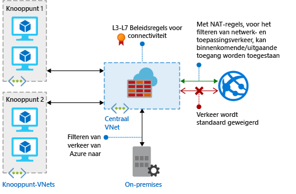

# Wat is Azure Firewall?

Azure Firewall is een beheerde, cloudgebaseerde netwerkbeveiligingsservice die uw Azure Virtual Network-resources beschermt. Het is een volledige stateful firewall als een service met ingebouwde hoge beschikbaarheid en onbeperkte cloudschaalbaarheid. 

U kunt beleid voor toepassings- en netwerkconnectiviteit centraal maken, afdwingen en registreren voor abonnementen en virtuele netwerken. Azure Firewall maakt gebruik van een statisch openbaar IP-adres voor uw virtuele-netwerkresources zodat externe firewalls verkeer dat afkomstig is van uw virtuele netwerk kunnen identificeren.  De service is volledig geïntegreerd met Azure Monitor voor registratie en analyses.

## Functies

Azure Firewall biedt de volgende functies:

### Ingebouwde hoge beschikbaarheid
Hoge beschikbaarheid is ingebouwd, zodat er geen extra load balancers vereist zijn en u niets hoeft te configureren.

### Onbeperkte cloudschaalbaarheid 
U kunt Azure Firewall omhoog schalen zoveel als nodig is om te voldoen aan veranderende netwerkverkeersstromen, zodat u geen budget hoeft te reserveren voor het drukste verkeer.

### Regels voor het filteren van de FQDN van toepassingen

U kunt uitgaand HTTP/S-verkeer beperken tot een opgegeven lijst met volledig gekwalificeerde domeinnamen (FQDN), inclusief jokertekens. Deze functie vereist geen SSL-beëindiging.

### Regels voor het filteren van netwerkverkeer

U kunt de netwerkfilterregels *toestaan* of *weigeren* centraal maken op IP-adres van bron en doel, poort en protocol. Azure Firewall is volledig stateful, wat betekent dat het legitieme pakketten voor verschillende soorten verbindingen kan onderscheiden. Regels worden afgedwongen en vastgelegd voor meerdere abonnementen en virtuele netwerken.

### FQDN-tags

Met FQDN-tags kunt u eenvoudig bekend netwerkverkeer voor Azure-services toestaan in uw firewall. Stel dat u Windows Update-netwerkverkeer wilt toestaan in de firewall. U maakt een toepassingsregel die de Windows Update-tag bevat. Het netwerkverkeer van Windows Update kan nu door uw firewall.

### Ondersteuning voor uitgaande SNAT

Alle uitgaande IP-adressen van virtueel netwerkverkeer worden geconverteerd naar de openbare IP van Azure Firewall (Source Network Address Translation). U kunt verkeer dat afkomstig is uit uw virtuele netwerk naar externe internetbestemmingen identificeren en toestaan.

### Ondersteuning voor inkomende DNAT

Het inkomende netwerkverkeer op het openbare IP-adres van de firewall wordt omgezet (Destination Network Address Translation) en gefilterd op het privé-IP-adres in uw virtuele netwerken. 

### Logboekregistratie van Azure Monitor

Alle gebeurtenissen zijn geïntegreerd met Azure Monitor, zodat u logboeken kunt archiveren in een opslagaccount, gebeurtenissen kunt streamen naar uw Event Hub of deze kunt verzenden naar Log Analytics.

## Bekende problemen

Azure Firewall heeft de volgende bekende problemen:

|Probleem  |Beschrijving  |Oplossing  |
|---------|---------|---------|
|Conflict met de JIT-functie (Just-in-Time) van Azure Security Center (ASC)|Als een virtuele machine wordt geopend met behulp van JIT en zich in een subnet bevindt met een door de gebruiker gedefinieerde route die naar Azure Firewall als een standaardgateway verwijst, werkt ASC JIT niet. Dit is het gevolg van asymmetrische routering: er komt een pakket binnen via de openbare IP van de virtuele machine (JIT geopend voor toegang), maar het retourpad gaat via de firewall, die het pakket weigert omdat er geen sessie tot stand is gebracht op de firewall.|Om dit probleem te omzeilen, plaatst u de virtuele JIT-machines op een apart subnet dat geen door de gebruiker gedefinieerde route naar de firewall bevat.|
|Hub-en-spoke met wereldwijde peering wordt niet ondersteund|Het hub-en-spoke-model gebruiken, waar de hub en de firewall zijn geïmplementeerd in een Azure-regio en de spokes zich in een andere Azure-regio bevinden. Verbindingen met de hub via wereldwijde VNet-peering worden niet ondersteund.|Dit is standaard. Zie [Azure-abonnement en servicelimieten, quota en beperkingen](../azure-subscription-service-limits.md#azure-firewall-limits) voor meer informatie|
Netwerkfilterregels voor niet-TCP/UDP-protocollen (bijvoorbeeld ICMP) werken niet voor internetverkeer|Netwerkfilterregels voor niet-TCP/UDP-protocollen werken niet met SNAT naar uw openbare IP-adres. Niet-TCP/UDP-protocollen worden ondersteund tussen spoke-subnetten en VNets.|Azure Firewall maakt gebruik van de standaardversie van Standard Load Balancer, [die momenteel geen ondersteuning biedt voor SNAT voor IP-protocollen](https://docs.microsoft.com/azure/load-balancer/load-balancer-standard-overview#limitations). We onderzoeken mogelijkheden om dit scenario in een toekomstige release te ondersteunen.|
|Destination NAT (DNAT) werkt niet voor poorten 80 en 22.|Het veld Doelpoort in de NAT-regelverzameling kan niet poort 80 of 22 bevatten.|We werken aan de snelle oplossing van dit probleem. In de tussentijd kunt elke andere poort als doelpoort in de NAT-regels gebruiken. U kunt poorten 80 en 22 wel gebruiken als omgezette poort; u kunt bijvoorbeeld openbaar-IP-adres:81 toewijzen aan privé-IP-adres:80.|
|Ontbrekende PowerShell- en CLI-ondersteuning voor ICMP|Azure PowerShell en CLI bieden geen ondersteuning voor ICMP als een geldig protocol in netwerkregels.|Het is nog steeds mogelijk om ICMP als een protocol te gebruiken via de portal en de REST-API. Er wordt aan gewerkt om ICMP binnenkort toe te voegen in PowerShell en CLI.|
|FQDN-tags vereisen instelling van een protocol: poort|Toepassingsregels met FQDN-tags vereisen definitie van poort:protocol.|U kunt **https** gebruiken als de waarde voor poort:protocol. Er wordt aan gewerkt om dit veld optioneel te maken wanneer FQDN-tags worden gebruikt.|
|Het verplaatsen van een firewall naar een andere resourcegroep of een ander abonnement wordt niet ondersteund.|Het verplaatsen van een firewall naar een andere resourcegroep of een ander abonnement wordt niet ondersteund.|Ondersteuning van deze functionaliteit staat op de planning. Om een firewall naar een andere resourcegroep of ander abonnement verplaatsen, moet u het huidige exemplaar verwijderen en deze vervolgens opnieuw maken in de nieuwe resourcegroep of het nieuwe abonnement.|

## Volgende stappen

- [Zelfstudie: Azure Firewall implementeren en configureren met Azure Portal](tutorial-firewall-deploy-portal.md)
- [Azure Firewall implementeren met behulp van een sjabloon](deploy-template.md)
- [Een Azure Firewall-testomgeving maken](scripts/sample-create-firewall-test.md)

