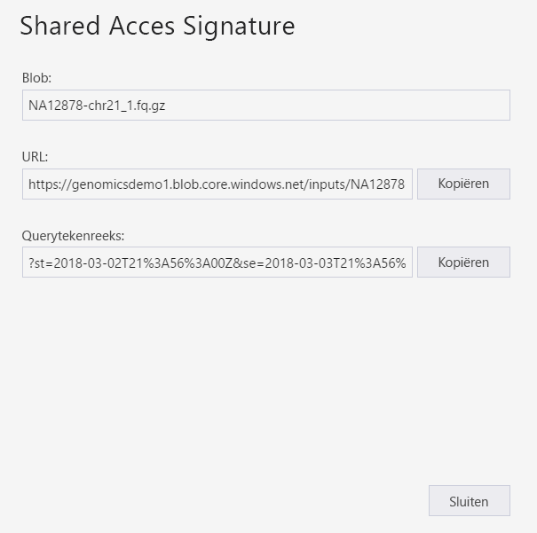
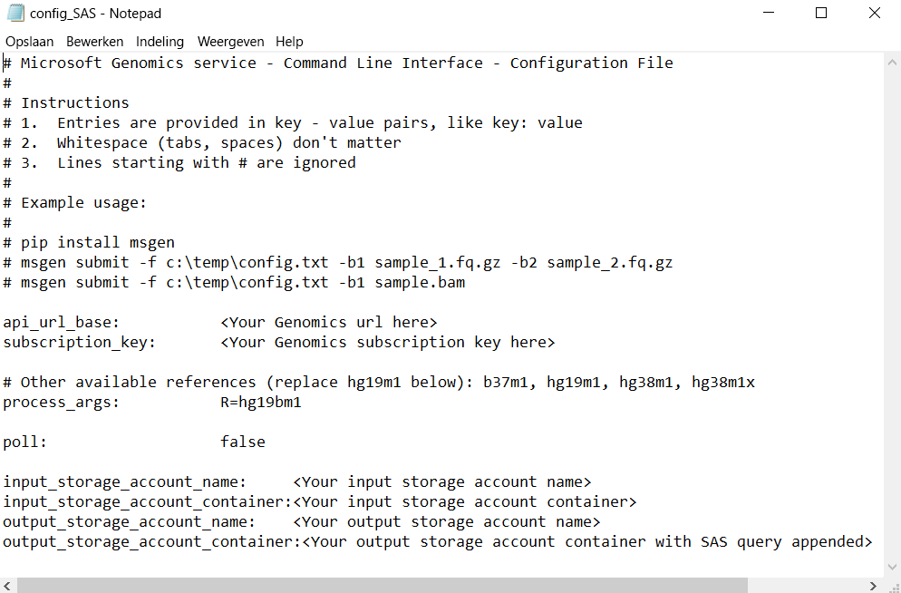

# <a name="submit-a-workflow-to-microsoft-genomics-using-a-sas-instead-of-a-storage-account-key"></a>Een werkstroom indienen aan Microsoft Genomics met behulp van een SAS in plaats van een opslagaccountsleutel 

In dit artikel ziet u hoe u een werkstroom verzendt naar de service Microsoft Genomics met behulp van een config.txt-bestand met [shared access signatures (SAS)](https://docs.microsoft.com/azure/storage/common/storage-dotnet-shared-access-signature-part-1) in plaats van opslagaccountsleutels. Deze mogelijkheid kan handig zijn als er de zichtbaarheid van een opslagaccountsleutel in het bestand config.txt uit veiligheidsoogpunt niet wenselijk is. 

In dit artikel wordt ervan uitgegaan dat u de `msgen`-client al hebt geïnstalleerd en uitgevoerd, en dat u bekend bent met het gebruik van Azure Storage. Als u een werkstroom met de opgegeven voorbeeldgegevens is verzonden, bent u klaar om door te gaan met dit artikel. 

## <a name="what-is-a-sas"></a>Wat is een SAS?
Een [SAS (Shared Access Signature; handtekening voor gedeelde toegang)](https://docs.microsoft.com/azure/storage/common/storage-dotnet-shared-access-signature-part-1) biedt gedelegeerde toegang tot bronnen in uw opslagaccount. Met behulp van een SAS kunt u toegang geven tot resources in uw opslagaccount zonder dat u de sleutels van uw account hoeft te delen. De belangrijkste reden voor het gebruik van handtekeningen voor gedeelde toegang in uw toepassingen is dat een SAS een veilige manier is voor het delen van uw opslagresources zonder dat uw accountsleutels in gevaar komen.

De SAS die wordt verzonden naar Microsoft Genomics moet een [service-SAS](https://docs.microsoft.com/rest/api/storageservices/Constructing-a-Service-SAS) zijn die alleen toegang biedt tot de blob of de container waarin de invoer- en uitvoerbestanden worden opgeslagen. 

De URI voor een SAS-token op serviceniveau bestaat uit de URI voor de resource waartoe de SAS toegang biedt, gevolgd door het SAS-token. Het SAS-token is de queryreeks die alle gegevens bevat die nodig zijn om de SAS te verifiëren, namelijk: de resource, de machtigingen die beschikbaar zijn voor toegang, de periode waarin de handtekening geldig is, het ondersteunde IP-adres of het adresbereik van waaruit aanvragen afkomstig mogen zijn, het ondersteunde protocol waarmee een aanvraag kan worden verstuurd, een optionele id voor toegangsbeleid die is gekoppeld aan de aanvraag en de handtekening zelf. 

## <a name="sas-needed-for-submitting-a-workflow-to-the-microsoft-genomics-service"></a>Vereiste SAS voor het aanbieden van een werkstroom aan de service Microsoft Genomics
Er zijn twee of meer SAS-tokens vereist voor elke werkstroom die wordt aangeboden aan de service Microsoft Genomics, één voor elk invoerbestand en één voor de uitvoercontainer.

De SAS voor de invoerbestanden moet de volgende eigenschappen hebben:
1.  Bereik (account, container, blob): blob
2.  Verlooptijd: 48 uur vanaf nu
3.  Machtigingen: lezen

De SAS voor de uitvoercontainer moet de volgende eigenschappen hebben:
1.  Bereik (account, container, blob): container
2.  Verlooptijd: 48 uur vanaf nu
3.  Machtigingen: lezen, schrijven, verwijderen


## <a name="create-a-sas-for-the-input-files-and-the-output-container"></a>Een SAS maken voor de invoerbestanden en de uitvoercontainer
Er zijn twee manieren om een SAS-token te maken: met behulp van Azure Storage Explorer of via programmacode.  Als u code gebruikt, kunt u de SAS zelf samenstellen, maar u kunt ook de SDK van Azure Storage gebruiken in de taal van uw voorkeur.


### <a name="set-up-create-a-sas-using-azure-storage-explorer"></a>Instellen: Een SAS maken met behulp van Azure Storage Explorer

[Azure Storage Explorer](https://azure.microsoft.com/features/storage-explorer/) is een hulpprogramma voor het beheren van resources die u hebt opgeslagen in Azure Storage.  U vindt [hier](https://docs.microsoft.com/azure/vs-azure-tools-storage-manage-with-storage-explorer) meer informatie over het gebruik van Azure Storage Explorer.

Het bereik van de SAS voor de invoerbestanden moet worden ingesteld op het specifieke invoerbestand (blob). Volg [deze instructies](https://docs.microsoft.com/azure/storage/blobs/storage-quickstart-blobs-storage-explorer) om een SAS-token te maken. Als u de SAS hebt gemaakt, ziet u de volledige URL met de querytekenreeks, evenals de querytekenreeks zelf, op het scherm en kunt u deze gegevens kopiëren.

 


### <a name="set-up-create-a-sas-programmatically"></a>Instellen: Een SAS maken via een programma

Als u een SAS wilt maken met behulp van de SDK van Azure Storage, raadpleegt u de documentatie voor verschillende talen, waaronder [.NET](https://docs.microsoft.com/azure/storage/blobs/storage-dotnet-shared-access-signature-part-2#generate-a-shared-access-signature-uri-for-a-blob), [Python](https://docs.microsoft.com/azure/storage/blobs/storage-python-how-to-use-blob-storage) en [Node.js](https://docs.microsoft.com/azure/storage/blobs/storage-nodejs-how-to-use-blob-storage). 

Als u een SAS wilt maken zonder een SDK, kunt u de SAS-querytekenreeks rechtstreeks samenstellen, inclusief alle gegevens die vereist zijn voor verificatie van de SAS. In deze [instructies](https://docs.microsoft.com/rest/api/storageservices/constructing-a-service-sas) worden de onderdelen van de SAS-queryreeks beschreven en ook hoe u de reeks samenstelt. De vereiste SAS-handtekening maakt u door het genereren van een HMAC aan de hand van de verificatiegegevens voor de blob/container, zoals wordt beschreven in deze [instructies](https://docs.microsoft.com/rest/api/storageservices/service-sas-examples).


## <a name="add-the-sas-to-the-configtxt-file"></a>De SAS toevoegen aan het config.txt-bestand
Als u een werkstroom wilt uitvoeren via de service Microsoft Genomics met behulp van een SAS-queryreeks, bewerkt u het config.txt-bestand om de sleutels te verwijderen uit het bestand. Vervolgens voegt u de SAS-queryreeks (begint met een `?`) toe aan de naam van de container, zoals hier wordt weergegeven. 



Gebruik de Microsoft Genomics Python-client voor het indienen van de werkstroom met de volgende opdracht, waarbij u de bijbehorende SAS-queryreeks toevoegt aan de namen van de blob-invoerbestanden:

```python
msgen submit -f [full path to your config file] -b1 [name of your first paired end read file, SAS query string appended] -b2 [name of your second paired end read file, SAS query string appended]
```

### <a name="if-adding-the-input-file-names-to-the-configtxt-file"></a>Namen van invoerbestanden toevoegen aan config.txt-bestand
U kunt ook de namen van de gekoppelde end read-bestanden rechtstreeks toevoegen aan het config.txt-bestand, met de SAS-querytokens toegevoegd zoals hier wordt weergegeven:


In dit geval gebruikt u de Python-client voor Microsoft Genomics om uw werkstroom te verzenden met de volgende opdracht, waarbij u de parameters `-b1` en `-b2` weglaat:

```python
msgen submit -f [full path to your config file] 
```

## <a name="next-steps"></a>Volgende stappen
In dit artikel hebt u SAS-tokens gebruikt in plaats van accountsleutels om een werkstroom via de Python-client `msgen` aan te bieden aan de service Microsoft Genomics. Zie onze [veelgestelde vragen](frequently-asked-questions-genomics.md) voor meer informatie over de verzending van werkstromen en andere opdrachten die u kunt gebruiken met de service Microsoft Genomics. 
