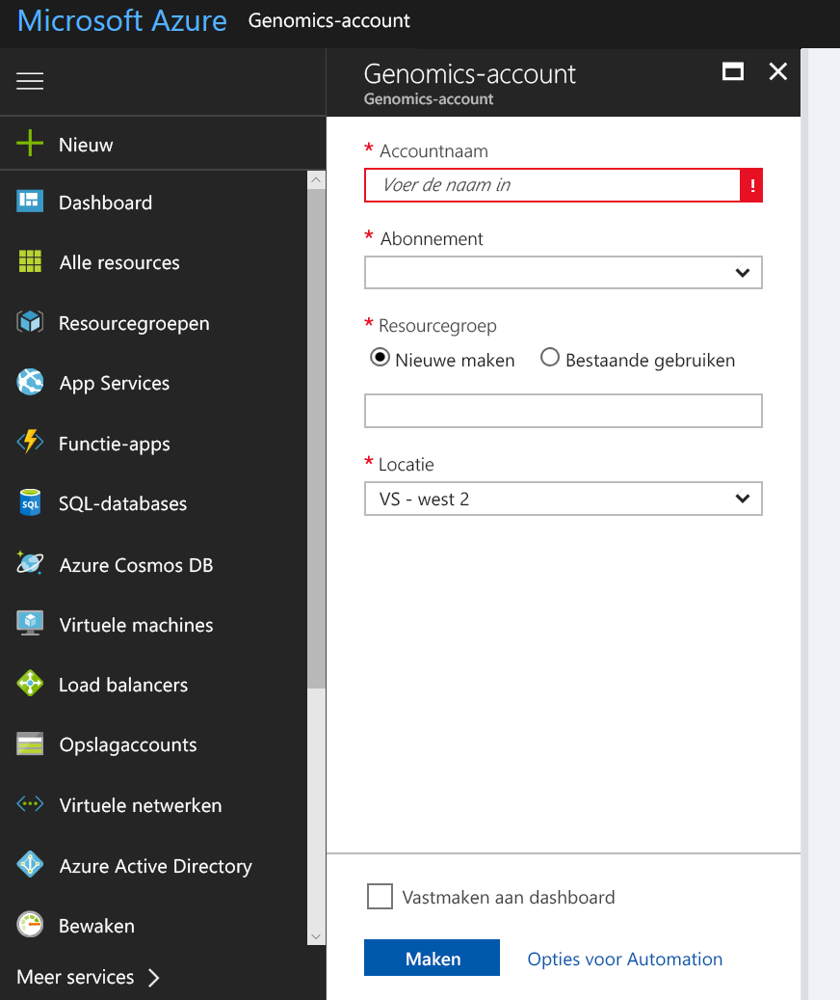
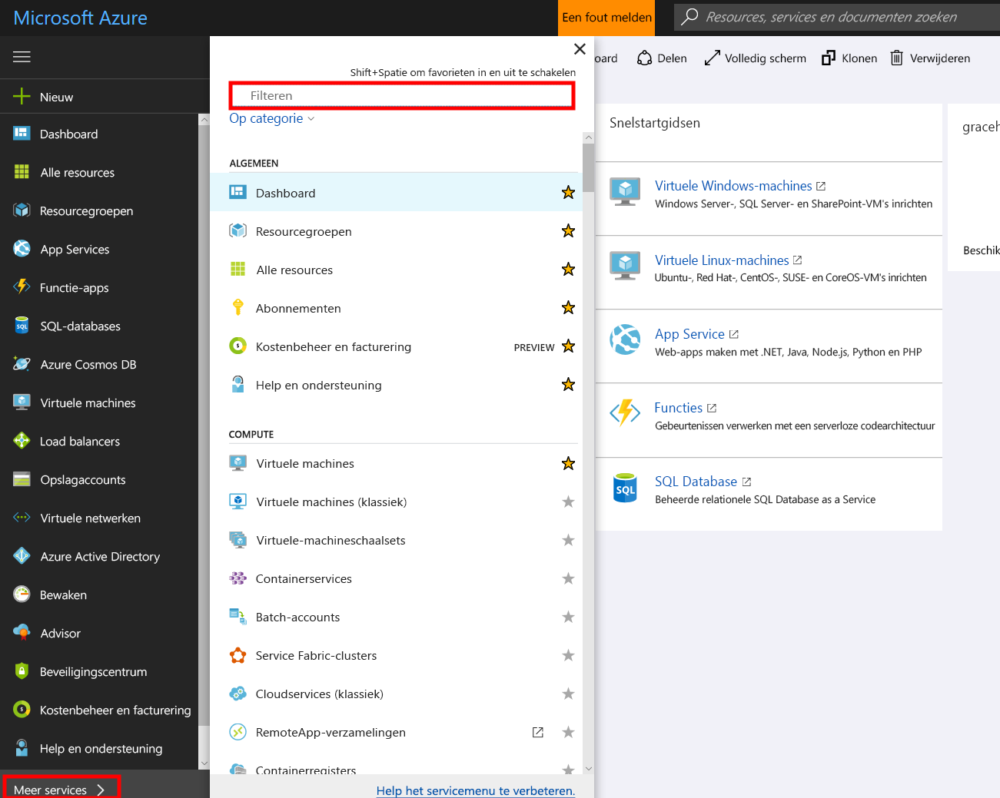
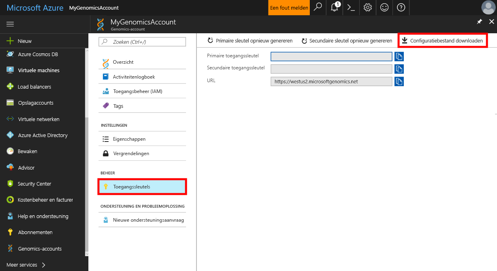

# <a name="quickstart-run-a-workflow-through-the-microsoft-genomics-service"></a>Snelstartgids: een werkstroom uitvoeren via de service Microsoft Genomics

Microsoft Genomics is een schaalbare, veilige service voor secundaire analyse waarbij genomen snel kunnen worden verwerkt, waarbij wordt begonnen met raw leesbewerkingen en uitgelijnde leesbewerkingen en variant-aanroepen worden geproduceerd. Ga in een paar stappen aan de slag: 
1.  Instellen: maak een Genomics Microsoft-account via Azure Portal en installeer de Python-client voor Microsoft Genomics in uw lokale omgeving. 
2.  Invoergegevens uploaden: maak een Microsoft Azure-opslagaccount via Azure Portal en upload vervolgens de invoerbestanden. De invoerbestanden moeten leesbewerkingen voor eindsequenties zijn (fastq- of bam-bestanden).
3.  Uitvoeren: gebruik de opdrachtregelinterface van Microsoft Genomics voor het uitvoeren van werkstromen via de service Microsoft Genomics. 

Zie [Wat is Microsoft Genomics?](overview-what-is-genomics.md) voor meer informatie over Microsoft Genomics.

## <a name="set-up-create-a-microsoft-genomics-account-in-the-azure-portal"></a>Instellen: een Microsoft Genomics-account in Azure Portal maken

Ga voor het maken van een Microsoft Genomics-account naar [Azure Portal](https://portal.azure.com/#create/Microsoft.Genomics). Als u nog geen Azure-abonnement hebt, maakt u er een voordat u een Microsoft Genomics-account maakt. 




Configureer uw Genomics-account met de volgende informatie, zoals weergegeven in de vorige afbeelding. 

 |**Instelling**          |  **Voorgestelde waarde**  | **Beschrijving van veld** |
 |:-------------       |:-------------         |:----------            |
 |Accountnaam         | MyGenomicsAccount     |Kies een unieke account-id. Zie [Naamgevingsregels](https://docs.microsoft.com/azure/architecture/best-practices/naming-conventions) voor geldige namen. |
 |Abonnement         | De naam van uw abonnement|Dit is de factureringseenheid voor uw Azure-services; zie [Abonnementen](https://account.azure.com/Subscriptions) voor meer informatie over uw abonnement. |      
 |Resourcegroep       | MyResourceGroup       |  Met resourcegroepen kunt u meerdere Azure-resources (opslagaccount, Genomics-account enzovoort) in één groep indelen voor eenvoudig beheer. Zie [Resourcegroepen] (https://docs.microsoft.com/azure/azure-resource-manager/resource-group-overview#resource-groups) voor meer informatie. Zie [Naamgevingsregels](https://docs.microsoft.com/azure/architecture/best-practices/naming-conventions) voor geldige resourcegroepnamen. |
 |Locatie                   | VS - west 2                    |    De service is beschikbaar in VS West 2, West-Europa en Zuidoost-Azië |


U kunt in de bovenste menubalk op Meldingen klikken om het implementatieproces te controleren.


## <a name="set-up-install-the-microsoft-genomics-python-client"></a>Instellen: de Python-client voor Microsoft Genomics installeren

Gebruikers moeten Python en de Python-client voor Microsoft Genomics installeren in hun lokale omgeving. 

### <a name="install-python"></a>Python installeren

De Python-client voor Microsoft Genomics is compatibel met Python 2.7. We raden u aan versie 2.7.12 of hoger te gebruiken, bij voorkeur versie 2.7.14. U vindt de download [hier](https://www.python.org/downloads/). 


### <a name="install-the-microsoft-genomics-client"></a>De Microsoft Genomics-client installeren

Gebruik Python-pip om de `msgen`-client voor Microsoft Genomics te installeren. Bij de volgende instructies wordt ervan uitgegaan dat Python al op het systeempad staat. Als de pip-installatie niet wordt herkend, dient u Python en de submap voor scripts aan het systeempad toe te voegen.


```
pip install --upgrade --no-deps msgen
pip install msgen
```


Als u `msgen` niet wilt installeren als een systeembreed binair bestand en systeembrede Python-pakketten niet wilt wijzigen, gebruikt u de markering `–-user` met `pip`.
Als u de installatie op basis van een pakket of setup.py gebruikt, worden alle vereiste pakketten geïnstalleerd. Anders zijn de vereiste basispakketten voor msgen 

 * [Azure-storage](https://pypi.python.org/pypi/azure-storage). 
 * [Requests](https://pypi.python.org/pypi/requests). 


U kunt deze pakketten installeren met `pip`, `easy_install` of via de standaard `setup.py`-procedures. 


### <a name="test-the-microsoft-genomics-client"></a>De Microsoft Genomics-client testen
Download het configuratiebestand in uw Genomics-account om de client voor Microsoft Genomics te testen. Navigeer naar uw Genomics-account door links onderin op **Meer services** te klikken, te filteren en Genomics-accounts te selecteren.





Selecteer het Genomics-account dat u zojuist hebt gemaakt, ga naar **Toegangssleutels** en download het configuratiebestand.




Test of de Python-client voor Microsoft Genomics werkt met de volgende opdracht


```
msgen list -f “<full path where you saved the config file>”
```

## <a name="create-a-microsoft-azure-storage-account"></a>Een Microsoft Azure-opslagaccount maken 
De service Microsoft Genomics verwacht dat invoeren worden opgeslagen als blok-blobs in een Azure-opslagaccount. Ook schrijft de service uitvoerbestanden als blok-blobs naar een door de gebruiker opgegeven container in een Azure-opslagaccount. De invoeren en uitvoeren kunnen zich in verschillende opslagaccounts bevinden.
Als u uw gegevens al in een Azure-opslagaccount hebt, hoeft u alleen ervoor te zorgen dat deze zich op dezelfde locatie bevinden als uw Genomics-account. Anders worden er uitvoerkosten gemaakt wanneer de Genomics-service wordt uitgevoerd. Als u nog geen Microsoft Azure Storage-account hebt, dient u er een te maken en uw gegevens te uploaden. U vindt [hier](https://docs.microsoft.com/azure/storage/common/storage-create-storage-account) meer informatie over Azure Storage-accounts, met inbegrip van wat een opslagaccount is en welke services het biedt. Ga naar [Azure Portal](https://portal.azure.com/#create/Microsoft.StorageAccount-ARM ) om een Microsoft Azure Storage-account te maken.  


Configureer uw Storage-account met de volgende informatie, zoals weergegeven in de vorige afbeelding. Gebruik de meeste van de standaardopties voor een opslagaccount en geef alleen op dat het account blob-opslag is en niet algemeen. Blob-opslag kan twee tot vijf keer sneller zijn voor downloads en uploads. 


 |**Instelling**          |  **Voorgestelde waarde**  | **Beschrijving van veld** |
 |:-------------------------       |:-------------         |:----------            |
 |Name         | MyStorageAccount     |Kies een unieke account-id. Zie [Naamgevingsregels](https://docs.microsoft.com/azure/architecture/best-practices/naming-conventions) voor geldige namen. |
 |Implementatiemodel         | Resource Manager| Resource Manager is het aanbevolen implementatiemodel. Zie [Understanding Resource Manager deployment](https://docs.microsoft.com/azure/azure-resource-manager/resource-manager-deployment-model) (Resource Manager-implementatie begrijpen) voor meer informatie. |      
 |Soort account       | Blob Storage       |  Blob-opslag kan twee tot vijf keer sneller zijn dan algemeen gebruik voor downloads en uploads. |
 |Prestaties                  | Standard                   | Standard is de standaardinstelling. Zie [Kennismaking met Microsoft Azure Storage](https://docs.microsoft.com/azure/storage/common/storage-introduction) voor meer informatie over standaard en premium opslagaccounts.    |
 |Replicatie                  | Lokaal redundante opslag                  | Lokaal redundante opslag repliceert uw gegevens in het datacenter in de regio waarin u uw opslagaccount hebt gemaakt. Zie [Azure Storage-replicatie](https://docs.microsoft.com/azure/storage/common/storage-redundancy) voor meer informatie.    |
 |Veilige overdracht vereist                  | Uitgeschakeld                 | Uitgeschakeld is de standaardinstelling. Zie [Veilige overdracht vereisen](https://docs.microsoft.com/azure/storage/common/storage-require-secure-transfer) voor meer informatie over de beveiliging van gegevensoverdracht.    |
 |Toegangslaag                  | Warm                   | De toegangslaag Hot geeft aan dat de objecten in het opslagaccount vaker worden gebruikt.    |
 |Abonnement         | Uw Azure-abonnement |Zie [Abonnementen](https://account.azure.com/Subscriptions) voor meer informatie over uw abonnement. |      
 |Resourcegroep       | MyResourceGroup       |  U kunt dezelfde resourcegroep als voor uw Genomics-account gebruiken. Zie [Naamgevingsregels](https://docs.microsoft.com/azure/architecture/best-practices/naming-conventions) voor geldige resourcegroepnamen. |
 |Locatie                  | VS - west 2                  | Gebruik dezelfde locatie als de locatie van uw Genomics-account om uitvoerkosten te verminderen en latentie te beperken. De Genomics-service is beschikbaar in VS West2, VS West 2, West-Europa en Zuidoost-Azië    |
 |Virtuele netwerken                | Uitgeschakeld                   | Uitgeschakeld is de standaardinstelling. Zie [Virtuele netwerken van Azure](https://docs.microsoft.com/azure/storage/common/storage-network-security) voor meer informatie.    |


Klik vervolgens op Maken om het opslagaccount te maken. Net als bij het maken van uw Genomics-account, kunt u in de bovenste menubalk op Meldingen klikken om het implementatieproces te controleren. 


## <a name="upload-input-data-to-your-storage-account"></a>De invoergegevens naar uw opslagaccount uploaden

De service Microsoft Genomics verwacht leesbewerkingen voor eindsequenties als invoerbestanden. U kunt uw eigen gegevens uploaden, of openbare voorbeeldgegevens verkennen die voor u beschikbaar zijn gesteld. De openbare voorbeeldgegevens worden hier gehost:


[https://msgensampledata.blob.core.windows.net/small/chr21_1.fq.gz](https://msgensampledata.blob.core.windows.net/small/chr21_1.fq.gz)
[https://msgensampledata.blob.core.windows.net/small/chr21_2.fq.gz](https://msgensampledata.blob.core.windows.net/small/chr21_2.fq.gz)


U dient binnen uw opslagaccount een blob-container te maken voor uw invoergegevens en een tweede blob-container voor de uitvoergegevens.  Upload de invoergegevens naar uw blob-container voor invoer. U kunt hiervoor verschillende hulpprogramma's gebruiken, waaronder [Microsoft Azure Storage Explorer](https://azure.microsoft.com/features/storage-explorer/), [blobporter](https://github.com/Azure/blobporter) en [AzCopy](https://docs.microsoft.com/azure/storage/common/storage-use-azcopy?toc=%2fazure%2fstorage%2fblobs%2ftoc.json). 


## <a name="run-a-workflow-through-the-microsoft-genomics-service-using-the-python-client"></a>Een werkstroom uitvoeren via de Microsoft Genomics-service met behulp van de Python-client 

Als u een werkstroom wilt uitvoeren via de service Microsoft Genomics, bewerkt u het bestand config.txt om de invoer- en uitvoeropslagcontainer voor uw gegevens op te geven.
Open het bestand config.txt dat u van uw Genomics-account hebt gedownload. De gedeeltes die u dient op te geven zijn de abonnementssleutel en de zes items onderaan, de naam van het opslagaccount, de sleutel en de naam van de container voor zowel invoer als uitvoer. U kunt deze informatie vinden door in de portal naar **Toegangssleutels** voor uw opslagaccount te navigeren of rechtstreeks vanuit Azure Storage Explorer.  


### <a name="submit-your-workflow-to-the-microsoft-genomics-service-the-microsoft-genomics-client"></a>De werkstroom in de service Microsoft Genomics verzenden met de client voor Microsoft Genomics

Gebruik de Python-client voor Microsoft Genomics om uw werkstroom te verzenden met de volgende opdracht:


```python
msgen submit -f [full path to your config file] -b1 [name of your first paired end read] -b2 [name of your second paired end read]
```


U kunt de status van uw werkstromen bekijken met de volgende opdracht: 
```python
msgen list -f c:\temp\config.txt 
```


Nadat de werkstroom is voltooid, kunt u de uitvoerbestanden weergeven in uw Azure Storage-account in de uitvoercontainer die u hebt geconfigureerd. 


## <a name="next-steps"></a>Volgende stappen
In dit artikel hebt u voorbeeldinvoergegevens geüpload naar Azure Storage, en een werkstroom verzonden naar de Microsoft Genomics-service via de Python-client voor `msgen`. Ga voor meer informatie over andere invoerbestandstypen die kunnen worden gebruikt met de Microsoft Genomics-service naar de volgende pagina's: [paired FASTQ](quickstart-input-pair-FASTQ.md) | [BAM](quickstart-input-BAM.md) | [Multiple FASTQ or BAM](quickstart-input-multiple.md) (gekoppelde FASTQ/BAM/Meerdere FASTQ of BAM). 