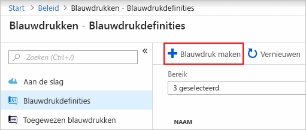
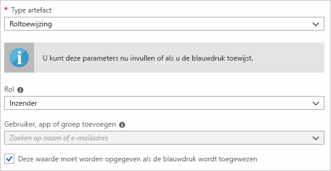
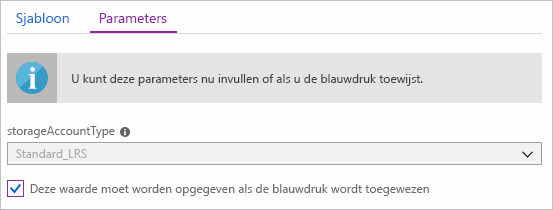
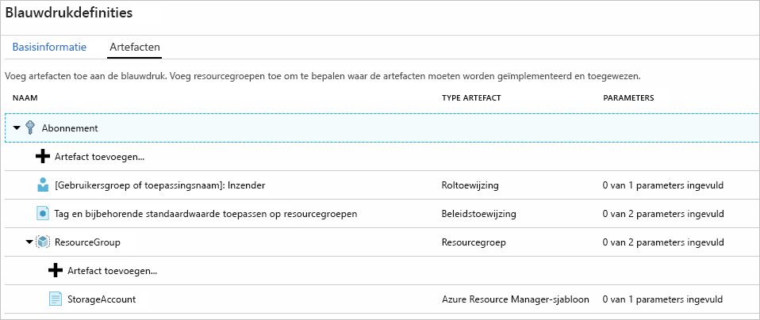
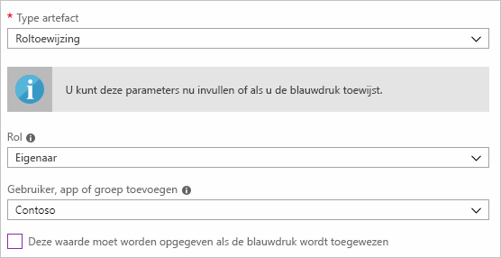
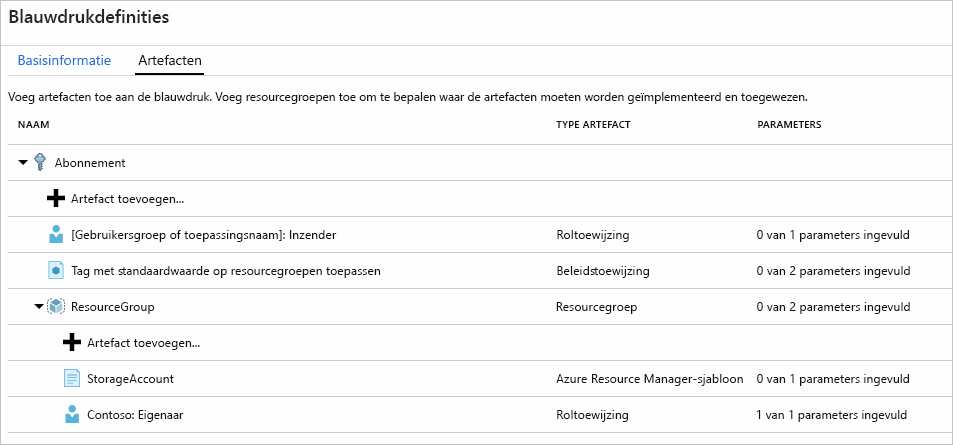
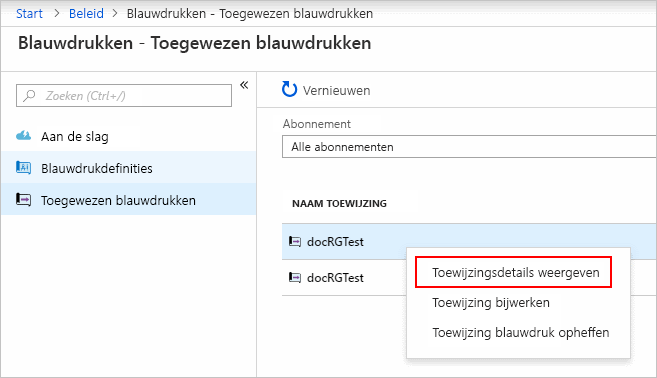

# <a name="define-and-assign-an-azure-blueprint-in-the-portal"></a>Een Azure Blueprint definiëren en toewijzen in de portal

Als u leert hoe u blauwdrukken in Azure maakt en toewijst, kunnen er algemene patronen worden gedefinieerd voor de ontwikkeling van herbruikbare en snel implementeerbare configuraties op basis van Resource Manager-sjablonen, beleid, beveiliging en meer. In deze zelfstudie leert u hoe u Azure Blueprints gebruikt om algemene taken uit te voeren met betrekking tot het maken, publiceren en toewijzen van een blauwdruk binnen uw organisatie, zoals:

> [!div class="checklist"]
> - Een nieuwe blauwdruk maken en verschillende ondersteunde artefacten toevoegen
> - Wijzigingen aanbrengen aan een bestaande blauwdruk die nog een **Concept** is
> - Blauwdrukken markeren als gereed om toe te wijzen met **Gepubliceerd**
> - Een blauwdruk toewijzen aan een bestaand abonnement
> - De status en voortgang van een toegewezen blauwdruk controleren
> - Een blauwdruk verwijderen die aan een abonnement is toegewezen

Als u nog geen abonnement op Azure hebt, maak dan een [gratis account](https://azure.microsoft.com/free) aan voordat u begint.

## <a name="create-a-blueprint"></a>Een blauwdruk maken

De eerste stap bij het definiëren van een standaardpatroon voor naleving bestaat uit het samenstellen van een blauwdruk uit de beschikbare resources. In dit voorbeeld maakt u een nieuwe blauwdruk met de naam 'MyBlueprint' om rol- en beleidstoewijzingen voor het abonnement te configureren, een nieuwe resourcegroep toe te voegen en een Resource Manager-sjabloon en roltoewijzing voor de nieuwe resourcegroep te maken.

1. Klik op **Alle services** en selecteer **Beleid** in het linkerdeelvenster. Klik op de pagina **Beleid** op **Blueprints**.

1. Selecteer **Blauwdrukdefinities** op de pagina aan de linkerkant en klik op de knop **+ Blauwdruk maken** aan de bovenkant van de pagina.

   - U kunt ook op de pagina **Aan de slag** op **Maken** klikken om rechtstreeks naar het maken van een blauwdruk te gaan.

   

1. Geef een **Blauwdruknaam** voor de blauwdruk op, bijvoorbeeld 'MyBlueprint' (letters en cijfers, maximaal 48 tekens, maar geen spaties of speciale tekens), maar laat **Beschrijving van blauwdruk** voorlopig leeg.  Klik in het vak **Definitielocatie** op het beletselteken aan de rechterkant, selecteer de [beheergroep](../management-groups/overview.md) waarin u de blauwdruk wilt opslaan en klik op **Selecteren**.

   > [!NOTE]
   > Blauwdrukdefinities kunnen alleen worden opgeslagen in beheergroepen. Volg [deze stappen](../management-groups/create.md) om uw eerste beheergroep te maken.

1. Controleer of de gegevens correct zijn (de velden **Blauwdruknaam** en **Definitielocatie** kunnen later niet meer worden gewijzigd) en klik op **Volgende: artefacten** onderaan de pagina of het tabblad **Artefacten** boven aan de pagina.

1. Roltoewijzing toevoegen aan abonnement: klik in de rij **+ Artefact toevoegen...**  onder **Abonnement** om het venster Artefact toevoegen aan de rechterkant van de browser te openen. Selecteer Roltoewijzing als _Type artefact_. Selecteer onder _Rol_ de optie Inzender en laat het selectievakje _Gebruiker, app of groep toevoegen_ ingeschakeld om een **dynamische parameter** aan te geven. Klik op **Toevoegen** om dit artefact toe te voegen aan de blauwdruk.

   

   > [!NOTE]
   > De meeste _artefacten_ ondersteunen parameters. Een parameter die wordt toegewezen tijdens het maken van een waarde is een **statische parameter**. Een parameter die wordt toegewezen tijdens het toewijzen van de blauwdruk, is een **dynamische parameter**. Zie [Blauwdrukparameters](./concepts/parameters.md) voor meer informatie.

1. Beleidstoewijzing toevoegen aan abonnement: klik in de rij **+ Artefact toevoegen...** , direct onder het **Abonnement**. Selecteer Beleidstoewijzing als _Type artefact_. Wijzig _Type_ in Ingebouwd en typ 'tag' in _Zoeken_. Klik buiten het veld _Zoeken_ om de filtering weer te geven. Selecteer Tag met standaardwaarde op resourcegroepen toepassen door erop te klikken. Klik op **Toevoegen** om dit artefact toe te voegen aan de blauwdruk.

1. Klik in de rij van de beleidstoewijzing Tag met standaardwaarde op resourcegroepen toepassen. Het venster waarin u parameters voor het artefact kunt opgeven als onderdeel van de blauwdrukdefinitie wordt geopend. Hier kunt u de parameters voor alle toewijzingen instellen (**statische parameters**) op basis van deze blauwdruk in plaats van tijdens de toewijzing (**dynamische parameters**). In dit voorbeeld worden **dynamische parameters** gebruikt tijdens de blauwdruktoewijzing. Laat daarom de standaardwaarden staan en klik op **Annuleren**.

1. Resourcegroep toevoegen aan abonnement: klik in de rij **+ Artefact toevoegen...**  onder **Abonnement**. Selecteer Resourcegroep als _Type artefact_. Laat de velden _Naam resourcegroep_ en _Locatie_ leeg, maar zorg dat het selectievakje voor elke eigenschap is ingeschakeld zodat het **dynamische parameters** zijn. Klik op **Toevoegen** om dit artefact toe te voegen aan de blauwdruk.

1. Sjabloon toevoegen onder resourcegroep: klik in de rij **+ Artefact toevoegen...** direct onder de vermelding **ResourceGroup**. Selecteer Azure Resource Manager-sjabloon als _Type artefact_, stel _Weergavenaam van artefact_ in op StorageAccount en laat de eigenschap _Beschrijving_ leeg. Op het tabblad **Sjabloon** van het editorvak plakt u de volgende Resource Manager-sjabloon. Na het plakken van de sjabloon klikt u op het tabblad **Parameters** en u ziet dat de sjabloonparameter **storageAccountType** en de standaardwaarde **Standard_LRS** automatisch zijn gedetecteerd en ingevuld. Ze zijn echter geconfigureerd als een **dynamische parameter**. Wanneer u het vinkje uit het selectievakje verwijdert, ziet u dat de vervolgkeuzelijst alleen waarden bevat die in de Resource Manager-sjabloon onder **allowedValues** voorkomen. Schakel het selectievakje weer in om de parameters terug te zetten op een **dynamische parameter**. Klik op **Toevoegen** om dit artefact toe te voegen aan de blauwdruk.

   > [!IMPORTANT]
   > Controleer bij het importeren van de sjabloon of het bestand alleen JSON is en geen HTML-code bevat. Wanneer u verwijst naar een URL op GitHub, zorg er dan voor dat u op **RAW** hebt geklikt om het zuivere JSON-bestand op te halen en niet het bestand met HTML, om weer te geven op GitHub. Er treedt een fout op als de geïmporteerde sjabloon geen zuivere JSON is.

   ```json
   {
       "$schema": "https://schema.management.azure.com/schemas/2015-01-01/deploymentTemplate.json#",
       "contentVersion": "1.0.0.0",
       "parameters": {
           "storageAccountType": {
               "type": "string",
               "defaultValue": "Standard_LRS",
               "allowedValues": [
                   "Standard_LRS",
                   "Standard_GRS",
                   "Standard_ZRS",
                   "Premium_LRS"
               ],
               "metadata": {
                   "description": "Storage Account type"
               }
           }
       },
       "variables": {
           "storageAccountName": "[concat(uniquestring(resourceGroup().id), 'standardsa')]"
       },
       "resources": [{
           "type": "Microsoft.Storage/storageAccounts",
           "name": "[variables('storageAccountName')]",
           "apiVersion": "2016-01-01",
           "location": "[resourceGroup().location]",
           "sku": {
               "name": "[parameters('storageAccountType')]"
           },
           "kind": "Storage",
           "properties": {}
       }],
       "outputs": {
           "storageAccountName": {
               "type": "string",
               "value": "[variables('storageAccountName')]"
           }
       }
   }
   ```

   

1. De voltooide blauwdruk moet er nu ongeveer als volgt uitzien. U ziet dat voor elke artefact '_x_ van de _y_ parameters ingevuld' wordt weergegeven in de kolom _Parameters_. De **dynamische parameters** worden ingesteld tijdens elke toewijzing van de blauwdruk.

   

1. Nu alle geplande artefacten zijn toegevoegd, klikt u onderaan de pagina op **Concept opslaan**.

## <a name="edit-a-blueprint"></a>Een blauwdruk bewerken

In [Een blauwdruk maken](#create-a-blueprint) hebt u geen beschrijving opgegeven en de roltoewijzing niet toegevoegd aan de nieuwe resourcegroep. Beide kunnen met de volgende stappen worden opgelost:

1. Selecteer **Blauwdrukdefinities** op de pagina aan de linkerkant.

1. Klik in de lijst met blauwdrukken met de rechtermuisknop op de blauwdruk die u eerder hebt gemaakt en kies **Blauwdruk bewerken**.

1. Geef in **Beschrijving van blauwdruk** informatie op over de blauwdruk en de artefacten waaruit deze bestaat.  Voer in dat geval iets in als: 'Deze blauwdruk stelt het tagbeleid en de roltoewijzing op abonnement in, maakt een ResourceGroup en implementeert een resourcesjabloon en wijst een rol toe aan die resourcegroep.'

1. Klik op **Volgende: artefacten** onderaan de pagina of op het tabblad **Artefacten** bovenaan de pagina.

1. Roltoewijzing toevoegen onder resourcegroep: klik in de rij **+ Artefact toevoegen...**  direct onder de vermelding **ResourceGroup**. Selecteer Roltoewijzing als _Type artefact_. Selecteer onder _Rol_ de optie Eigenaar en schakel het selectievakje _Gebruiker, app of groep toevoegen_ uit en selecteer de gebruiker, app of groep die u wilt toevoegen. Dit artefact maakt gebruik van een **statische parameter** die in elke toewijzing van deze blauwdruk is ingesteld. Klik op **Toevoegen** om dit artefact toe te voegen aan de blauwdruk.

   

1. De voltooide blauwdruk moet er nu ongeveer als volgt uitzien. Voor de zojuist toegevoegde roltoewijzing wordt '**1 van 1 parameters ingevuld**' weergegeven. Dat wil zeggen dat het een **statische parameter** is.

   

1. Klik op **Concept opslaan** nu deze is bijgewerkt.

## <a name="publish-a-blueprint"></a>Een blauwdruk publiceren

Nu alle geplande artefacten aan de blauwdruk zijn toegevoegd, kunt u deze gaan publiceren.
Als de blauwdruk wordt gepubliceerd, wordt deze toegewezen aan een abonnement.

1. Selecteer **Blauwdrukdefinities** op de pagina aan de linkerkant.

1. Klik in de lijst met blauwdrukken met de rechtermuisknop op de blauwdruk die u eerder hebt gemaakt en kies **Blauwdruk publiceren**.

1. Geef in het volgende dialoogvenster een **versie** op (letters, cijfers en afbreekstreepjes met een maximale lengte van twintig tekens), bijvoorbeeld v1 en **Wijzigingsopmerkingen** (optioneel), bijvoorbeeld Eerst publiceren.

1. Klik onderaan de pagina op **Publiceren**.

## <a name="assign-a-blueprint"></a>Een blauwdruk toewijzen

Wanneer een blauwdruk is gepubliceerd, kan deze worden toegewezen aan een abonnement. Wijs de blauwdruk die u hebt gemaakt toe aan een van de abonnementen in uw beheergroephiërarchie.

1. Selecteer **Blauwdrukdefinities** op de pagina aan de linkerkant.

1. Klik in de lijst met blauwdrukken met de rechtermuisknop op de blauwdruk die u eerder hebt gemaakt (of klik op het beletselteken) en kies **Blauwdruk toewijzen**.

1. Op de pagina **Blauwdruk toewijzen** selecteert u in de vervolgkeuzelijst **Abonnement** de abonnementen waarin u deze blauwdruk wilt implementeren.

   > [!NOTE]
   > Er wordt voor elk abonnement dat u hebt geselecteerd een toewijzing gemaakt, zodat één abonnementtoewijzing later kan worden gewijzigd zonder dat de overige geselecteerde abonnementen ook worden gewijzigd.

1. Geef voor **Naam Toegewezen** een unieke naam op voor deze toewijzing.

1. Selecteer in **Locatie** een regio waarin u de beheerde identiteit wilt maken. Azure Blueprint gebruikt deze beheerde identiteit om alle artefacten in de toegewezen blauwdruk te implementeren. Zie [Beheerde identiteiten voor Azure-resources](../../active-directory/managed-identities-azure-resources/overview.md) voor meer informatie.

1. Laat de vervolgkeuzelijst **Blauwdrukdefinitieversies** van **Gepubliceerde** versies staan op de vermelding 'v1' (standaard de meest recente **gepubliceerd** versie).

1. Laat **Toewijzing vergrendelen** staan op de standaardwaarde **Niet vergrendelen**. Zie voor meer informatie [Vergrendeling van blauwdrukresources](./concepts/resource-locking.md).

1. Voor de roltoewijzing op abonnementsniveau **[gebruikersgroep of toepassingsnaam]: Inzender** selecteert u een gebruiker, app of groep.

1. Voor de beleidstoewijzing op abonnementsniveau stelt u de **Tagnaam** in op CostCenter en de **Tagwaarde** op ContosoIT.

1. Geef voor de ResourceGroup de **Naam** StorageAccount op en selecteer voor de **Locatie** US - oost 2 in de vervolgkeuzelijst.

   > [!NOTE]
   > Elk artefact dat tijdens de blauwdrukdefinitie is toegevoegd aan de resourcegroep, springt in, zodat het op één lijn staat met de resourcegroep of het object waarmee het wordt geïmplementeerd. Artefacten die geen parameters hebben of waarvoor tijdens de toewijzing geen parameters zijn gedefinieerd, worden alleen weergegeven voor contextuele informatie.

1. Selecteer in de Azure Resource Manager-sjabloon StorageAccount de optie Standard_GRS voor de parameter **storageAccountType**.

1. Lees het informatievak onderaan de pagina en klik op **Toewijzen**.

## <a name="track-deployment-of-a-blueprint"></a>Implementatie van een blauwdruk bijhouden

Wanneer een blauwdruk is toegewezen aan een of meer abonnementen, gebeuren er twee dingen:

- De blauwdruk wordt toegevoegd aan de pagina **Toegewezen blauwdrukken** van elk abonnement waaraan deze is toegewezen
- De implementatie van de artefacten die zijn gedefinieerd door de blauwdruk begint

Nu de blauwdruk is toegewezen aan een abonnement, kunt u de voortgang van de implementatie controleren.

1. Selecteer **Toegewezen blauwdrukken** op de pagina aan de linkerkant.

1. Klik in de lijst met blauwdrukken met de rechtermuisknop op de blauwdruk die u eerder hebt toegewezen en selecteer **Toewijzingsdetails weergeven**.

   

1. Valideer op de pagina **Implementatiedetails** of alle artefacten zijn geïmplementeerd en of er tijdens de implementatie geen fouten zijn opgetreden. Als er fouten zijn opgetreden, raadpleegt u [Blauwdrukproblemen oplossen](./troubleshoot/general.md) voor stappen om te bepalen wat er mis is gegaan.

## <a name="unassign-a-blueprint"></a>De toewijzing van een blauwdruk ongedaan maken

Als u een blauwdruktoewijzing niet langer nodig hebt, kunt u deze uit een abonnement verwijderen. De blauwdruk is mogelijk vervangen door een nieuwere blauwdruk met bijgewerkte patronen, beleidsregels en ontwerpen. Wanneer een blauwdruk wordt verwijderd, blijven de artefacten die als onderdeel van die blauwdruk zijn toegewezen, achter. Voer de volgende stappen uit als u een blauwdruktoewijzing wilt verwijderen:

1. Selecteer **Toegewezen blauwdrukken** op de pagina aan de linkerkant.

1. Selecteer in de lijst met blauwdrukken de blauwdruk waarvan u de toewijzing wilt verwijderen en klik op de knop **Toewijzing blauwdruk intrekken** bovenaan de pagina.

1. Lees het bevestigingsbericht en klik op **OK**.

## <a name="delete-a-blueprint"></a>Een blauwdruk verwijderen

1. Selecteer **Blauwdrukdefinities** op de pagina aan de linkerkant.

1. Klik met de rechtermuisknop op de blauwdruk die u wilt verwijderen en selecteer **Blauwdruk verwijderen**. Klik in het bevestigingsvenster op **Ja**.

> [!NOTE]
> Door een blauwdruk met deze methode te verwijderen, verwijdert u ook alle **Gepubliceerde versies** van de geselecteerde blauwdruk. Als u één versie wilt verwijderen, opent u de blauwdruk, klikt u op het tabblad **Gepubliceerde versies**, klikt u op de versie die u wilt verwijderen en vervolgens op **Deze versie verwijderen**. Bovendien kan een blauwdruk met toewijzingen pas worden verwijderd wanneer alle blauwdruktoewijzingen zijn verwijderd.

## <a name="next-steps"></a>Volgende stappen

- Meer informatie over de [levenscyclus van een blauwdruk](./concepts/lifecycle.md)
- Informatie over hoe u [statische en dynamische parameters](./concepts/parameters.md) gebruikt
- Meer informatie over hoe u de [blauwdrukvolgorde](./concepts/sequencing-order.md) aanpast
- Ontdek hoe u gebruikmaakt van [resourcevergrendeling in blauwdrukken](./concepts/resource-locking.md)
- Meer informatie over hoe u [bestaande toewijzingen bijwerkt](./how-to/update-existing-assignments.md)
- Problemen oplossen tijdens de toewijzing van een blauwdruk met [algemene probleemoplossing](./troubleshoot/general.md)
