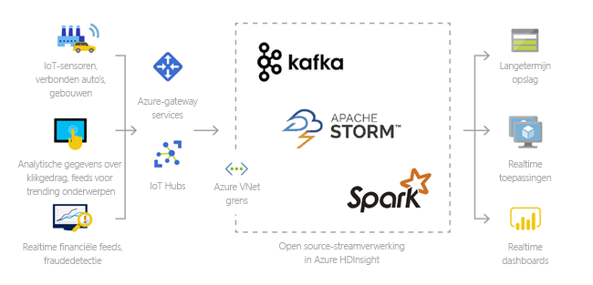
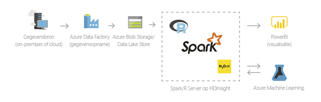
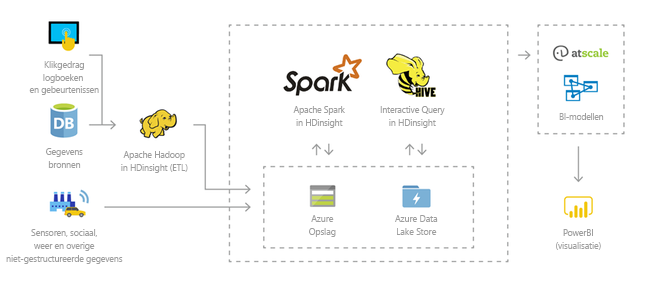
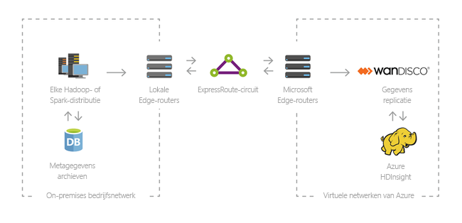

# Inleiding tot Azure HDInsight en de Hadoop- en Spark-technologiestack
Dit artikel biedt een inleiding tot Azure HDInsight. Azure HDInsight is een volledig beheerde, zeer uitgebreide open-source analyseservice voor bedrijven. U kunt populaire opensourcekaders zoals Hadoop, Spark, Hive, LLAP, Kafka, Storm, R, etc. gebruiken. 

[!INCLUDE [hdinsight-price-change](../../../includes/hdinsight-enhancements.md)]

[Apache Hadoop](http://hadoop.apache.org/) was het originele open-source framework voor gedistribueerde verwerking en analyse van sets met big data in clusters. De Hadoop-technologiestack omvat verwante software en hulpprogramma's, waaronder Apache Hive, HBase, Spark en Kafka om er maar een paar te noemen. 

Raadpleeg [Components and versions available with HDInsight][component-versioning] (Onderdelen en versies die beschikbaar zijn in HDInsight) om na te gaan welke onderdelen van de Hadoop-technologiestack in HDInsight beschikbaar zijn. Zie de [pagina met Azure-functies voor HDInsight](https://azure.microsoft.com/services/hdinsight/) voor meer informatie over Hadoop in HDInsight.

[Apache Spark](http://spark.apache.org) is een opensourcekader voor parallelle verwerking dat ondersteuning biedt voor in-memory verwerking om de prestaties van toepassingen voor de analyse van big data te verbeteren. Zie voor meer informatie over Spark in HDInsight de [Inleiding tot Spark in Azure HDInsight](../spark/apache-spark-overview.md). 

## Wat is HDInsight en de Hadoop-technologiestack? 
Azure HDInsight is een cloud-distributie van de Hadoop-onderdelen van het [Hortonworks Data Platform (HDP)](https://hortonworks.com/products/data-center/hdp/). Azure HDInsight maakt het eenvoudig, snel en kosteneffectief om enorme hoeveelheden gegevens te verwerken. U kunt de populairste opensourcekaders gebruiken, zoals Hadoop, Spark, Hive, LLAP, Kafka, Storm, R enz. Met deze kaders kunt u ook een breed scala aan scenario's inschakelen, zoals extraheren, transformeren en laden (ETL), gegevensopslag, machine learning en IoT.

## Wat is big data?

Big data wordt verzameld in steeds sneller groeiende volumes, met een steeds hogere snelheid en in een groter aantal indelingen dan ooit tevoren. Bij big data kan het gaan om historische gegevens (opgeslagen gegevens), maar ook om realtime gegevens (gestreamd vanuit de bron). Zie [Scenario's voor het gebruik van HDInsight](#scenarios-for-using-hdinsight) voor meer informatie over de meest voorkomende gebruiksvoorbeelden voor big data.

## Waarom moet ik HDInsight gebruiken?

In deze sectie worden de mogelijkheden van Azure HDInsight toegelicht.

|Mogelijkheid  |Beschrijving  |
|---------|---------|
|Cloudeigen     |     Met Azure HDInsight kunt u geoptimaliseerde clusters maken voor [Hadoop](apache-hadoop-linux-tutorial-get-started.md), [Spark](../spark/apache-spark-jupyter-spark-sql.md), [interactieve query’s (LLAP)](../interactive-query/apache-interactive-query-get-started.md), [Kafka](../kafka/apache-kafka-get-started.md), [ Storm](../storm/apache-storm-tutorial-get-started-linux.md), [HBase](../hbase/apache-hbase-tutorial-get-started-linux.md), en [R Server](../r-server/r-server-get-started.md) op Azure. HDInsight Biedt tevens een end-to-end SLA voor al uw productieworkloads.  |
|Voordelig en schaalbaar     | Met HDInsight kunt u [workloads](../hdinsight-administer-use-portal-linux.md)  vergroten/verkleinen. U kunt de kosten verlagen door [clusters op aanvraag te maken](../hdinsight-hadoop-create-linux-clusters-adf.md) en uitsluitend te betalen voor wat u gebruikt. U kunt ook gegevenspijplijnen maken om uw taken operationeel maken. Rekenwerk en opslag zijn niet langer gekoppeld, voor betere prestaties en flexibiliteit. |
|Beveiligd en compatibel    | Met HDInsight kunt u uw zakelijke gegevensassets beschermen met [Azure Virtual Network](../hdinsight-extend-hadoop-virtual-network.md), [versleuteling](../hdinsight-hadoop-create-linux-clusters-with-secure-transfer-storage.md) en integratie met [Azure Active Directory](../domain-joined/apache-domain-joined-introduction.md). HDInsight voldoet aan de meeste populaire [nalevingsstandaarden](https://azure.microsoft.com/overview/trusted-cloud) van de industrie en de overheid.        |
|Bewaking    | Azure HDInsight kan worden geïntegreerd met [Azure Log Analytics](../hdinsight-hadoop-oms-log-analytics-tutorial.md) en biedt zo één enkele interface waarmee u al uw clusters kunt bewaken.        |
|Wereldwijde beschikbaarheid | HDInsight is wereldwijd beschikbaar in meer  [regio's](https://azure.microsoft.com/regions/services/)  dan welk ander aanbod voor big-data-analyses ook. Azure HDInsight is ook beschikbaar in Azure Government, China en Duitsland, waarmee u kunt voldoen aan de behoeften van uw bedrijf in belangrijke soevereine gebieden. |  
|Productiviteit     |  Met Azure HDInsight kunt u geavanceerde hulpprogramma's voor Hadoop en Spark gebruiken in de ontwikkelomgeving van uw keuze. De beschikbare ontwikkelomgevingen zijn [Visual Studio](apache-hadoop-visual-studio-tools-get-started.md), [Eclipse](../spark/apache-spark-eclipse-tool-plugin.md) en [IntelliJ](../spark/apache-spark-intellij-tool-plugin.md) voor Scala-, Python-, R-, Java- en .NET-ondersteuning. Gegevensanalisten kunnen ook samenwerken met behulp van populaire notebooks zoals [Jupyter](../spark/apache-spark-jupyter-notebook-kernels.md) en [Zeppelin](../spark/apache-spark-zeppelin-notebook.md).    |
|Uitbreidbaarheid     |  U kunt de HDInsight-clusters uitbreiden met geïnstalleerde onderdelen (Hue, Presto enz.) met behulp van [scriptacties](../hdinsight-hadoop-customize-cluster-linux.md), door [edge-knooppunten toe te voegen](../hdinsight-apps-use-edge-node.md) of via [integratie met andere toepassingen die zijn gecertificeerd voor big data](../hdinsight-apps-install-applications.md). Met HDInsight kunt u naadloos integreren met de meest populaire big data-oplossingen met [éénkliksimplementatie](https://azure.microsoft.com/services/hdinsight/partner-ecosystem/).|

## Scenario's voor het gebruik van HDInsight

Azure HDInsight kan worden gebruikt voor tal van scenario's in big data-verwerking. Hierbij kan het gaan om historische gegevens (gegevens die al zijn verzameld en opgeslagen), maar ook om realtime gegevens (gegevens die rechtstreeks vanuit de bron worden gestreamd). De scenario's voor het verwerken van deze gegevens kunnen worden ingedeeld in de volgende categorieën: 

### Batchverwerking (ETL)

Extraheren, transformeren en laden (ETL) is een proces waarbij ongestructureerde of gestructureerde gegevens worden geëxtraheerd uit heterogene gegevensbronnen. Deze gegevens worden vervolgens omgezet in een gestructureerde indeling en in een gegevensarchief geladen. U kunt de getransformeerde gegevens gebruiken voor data science of datawarehousing.

### Internet der dingen (IoT)

U kunt HDInsight gebruiken voor het verwerken van streaminggegevens die in realtime worden ontvangen vanaf een breed scala aan apparaten. Voor meer informatie leest u [deze Azure-blogpost](https://azure.microsoft.com/blog/announcing-public-preview-of-apache-kafka-on-hdinsight-with-azure-managed-disks/) waarin de openbare preview van Apache Kafka in HDInsight met Azure Managed Disks wordt aangekondigd.

 

### Data Science

Met HDInsight kunt u toepassingen ontwikkelen die belangrijke inzichten uit gegevens halen. U kunt hierbij ook Azure Machine Learning gebruiken om toekomstige ontwikkelingen voor uw bedrijf te voorspellen. Lees dit [verhaal van een klant](https://customers.microsoft.com/story/pros) voor meer informatie.

### Datawarehousing

Met HDInsight kunt u interactieve query's op petabyte-schaal uitvoeren voor gestructureerde of ongestructureerde gegevens in elke indeling. U kunt ook modellen bouwen die hen verbinden met BI-hulpprogramma’s. Lees dit [verhaal van een klant](https://customers.microsoft.com/story/milliman) voor meer informatie. 

### Hybride

Met HDInsight kunt u uw bestaande on-premises big data-infrastructuur uitbreiden naar Azure om gebruik te maken van de mogelijkheden voor geavanceerde analyses van de cloud.

## Clustertypen in HDInsight
HDInsight omvat specifieke clustertypen en opties voor clusteraanpassing, zoals de mogelijkheid om onderdelen, hulpprogramma's en talen toe te voegen.

### Clusters van Apache Spark, Kafka, Interactive Query en HBase, aangepaste clusters en andere clustertypen
HDInsight biedt de volgende clustertypen:

* **[Apache Hadoop](https://wiki.apache.org/hadoop)**: een kader dat gebruikmaakt van [HDFS](#hdfs), [YARN](#yarn) voor resourcebeheer en een eenvoudig [MapReduce](#mapreduce)-programmeermodel om batchgegevens parallel te verwerken en te analyseren.

* **[Apache Spark](http://spark.apache.org/)**: een kader voor parallelle verwerking dat ondersteuning biedt voor in-memory verwerking om de prestaties van toepassingen voor de analyse van big data te verbeteren. Spark werkt voor SQL, het streamen van gegevens en machine learning. Zie [Wat is Apache Spark in HDInsight?](../spark/apache-spark-overview.md)

* **[Apache HBase](http://hbase.apache.org/)**: een NoSQL-database gebouwd op Hadoop. Deze biedt willekeurige toegang en sterke consistentie voor grote hoeveelheden (mogelijk miljarden rijen bij miljoenen kolommen) ongestructureerde en semi-gestructureerde gegevens. Zie [Wat is HBase in HDInsight?](../hbase/apache-hbase-overview.md)

* **[Microsoft R Server](https://msdn.microsoft.com/microsoft-r/rserver)**: een server voor de hosting van websites en het beheren van parallelle, gedistribueerde R-processen. Het biedt gegevenswetenschappers, statistici en R-programmeurs on-demand toegang tot schaalbare, gedistribueerde analysemethoden in HDInsight. Zie [Overzicht van R Server in HDInsight](../r-server/r-server-overview.md).

* **[Apache Storm](https://storm.incubator.apache.org/)**: een gedistribueerd, realtime berekeningssysteem voor het snel verwerken van grote gegevensstromen. Storm wordt aangeboden als beheerd cluster in HDInsight. Zie [Realtime-sensorgegevens analyseren met Storm en Hadoop](../storm/apache-storm-sensor-data-analysis.md).

* **[Voorbeeld van Apache Interactive Query (ook bekend onder de naam: Live Long and Process)](https://cwiki.apache.org/confluence/display/Hive/LLAP)**: caching in geheugen voor interactieve en snellere Hive-query's. Zie [Interactive Query gebruiken in HDInsight](../interactive-query/apache-interactive-query-get-started.md).

* **[Apache Kafka](https://kafka.apache.org/)**: een opensourceplatform dat wordt gebruikt voor het bouwen van pijplijnen en toepassingen voor het streamen van gegevens. Kafka biedt ook berichtenwachtrijfunctionaliteit waarmee u gegevensstromen kunt publiceren en zich kunt abonneren op gegevensstromen. Zie [Inleiding tot Apache Kafka in HDInsight](../kafka/apache-kafka-introduction.md).

## Opensource-onderdelen in HDInsight

Met Azure HDInsight kunt u clusters maken met opensourcekaders zoals Hadoop, Spark, Hive, LLAP, Kafka, Storm, HBase en R. Deze clusters worden standaard geleverd met andere opensource-onderdelen die zijn opgenomen in het cluster, zoals [Ambari](https://github.com/apache/ambari/blob/trunk/ambari-server/docs/api/v1/index.md), [Avro](http://avro.apache.org/docs/current/spec.html), [Hive](http://hive.apache.org), [HCatalog](https://cwiki.apache.org/confluence/display/Hive/HCatalog/), [Mahout](https://mahout.apache.org/), [MapReduce](http://wiki.apache.org/hadoop/MapReduce), [YARN](http://hadoop.apache.org/docs/current/hadoop-yarn/hadoop-yarn-site/YARN.html), [Phoenix](http://phoenix.apache.org/), [Pig](http://pig.apache.org/), [Sqoop](http://sqoop.apache.org/), [Tez](http://tez.apache.org/), [Oozie](http://oozie.apache.org/) en [ZooKeeper](http://zookeeper.apache.org/).  

## Programmeertalen in HDInsight
HDInsight-clusters, waaronder Spark, HBase, Kafka, Hadoop en andere, bieden ondersteuning voor een groot aantal programmeertalen. Sommige programmeertalen worden niet standaard geïnstalleerd. Gebruik voor bibliotheken, modules en pakketten die niet standaard zijn geïnstalleerd, [een scriptactie om het betreffende onderdeel te installeren](../hdinsight-hadoop-script-actions-linux.md). 

### Standaardondersteuning voor programmeertalen
Standaard bieden HDInsight-clusters ondersteuning voor:

* Java
* Python

U kunt extra talen installeren via [scriptacties](../hdinsight-hadoop-script-actions-linux.md).

### JVM-talen (Java Virtual Machine)
Op een virtuele Java-machine (JVM) kunnen naast Java ook vele andere talen worden uitgevoerd. Voor sommige van deze talen moet u mogelijk echter aanvullende onderdelen in het cluster installeren.

De volgende JVM-talen worden in HDInsight-clusters ondersteund:

* Clojure
* Jython (Python voor Java)
* Scala

### Hadoop-specifieke talen
HDInsight-clusters bieden ondersteuning voor de volgende talen die specifiek zijn voor de Hadoop-technologiestack:

* Pig Latin voor Pig-taken
* HiveQL voor Hive-taken en SparkSQL

## Business Intelligence in HDInsight
Voor het ophalen, analyseren en rapporteren van met HDInsight geïntegreerde gegevens kunt u gebruikmaken van gangbare hulpprogramma's voor Business Intelligence (BI). Hiervoor is de invoegtoepassing Power Query of het ODBC-stuurprogramma Microsoft Hive vereist.

* [Apache Spark BI met gebruik van hulpmiddelen voor gegevensvisualisatie met Azure HDInsight](../spark/apache-spark-use-bi-tools.md)

* [Hive-gegevens visualiseren met Microsoft Power BI in Azure HDInsight](apache-hadoop-connect-hive-power-bi.md) 

* [Interactive Query Hive-gegevens visualiseren met Power BI in Azure HDInsight](../interactive-query/apache-hadoop-connect-hive-power-bi-directquery.md)

* [Excel en Hadoop koppelen met Power Query](apache-hadoop-connect-excel-power-query.md): informatie over hoe u met behulp van Microsoft Power Query voor Excel verbinding maakt tussen Excel en het Azure Storage-account dat de gegevens uit uw HDInsight-cluster bevat. Windows Workstation is vereist. 

* [Excel en Hadoop koppelen met het stuurprogramma Microsoft Hive ODBC](apache-hadoop-connect-excel-hive-odbc-driver.md): informatie over hoe u gegevens importeert uit HDInsight met behulp van het stuurprogramma Microsoft Hive ODBC. Windows Workstation is vereist. 

* [Microsoft-cloudplatform](http://www.microsoft.com/server-cloud/solutions/business-intelligence/default.aspx): informatie over Power BI voor Office 365, het downloaden van de proefversie van SQL Server, en het instellen van SharePoint Server 2013 en SQL Server BI.

* [SQL Server Analysis Services](http://msdn.microsoft.com/library/hh231701.aspx)

* [SQL Server Reporting Services](http://msdn.microsoft.com/library/ms159106.aspx)

## Volgende stappen

* [Aan de slag met Hadoop in HDInsight](apache-hadoop-linux-tutorial-get-started.md)
* [Aan de slag met Spark in HDInsight](../spark/apache-spark-jupyter-spark-sql.md)
* [Aan de slag met Kafka in HDInsight](../kafka/apache-kafka-get-started.md)
* [Aan de slag met Storm in HDInsight](../storm/apache-storm-tutorial-get-started-linux.md)
* [Aan de slag met HBase in HDInsight](../hbase/apache-hbase-tutorial-get-started-linux.md)
* [Aan de slag met Interactive Query (LLAP) in HDInsight](../interactive-query/apache-interactive-query-get-started.md)
* [Aan de slag met R Server in HDInsight](../r-server/r-server-get-started.md)
* [HDInsight-clusters beheren](../hdinsight-administer-use-portal-linux.md)
* [Uw HDInsight-clusters beveiligen](../domain-joined/apache-domain-joined-introduction.md)
* [HDInsight-clusters controleren](../hdinsight-hadoop-oms-log-analytics-tutorial.md)

[component-versioning]: ../hdinsight-component-versioning.md
[zookeeper]: http://zookeeper.apache.org/
