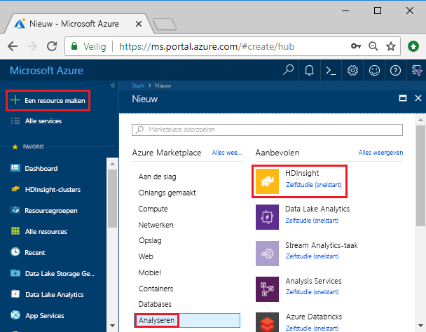
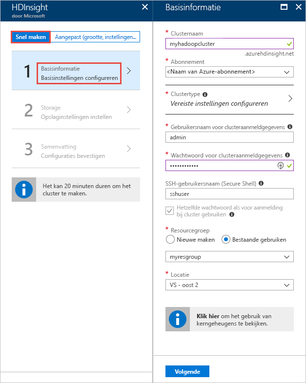
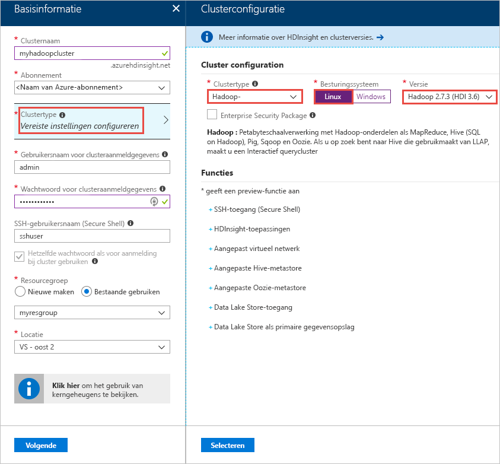
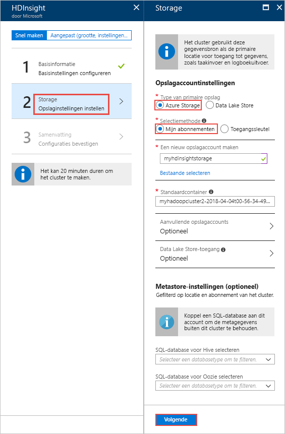
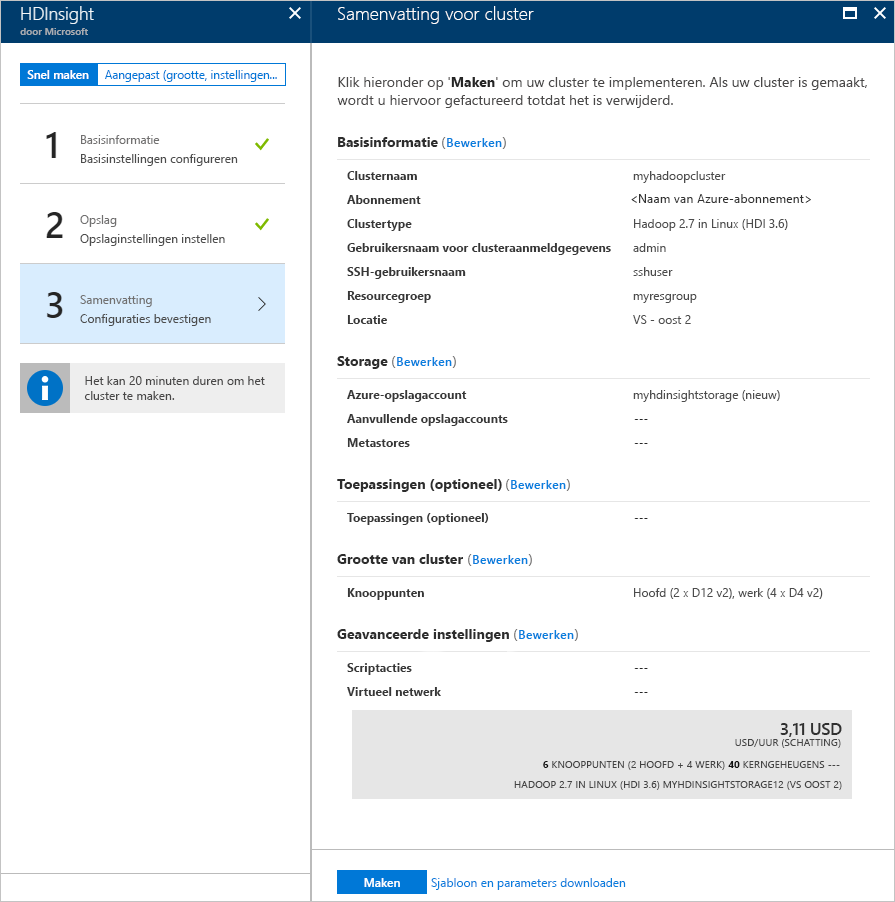

# Snelstart: Aan de slag met Apache Hadoop en Apache Hive in Azure HDInsight met behulp van Azure Portal

In dit artikel leert u hoe u [Apache Hadoop](https://hadoop.apache.org/)-clusters maakt in HDInsight met behulp van de Azure-portal en vervolgens Apache Hive-taken uitvoert in HDInsight. De meeste Hadoop-taken zijn batchtaken. U maakt een cluster, voert enkele taken uit en verwijdert het cluster vervolgens. In dit artikel gaat u al deze drie taken uitvoeren.

In deze snelstartgids gebruikt u Azure Portal voor het maken van een Hadoop-cluster in HDInsight. U kunt ook een cluster maken met behulp van een [Azure Resource Manager-sjabloon](apache-hadoop-linux-tutorial-get-started.md).

Op dit moment wordt HDInsight geleverd met [zeven verschillende clustertypen](./apache-hadoop-introduction.md#cluster-types-in-hdinsight). Elk clustertype ondersteunt een andere set onderdelen. Alle clustertypen ondersteunen Hive. Zie [Wat is er nieuw in de Apache Hadoop-clusterversies geleverd door HDInsight?](../hdinsight-component-versioning.md) voor een lijst met ondersteunde onderdelen in HDInsight.  

Als u geen abonnement op Azure hebt, maakt u een [gratis account](https://azure.microsoft.com/free/) voordat u begint.

## Een Apache Hadoop-cluster maken

In deze sectie maakt u een Hadoop-cluster in HDInsight met behulp van Azure Portal. 

1. Meld u aan bij [Azure Portal](https://portal.azure.com).

1. Selecteer in Azure Portal **Een resource maken** > **Gegevens en analyses** > **HDInsight**. 

    

2. Geef onder **HDInsight** > **Snel maken** > **Basis** de waarden op zoals deze worden weergegeven in de volgende schermafbeelding:

    

    Typ of selecteer de volgende waarden:
    
    |Eigenschap  |Beschrijving  |
    |---------|---------|
    |**Clusternaam**     | Voer een naam in voor het Hadoop-cluster. Omdat alle clusters in HDInsight dezelfde DNS-naamruimte delen, moet deze naam uniek zijn. De naam mag bestaan uit maximaal 59 tekens, inclusief letters, cijfers en afbreekstreepjes. De eerste en laatste tekens van de naam mogen geen streepjes zijn. |
    |**Abonnement**     |  Selecteer uw Azure-abonnement. |
    |**Clustertype**     | Deze stap kunt u nu overslaan. U geeft het type cluster op in de volgende stap van deze procedure.|
    |**Gebruikersnaam/Wachtwoord voor clusteraanmeldgegevens**     | De standaardaanmeldingsnaam is **admin**. Het wachtwoord moet uit minstens tien tekens bestaan en moet minstens één cijfer, één hoofdletter, één kleine letter en één niet-alfanumeriek teken bevatten (uitgezonderd ' " ` \). Zorg ervoor dat u **geen makkelijk te raden** wachtwoorden gebruikt, zoals 'Pass@word1'.|
    |**SSH-gebruikersnaam** | De standaardgebruikersnaam is **sshuser**.  U kunt hier echter een andere naam opgeven als u dat wilt. |
    | **Hetzelfde wachtwoord als voor aanmelding bij cluster gebruiken** | Schakel dit selectievakje in als u voor de SSH-gebruiker het wachtwoord wilt gebruiken dat u hebt opgegeven voor Wachtwoord voor clusteraanmeldgegevens.|
    |**Resourcegroep**     | Maak een resourcegroep of selecteer een bestaande resourcegroep.  Een resourcegroep is een container met Azure-onderdelen.  In dit geval bevat de resourcegroep het HDInsight-cluster en het afhankelijke Azure Storage-account. |
    |**Locatie**     | Selecteer een Azure-locatie waar u het cluster wilt maken.  Kies een locatie zo dicht mogelijk bij u in de buurt voor betere prestaties. |
        
3. Selecteer **Clustertype** en geef vervolgens de waarden op zoals deze worden weergegeven in de volgende schermafbeelding:

    

    Selecteer de volgende waarden:
    
    |Eigenschap  |Beschrijving  |
    |---------|---------|
    |**Clustertype**     | Selecteer **Hadoop**. |
    |**Besturingssysteem**     |  Selecteer uw Azure-abonnement. |
    |**Versie**     | Selecteer **Hadoop 2.7.3 (HDI 3.6)**|

    Klik op **Selecteren** en daarna op **Volgende**.

4. Geef op het tabblad **Opslag** de waarden op zoals deze worden weergegeven in de volgende schermafbeelding:

    

    Selecteer de volgende waarden:
    
    |Eigenschap  |Beschrijving  |
    |---------|---------|
    |**Type van primaire opslag**     | Selecteer voor dit artikel **Azure Storage** om Azure Storage Blob te gebruiken als het standaardopslagaccount. U kunt ook Azure Data Lake Storage gebruiken als standaardopslag. |
    |**Selectiemethode**     |  Selecteer voor dit artikel **Mijn abonnementen** om een opslagaccount uit uw Azure-abonnement te gebruiken. Als u een opslagaccount uit andere abonnementen wilt gebruiken, selecteert u **Toegangssleutel** en geeft u vervolgens de toegangssleutel voor dat account op. |
    |**Een nieuw opslagaccount maken**     | Geef een naam op voor het opslagaccount.|

    Accepteer alle overige standaardwaarden en selecteer vervolgens **Volgende**.

5. Controleer op het tabblad **Overzicht** de waarden die u in de eerdere stappen hebt geselecteerd.

    
      
4. Selecteer **Maken**. U ziet een nieuwe tegel met de mededeling dat**de implementatie voor HDInsight** wordt verzonden. Het duurt ongeveer 20 minuten om een cluster te maken.

    

4. Zodra het cluster is gemaakt, ziet u de overzichtspagina van het cluster in Azure Portal.
   
        
    
    Elk cluster is afhankelijk van een [Azure Storage-account](../hdinsight-hadoop-use-blob-storage.md) of een [Azure Data Lake-account](../hdinsight-hadoop-use-data-lake-store.md). Dit wordt het standaardopslagaccount genoemd. HDInsight-cluster en het standaard opslagaccount moeten samen in dezelfde Azure-regio worden geplaatst. Het opslagaccount wordt niet verwijderd wanneer er clusters worden verwijderd.

    > [!NOTE]  
    > Zie [HDInsight-clusters maken](../hdinsight-hadoop-provision-linux-clusters.md) voor andere methoden om clusters te maken en inzicht te krijgen in de eigenschappen die worden gebruikt in deze zelfstudie.       

## Apache Hive-query's uitvoeren

[Apache Hive](hdinsight-use-hive.md) is het meest populaire onderdeel dat in HDInsight wordt gebruikt. Er zijn veel manieren om Hive-taken uit te voeren in HDInsight. In deze zelfstudie gebruikt u de Ambari Hive-weergave in de portal. Voor andere methoden voor het indienen van Hive-taken raadpleegt u [Hive gebruiken in HDInsight](hdinsight-use-hive.md).

1. Als u Ambari wilt openen, selecteert u **Clusterdashboard** in de vorige schermafbeelding.  U kunt ook bladeren naar **https://&lt;ClusterName>. azurehdinsight.net**, waarbij &lt;ClusterName> het cluster is dat u in de vorige sectie hebt gemaakt.

    

2. Voer de gebruikersnaam en het wachtwoord voor Hadoop in die u hebt opgegeven tijdens het maken van het cluster. De standaardgebruikersnaam **admin**.

3. Open **Hive-weergave** zoals weergegeven in de volgende schermafbeelding:
   
    

4. Plak in het tabblad **QUERY** de volgende HiveQL-instructies in het werkblad:
   
        SHOW TABLES;

    
   
   > [!NOTE]  
   > Puntkomma is vereist voor Hive.       

5. Selecteer **Uitvoeren**. Er wordt een tabblad **RESULTATEN** weergegeven onder het tabblad **QUERY** met informatie over de taak. 
   
    Nadat de query is voltooid, worden de resultaten van de bewerking weergegeven op het tabblad **QUERY**. U ziet één tabel met de naam **hivesampletable**. Deze Hive-voorbeeldtabel is bij alle HDInsight-clusters inbegrepen.
   
    

6. Herhaal stap 4 en 5 om de volgende query uit te voeren:
   
        SELECT * FROM hivesampletable;
   
7. U kunt de resultaten van de query ook opslaan. Selecteer de menuknop aan de rechterkant en geef aan of u de resultaten wilt downloaden als een CSV-bestand of deze wilt opslaan in het opslagaccount dat aan het cluster is gekoppeld.

    

Nadat u een Hive-taak hebt voltooid, kunt u [de resultaten exporteren naar een Azure SQL-database of een SQL Server-database](apache-hadoop-use-sqoop-mac-linux.md). U kunt ook [de resultaten weergeven in Excel](apache-hadoop-connect-excel-power-query.md). Zie [Apache Hive en HiveQL gebruiken met Apache Hadoop in HDInsight voor het analyseren van een voorbeeldbestand van de Apache-log4j](hdinsight-use-hive.md) voor meer informatie over het gebruik van Hive in HDInsight.

## Problemen oplossen

Zie [Vereisten voor toegangsbeheer](../hdinsight-administer-use-portal-linux.md#create-clusters) als u problemen ondervindt met het maken van HDInsight-clusters.

## Resources opschonen
Nadat u de zelfstudie hebt voltooid, kunt u het cluster verwijderen. Met HDInsight worden uw gegevens opgeslagen in Azure Storage zodat u een cluster veilig kunt verwijderen wanneer deze niet wordt gebruikt. Voor een HDInsight-cluster worden ook kosten in rekening gebracht, zelfs wanneer het niet wordt gebruikt. Aangezien de kosten voor het cluster vaak zoveel hoger zijn dan de kosten voor opslag, is het financieel gezien logischer clusters te verwijderen wanneer ze niet worden gebruikt. 

> [!NOTE]  
> Als u *meteen* verder wilt gaan met de volgende zelfstudie om te leren hoe u ETL-bewerkingen uitvoert met behulp van Hadoop in HDInsight, kunt u het cluster beter behouden. In die zelfstudie hebt u namelijk ook een Hadoop-cluster nodig. Als u echter niet direct verdergaat met de volgende zelfstudie, moet u het cluster nu verwijderen.
> 
>  

**Het cluster en/of het standaardopslagaccount verwijderen**

1. Ga terug naar het browsertabblad voor Azure Portal. U komt terecht op de overzichtspagina voor het cluster. Selecteer **Verwijderen** als u alleen het cluster wilt verwijderen maar het standaardopslagaccount wilt behouden.

    

2. Als u het cluster en het standaardopslagaccount wilt verwijderen, selecteert u de naam van de resourcegroep (gemarkeerd in de vorige schermafbeelding) om de pagina van de resourcegroep te openen.

3. Selecteer **Resourcegroep verwijderen** om de resourcegroep te verwijderen. De groep bevat zowel het cluster als het standaardopslagaccount. Als u de resourcegroep verwijdert, wordt ook het opslagaccount verwijderd. Als u het opslagaccount wilt behouden, verwijdert u alleen het cluster.

## Volgende stappen
In deze zelfstudie hebt u geleerd hoe u een HDInsight-cluster op basis van Linux maakt met behulp van een Resource Manager-sjabloon, en hoe u eenvoudige Hive-query's uitvoert. In het volgende artikel leert u hoe u een ETL-bewerking (Extraction, Transformation, Loading) uitvoert met behulp van Hadoop in HDInsight.

> [!div class="nextstepaction"]
>[Gegevens uitpakken, transformeren en laden met Apache Hive in HDInsight ](../hdinsight-analyze-flight-delay-data-linux.md)

Als u klaar bent om te gaan werken met uw eigen gegevens en meer wilt weten over hoe HDInsight gegevens opslaat of hoe u gegevens in HDInsight krijgt, raadpleegt u de volgende artikelen:

* Zie [Azure Storage gebruiken met HDInsight](../hdinsight-hadoop-use-blob-storage.md) voor meer informatie over hoe HDInsight Azure Storage gebruikt.
* Zie [Snelstart: Clusters instellen in HDInsight](../../storage/data-lake-storage/quickstart-create-connect-hdi-cluster.md) voor informatie over het maken van een HDInsight-cluster met Data Lake Storage
* Zie [Gegevens uploaden naar HDInsight](../hdinsight-upload-data.md) voor meer informatie over het uploaden van gegevens naar HDInsight.

Zie de volgende artikelen voor meer informatie over het analyseren van gegevens met HDInsight:

* Zie [Apache Hive gebruiken met HDInsight](hdinsight-use-hive.md) voor meer informatie over het gebruik van Hive met HDInsight, waaronder over het uitvoeren van Hive-query's vanuit Visual Studio.
* Zie [Apache Pig gebruiken met HDInsight](hdinsight-use-pig.md) voor meer informatie over Pig, een taal die wordt gebruikt voor het omzetten van gegevens.
* Zie [MapReduce gebruiken met HDInsight](hdinsight-use-mapreduce.md) voor meer informatie over MapReduce, een middel om programma's te schrijven die gegevens verwerken op Hadoop.
* Zie voor meer informatie over het gebruik van de HDInsight-hulpprogramma's voor Visual Studio om gegevens op HDInsight te analyseren [Aan de slag met Visual Studio Hadoop-hulpprogramma's voor HDInsight](apache-hadoop-visual-studio-tools-get-started.md).

Als u meer informatie wilt over het maken of beheren van een HDInsight-cluster, raadpleegt u de volgende artikelen:

* Zie [HDInsight-clusters beheren met Apache Ambari](../hdinsight-hadoop-manage-ambari.md) voor meer informatie over het beheren van uw HDInsight-cluster op basis van Linux.
* Zie voor meer informatie over de opties die u kunt selecteren bij het maken van een HDInsight-cluster [HDInsight op Linux maken met aangepaste opties](../hdinsight-hadoop-provision-linux-clusters.md).

[1]: ../HDInsight/apache-hadoop-visual-studio-tools-get-started.md

[hdinsight-provision]: hdinsight-provision-linux-clusters.md
[hdinsight-upload-data]: hdinsight-upload-data.md
[hdinsight-use-hive]: hdinsight-use-hive.md
[hdinsight-use-pig]: hdinsight-use-pig.md

