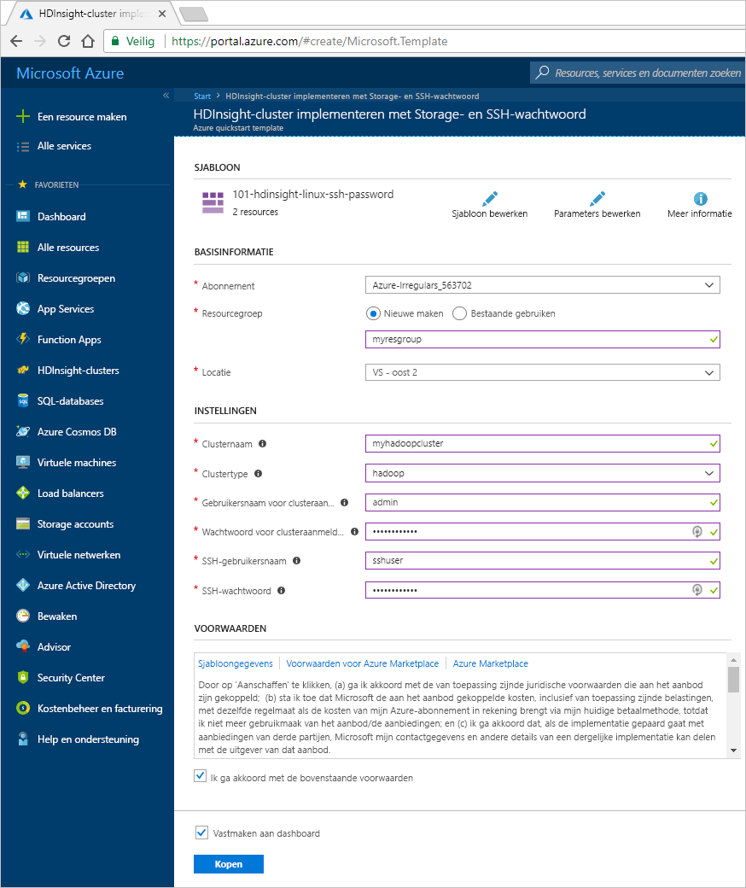
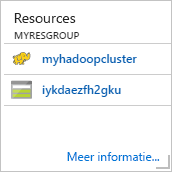
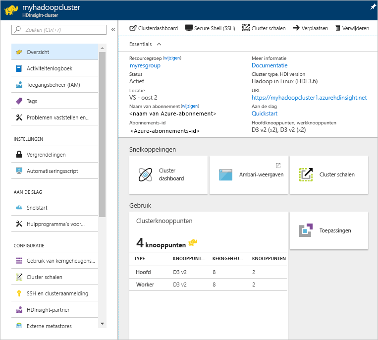
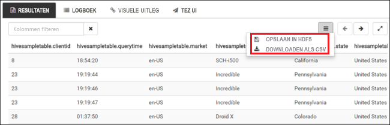

# Hadoop-zelfstudie: aan de slag met Hadoop in HDInsight

Informatie over het maken van [Hadoop](http://hadoop.apache.org/)-clusters in HDInsight en het uitvoeren van Hive-taken in HDInsight. [Apache Hive](https://hive.apache.org/) is het meest populaire onderdeel in het Hadoop-ecosysteem. Op dit moment wordt HDInsight geleverd met [zeven verschillende clustertypen](apache-hadoop-introduction.md#overview). Elk clustertype ondersteunt een andere set onderdelen. Alle clustertypen ondersteunen Hive. Zie voor een lijst van ondersteunde onderdelen in HDInsight [Wat is er nieuw in de Hadoop-clusterversies geleverd door HDInsight?](../hdinsight-component-versioning.md)  

[!INCLUDE [delete-cluster-warning](../../../includes/hdinsight-delete-cluster-warning.md)]

## Vereisten
Voordat u met deze zelfstudie begint, moet u over de volgende onderdelen beschikken:

* **Azure-abonnement**: voor het maken van een gratis proefaccount van één maand, bezoekt u [azure.microsoft.com/free](https://azure.microsoft.com/free).

## Cluster maken

De meeste Hadoop-taken zijn batchtaken. U maakt een cluster, voert enkele taken uit en verwijdert het cluster vervolgens. In deze sectie maakt u een Hadoop-cluster in HDInsight met behulp van een [Azure Resource Manager-sjabloon](../../azure-resource-manager/resource-group-template-deploy.md). Het maken van een Azure Resource Manager-sjabloon is niet vereist voor deze zelfstudie. Zie [HDInsight-clusters maken](../hdinsight-hadoop-provision-linux-clusters.md) voor andere methoden om clusters te maken en inzicht te krijgen in de eigenschappen die worden gebruikt in deze zelfstudie.

De Resource Manager-sjabloon die in deze zelfstudie wordt gebruikt, bevindt zich in [GitHub](https://azure.microsoft.com/resources/templates/101-hdinsight-linux-ssh-password/). 

1. Klik op de volgende afbeelding om u aan te melden bij Azure en de Resource Manager-sjabloon in Azure Portal te openen. 
   
    

2. Typ of selecteer de volgende waarden:
   
    .
   
    * **Abonnement**: selecteer uw Azure-abonnement.
    * **Resourcegroep**: maak een resourcegroep of selecteer een bestaande resourcegroep.  Een resourcegroep is een container met Azure-onderdelen.  In dit geval bevat de resourcegroep het HDInsight-cluster en het afhankelijke Azure Storage-account. 
    * **Locatie**: selecteer een Azure-locatie waar u uw cluster wilt maken.  Kies een locatie zo dicht mogelijk bij u in de buurt voor betere prestaties. 
    * **Clustertype**: selecteer **hadoop** voor deze zelfstudie.
    * **Clusternaam**: voer een naam in voor het Hadoop-cluster. Omdat alle clusters in HDInsight dezelfde DNS-naamruimte delen, moet deze naam uniek zijn. De naam kan bestaan uit maximaal 59 tekens, inclusief letters, cijfers en afbreekstreepjes. De eerste en laatste tekens van de naam mogen geen streepjes zijn.
    * **Aanmeldingsgegevens voor het cluster**: de standaardaanmeldingsnaam is **admin**.
    * **SSH-gebruikersnaam en -wachtwoord**: de standaardgebruikersnaam is **sshuser**.  U kunt de naam wijzigen. 
     
    Sommige eigenschappen zijn vastgelegd in de sjabloon.  U kunt deze waarden uit de sjabloon configureren.
    
    Elk cluster is afhankelijk van een [Azure Storage-account](../hdinsight-hadoop-use-blob-storage.md) of een [Azure Data Lake-account](../hdinsight-hadoop-use-data-lake-store.md). Dit wordt het standaardopslagaccount genoemd. HDInsight-cluster en het standaard opslagaccount moeten samen in dezelfde Azure-regio worden geplaatst. Het opslagaccount wordt niet verwijderd wanneer er clusters worden verwijderd. 
        
    Raadpleeg voor meer uitleg over deze eigenschappen [Hadoop-clusters maken in HDInsight](../hdinsight-hadoop-provision-linux-clusters.md).

3. Selecteer **Ik ga akkoord met de bovenstaande voorwaarden** en **Vastmaken aan dashboard** en klik vervolgens op **Kopen**. U ziet een nieuwe tegel met de titel **Implementatiesjabloon implementeren** in het portaldashboard. Het duurt ongeveer 20 minuten om een cluster te maken. 

4. Als het cluster is gemaakt, wordt de ondertiteling van de tegel gewijzigd in de opgegeven naam van de resourcegroep. Klik op de tegel om zowel het cluster als de standaardopslag voor het vermelde cluster weer te geven.
   
    

4. Klik op de naam van het cluster om het cluster te openen.

   

## Hive-query's uitvoeren

[Apache Hive](hdinsight-use-hive.md) is het meest populaire onderdeel dat in HDInsight wordt gebruikt. Er zijn veel manieren om Hive-taken uit te voeren in HDInsight. In deze zelfstudie gebruikt u de Ambari Hive-weergave in de portal. Voor andere methoden voor het indienen van Hive-taken raadpleegt u [Hive gebruiken in HDInsight](hdinsight-use-hive.md).

1. U opent Ambari door in de vorige schermafbeelding op **Clusterdashboard** en vervolgens op **HDInsight-clusterdashboard** te klikken.  U kunt ook bladeren naar **https://&lt;ClusterName>. azurehdinsight.net**, waarbij &lt;ClusterName> het cluster is dat u in de vorige sectie hebt gemaakt.

2. Voer de gebruikersnaam en het wachtwoord voor Hadoop in die u hebt opgegeven tijdens het maken van het cluster. De standaardgebruikersnaam **admin**.

3. Open **Hive-weergave** zoals weergegeven in de volgende schermafbeelding:
   
    

4. Plak in het tabblad **QUERY** de volgende HiveQL-instructies in het werkblad:
   
        SHOW TABLES;

    
   
   > [!NOTE]
   > Puntkomma is vereist voor Hive.       
   > 
   > 

5. Klik op **Uitvoeren**. Er wordt een tabblad **RESULTATEN** weergegeven onder het tabblad **QUERY** met informatie over de taak. 
   
    Nadat de query is voltooid, worden de resultaten van de bewerking weergegeven op het tabblad **QUERY**. U ziet één tabel met de naam **hivesampletable**. Deze Hive-voorbeeldtabel is bij alle HDInsight-clusters inbegrepen.
   
    

6. Herhaal stap 4 en 5 om de volgende query uit te voeren:
   
        SELECT * FROM hivesampletable;
   
7. U kunt de resultaten van de query ook opslaan. Klik op de menuknop aan de rechterkant en geef aan of u de resultaten wilt downloaden als een CSV-bestand of deze wilt opslaan in het opslagaccount dat aan het cluster is gekoppeld.

    

Nadat u een Hive-taak hebt voltooid, kunt u [de resultaten exporteren naar een Azure SQL-database of een SQL Server-database](apache-hadoop-use-sqoop-mac-linux.md). U kunt ook [de resultaten weergeven in Excel](apache-hadoop-connect-excel-power-query.md). Zie voor meer informatie over het gebruik van Hive in HDInsight [Hive en HiveQL gebruiken met Hadoop in HDInsight voor het analyseren van een voorbeeldbestand van de Apache-log4j](hdinsight-use-hive.md).

## De zelfstudie opschonen
Nadat u de zelfstudie hebt voltooid, kunt u het cluster verwijderen. Met HDInsight worden uw gegevens opgeslagen in Azure Storage zodat u een cluster veilig kunt verwijderen wanneer deze niet wordt gebruikt. Voor een HDInsight-cluster worden ook kosten in rekening gebracht, zelfs wanneer het niet wordt gebruikt. Aangezien de kosten voor het cluster vaak zoveel hoger zijn dan de kosten voor opslag, is het financieel gezien logischer clusters te verwijderen wanneer ze niet worden gebruikt. 

> [!NOTE]
> Met behulp van [Azure Data Factory](../hdinsight-hadoop-create-linux-clusters-adf.md) kunt u HDInsight-clusters op aanvraag maken en een TimeToLive-instelling configureren om clusters automatisch te verwijderen. 
> 
> 

**Het cluster en/of het standaardopslagaccount verwijderen**

1. Meld u aan bij [Azure Portal](https://portal.azure.com).
2. Klik vanuit het portal-dashboard op de tegel met de naam van de resourcegroep die u hebt gebruikt toen u het cluster maakte.
3. Klik op **Resourcegroep verwijderen** om de resourcegroep die het cluster en het standaardopslagaccount bevat, te verwijderen. Of klik op de clusternaam op de tegel **Resources** en klik vervolgens op **Verwijderen**. Als u de resourcegroep verwijdert, wordt ook het opslagaccount verwijderd. Als u het opslagaccount wilt behouden, verwijdert u alleen het cluster.

## Problemen oplossen

Zie [Vereisten voor toegangsbeheer](../hdinsight-administer-use-portal-linux.md#create-clusters) als u problemen ondervindt met het maken van HDInsight-clusters.

## Volgende stappen
In deze zelfstudie hebt u geleerd hoe u een HDInsight-cluster op basis van Linux maakt met behulp van een Resource Manager-sjabloon, en hoe u eenvoudige Hive-query's uitvoert.

Zie de volgende artikelen voor meer informatie over het analyseren van gegevens met HDInsight:

* Zie [Hive gebruiken met HDInsight](hdinsight-use-hive.md) voor meer informatie over het gebruik van Hive met HDInsight, waaronder over het uitvoeren van Hive-query's vanuit Visual Studio.
* Zie [Pig gebruiken met HDInsight](hdinsight-use-pig.md) voor meer informatie over Pig, een taal die wordt gebruikt voor het omzetten van gegevens.
* Zie [MapReduce gebruiken met HDInsight](hdinsight-use-mapreduce.md) voor meer informatie over MapReduce, een middel om programma's te schrijven die gegevens verwerken op Hadoop.
* Zie voor meer informatie over het gebruik van de HDInsight-hulpprogramma's voor Visual Studio om gegevens op HDInsight te analyseren [Aan de slag met Visual Studio Hadoop-hulpprogramma's voor HDInsight](apache-hadoop-visual-studio-tools-get-started.md).

Als u klaar bent om te gaan werken met uw eigen gegevens en meer wilt weten over hoe HDInsight gegevens opslaat of hoe u gegevens in HDInsight krijgt, raadpleegt u de volgende artikelen:

* Zie [Azure Storage gebruiken met HDInsight](../hdinsight-hadoop-use-blob-storage.md) voor meer informatie over hoe HDInsight Azure Storage gebruikt.
* Zie [Gegevens uploaden naar HDInsight](../hdinsight-upload-data.md) voor meer informatie over het uploaden van gegevens naar HDInsight.

Als u meer informatie wilt over het maken of beheren van een HDInsight-cluster, raadpleegt u de volgende artikelen:

* Zie voor meer informatie over het beheren van uw HDInsight-cluster op basis van Linux [HDInsight-clusters beheren met Ambari](../hdinsight-hadoop-manage-ambari.md).
* Zie voor meer informatie over de opties die u kunt selecteren bij het maken van een HDInsight-cluster [HDInsight op Linux maken met aangepaste opties](../hdinsight-hadoop-provision-linux-clusters.md).
* Als u bekend bent met Linux en Hadoop, maar u meer details wilt weten over Hadoop op HDInsight, raadpleegt u [Werken met HDInsight op Linux](../hdinsight-hadoop-linux-information.md). Dit artikel biedt informatie zoals:
  
  * URL's voor services die worden gehost op het cluster, zoals Ambari en WebHCat
  * De locatie van Hadoop-bestanden en voorbeelden op het lokale bestandssysteem
  * Het gebruik van Azure Storage (WASB) in plaats van HDFS als de standaard gegevensopslag

[1]: ../HDInsight/apache-hadoop-visual-studio-tools-get-started.md

[hdinsight-provision]: hdinsight-provision-linux-clusters.md
[hdinsight-upload-data]: hdinsight-upload-data.md
[hdinsight-use-hive]: hdinsight-use-hive.md
[hdinsight-use-pig]: hdinsight-use-pig.md

