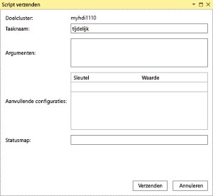
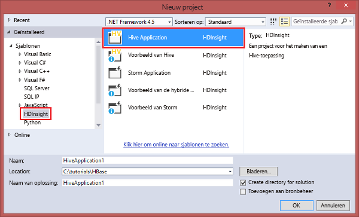

# Data Lake Tools voor Visual Studio gebruiken om verbinding te maken met Azure HDInsight en Hive-query's uit te voeren

Leer hoe u Data Lake Tools voor Visual Studio (ook wel Azure Data Lake en Stream Analytics Tools for Visual Studio genoemd) gebruikt om verbinding te maken met Hadoop-clusters in [Azure HDInsight](../hdinsight-hadoop-introduction.md) en om Hive-query's uit te voeren. 

Zie [Inleiding tot HDInsight](../hdinsight-hadoop-introduction.md) en [Aan de slag met HDInsight](apache-hadoop-linux-tutorial-get-started.md) voor meer informatie over het gebruik van HDInsight. 

Zie [Develop C# topologies for Apache Storm on HDInsight by using Visual Studio](../storm/apache-storm-develop-csharp-visual-studio-topology.md) (C#-topologieën ontwikkelen voor Apache Storm op HDInsight met behulp van Visual Studio) voor meer informatie over het maken van verbinding met een Storm-cluster.

U kunt Data Lake Tools voor Visual Studio gebruiken voor toegang tot Azure Data Lake Analytics en HDInsight. Zie voor informatie over Data Lake Tools [Zelfstudie: U-SQL-scripts ontwikkelen met Data Lake Tools voor Visual Studio](../../data-lake-analytics/data-lake-analytics-data-lake-tools-get-started.md).

## Vereisten

Al u deze zelfstudie wilt voltooien en Data Lake Tools voor Visual Studio wilt gebruiken, hebt u de volgende items nodig:

* Een Azure HDInsight-cluster. Zie [Aan de slag met Hadoop in Azure HDInsight](apache-hadoop-linux-tutorial-get-started.md) om een HDInsight-cluster te maken. Om interactieve Hive-query's uit te voeren, hebt u een [HDInsight Interactive Query-cluster](../interactive-query/apache-interactive-query-get-started.md) nodig.
* Een computer waarop Visual Studio 2017, 2015 of 2013 is geïnstalleerd.
    
    > [!NOTE]
    > Momenteel is alleen de Engelse versie van Data Lake Tools voor Visual Studio beschikbaar.
    > 
    > 

## Azure Data Lake-tools voor Visual Studio installeren of bijwerken

### Data Lake Tools installeren

Data Lake Tools is standaard geïnstalleerd voor Visual Studio 2017. Voor eerdere versies van Visual Studio kunt u Data Lake Tools installeren met behulp van het [Webplatforminstallatieprogramma](https://www.microsoft.com/web/downloads/platform.aspx). Kies de versie van Data Lake Tools die overeenkomt met uw versie van Visual Studio. 

### Visual Studio installeren

Als u Visual Studio niet hebt geïnstalleerd, gebruik dan het [Webplatforminstallatieprogramma](https://www.microsoft.com/web/downloads/platform.aspx) om de laatste versies van Visual Studio Community en de Azure SDK te installeren:

### De hulpprogramma's bijwerken

1. Open Visual Studio.
2. Selecteer **Extensies en updates** in het menu **Extra**.
3. Vouw **Updates** uit en selecteer **Azure Data Lake en Stream Analytics-hulpprogramma's** (als dat is geïnstalleerd).

> [!NOTE]
>
> U kunt alleen Data Lake Tools versie 2.3.0.0 of hoger gebruiken om verbinding te maken met Interactive Query-clusters en interactieve Hive-query's uit te voeren.

## Verbinding maken met Azure-abonnementen
U kunt Data Lake Tools voor Visual Studio gebruiken om verbinding te maken met uw HDInsight-clusters, enkele eenvoudige beheerbewerkingen uit te voeren en Hive-query's uit te voeren.

> [!NOTE]
> Zie [Write and submit Hive queries by using Visual Studio](http://blogs.msdn.com/b/xiaoyong/archive/2015/05/04/how-to-write-and-submit-hive-queries-using-visual-studio.aspx) (Hive-query's schrijven en verzenden met behulp van Visual Studio) voor informatie over het maken van verbinding met een algemeen Hadoop-cluster.
> 
> 

Verbinding maken met uw Azure-abonnement:

1. Open Visual Studio.
2. In het **Weergave**-menu selecteert u **Server Explorer**.
3. Vouw in Server Explorer achtereenvolgens **Azure** en **HDInsight** uit.
   
   > [!NOTE]
   > Het venster **Taakoverzicht HDInsight** wordt geopend. Als u het venster niet ziet, kiest u in het menu **Beeld** **Overige vensters**en vervolgens **het venster Taakoverzicht HDInsight**.  
   > 
   > 
4. Voer de referenties voor uw Azure-abonnement in en selecteer **Aanmelden**. Verificatie is alleen vereist als u op deze computer nog nooit verbinding hebt gemaakt met het Azure-abonnement vanuit Visual Studio.
5. In Server Explorer wordt een lijst met bestaande HDInsight-clusters weergegeven. Als u geen clusters hebt, kunt u een cluster maken door gebruik te maken van Azure Portal, Azure PowerShell of de HDInsight SDK. Zie [HDInsight-clusters maken](../hdinsight-hadoop-provision-linux-clusters.md) voor meer informatie.
   
   
6. Een HDInsight-cluster uitbreiden. **Hive-databases**, een standaardopslagaccount, gekoppelde opslagaccounts en een **Hadoop Service-logboek** worden weergegeven. U kunt de entiteiten verder uitbreiden.

Nadat u verbinding hebt gemaakt met het Azure-abonnement, kunt u de volgende taken uitvoeren.

Verbinding maken met Azure Portal vanuit Visual Studio:

1. In Server Explorer selecteert u **Azure** > **HDInsight**.
2. Klik met de rechtermuisknop op een HDInsight-cluster en selecteer vervolgens **Cluster beheren in Azure Portal**.

Vragen stellen en feedback geven vanuit Visual Studio:

1. Selecteer **HDInsight** in het menu **Extra**.
2. Selecteer **MSDN-Forum** om vragen te stellen. Selecteer **Feedback geven** als u feedback wilt geven.

## Gekoppelde resources verkennen
In Server Explorer worden het standaardaccount voor opslag en alle gekoppelde opslagaccounts weergegeven. Als u het standaardopslagaccount uitvouwt, kunt u de containers op het opslagaccount zien. Het standaardopslagaccount en de standaardcontainer worden gemarkeerd. Klik met de rechtermuisknop op een van de containers om de inhoud ervan weer te geven.

Nadat u een container hebt geopend, kunt u met de volgende knoppen blobs uploaden, verwijderen en downloaden:

## Interactieve Hive-query's uitvoeren
[Apache Hive](http://hive.apache.org) is een datawarehouse-infrastructuur die is gebouwd op Hadoop. Hive wordt gebruikt voor gegevenssamenvatting, query's en analyse. U kunt Data Lake Tools voor Visual Studio gebruiken om Hive-query's uit te voeren vanuit Visual Studio. Zie [Hive gebruiken met HDInsight](hdinsight-use-hive.md) voor meer informatie over Hive.

[Interactive Query](../interactive-query/apache-interactive-query-get-started.md) gebruikt [Hive op LLAP](https://cwiki.apache.org/confluence/display/Hive/LLAP) in Apache Hive 2.1. Interactive Query brengt interactiviteit naar complexe datawarehouse-achtige query's op grote opgeslagen gegevenssets. Het uitvoeren van Hive-query's in Interactive Query is veel sneller dan de traditionele Hive-batchtaken. Zie voor meer informatie [Hive-batchtaken uitvoeren](#run-hive-batch-jobs).

> [!NOTE]
>
> U kunt alleen interactieve Hive-query's uitvoeren wanneer u verbinding maakt met een [HDInsight Interactive Query](../interactive-query/apache-interactive-query-get-started.md)-cluster.

U kunt Data Lake Tools voor Visual Studio ook gebruiken om te zien wat er in een Hive-taak zit. Data Lake Tools voor Visual Studio verzamelt de Yarn-logboeken van bepaalde Hive-taken en maakt ze zichtbaar.

### **hivesampletable** bekijken
Alle HDInsight-clusters bevatten standaard een voorbeeld-Hive-tabel met de naam hivesampletable. De Hive-tabel definieert hoe u Hive-tabellen opsomt, tabelschema's bekijkt en rijen in de Hive-tabel weergeeft.

Een lijst met Hive-tabellen maken en het Hive-tabelschema weergeven:

1. Als u het tabelschema wilt zien, kiest u in **Server Explorer** **Azure** > **HDInsight**. Selecteer het cluster, en selecteer vervolgens **Hive-databases** > **Standaard** > **hivesampletable**.
2. Klik met de rechtermuisknop op de **hivesampletable** en klik vervolgens op **View Top 100 Rows** (Top 100 rijen weergeven) om de rijen weer te geven. Dit is equivalent aan het uitvoeren van de volgende Hive-query met behulp van het Hive ODBC-stuurprogramma:
   
     `SELECT * FROM hivesampletable LIMIT 100`
   
   U kunt het aantal rijen aanpassen.
   
   

### Hive-tabellen maken
U een Hive-tabel maken door de GUI te gebruiken of door Hive-query's te gebruiken. Zie [Hive-query's uitvoeren](#run.queries) voor meer informatie over het gebruik van Hive-query's.

Een Hive-tabel maken:

1. In **Server Explorer** selecteert u **Azure** > **HDInsight-clusters**. Selecteer uw HDInsight-cluster, en selecteer vervolgens **Hive-databases**.
2. Klik met de rechtermuisknop op **Standaard**, en selecteer **Tabel maken**.
3. Configureer de tabel.  
4. Selecteer **Tabel maken** om de taak voor het maken van de nieuwe Hive-tabel te verzenden.
   
    

### Hive-query’s valideren en uitvoeren
U hebt twee opties voor het maken en uitvoeren van Hive-query's:

* Ad-hocquery's maken
* Een Hive-toepassing maken

Ad-hocquery's maken, valideren en uitvoeren:

1. In **Server Explorer** selecteert u **Azure** > **HDInsight-clusters**.
2. Klik met de rechtermuisknop op het cluster waar u de query wilt uitvoeren en selecteer **Write a Hive Query** (Een Hive-query schrijven).  
3. Voer de Hive-query's in 

    De Hive-editor ondersteunt IntelliSense. Data Lake Tools voor Visual Studio biedt ondersteuning voor het laden van externe metagegevens wanneer u het Hive-script bewerkt. Wanneer u bijvoorbeeld **SELECT * FROM** typt, geeft IntelliSense alle voorgestelde tabelnamen weer. Wanneer een tabelnaam wordt opgegeven, geeft IntelliSense de kolomnamen weer. De hulpprogramma's ondersteunen de meeste DML-instructies, subquery's en ingebouwde UDF's van Hive.
   
    
   
    
   
   > [!NOTE]
   > IntelliSense suggereert alleen de metagegevens van het cluster dat in de HDInsight-werkbalk is geselecteerd.
   > 
   
4. (Optioneel) Klik op **Script valideren** om het script te controleren op syntaxisfouten.
   
    
5. Selecteer **Verzenden** of **Verzenden (geavanceerd)**. Als u de optie voor geavanceerd verzenden selecteert, configureert u de **Taaknaam**, **Argumenten**, **Aanvullende configuraties** en **Statusmap** voor het script:
   
    
   
    Nadat u de taak hebt verzonden, wordt het venster **Samenvatting van Hive-taak** weergegeven.
   
    
6. Gebruik de knop **Vernieuwen** om de status bij te werken totdat de status van de taak is gewijzigd in **Voltooid**.
7. Selecteer de koppelingen onderaan om de **Taakquery**, **Taakuitvoer**, het **Logboek** of **Yarn-logboek** weer te geven.

Een Hive-oplossing maken en uitvoeren:

1. Selecteer in het menu **Bestand** de optie **Nieuw** en selecteer vervolgens **Project**.
2. Selecteer **HDInsight** in het linkerdeelvenster. Selecteer **Hive-toepassing** in het middelste deelvenster. Voer de eigenschappen in en selecteer **OK**.
   
    
3. Dubbelklik in **Solution Explorer** op **Script.hql** om het script te openen.
4. Selecteer de knop **Script valideren** om het Hive-script te valideren. U kunt ook met de rechtermuisknop op het script in de Hive-editor klikken en vervolgens **Script valideren** selecteren in het contextmenu.

### Hive-taken weergeven
U kunt taakquery's, taakuitvoer, logboekbestanden van taken en Yarn-logboekbestanden voor Hive-taken weergeven. Zie de bovenstaande schermafbeelding voor meer informatie.

In de meest recente versie van de hulpprogramma's kunt u in uw Hive-taken kijken door Yarn-logboeken te verzamelen en zichtbaar te maken. Een Yarn-logboek kan u helpen bij het onderzoeken van prestatieproblemen. Zie [Programmacode gebruiken om toegang te krijgen tot HDInsight-toepassingslogboeken](../hdinsight-hadoop-access-yarn-app-logs.md) voor informatie over hoe HDInsight Yarn-logboeken verzamelt.

Hive-taken weergeven:

1. Vouw in **Server Explorer** achtereenvolgens **Azure** en **HDInsight** uit.
2. Klik met de rechtermuisknop op een HDInsight-cluster en selecteer **Taken weergeven**. Er wordt een lijst weergegeven met de Hive-taken die op het cluster zijn uitgevoerd.  
3. Selecteer een taak. Selecteer in het venster **Samenvatting van Hive-taak** een van de volgende opties:
    - **Taakquery**
    - **Taakuitvoer**
    - **Takenlogboek**  
    - **Yarn-logboek**
   
    

### Sneller pad voor het uitvoeren van Hive via HiveServer2
> [!NOTE]
> Deze functie werkt alleen in een cluster in HDInsight versie 3.2 of hoger.
 
Data Lake Tools voor Visual Studio gebruikt om Hive-taken via [WebHCat](https://cwiki.apache.org/confluence/display/Hive/WebHCat) te verzenden (ook wel bekend als Templeton). Met deze methode voor het verzenden van Hive-taken duurde het lang om taakgegevens en foutinformatie te retourneren.

Om dit prestatieprobleem op te lossen kan Data Lake Tools voor Visual Studio RDP/SSH overslaan en Hive-taken rechtstreeks in het cluster uitvoeren via HiveServer2.

Naast betere prestaties kunt u met deze methode Hive ook bekijken op Apache Tez-grafieken en in de taakdetails.

In een cluster in HDInsight versie 3.2 of hoger wordt de knop **Execute via HiveServer2** weergegeven:

U kunt ook de logboeken in realtime laten terugstreamen. U kunt ook de taakgrafieken zien, als de Hive-query wordt uitgevoerd in Tez.

### Uitvoeren van query's via HiveServer2 versus query's verzenden via WebHCat

Hoewel het uitvoeren van query's via HiveServer2 veel prestatievoordelen biedt, heeft deze methode ook enkele beperkingen. Sommige van deze beperkingen maken dat deze methode niet geschikt is voor productiegebruik. 

De volgende tabel laat het verschil zien tussen het uitvoeren van query's via HiveServer2 en het verzenden van query's via WebHCat:

|  | Uitvoeren via HiveServer2 | Verzenden via WebHCat |
| --- | --- | --- |
| Query's uitvoeren |Hiermee wordt de overhead geëlimineerd in WebHCat (die MapReduce-taak met de naam TempletonControllerJob start). |Als een query wordt uitgevoerd met WebHCat, start WebHCat een MapReduce-taak, wat resulteert in extra latentie. |
| Logboeken terugstreamen |Nagenoeg in realtime. |De logboekbestanden voor het uitvoeren van de taak zijn alleen beschikbaar wanneer de taak is voltooid. |
| Taakgeschiedenis weergeven |Als een query wordt uitgevoerd via HiveServer2, blijft de taakgeschiedenis (taaklogboek, taakuitvoer) niet behouden. U kunt de toepassing in de gebruikersinterface van Yarn bekijken met beperkte informatie. |Als een query wordt uitgevoerd via WebHCat, blijft de taakgeschiedenis (taaklogboek, taakuitvoer) behouden. U kunt de taakgeschiedenis bekijken met behulp van Visual Studio, de HDInsight-SDK of PowerShell. |
| Venster sluiten |Uitvoeren via HiveServer2 is *synchroon*. Als de vensters worden gesloten, wordt de queryuitvoering geannuleerd. |Verzenden via WebHCat is *asynchroon*. U kunt de query via WebHCat verzenden en Visual Studio sluiten. U kunt op elk gewenst moment terugkeren om de resultaten te bekijken. |

### Prestatiegrafiek Tez Hive-taak
In Data Lake Tools voor Visual Studio ziet u prestatiegrafieken voor de Hive-taken die met de Tez-uitvoeringsengine wordt uitgevoerd. Zie [Hive in HDInsight gebruiken](hdinsight-use-hive.md) voor informatie over het inschakelen van Tez. 

Nadat u een Hive-taak in Visual Studio hebt ingediend, wordt in Visual Studio de grafiek weergegeven als de taak is voltooid. Mogelijk moet u de knop **Vernieuwen** selecteren om de meest recente taakstatus te bekijken.

> [!NOTE]
> Deze functie is alleen beschikbaar voor een cluster in HDInsight versie 3.2.4.593 of hoger. De functie werkt alleen op voltooide taken. Verder moet u taken verzenden via WebHCat om deze functie te gebruiken. De volgende afbeelding wordt weergegeven wanneer u uw query via HiveServer2 uitvoert: 
> 
> 

Om u een beter inzicht te geven in uw Hive-query, is in deze release de Hive Operator-view toegevoegd. Als u alle operators binnen het hoekpunt wilt bekijken, dubbelklikt u op de hoekpunten van de taakgrafiek. U kunt ook een bepaalde operator aanwijzen voor meer informatie over de operator.

### Taakuitvoeringsweergave voor Hive op Tez-taken
U kunt de taakuitvoeringsweergave voor Hive op Tez-taken gebruiken om gestructureerde en gevisualiseerde informatie voor Hive-taken op te halen. U kunt ook meer taakgegevens ophalen. Als er prestatieproblemen optreden, kunt u de weergave gebruiken om meer informatie over het probleem op te vragen. U kunt bijvoorbeeld informatie krijgen over hoe elke taak werkt, en gedetailleerde informatie over elke taak (gegevens lezen/schrijven, geplande/start-/eindtijd, enzovoort). Gebruik de informatie om taakconfiguraties of systeemarchitectuur bij te stellen op basis van de gevisualiseerde informatie.

## Hive-batchtaken uitvoeren
Het kan veel tijd kosten om een Hive-script te testen in een HDInsight-cluster (met uitzondering van het Interactive Query-cluster). Dit proces kan enkele minuten of meer duren. Data Lake Tools voor Visual Studio kan Hive-scripts lokaal valideren zonder dat er verbinding hoeft te worden gemaakt met een live cluster. Zie [Interactieve Hive-query's uitvoeren](#run-interactive-hive-queries) voor meer informatie over het uitvoeren van interactieve query's.

U kunt Data Lake Tools voor Visual Studio gebruiken om in de Hive-taak te kijken door de Yarn-logboeken van bepaalde Hive-taken te verzamelen en zichtbaar te maken.

Zie [Interactieve Hive-query's uitvoeren](#run-interactive-hive-queries) voor meer informatie over het uitvoeren van Hive-batchtaken. De informatie in die sectie is van toepassing op het uitvoeren Hive-batchtaken die langere verwerkingstijden hebben.

## Pig-scripts uitvoeren
U kunt Data Lake Tools voor Visual Studio gebruiken om Pig-scripts te maken en naar HDInsight-clusters te verzenden. Maak eerst een Pig-project op basis van een sjabloon. Verzend het script vervolgens naar HDInsight-clusters.

## Feedback en bekende problemen
* Momenteel worden de HiveServer2-resultaten weergegeven als gewone tekst, wat niet ideaal is. Microsoft werkt eraan om dit te verhelpen.
* Een probleem waardoor resultaten beginnend met null-waarden niet worden weergegeven, is opgelost. Neem contact op met het ondersteuningsteam als u vastloopt op dit probleem.
* Het HQL-script dat door Visual Studio wordt gemaakt, word gecodeerd op basis van de lokale regio-instellingen van de gebruiker. Het script wordt niet correct uitgevoerd als u het script als binair bestand naar een cluster uploadt.

## Volgende stappen
In dit artikel hebt u hoe geleerd u het Data Lake Tools-pakket voor Visual Studio kunt gebruiken om verbinding te maken met HDInsight-clusters vanuit Visual Studio. U hebt ook geleerd hoe u een Hive-query uitvoert. Raadpleeg voor meer informatie de volgende artikelen:

* [Hadoop Hive in HDInsight gebruiken](hdinsight-use-hive.md)
* [Aan de slag met Hadoop in HDInsight](apache-hadoop-linux-tutorial-get-started.md)
* [Hadoop-taken opgeven in HDInsight](submit-apache-hadoop-jobs-programmatically.md)
* [Twitter-gegevens met Hadoop analyseren in HDInsight](../hdinsight-analyze-twitter-data.md)

