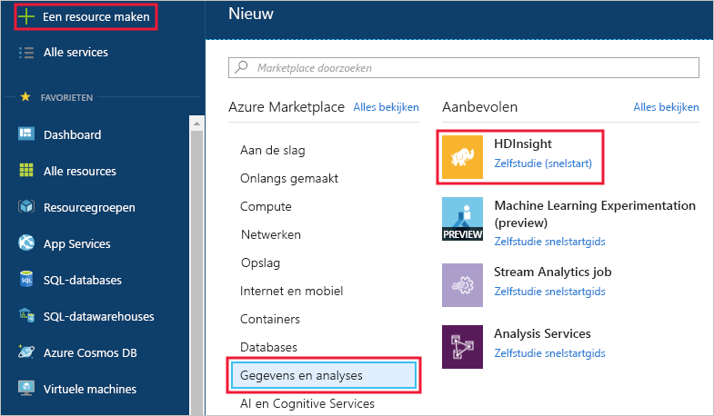
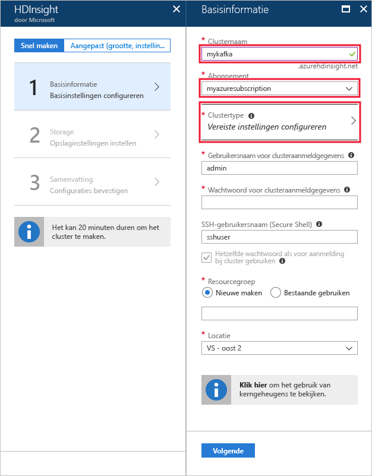
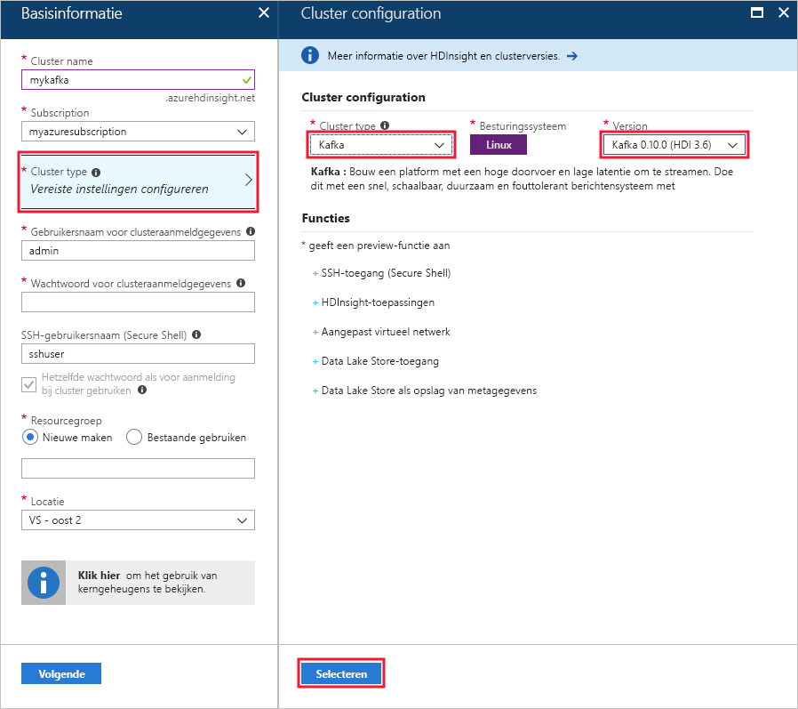
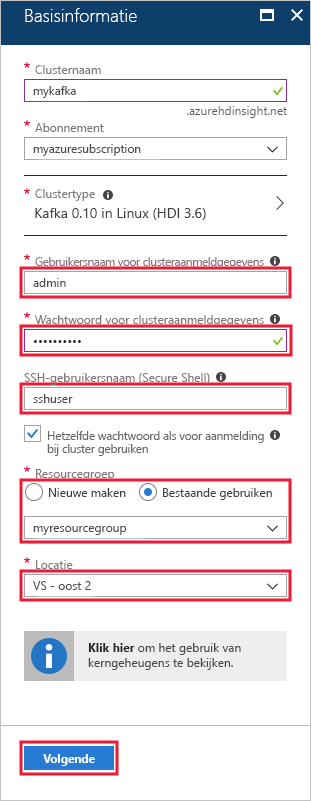
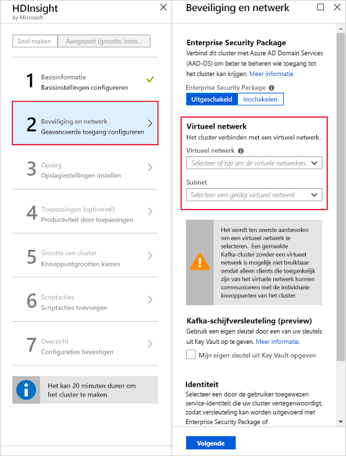
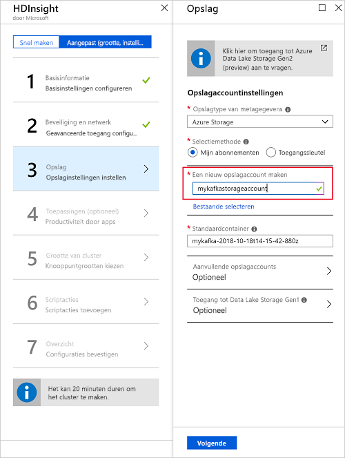
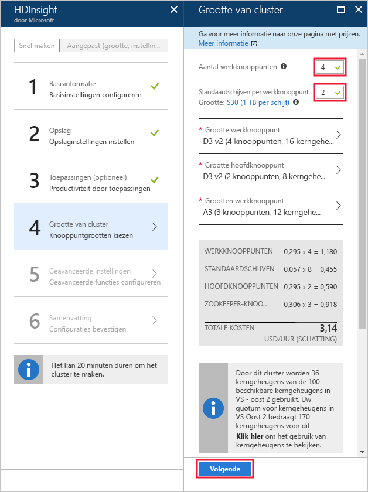
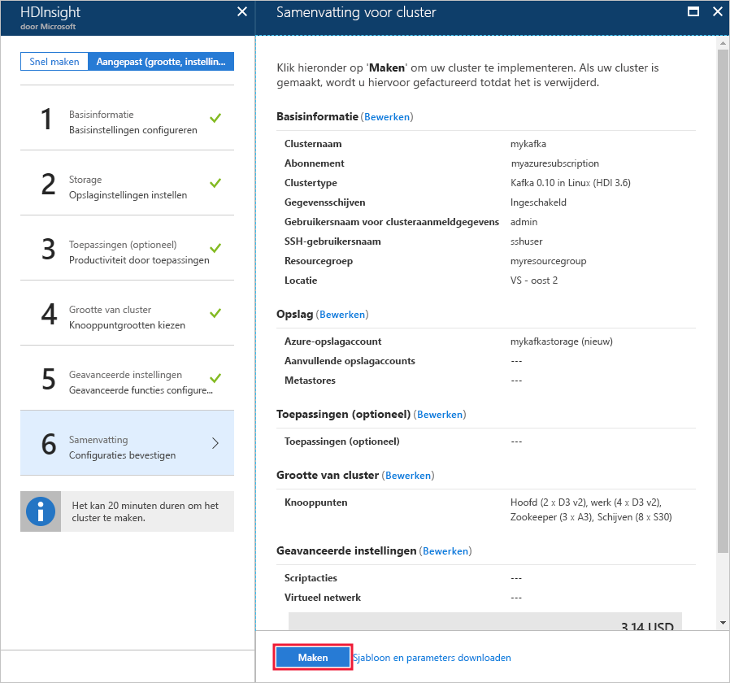

# <a name="quickstart-create-an-apache-kafka-on-hdinsight-cluster"></a>Snelstart: Een Apache Kafka-cluster maken in HDInsight

Apache Kafka is een open-source, gedistribueerd streamingplatform. Het wordt vaak gebruikt als een berichtenbroker, omdat het een functionaliteit biedt die vergelijkbaar is met een publicatie-/abonnementswachtrij voor berichten. 

In deze snelstart leert u hoe u met Azure Portal een [Apache Kafka](https://kafka.apache.org)-cluster maakt. U leert ook hoe u de inbegrepen hulpprogramma's gebruikt voor het verzenden en ontvangen van berichten via Apache Kafka.

[!INCLUDE [delete-cluster-warning](../../../includes/hdinsight-delete-cluster-warning.md)]

> [!IMPORTANT]
> De Apache Kafka-API is alleen toegankelijk voor resources binnen hetzelfde virtuele netwerk. In deze snelstart benadert u het cluster rechtstreeks via SSH. Als u andere services, netwerken of virtuele machines wilt verbinden met Apache Kafka, moet u eerst een virtueel netwerk maken en vervolgens de resources maken in het netwerk.
>
> Zie het document [Verbinding maken met Apache Kafka via een virtueel netwerk](apache-kafka-connect-vpn-gateway.md) voor meer informatie.

## <a name="prerequisites"></a>Vereisten

* Een Azure-abonnement. Als u nog geen abonnement op Azure hebt, maakt u een [gratis account](https://azure.microsoft.com/free/?WT.mc_id=A261C142F) aan voordat u begint.

* Een SSH-client. In de stappen in dit document wordt SSH gebruikt om verbinding te maken met het cluster.

    De opdracht `ssh` wordt standaard ondersteund op Linux, Unix- en macOS-systemen. In Windows 10 gebruikt u een van de volgende methoden om de opdracht `ssh` te installeren:

    * Gebruik [Azure Cloud Shell](https://docs.microsoft.com/azure/cloud-shell/quickstart). De cloud-shell biedt de opdracht `ssh` en kan worden geconfigureerd om Bash of PowerShell te gebruiken als de shell-omgeving.

    * [Installeer het Windows-subsysteem voor Linux](https://docs.microsoft.com/windows/wsl/install-win10). De Linux-distributies die beschikbaar zijn via de Microsoft Store bieden de opdracht `ssh`.

    > [!IMPORTANT]
    > Bij de stappen in dit document wordt ervan uitgegaan dat u van een van de hierboven genoemde SSH-clients gebruikt. Als u een andere SSH-client gebruikt en er problemen optreden, raadpleegt u de documentatie voor uw SSH-client.
    >
    > Zie het document [SSH gebruiken met HDInsight](../hdinsight-hadoop-linux-use-ssh-unix.md) voor meer informatie.

## <a name="create-an-apache-kafka-cluster"></a>Apache Kafka-cluster maken

Gebruik de volgende stappen om een Apache Kafka-cluster te maken in HDInsight:

1. In [Azure Portal](https://portal.azure.com) selecteert u **+ Een resource maken**, **Gegevens en analyses** en vervolgens **HDInsight**.
   
    

2. Geef op het tabblad **Basis** de volgende informatie op:

    | Instelling | Waarde |
    | --- | --- |
    | Clusternaam | Een unieke naam voor het HDInsight-cluster. |
    | Abonnement | Selecteer uw abonnement. |
    
   Selecteer __Clustertype__ om het deelvenster **Clusterconfiguratie** weer te geven.
   
   

3. Selecteer in het deelvenster __Clusterconfiguratie__ de volgende waarden:

    | Instelling | Waarde |
    | --- | --- |
    | Clustertype | Kafka |
    | Versie | Kafka 1.1.0 (HDI 3.6) |

    Gebruik de knop **Selecteren** om de instellingen voor het clustertype op te slaan en terug te gaan naar het tabblad __Basis__.

    

4. Geef op het tabblad __Basis__ de volgende informatie op:

    | Instelling | Waarde |
    | --- | --- |
    | Gebruikersnaam voor clusteraanmeldgegevens | De aanmeldingsnaam voor het werken met webservices of REST-API's die worden gehost in het cluster. Laat de standaardwaarde (admin) staan. |
    | Wachtwoord voor clusteraanmeldgegevens | Het aanmeldingswachtwoord voor het werken met webservices of REST-API's die worden gehost in het cluster. |
    | SSH-gebruikersnaam (Secure Shell) | De aanmeldingsgegevens voor toegang tot het cluster via SSH. Het wachtwoord is standaard hetzelfde als het aanmeldingswachtwoord van het cluster. |
    | Resourcegroep | De resourcegroep waarin het cluster wordt gemaakt. |
    | Locatie | De Azure-regio waarin het cluster wordt gemaakt. |

    > [!TIP]
    > Elke Azure-regio (locatie) heeft _foutdomeinen_. Een foutdomein is een logische groepering van de onderliggende hardware in een Azure-datacenter. Elk foutdomein deelt een algemene voedingsbron en netwerkswitch. De virtuele machines en beheerde schijven die de knooppunten in een HDInsight-cluster implementeren zijn verdeeld over deze foutdomeinen. Deze architectuur beperkt de potentiële impact van problemen met de fysieke hardware.
    >
    > Voor hoge beschikbaarheid van gegevens wordt u geadviseerd om een regio (locatie) te selecteren die __drie foutdomeinen__ heeft. Raadpleeg het document [Beschikbaarheid van virtuele Linux-machines](../../virtual-machines/windows/manage-availability.md#use-managed-disks-for-vms-in-an-availability-set) voor informatie over het aantal foutdomeinen in een regio.

   

    Gebruik de knop __Volgende__ om de basisconfiguratie te voltooien.

5. Laat voor deze snelstart de standaardbeveiligingsinstellingen staan. Ga naar [Een HDInsight-cluster configureren met Enterprise Security Package met behulp van Azure Active Directory Domain Services](../domain-joined/apache-domain-joined-configure-using-azure-adds.md) voor meer informatie over Enterprise Security Package. Ga naar [Bring Your Own Key voor Apache Kafka in Azure HDInsight](apache-kafka-byok.md) voor meer informatie over het gebruik van uw eigen sleutel voor Apache Kafka-schijfversleuteling

   Als u uw cluster verbinding wilt laten maken met een virtueel netwerk, selecteert u een virtueel netwerk in de vervolgkeuzelijst **Virtueel netwerk**.

   

6. Selecteer of maak bij **Opslag** een opslagaccount. Voor de stappen in dit document laat u de andere velden op de standaardwaarden ingesteld. Gebruik de knop __Volgende__ om de opslagconfiguratie op te slaan. Zie [Snelstart: Clusters instellen in HDInsight](../../storage/data-lake-storage/quickstart-create-connect-hdi-cluster.md) voor meer informatie over het gebruik van Data Lake Storage Gen2.

   

7. Selecteer bij __Toepassingen (optioneel)__ de optie __Volgende__ om door te gaan met de standaardinstellingen.

8. Selecteer bij __Grootte van cluster__ de optie __Volgende__ om door te gaan met de standaardinstellingen.

    > [!IMPORTANT]
    > Om de beschikbaarheid van Apache Kafka in HDInsight te waarborgen, moet u het __aantal werkknooppunten__ instellen op minimaal 3. De standaardwaarde is 4.
    
    > [!TIP]
    > De waarde voor **schijven per werkknooppunt** configureert de schaalbaarheid van Apache Kafka in HDInsight. Apache Kafka in HDInsight gebruikt de lokale schijf van de virtuele machines in het cluster voor het opslaan van gegevens. Omdat Apache Kafka veel gebruikmaakt van invoer/uitvoer, wordt [Azure Managed Disks](../../virtual-machines/windows/managed-disks-overview.md) gebruikt voor een hoge doorvoer en meer opslag per knooppunt. Het type beheerde schijf is __Standaard__ (HDD) of __Premium__ (SSD). Het type schijf is afhankelijk van de VM-grootte die wordt gebruikt door de werkknooppunten (Apache Kafka-brokers). Premium-schijven worden automatisch gebruikt met VM's uit de DS- en GS-serie. Alle andere VM-typen gebruiken standaardschijven.

   

9. Selecteer bij __Geavanceerde instellingen__ de optie __Volgende__ om door te gaan met de standaardinstellingen.

10. Controleer bij **Samenvatting** de configuratie van het cluster. Gebruik de koppeling __Bewerken__ om onjuiste instellingen te wijzigen. Gebruik tot slot de knop __Maken__ om het cluster te maken.
   
    
   
    > [!NOTE]
    > Het kan tot 20 minuten duren om het cluster te maken.

## <a name="connect-to-the-cluster"></a>Verbinding maken met het cluster

1. Gebruik de volgende opdracht om verbinding te maken met het primaire hoofdknooppunt van het Apache Kafka-cluster. Vervang `sshuser` door de SSH-gebruikersnaam. Vervang `mykafka` door de naam van uw Apache Kafka-cluster

    ```bash
    ssh sshuser@mykafka-ssh.azurehdinsight.net
    ```

2. Wanneer u voor het eerst verbinding maakt met het cluster, wordt in de SSH-client mogelijk de waarschuwing weergegeven dat de authenticiteit van de host niet kan worden vastgesteld. Wanneer u wordt gevraagd de host te bevestigen, typt u __yes__ en drukt u vervolgens op __Enter__ om de host toe te voegen aan de lijst met vertrouwde servers van uw SSH-client.

3. Voer het wachtwoord voor de SSH-gebruiker in wanneer hierom wordt gevraagd.

Zodra er verbinding is gemaakt, ziet u informatie die er ongeveer als volgt uitziet:

```text
Authorized uses only. All activity may be monitored and reported.
Welcome to Ubuntu 16.04.4 LTS (GNU/Linux 4.13.0-1011-azure x86_64)

 * Documentation:  https://help.ubuntu.com
 * Management:     https://landscape.canonical.com
 * Support:        https://ubuntu.com/advantage

  Get cloud support with Ubuntu Advantage Cloud Guest:
    http://www.ubuntu.com/business/services/cloud

83 packages can be updated.
37 updates are security updates.


Welcome to Apache Kafka on HDInsight.

Last login: Thu Mar 29 13:25:27 2018 from 108.252.109.241
ssuhuser@hn0-mykafk:~$
```

## <a id="getkafkainfo"></a>Informatie over de Apache Zookeeper- en Broker-hosts ophalen

Als u met Kafka werkt, moet u de *Zookeeper*- en *Broker*-hosts kennen. Deze hosts worden gebruikt met de Apache Kafka-API en veel van de hulpprogramma's die bij Kafka worden meegeleverd.

In deze sectie vraagt u de hostgegevens op uit de Apache Ambari REST API in het cluster.

1. Wanneer er een SSH-verbinding is gemaakt met het cluster, gebruikt u de volgende opdracht om het hulpprogramma `jq` te installeren. Dit hulpprogramma wordt gebruikt om JSON-documenten te parseren en is handig bij het ophalen van de hostgegevens:
   
    ```bash
    sudo apt -y install jq
    ```

2. Gebruik de volgende opdracht om een omgevingsvariabele in te stellen op de clusternaam:

    ```bash
    read -p "Enter the Kafka on HDInsight cluster name: " CLUSTERNAME
    ```

    Voer de naam van het Apache Kafka-cluster in als daarom wordt gevraagd.

3. Gebruik de volgende opdracht om een omgevingsvariabele in te stellen met hostinformatie van Zookeeper:
    
    ```bash
    export KAFKAZKHOSTS=`curl -sS -u admin -G http://headnodehost:8080/api/v1/clusters/$CLUSTERNAME/services/ZOOKEEPER/components/ZOOKEEPER_SERVER | jq -r '["\(.host_components[].HostRoles.host_name):2181"] | join(",")' | cut -d',' -f1,2`
    ```

    > [!TIP]
    > Met deze opdracht wordt rechtstreeks een query uitgevoerd op de Ambari-service op het hoofdknooppunt van het cluster. U kunt ambari ook benaderen via het openbare adres `https://$CLUSTERNAME.azurehdinsight.net:80/`. Sommige netwerkconfiguraties kunnen de toegang tot het openbare adres voorkomen. Dit is bijvoorbeeld het geval als er een netwerkbeveiligingsgroep (NSG) wordt gebruikt om de toegang tot HDInsight in een virtueel netwerk te beperken.

    Geef desgevraagd het wachtwoord voor het account voor clusteraanmelding op (niet het SSH-account).

    > [!NOTE]
    > Met deze opdracht worden alle Zookeeper-hosts opgehaald, waarna alleen de eerste twee vermeldingen worden geretourneerd. De reden hiervoor is dat u een bepaalde mate van redundantie wilt voor het geval één host onbereikbaar is.

4. Gebruik de volgende opdracht om te controleren of de omgevingsvariabele juist is ingesteld:

    ```bash
     echo '$KAFKAZKHOSTS='$KAFKAZKHOSTS
    ```

    Met deze opdracht wordt informatie geretourneerd die lijkt op de volgende tekst:

    `zk0-kafka.eahjefxxp1netdbyklgqj5y1ud.ex.internal.cloudapp.net:2181,zk2-kafka.eahjefxxp1netdbyklgqj5y1ud.ex.internal.cloudapp.net:2181`

5. Gebruik de volgende opdracht om een omgevingsvariabele in te stellen met brokerhostinformatie van Apache Kafka:

    ```bash
    export KAFKABROKERS=`curl -sS -u admin -G http://headnodehost:8080/api/v1/clusters/$CLUSTERNAME/services/KAFKA/components/KAFKA_BROKER | jq -r '["\(.host_components[].HostRoles.host_name):9092"] | join(",")' | cut -d',' -f1,2`
    ```

    Geef desgevraagd het wachtwoord voor het account voor clusteraanmelding op (niet het SSH-account).

6. Gebruik de volgende opdracht om te controleren of de omgevingsvariabele juist is ingesteld:

    ```bash   
    echo '$KAFKABROKERS='$KAFKABROKERS
    ```

    Met deze opdracht wordt informatie geretourneerd die lijkt op de volgende tekst:
   
    `wn1-kafka.eahjefxxp1netdbyklgqj5y1ud.cx.internal.cloudapp.net:9092,wn0-kafka.eahjefxxp1netdbyklgqj5y1ud.cx.internal.cloudapp.net:9092`

## <a name="manage-apache-kafka-topics"></a>Apache Kafka-onderwerpen beheren

Kafka slaat gegevensstromen op in zogenaamde *onderwerpen (topics)*. U kunt het hulpprogramma `kafka-topics.sh` gebruiken om onderwerpen te beheren.

* **Als u een onderwerp wilt maken**, gebruikt u de volgende opdracht in de SSH-verbinding:

    ```bash
    /usr/hdp/current/kafka-broker/bin/kafka-topics.sh --create --replication-factor 3 --partitions 8 --topic test --zookeeper $KAFKAZKHOSTS
    ```

    Met deze opdracht brengt u een verbinding met Zookeeper tot stand met behulp van de hostinformatie die is opgeslagen in `$KAFKAZKHOSTS`. Vervolgens wordt er een Apache Kafka-onderwerp gemaakt met de naam **test**. 

    * Gegevens die zijn opgeslagen in dit onderwerp worden gepartitioneerd in acht partities.

    * Elke partitie wordt gerepliceerd naar drie werkknooppunten in het cluster.

        > [!IMPORTANT]
        > Als u het cluster hebt gemaakt in een Azure-regio met drie foutdomeinen, gebruikt u een replicatiefactor van drie. Gebruik anders een replicatiefactor van vier.
        
        In regio's met drie foutdomeinen zorgt een replicatiefactor van drie ervoor dat replica's worden verdeeld over de foutdomeinen. In regio's met twee foutdomeinen zorgt een replicatiefactor van vier ervoor dat replica's worden verdeeld over de domeinen.
        
        Raadpleeg het document [Beschikbaarheid van virtuele Linux-machines](../../virtual-machines/windows/manage-availability.md#use-managed-disks-for-vms-in-an-availability-set) voor informatie over het aantal foutdomeinen in een regio.

        > [!IMPORTANT] 
        > Apache Kafka kan niet overweg met Azure-foutdomeinen. Bij het maken van partitiereplica's voor onderwerpen worden replica's mogelijk niet goed gedistribueerd voor hoge beschikbaarheid.

        Gebruik het [partitieherverdelingsprogramma van Apache Kafka](https://github.com/hdinsight/hdinsight-kafka-tools) voor gegarandeerde hoge beschikbaarheid. Dit hulpprogramma moet vanuit een SSH-verbinding naar het hoofdknooppunt van het Apache Kafka-cluster worden uitgevoerd.

        Om de hoogst mogelijke beschikbaarheid van uw Apache Kafka-gegevens te waarborgen, moet u de partitiereplica's voor uw onderwerp opnieuw indelen wanneer:

        * U een nieuw onderwerp of nieuwe partitie maakt

        * U een cluster omhoog schaalt

* Gebruik de volgende opdracht om **een lijst met onderwerpen op te vragen**:

    ```bash
    /usr/hdp/current/kafka-broker/bin/kafka-topics.sh --list --zookeeper $KAFKAZKHOSTS
    ```

    Met deze opdracht worden de onderwerpen weergegeven die beschikbaar zijn in het Apache Kafka-cluster.

* Gebruik de volgende opdracht om **een onderwerp te verwijderen**:

    ```bash
    /usr/hdp/current/kafka-broker/bin/kafka-topics.sh --delete --topic topicname --zookeeper $KAFKAZKHOSTS
    ```

    Met deze opdracht verwijdert u het onderwerp met de naam `topicname`.

    > [!WARNING]
    > Als u het onderwerp `test` verwijdert dat u eerder hebt gemaakt, moet u het opnieuw maken. Het onderwerp wordt namelijk gebruikt in stappen verderop in dit document.

Gebruik de volgende opdracht voor meer informatie over de opdrachten die beschikbaar zijn met het hulpprogramma `kafka-topics.sh`:

```bash
/usr/hdp/current/kafka-broker/bin/kafka-topics.sh
```

## <a name="produce-and-consume-records"></a>Records maken en gebruiken

Kafka slaat *records* op in onderwerpen. Records worden geproduceerd door *producenten* en worden gebruikt door *consumenten*. Producenten en consumenten communiceren met de *Kafka-brokerservice*. Elk werkknooppunt in uw HDInsight-cluster is een Apache Kafka-brokerhost.

Gebruik de volgende stappen om records op te slaan in het testonderwerp dat u eerder hebt gemaakt. Lees deze vervolgens met behulp van een verbruiker:

1. Als u records wilt wegschrijven naar het onderwerp, gebruikt u het hulpprogramma `kafka-console-producer.sh` vanuit de SSH-verbinding:
   
    ```bash
    /usr/hdp/current/kafka-broker/bin/kafka-console-producer.sh --broker-list $KAFKABROKERS --topic test
    ```
   
    Na deze opdracht komt u aan bij een lege regel.

2. Typ een tekstbericht op de lege regel en druk op Enter. Voer op deze manier enkele berichten in en gebruik vervolgens **Ctrl+C** om terug te keren naar de normale prompt. Elke regel wordt als afzonderlijke record naar het Apache Kafka-onderwerp verzonden.

3. Als u records wilt lezen uit het onderwerp, gebruikt u het hulpprogramma `kafka-console-consumer.sh` vanuit de SSH-verbinding:
   
    ```bash
    /usr/hdp/current/kafka-broker/bin/kafka-console-consumer.sh --bootstrap-server $KAFKABROKERS --topic test --from-beginning
    ```
   
    Met deze opdracht haalt u de records van het onderwerp op en geeft u deze weer. Met `--from-beginning` wordt de consument gevraagd om bij het begin van de stream te beginnen, zodat alle records worden opgehaald.

    > [!NOTE]
    > Vervang `--bootstrap-server $KAFKABROKERS` door `--zookeeper $KAFKAZKHOSTS` als u een oudere versie van Kafka gebruikt.

4. Gebruik __Ctrl+C__ om de consument te stoppen.

U kunt ook programmatisch producenten en consumenten maken. Zie het document [Producer and Consumer API van Apache Kafka met HDInsight](apache-kafka-producer-consumer-api.md) voor een voorbeeld van het gebruik van deze API.

## <a name="clean-up-resources"></a>Resources opschonen

Als u de resources die in deze snelstart zijn gemaakt, wilt opschonen, verwijdert u de resourcegroep. Als u de resourcegroep verwijdert, worden ook het bijbehorende HDInsight-cluster en eventuele andere resources die aan de resourcegroep zijn gekoppeld, verwijderd.

Ga als volgt te werk om de resourcegroep te verwijderen in Azure Portal:

1. Vouw het menu aan de linkerkant in Azure Portal uit om het menu met services te openen en kies __Resourcegroepen__ om de lijst met resourcegroepen weer te geven.
2. Zoek de resourcegroep die u wilt verwijderen en klik met de rechtermuisknop op de knop __Meer__ (... ) aan de rechterkant van de vermelding.
3. Selecteer __Resourcegroep verwijderen__ en bevestig dit.

> [!WARNING]
> De facturering voor het gebruik van HDInsight-clusters begint zodra er een cluster is gemaakt en stopt als een cluster wordt verwijderd. De facturering wordt pro-rato per minuut berekend, dus u moet altijd uw cluster verwijderen wanneer het niet meer wordt gebruikt.
> 
> Door een Apache Kafka in HDInsight-cluster te verwijderen, worden alle gegevens verwijderd die zijn opgeslagen in Kafka.

## <a name="next-steps"></a>Volgende stappen

> [!div class="nextstepaction"]
> [Apache Spark gebruiken met Apache Kafka](../hdinsight-apache-kafka-spark-structured-streaming.md)

