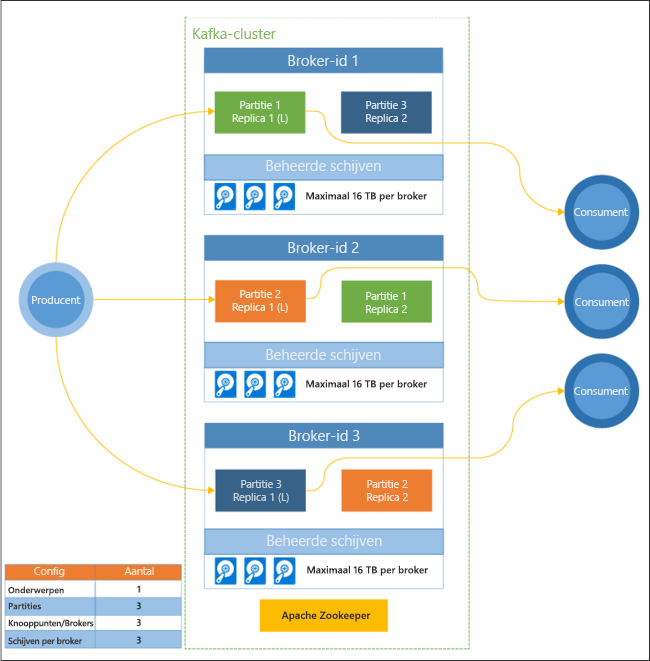

# Wat is Apache Kafka in HDInsight?

[Apache Kafka](https://kafka.apache.org) is een open-source gedistribueerd streamingplatform dat kan worden gebruikt voor het bouwen van pijplijnen en toepassingen voor realtime streaming van gegevens. Kafka biedt ook berichtenbrokerfunctionaliteit vergelijkbaar met een berichtenwachtrij, waarmee u benoemde gegevensstromen kunt publiceren en zich erop kunt abonneren. 

Dit zijn specifieke kenmerken van Kafka in HDInsight:

* Het is een beheerde service die een vereenvoudigd configuratieproces mogelijk maakt. Het resultaat is een configuratie die is getest en die wordt ondersteund door Microsoft.

* Microsoft biedt een SLA (Service Level Agreement) met een uptime van 99,9% voor Kafka. Zie [SLA-informatie voor HDInsight](https://azure.microsoft.com/support/legal/sla/hdinsight/v1_0/) voor meer informatie.

* Het gebruikt Azure Managed Disks als de externe opslag voor Kafka. Managed Disks kan maximaal 16 TB opslag per Kafka-broker leveren. Zie [Increase scalability of Kafka on HDInsight](apache-kafka-scalability.md) (Schaalbaarheid verhogen van Kafka in HDInsight) voor informatie over het configureren van beheerde schijven met Kafka in HDInsight.

    Zie [Azure Managed Disks](../../virtual-machines/windows/managed-disks-overview.md) voor meer informatie over beheerde schijven.

* Kafka is ontworpen als een eendimensionale weergave van een rek. Azure splitst een rek op in twee dimensies: updatedomeinen (UD) en foutdomeinen (FD). Microsoft biedt hulpprogramma's voor het herverdelen van Kafka-partities en -replica's in UD’s en FD’s. 

    Zie [Hoge beschikbaarheid met Kafka op HDInsight](apache-kafka-high-availability.md) voor meer informatie.

* Met HDInsight kunt u het aantal werkknooppunten (waarop de Kafka-broker wordt gehost) wijzigen na het maken van het cluster. Schalen kan worden uitgevoerd vanuit Azure Portal, Azure PowerShell en andere interfaces voor Azure-beheer. Voor Kafka moet u partitiereplica's na het schalen herverdelen. Door herverdeling van partities kan Kafka gebruikmaken van het nieuwe aantal worker-knooppunten.

    Zie [Hoge beschikbaarheid met Kafka op HDInsight](apache-kafka-high-availability.md) voor meer informatie.

* Azure Log Analytics kan worden gebruikt voor het monitoren van Kafka in HDInsight. Log Analytics haalt informatie op VM-niveau naar boven, zoals schijf- en NIC-gegevens en JMX-gegevens van Kafka.

    Zie [Logboeken voor Kafka op HDInsight analyseren](apache-kafka-log-analytics-operations-management.md) voor meer informatie.

### Architectuur van Kafka in HDInsight

Het volgende diagram toont een typische Kafka-configuratie die gebruikmaakt van de consumentgroepen, partitionering en replicatie om het parallel lezen van gebeurtenissen met fouttolerantie mogelijk te maken:

Apache ZooKeeper beheert de status van het Kafka-cluster. Zookeeper is gebouwd voor gelijktijdige, robuuste transacties met een lage latentie. 

Kafka slaat records (gegevens) op in **onderwerpen**. Records worden geproduceerd door **producenten** en worden gebruikt door **consumenten**. Producenten versturen records naar Kafka-**brokers**. Elk werkrolknooppunt in uw HDInsight-cluster is een Kafka-broker. 

Onderwerpen verdelen records over brokers. Wanneer records worden verbruikt, kunt u maximaal één consumer per partitie gebruiken voor parallelle verwerking van de gegevens.

Replicatie wordt gebruikt om partities te dupliceren over knooppunten, zodat er beveiliging is tegen storingen van knooppunten (broker). Een partitie die in het diagram is gemarkeerd met een *(L)*, is de leidende partitie voor de opgegeven partitie. Producentverkeer wordt doorgestuurd naar de leider van elk knooppunt, met behulp van de status die wordt beheerd door ZooKeeper.

## Waarom Kafka op HDInsight gebruiken?

Hier volgen enkele algemene taken en patronen die kunnen worden uitgevoerd met Kafka in HDInsight:

* **Replicatie van Kafka-gegevens**: Kafka biedt het hulpprogramma MirrorMaker, waarmee gegevens worden gerepliceerd tussen Kafka-clusters.

    Zie [Kafka-onderwerpen repliceren met Kafka op HDInsight](apache-kafka-mirroring.md) voor informatie over het gebruik van MirrorMaker.

* **Publicatie-/abonnementsberichten**: Kafka biedt een producent-API voor het publiceren van records naar een Kafka-onderwerp. De consument-API wordt gebruikt bij het abonneren op een onderwerp.

    Zie [Starten met Kafka op HDInsight](apache-kafka-get-started.md) voor meer informatie.

* **Streamverwerking**: Kafka wordt vaak gebruikt met Apache Storm of Spark voor streamverwerking in realtime. In Kafka 0.10.0.0 (HDInsight-versie 3.5 en 3.6) werd een streaming-API geïntroduceerd waarmee u streamingoplossingen kunt maken zonder Storm of Spark.

    Zie [Starten met Kafka op HDInsight](apache-kafka-get-started.md) voor meer informatie.

* **Horizontale schaal**: Kafka partitioneert streams op de knooppunten in het HDInsight-cluster. Consumentenprocessen kunnen worden gekoppeld aan afzonderlijke partities voor een evenwichtige taakverdeling bij het gebruiken van records.

    Zie [Starten met Kafka op HDInsight](apache-kafka-get-started.md) voor meer informatie.

* **Levering op volgorde**: binnen elke partitie worden records in de stream opgeslagen in de volgorde waarin ze zijn ontvangen. Door één consumentenproces aan een partitie te koppelen, kunt u garanderen dat de records in de juiste volgorde worden verwerkt.

    Zie [Starten met Kafka op HDInsight](apache-kafka-get-started.md) voor meer informatie.

## Gebruiksvoorbeelden

* **Berichten**: omdat het publicatie-/abonnementspatroon voor berichten wordt ondersteund, wordt Kafka vaak gebruikt als berichtenbroker.

* **Activiteitsregistratie**: omdat Kafka records registreert in de volgorde waarin ze binnenkomen, kan dit worden gebruikt om activiteiten bij te houden en opnieuw te maken. Bijvoorbeeld gebruikersacties op een website of in een toepassing.

* **Aggregatie**: met streamverwerking kunt u de gegevens uit de verschillende streams combineren en samenvoegen in operationele gegevens.

* **Transformatie**: met streamverwerking kunt u de gegevens uit meerdere invoeronderwerpen combineren en vertalen naar één of meer uitvoeronderwerpen.

## Volgende stappen

Gebruik de volgende koppelingen voor meer informatie over het gebruik van Apache Kafka in HDInsight:

* [Snelstart: Een Kafka-cluster maken in HDInsight](apache-kafka-get-started.md)

* [Zelfstudie: Apache Spark gebruiken met Kafka in HDInsight](../hdinsight-apache-spark-with-kafka.md)

* [Zelfstudie: Apache Storm gebruiken met Kafka in HDInsight](../hdinsight-apache-storm-with-kafka.md)
