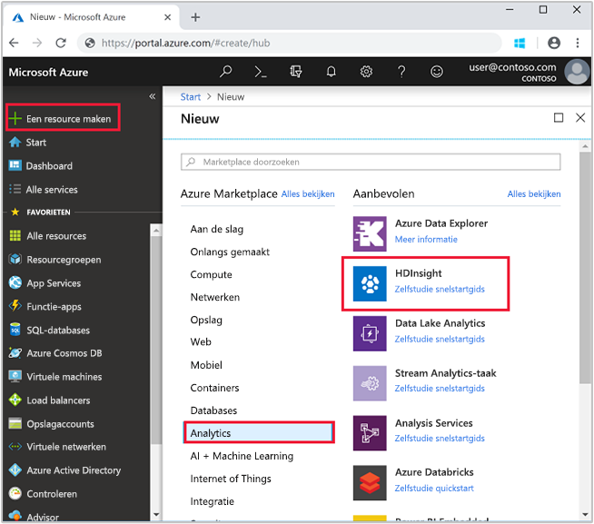
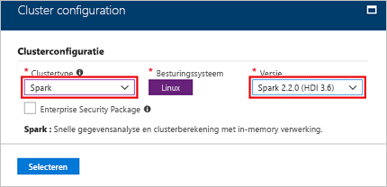
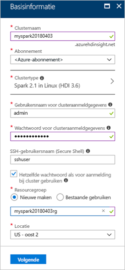
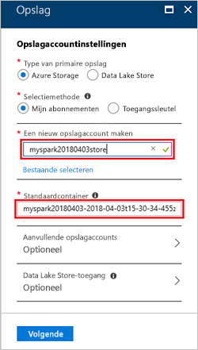

# <a name="quickstart-create-a-spark-cluster-in-hdinsight-using-the-azure-portal"></a>Snelstartgids: Een Spark-cluster in HDInsight maken met behulp van Azure Portal
Leer hoe u een Apache Spark-cluster maakt in Azure HDInsight en hoe u Spark SQL-query's uitvoert op Hive-tabellen. Apache Spark maakt het mogelijk om snelle gegevensanalyses en clusterberekeningen uit te voeren met behulp van verwerking in het geheugen. Zie [Overzicht: Apache Spark in Azure HDInsight](apache-spark-overview.md) voor informatie over Spark in HDInsight.

In deze snelstartgids gebruikt u Azure Portal voor het maken van een Spark-cluster in HDInsight. Het cluster maakt gebruik van Azure Storage Blobs als de clusteropslag. Zie [Snelstart: Clusters instellen in HDInsight](../../storage/data-lake-storage/quickstart-create-connect-hdi-cluster.md) voor meer informatie over het gebruik van Data Lake Storage Gen2.

> [!IMPORTANT]
> HDInsight-clusters worden pro rato per minuut gefactureerd, ongeacht of u er wel of niet gebruik van maakt. Verwijder uw cluster daarom als u er klaar mee bent. Zie voor meer informatie de sectie [Resources opschonen](#clean-up-resources) van dit artikel.

Als u geen abonnement op Azure hebt, maakt u een [gratis account](https://azure.microsoft.com/free/) voordat u begint.

## <a name="create-an-hdinsight-spark-cluster"></a>Een HDInsight Spark-cluster maken

1. Selecteer in Azure Portal **Een resource maken** > **Gegevens en analyses** > **HDInsight**. 

    
2. Geef onder **Basis** de volgende waarden op:
     
    |Eigenschap  |Beschrijving  |
    |---------|---------|
    |**Clusternaam**     | Geef een naam op voor het HDInsight Spark-cluster. De clusternaam die we gebruiken voor deze snelstartgids is **myspark20180403**.|
    |**Abonnement**     | Kies in de vervolgkeuzelijst een Azure-abonnement voor dit cluster. Het abonnement dat we gebruiken voor deze snelstartgids is **&lt;Azure-abonnement**. |
    |**Clustertype**| Vouw het item uit, selecteer vervolgens **Spark** als het clustertype en geef de versie van het Spark-cluster op. <br/>  |
    |**Gebruikersnaam voor clusteraanmeldgegevens**| Voer de gebruikersnaam voor aanmelding bij het cluster in.  De standaardnaam is *admin*. U gebruikt dit account om u verderop in de snelstartgids aan te melden bij het Jupyter-notebook. |
    |**Wachtwoord voor clusteraanmeldgegevens**| Voer het wachtwoord voor aanmelding bij het cluster in. |
    |**SSH-gebruikersnaam (Secure Shell)**| Voer de SSH-gebruikersnaam in. De SSH-gebruikersnaam voor deze snelstartgids is **sshuser**. De standaardinstelling is dat voor dit account hetzelfde wachtwoord wordt gebruikt als voor *Gebruikersnaam voor clusteraanmeldgegevens*. |
    |**Resourcegroep**     | Geef aan of u een nieuwe resourcegroep wilt maken of een bestaande groep wilt gebruiken. Een resourcegroep is een container met gerelateerde resources voor een Azure-oplossing. De naam van de resourcegroep die we gebruiken voor deze snelstartgids is **myspark20180403rg**. |
    |**Locatie**     | Selecteer een locatie voor de resourcegroep. De sjabloon gebruikt deze locatie voor het maken van het cluster en als standaardclusteropslag. De locatie voor deze snelstart is **US - oost 2**. |

    

    Selecteer **Volgende** om naar de pagina **Opslag** te gaan.
3. Geef onder **Opslag** de volgende waarden op:

    - **Selecteer een opslagaccount**: selecteer **Nieuw** en geef vervolgens een naam op voor het nieuwe opslagaccount. De naam van het opslagaccount dat we gebruiken voor deze snelstartgids is **myspark20180403store**.

    

    > [!NOTE] 
    > In de schermafbeelding staat **Bestaande selecteren**. De koppeling heeft achtereenvolgens de naam **Nieuw** en **Bestaande selecteren**.

    De **standaardcontainer** heeft een standaardnaam.  U kunt deze naam desgewenst wijzigen.

    Selecteer **Volgende** om naar de pagina **Overzicht** te gaan. 


3. Selecteer **Maken** op het tabblad **Overzicht**. Het duurt ongeveer 20 minuten om het cluster te maken. Het cluster moet zijn gemaakt voordat u verder kunt gaan met de volgende sessie.

Als u een probleem ondervindt met het maken van HDInsight-clusters, beschikt u mogelijk niet over de juiste machtigingen om dit te doen. Zie [Vereisten voor toegangsbeheer](../hdinsight-administer-use-portal-linux.md#create-clusters) voor meer informatie.

## <a name="create-a-jupyter-notebook"></a>Een Jupyter-notebook maken

Jupyter Notebook is een interactieve notitieblokomgeving die ondersteuning biedt voor verschillende programmeertalen. Via het notitieblok kunt u interactie hebben met uw gegevens, code combineren met markdown-tekst en eenvoudige visualisaties uitvoeren. 

1. Open de [Azure Portal](https://portal.azure.com).
2. Selecteer **HDInsight-clusters** en selecteer vervolgens het cluster dat u hebt gemaakt.

    

3. Selecteer **Clusterdashboard** in het portal en selecteer vervolgens **Jupyter Notebook**. Voer de aanmeldingsreferenties voor het cluster in als u daarom wordt gevraagd.

   

4. Selecteer **Nieuw** > **PySpark** om een notebook te maken. 

   

   Er wordt een nieuwe notebook gemaakt en geopend met de naam Untitled (Untitled.pynb).


## <a name="run-spark-sql-statements"></a>Spark SQL-instructies uitvoeren

SQL (Structured Query Language) is de meest voorkomende en gebruikte taal voor het uitvoeren van query's en het definiëren van gegevens. Spark SQL fungeert als een uitbreiding van Apache Spark voor het verwerken van gestructureerde gegevens, met behulp van de bekende SQL-syntaxis.

1. Controleer of de kernel gereed is. Wanneer u een lege cirkel naast de naam van de kernel in de notebook ziet, is de kernel gereed. Gevulde cirkel geeft aan dat de kernel bezet is.

    

    Wanneer u de notebook voor het eerst start, voert de kernel enkele taken in de achtergrond uit. Wacht tot de kernel gereed is. 
2. Plak de volgende code in een lege cel en druk op **Shift+Enter** om de code uit te voeren. Met de opdracht worden de Hive-tabellen in het cluster weergegeven:

    ```PySpark
    %%sql
    SHOW TABLES
    ```
    Als u een Jupyter Notebook gebruikt dat is geconfigureerd voor uw HDInsight Spark-cluster, krijgt u een vooraf ingestelde `sqlContext` waarmee u Hive-query's kunt uitvoeren met behulp van Apache Spark SQL. `%%sql` instrueert Jupyter Notebook gebruik te maken van de vooraf ingestelde `sqlContext` om de Hive-query uit te voeren. De query haalt de bovenste tien rijen op uit een Hive-tabel (**hivesampletable**) die standaard worden meegeleverd met alle HDInsight-clusters. Het duurt ongeveer 30 seconden om de resultaten op te halen. De uitvoer ziet er als volgt uit: 

    

    Telkens wanneer u in Jupyter een query uitvoert, toont de venstertitel van uw webbrowser de status **(Bezet)** en de notebooktitel. Ook ziet u een gevulde cirkel naast de **PySpark**-tekst in de rechterbovenhoek.
    
2. Voer een andere query uit om de gegevens in `hivesampletable` te zien.

    ```PySpark
    %%sql
    SELECT * FROM hivesampletable LIMIT 10
    ```
    
    Het scherm wordt vernieuwd om de query-uitvoer weer te geven.

    

2. Klik in het menu **File** van het notebook op **Close and Halt**. Als de notebook wordt afgesloten, komen de clusterbronnen vrij.

## <a name="clean-up-resources"></a>Resources opschonen
Met HDInsight worden uw gegevens opgeslagen in Azure Storage of Azure Data Lake Storage, zodat u een cluster veilig kunt verwijderen wanneer dit niet wordt gebruikt. Voor een HDInsight-cluster worden ook kosten in rekening gebracht, zelfs wanneer het niet wordt gebruikt. Aangezien de kosten voor het cluster vaak zoveel hoger zijn dan de kosten voor opslag, is het financieel gezien logischer clusters te verwijderen wanneer ze niet worden gebruikt. Als u direct verder wilt met de zelfstudie die wordt vermeld bij [Volgende stappen](#next-steps), is het beter om het cluster te behouden.

Ga terug naar Azure Portal en selecteer **Verwijderen**.


U kunt ook de naam van de resourcegroep selecteren om de pagina van de resourcegroep te openen en vervolgens **Resourcegroep verwijderen** selecteren. Als u de resourcegroep verwijdert, verwijdert u zowel het HDInsight Spark-cluster als het standaardopslagaccount.

## <a name="next-steps"></a>Volgende stappen 

In deze snelstart hebt u geleerd hoe u een HDInsight Spark-cluster maakt en een eenvoudige Spark SQL-query uitvoert. Ga naar de volgende zelfstudie voor informatie over het gebruik van een HDInsight Spark-cluster om interactieve query's uit te voeren op voorbeeldgegevens.

> [!div class="nextstepaction"]
>[Interactieve query's uitvoeren in Spark](./apache-spark-load-data-run-query.md)
