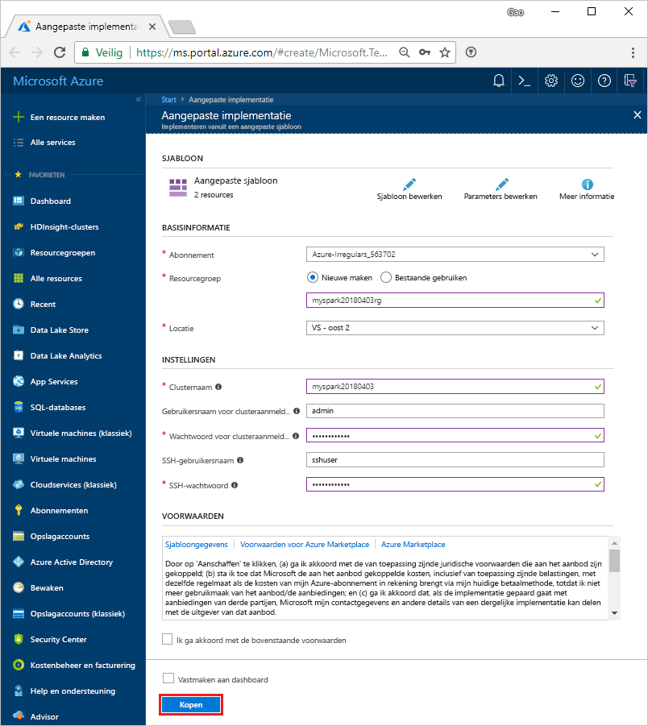

# <a name="quickstart-create-an-apache-spark-cluster-in-hdinsight-using-template"></a>Quickstart: Een Apache Spark-cluster in HDInsight maken met behulp van een sjabloon

Meer informatie over hoe u een [Apache Spark](https://spark.apache.org/)-cluster maakt in Azure HDInsight en hoe u Spark SQL-query's uitvoert op [Apache Hive](https://hive.apache.org/)-tabellen. Apache Spark maakt het mogelijk om snelle gegevensanalyses en clusterberekeningen uit te voeren met behulp van verwerking in het geheugen. Zie voor informatie over Apache Spark in HDInsight [Overzicht: Apache Spark in Azure HDInsight](apache-spark-overview.md).

In deze snelstart gebruikt u Resource Manager-sjabloon voor het maken van een Spark-cluster in HDInsight. U kunt vergelijkbare sjablonen bekijken bij de [Azure-snelstartsjablonen](https://azure.microsoft.com/resources/templates/?resourceType=Microsoft.Hdinsight&pageNumber=1&sort=Popular). De sjabloonverwijzing vindt u [hier](https://docs.microsoft.com/azure/templates/microsoft.hdinsight/allversions).

Het cluster maakt gebruik van Azure Storage Blobs als de clusteropslag. Zie voor informatie over het gebruik van Data Lake Storage Gen2 [Snelstart: clusters instellen in HDInsight](../../storage/data-lake-storage/quickstart-create-connect-hdi-cluster.md).

> [!IMPORTANT]  
> HDInsight-clusters worden pro rato per minuut gefactureerd, ongeacht of u er wel of niet gebruik van maakt. Verwijder uw cluster daarom als u er klaar mee bent. Zie voor meer informatie de sectie [Resources opschonen](#clean-up-resources) van dit artikel.

Als u geen abonnement op Azure hebt, maakt u een [gratis account](https://azure.microsoft.com/free/) voordat u begint.

## <a name="create-an-hdinsight-spark-cluster"></a>Een HDInsight Spark-cluster maken

U maakt een HDInsight Spark-cluster met behulp van een Azure Resource Manager-sjabloon. U vindt de sjabloon in [GitHub](https://azure.microsoft.com/resources/templates/101-hdinsight-spark-linux/). Raadpleeg [Microsoft.HDInsight/clusters](/azure/templates/microsoft.hdinsight/clusters) voor de JSON-syntaxis en de eigenschappen van het cluster.

1. Selecteer de link koppeling om de sjabloon te openen in een nieuw browsertabblad in Azure Portal:

    <a href="https://portal.azure.com/#create/Microsoft.Template/uri/https%3A%2F%2Fraw.githubusercontent.com%2FAzure%2Fazure-quickstart-templates%2Fmaster%2F101-hdinsight-spark-linux%2Fazuredeploy.json" target="_blank">Implementeren naar Azure</a>

2. Voer de volgende waarden in:

    | Eigenschap | Waarde |
    |---|---|
    |**Abonnement**|Selecteer het Azure-abonnement dat is gebruikt om dit cluster te maken. Het abonnement dat we gebruiken voor deze snelstart is **&lt;<naam van Azure-abonnement>**. |
    | **Resourcegroep**|Maak een resourcegroep of selecteer een bestaande resourcegroep. Deze resourcegroep wordt gebruikt om Azure-resources voor uw projecten te beheren. De naam van de nieuwe resourcegroep die we gebruiken voor deze snelstart is **myspark20180403rg**.|
    | **Locatie**|Selecteer een locatie voor de resourcegroep. De sjabloon gebruikt deze locatie voor het maken van het cluster en als standaardclusteropslag. De locatie voor deze snelstart is **US - oost 2**.|
    | **Clusternaam**|Voer een naam in voor het HDInsight-cluster dat u wilt maken. De naam voor het nieuwe cluster dat we gebruiken voor deze snelstart is **myspark20180403**.|
    | **Gebruikersnaam/Wachtwoord voor clusteraanmeldgegevens**|De standaardaanmeldingsnaam is admin. Kies een wachtwoord voor de clusteraanmelding. De aanmeldingsnaam voor deze snelstart is **admin**.|
    | **SSH-gebruikersnaam en SSH-wachtwoord**|Kies een wachtwoord voor de SSH-gebruiker. De SSH-gebruikersnaam voor deze snelstart is **sshuser**.|

    

3. Selecteer **Ik ga akkoord met de bovenstaande voorwaarden**, selecteer **Vastmaken aan dashboard** en selecteer **Kopen**. U ziet een nieuwe tegel met de titel **Implementatie van sjabloonimplementatie**. Het duurt ongeveer 20 minuten om het cluster te maken. Het cluster moet zijn gemaakt voordat u verder kunt gaan met de volgende sessie.

Als u een probleem ondervindt met het maken van HDInsight-clusters, beschikt u mogelijk niet over de juiste machtigingen om dit te doen. Zie [Vereisten voor toegangsbeheer](../hdinsight-hadoop-create-linux-clusters-portal.md) voor meer informatie.

## <a name="install-intellijeclipse-for-spark-application"></a>IntelliJ/Eclipse voor Spark-toepassing installeren
Gebruik de invoegtoepassing Azure-toolkit voor IntelliJ/Eclipse om Apache Spark scala-toepassingen te ontwikkelen die zijn geschreven in [Scala](https://www.scala-lang.org/), en verzend deze vervolgens rechtstreeks vanuit de IntelliJ/Eclipse Integrated Development Environment (IDE) naar een Azure HDInsight Spark-cluster. Zie [IntelliJ gebruiken om Spark-toepassing te schrijven/verzenden](./apache-spark-intellij-tool-plugin.md) en [Eclipse gebruiken om Spark-toepassing te schrijven/verzenden](./apache-spark-eclipse-tool-plugin.md).

## <a name="install-vscode-for-pysparkhive-applications"></a>VSCode voor PySpark-/hive-toepassingen installeren
Leer hoe u Azure HDInsight-hulpprogramma's voor Visual Studio Code (VSCode) kunt gebruiken om Hive-batchtaken, interactieve Hive-query's, PySpark-batch- en interactieve PySpark-scripts te maken en verzenden. De Azure HDInsight-hulpprogramma's kunnen worden geïnstalleerd op de platforms die worden ondersteund door VSCode. Zoals onder andere Windows, Linux en macOS. Zie [VSCode gebruiken om PySpark-toepassing te schrijven/verzenden](../hdinsight-for-vscode.md) voor meer informatie.

## <a name="create-a-jupyter-notebook"></a>Een Jupyter-notebook maken

[Jupyter Notebook](https://jupyter.org/) is een interactieve notitieblokomgeving die ondersteuning biedt voor verschillende programmeertalen. Via het notitieblok kunt u interactie hebben met uw gegevens, code combineren met markdown-tekst en eenvoudige visualisaties uitvoeren.

1. Open de [Azure Portal](https://portal.azure.com).
2. Selecteer **HDInsight-clusters** en selecteer vervolgens het cluster dat u hebt gemaakt.

    

3. Ga in de portal naar de sectie **Clusterdashboards** en klik op **Jupyter Notebook**. Voer de aanmeldingsreferenties voor het cluster in als u daarom wordt gevraagd.

   

4. Selecteer **Nieuw** > **PySpark** om een notebook te maken.

   

   Er wordt een nieuwe notebook gemaakt en geopend met de naam Untitled (Untitled.pynb).


## <a name="run-spark-sql-statements"></a>Spark SQL-instructies uitvoeren

SQL (Structured Query Language) is de meest voorkomende en gebruikte taal voor het uitvoeren van query's en het transformeren van gegevens. Spark SQL fungeert als een uitbreiding van Apache Spark voor het verwerken van gestructureerde gegevens, met behulp van de bekende SQL-syntaxis.

1. Controleer of de kernel gereed is. Wanneer u een lege cirkel naast de naam van de kernel in de notebook ziet, is de kernel gereed. Gevulde cirkel geeft aan dat de kernel bezet is.

    

    Wanneer u de notebook voor het eerst start, voert de kernel enkele taken in de achtergrond uit. Wacht tot de kernel gereed is.
2. Plak de volgende code in een lege cel en druk op **Shift+Enter** om de code uit te voeren. Met de opdracht worden de Hive-tabellen in het cluster weergegeven:

    ```sql
    %%sql
    SHOW TABLES
    ```
    Wanneer u een Jupyter Notebook met uw HDInsight Spark-cluster gebruikt, krijgt u een vooraf ingestelde `spark`-sessie waarmee u Hive-query's kunt uitvoeren met behulp van Apache Spark SQL. `%%sql` instrueert Jupyter Notebook om de vooraf ingestelde `spark`-sessie te gebruiken voor het uitvoeren van de Hive-query. De query haalt de bovenste tien rijen op uit een Hive-tabel (**hivesampletable**) die standaard worden meegeleverd met alle HDInsight-clusters. De eerste keer dat u de query verzendt, maakt Jupyter een Apache Spark-toepassing voor de notebook. Dit duurt ongeveer 30 seconden. Zodra de Spark-toepassing gereed is, wordt de query uitgevoerd in ongeveer een seconde en worden de resultaten geproduceerd. De uitvoer ziet er als volgt uit:

    

    Telkens wanneer u in Jupyter een query uitvoert, toont de venstertitel van uw webbrowser de status **(Bezet)** en de notebooktitel. Ook ziet u een gevulde cirkel naast de **PySpark**-tekst in de rechterbovenhoek.

2. Voer een andere query uit om de gegevens in `hivesampletable` te zien.

    ```sql
    %%sql
    SELECT * FROM hivesampletable LIMIT 10
    ```
    
    Het scherm wordt vernieuwd om de query-uitvoer weer te geven.

    

2. Klik in het menu **File** van het notebook op **Close and Halt**. Als de notebook wordt afgesloten, komen de clusterbronnen, waaronder de Apache Spark-toepassing, vrij.

## <a name="clean-up-resources"></a>Resources opschonen
HDInsight slaat uw gegevens en Jupyter Notebooks op in Azure Storage of Azure Data Lake Store, zodat u een cluster veilig kunt verwijderen wanneer dit niet wordt gebruikt. Voor een HDInsight-cluster worden ook kosten in rekening gebracht, zelfs wanneer het niet wordt gebruikt. Aangezien de kosten voor het cluster vaak zoveel hoger zijn dan de kosten voor opslag, is het financieel gezien logischer clusters te verwijderen wanneer ze niet worden gebruikt. Als u direct verder wilt met de zelfstudie die wordt vermeld bij [Volgende stappen](#next-steps), is het beter om het cluster te behouden.

Ga terug naar Azure Portal en selecteer **Verwijderen**.


U kunt ook de naam van de resourcegroep selecteren om de pagina van de resourcegroep te openen en vervolgens **Resourcegroep verwijderen** selecteren. Als u de resourcegroep verwijdert, verwijdert u zowel het HDInsight Spark-cluster als het standaardopslagaccount.

## <a name="next-steps"></a>Volgende stappen

In deze snelstart hebt u geleerd hoe u een HDInsight Spark-cluster maakt en een eenvoudige Spark SQL-query uitvoert. Ga naar de volgende zelfstudie voor informatie over het gebruik van een HDInsight Spark-cluster om interactieve query's uit te voeren op voorbeeldgegevens.

> [!div class="nextstepaction"]
>[Interactieve query's uitvoeren in Apache Spark](./apache-spark-load-data-run-query.md)


