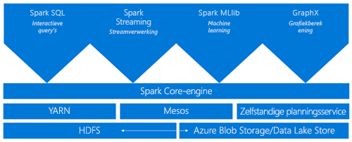
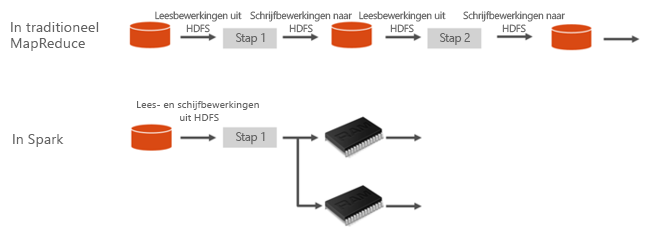
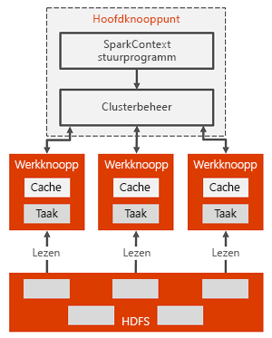

# Inleiding tot Spark in HDInsight

Dit artikel biedt een inleiding tot Spark in HDInsight. <a href="http://spark.apache.org/" target="_blank">Apache Spark</a> is een open-source framework voor parallelle verwerking dat ondersteuning biedt voor in-memory verwerking om de prestaties van toepassingen voor de analyse van big data te verbeteren. Een Spark-cluster in HDInsight is compatibel met Azure Storage (WASB), evenals met Azure Data Lake Store. Om die reden kunnen bestaande gegevens die zijn opgeslagen in Azure, gemakkelijk worden verwerkt via een Spark-cluster.

[!INCLUDE [hdinsight-price-change](../../../includes/hdinsight-enhancements.md)]

Wanneer u Spark-cluster in HDInsight maakt, maakt u Azure-rekenresources met Spark geïnstalleerd en geconfigureerd. Het maken van een Spark-cluster in HDInsight duurt niet meer dan ongeveer tien minuten. De gegevens die moeten worden verwerkt, zijn opgeslagen in Azure Storage of Azure Data Lake Store. Zie [Azure Storage gebruiken met HDInsight](../hdinsight-hadoop-use-blob-storage.md).

## Spark vergeleken met traditionele MapReduce

Wat maakt Spark snel? Hoe verschilt de architectuur van Apache Spark van traditionele MapReduce, waardoor het betere prestaties voor het delen van gegevens kan bieden?

Spark biedt primitieve typen voor in-memory clustercomputing. Een Spark-taak kan gegevens laden en in het geheugen cachen en er herhaaldelijk query’s op uitvoeren, veel sneller dan systemen op basis van schijven. Spark kan ook worden geïntegreerd met de programmeertaal Scala waarmee u gedistribueerde gegevenssets zoals lokale verzamelingen kunt bewerken. Het is niet nodig om alles te structureren als toewijzings- en verminderingsbewerkingen.

In Spark worden gegevens tussen bewerkingen sneller gedeeld omdat gegevens zich in het geheugen bevinden. Hadoop deelt daarentegen gegevens via HDFS, wat langer duurt om te verwerken.

## Wat is Apache Spark in Azure HDInsight?
Spark-clusters in HDInsight bieden een volledig beheerde Spark-service. Hier worden de voordelen vermeld van het maken van een Spark-cluster in HDInsight.

| Functie | Beschrijving |
| --- | --- |
| Het gemak van het maken van Spark-clusters |U kunt binnen enkele minuten een nieuw Spark-cluster in HDInsight maken met Azure Portal, Azure PowerShell of de .NET-SDK voor HDInsight. Zie [Aan de slag met Spark-clusters in HDInsight](apache-spark-jupyter-spark-sql.md) |
| Gebruiksgemak |Spark-cluster in HDInsight bevat Jupyter- en Zeppelin-notebooks. U kunt deze notebooks gebruiken voor interactieve gegevensverwerking en visualisatie.|
| REST-API’s |Spark-clusters in HDInsight omvatten [Livy](https://github.com/cloudera/hue/tree/master/apps/spark/java#welcome-to-livy-the-rest-spark-server), een Spark-taakserver op basis van een REST-API om op afstand taken te verzenden en te controleren. |
| Ondersteuning voor Azure Data Lake Store | Spark-cluster in HDInsight kan worden geconfigureerd voor het gebruik van Azure Data Lake Store als extra opslag en als primaire opslag (alleen met HDInsight 3.5-clusters). Zie [Overzicht van Azure Data Lake Store](../../data-lake-store/data-lake-store-overview.md) voor meer informatie over Data Lake Store. |
| Integratie met Azure-services |Spark-cluster in HDInsight wordt geleverd met een connector voor Azure Event Hubs. Met behulp van de Event Hubs kunnen klanten ook andere streamingtoepassingen bouwen, naast [Kafka](http://kafka.apache.org/), dat al beschikbaar is als onderdeel van Spark. |
| Ondersteuning voor R Server | U kunt in een HDInsight Spark-cluster een R Server instellen voor het uitvoeren van gedistribueerde R-berekeningen met de snelheden die worden toegezegd voor een Spark-cluster. Zie [Aan de slag met R Server in HDInsight](../r-server/r-server-get-started.md) voor meer informatie. |
| Integratie met IDE's van derden | HDInsight biedt invoegtoepassingen voor IDE‘s, zoals IntelliJ IDEA en Eclipse, die u kunt gebruiken om toepassingen te maken en te verzenden naar een HDInsight Spark-cluster. Zie [Azure-toolkit voor IntelliJ IDEA gebruiken](apache-spark-intellij-tool-plugin.md) en [Azure-toolkit voor Eclipse gebruiken](apache-spark-eclipse-tool-plugin.md) voor meer informatie.|
| Gelijktijdige query's |Spark-clusters in HDInsight ondersteunen gelijktijdige query's. Hierdoor kunnen meerdere query's van één gebruiker of meerdere query's van verschillende gebruikers en toepassingen dezelfde clusterresources delen. |
| Opslaan in cache in SSD's |U kunt gegevens in het geheugen of in aan de clusterknooppunten gekoppelde SSD's cachen. Cachen in het geheugen biedt de beste queryprestaties, maar kan duur zijn. Cachen in SSD's biedt een goede optie voor het verbeteren van de prestaties van query's zonder de noodzaak tot het maken van een cluster dat zo groot is dat de volledige gegevensset in het geheugen past. |
| Integratie met BI-tools |Spark-clusters voor HDInsight bieden connectors voor BI-tools zoals [Power BI](http://www.powerbi.com/) en [Tableau](http://www.tableau.com/products/desktop) voor gegevensanalyse. |
| Vooraf geladen Anaconda-bibliotheken |Spark-clusters in HDInsight worden geleverd met Anaconda-bibliotheken die vooraf zijn geïnstalleerd. [Anaconda](http://docs.continuum.io/anaconda/) voorziet in bijna 200 bibliotheken voor machine learning, data-analyse, visualisatie, enzovoort. |
| Schaalbaarheid |Tijdens het maken kunt u het aantal knooppunten in het cluster opgeven, maar mogelijk wilt u het cluster vergroten of verkleinen, zodat dit aansluit bij de werkbelasting. Alle HDInsight-clusters bieden u de mogelijkheid het aantal knooppunten in het cluster te wijzigen. Bovendien kunnen Spark-clusters zonder gegevensverlies worden verwijderd, omdat alle gegevens zijn opgeslagen in Azure Storage of Data Lake Store. |
| 24/7 ondersteuning |Spark-clusters in HDInsight worden geleverd met 24/7 ondersteuning op bedrijfsniveau en een SLA met 99,9% beschikbaarheid. |

## Architectuur van Spark-cluster

Hier volgt de Spark-clusterarchitectuur en de werking ervan:

Het hoofdknooppunt heeft de Spark-master die het aantal toepassingen beheert, de apps die zijn toegewezen aan het Spark-stuurprogramma. Elke app wordt op verschillende manieren door de Spark-master beheerd. Spark kan worden geïmplementeerd naast Mesos, YARN of de Spark-clustermanager die werkrolknooppuntresources toewijst aan een toepassing. In HDInsight wordt Spark uitgevoerd met behulp van de YARN-clustermanager. De resources in het cluster worden beheerd door de Spark-master in HDInsight. Dit betekent dat de Spark-master weet welke resources, zoals geheugen, bezet of beschikbaar zijn in het werkrolknooppunt.

Het stuurprogramma voert de hoofdfunctie van de gebruiker uit en voert de verschillende parallelle bewerkingen op de werkrolknooppunten uit. Vervolgens verzamelt het stuurprogramma de resultaten van de bewerkingen. De werkrolknooppunten lezen en schrijven gegevens van en naar het HDFS (Hadoop Distributed File System). De werkrolknooppunten plaatsen getransformeerde gegevens ook in het geheugen als RDD’s (Resilient Distributed Datasets).

Zodra de app is gemaakt in de Spark-master, worden de resources door de Spark-master toegewezen aan de apps, waarbij het Spark-stuurprogramma wordt aangeroepen. Het Spark-stuurprogramma maakt ook de SparkContext en begint ook met het maken van de RDD's. De metagegevens van de RDD's worden opgeslagen in het Spark-stuurprogramma.

Het Spark-stuurprogramma maakt verbinding met de Spark-master en is verantwoordelijk voor het converteren van een toepassing naar een geleide grafiek (DAG) van afzonderlijke taken die worden uitgevoerd binnen een executorproces op de werkrolknooppunten. Elke toepassing krijgt zijn eigen executorprocessen, die voor de duur van de gehele toepassing blijven en taken uitvoeren in meerdere threads.

## Wat zijn de gebruiksvoorbeelden voor Spark in HDInsight?
Spark-clusters in HDInsight maken de volgende belangrijke scenario's mogelijk:

### Interactieve gegevensanalyse en BI
[Bekijk een zelfstudie](apache-spark-use-bi-tools.md)

Met Apache Spark in HDInsight worden gegevens opgeslagen in Azure Storage of Azure Data Lake Store. Zakelijke deskundigen en besluitvormers kunnen die gegevens analyseren, erover rapporteren en Microsoft Power BI gebruiken voor het maken van interactieve rapporten van de geanalyseerde gegevens. Analisten kunnen beginnen met ongestructureerde/semi-gestructureerde gegevens in clusteropslag, een schema voor de gegevens definiëren met behulp van notebooks, en vervolgens gegevensmodellen bouwen met behulp van Microsoft Power BI. Spark-clusters in HDInsight bieden ook ondersteuning voor een aantal BI-tools van derden, zoals Tableau, wat het tot een ideaal platform maakt voor gegevensanalisten, zakelijke deskundigen en besluitvormers.

### Machine Learning in Spark
[Bekijk een zelfstudie: gebouwtemperaturen voorspellen met behulp van HVAC-gegevens](apache-spark-ipython-notebook-machine-learning.md)

[Bekijk een zelfstudie: Voedselinspectieresultaten voorspellen](apache-spark-machine-learning-mllib-ipython.md)

Apache Spark wordt geleverd met [MLlib](http://spark.apache.org/mllib/), een bibliotheek voor machine learning die boven op Spark is gebouwd. U kunt deze bibliotheek gebruiken vanuit een Spark-cluster in HDInsight. Spark-cluster in HDInsight bevat ook Anaconda, een Python-distributie met tal van andere pakketten voor machine learning. Combineer dit met ingebouwde ondersteuning voor Jupyter- en Zeppelin-notebooks en u hebt een eersteklas omgeving voor het maken van machine learning-toepassingen.

### Streaming en realtime gegevensanalyse in Spark
[Bekijk een zelfstudie](apache-spark-eventhub-streaming.md)

Spark-clusters in HDInsight bieden uitgebreide ondersteuning voor het bouwen van realtime analyseoplossingen. Spark omvat al connectors om gegevens op te halen uit diverse bronnen, zoals Kafka-, Flume-, Twitter-, ZeroMQ- en TCP-sockets, en HDInsight Spark voegt eersteklas ondersteuning toe voor het ophalen van gegevens uit Azure Event Hubs. Event Hubs is de meest gebruikte wachtrijservice in Azure. Dankzij out-of-the-box-ondersteuning voor Event Hubs zijn Spark-clusters in HDInsight een ideaal platform voor het bouwen van een realtime analysepijplijn.

## Welke onderdelen zijn in een Spark-cluster opgenomen?
Spark-clusters in HDInsight omvatten de volgende onderdelen die standaard beschikbaar zijn in de clusters.

* [Spark Core](https://spark.apache.org/docs/1.5.1/). Omvat Spark Core, Spark SQL, Spark-streaming-API's, GraphX en MLlib.
* [Anaconda](http://docs.continuum.io/anaconda/)
* [Livy](https://github.com/cloudera/hue/tree/master/apps/spark/java#welcome-to-livy-the-rest-spark-server)
* [Jupyter-notebook](https://jupyter.org)
* [Zeppelin-notebook](http://zeppelin-project.org/)

Spark-clusters in HDInsight bieden ook een [ODBC-stuurprogramma](http://go.microsoft.com/fwlink/?LinkId=616229) voor verbinding met Spark-clusters in HDInsight vanuit BI-tools, zoals Microsoft Power BI en Tableau.

## Waar moet ik beginnen?
Begin met het maken van een Spark-cluster in HDInsight. Zie [Snelstartgids: een Spark-cluster maken in HDInsight Linux en een interactieve query uitvoeren met Jupyter](apache-spark-jupyter-spark-sql.md). 

## Volgende stappen
### Scenario's
* [Spark met BI: interactieve gegevensanalyses uitvoeren met behulp van Spark in HDInsight met BI-tools](apache-spark-use-bi-tools.md)
* [Spark met Machine Learning: Spark in HDInsight gebruiken voor het analyseren van de gebouwtemperatuur met behulp van HVAC-gegevens](apache-spark-ipython-notebook-machine-learning.md)
* [Spark met Machine Learning: Spark in HDInsight gebruiken om voedselinspectieresultaten te voorspellen](apache-spark-machine-learning-mllib-ipython.md)
* [Spark-streaming: Spark in HDInsight gebruiken voor het bouwen van realtime streamingtoepassingen](apache-spark-eventhub-streaming.md)
* [Websitelogboekanalyse met Spark in HDInsight](apache-spark-custom-library-website-log-analysis.md)

### Toepassingen maken en uitvoeren
* [Een zelfstandige toepassing maken met behulp van Scala](apache-spark-create-standalone-application.md)
* [Taken op afstand uitvoeren in een Spark-cluster met behulp van Livy](apache-spark-livy-rest-interface.md)

### Tools en uitbreidingen
* [De invoegtoepassing HDInsight Tools for IntelliJ IDEA gebruiken om Spark Scala-toepassingen te maken en in te dienen](apache-spark-intellij-tool-plugin.md)
* [De invoegtoepassing HDInsight Tools for IntelliJ IDEA gebruiken om op afstand fouten in Spark Scala-toepassingen op te lossen](apache-spark-intellij-tool-plugin-debug-jobs-remotely.md)
* [Zeppelin-notebooks gebruiken met een Spark-cluster in HDInsight](apache-spark-zeppelin-notebook.md)
* [Beschikbare kernels voor Jupyter-notebook in Spark-cluster voor HDInsight](apache-spark-jupyter-notebook-kernels.md)
* [Externe pakketten gebruiken met Jupyter-notebooks](apache-spark-jupyter-notebook-use-external-packages.md)
* [Jupyter op uw computer installeren en verbinding maken met een HDInsight Spark-cluster](apache-spark-jupyter-notebook-install-locally.md)

### Resources beheren
* [Resources beheren voor het Apache Spark-cluster in Azure HDInsight](apache-spark-resource-manager.md)
* [Taken die worden uitgevoerd in een Apache Spark-cluster in HDInsight, traceren en er fouten in oplossen](apache-spark-job-debugging.md)
* [Bekende problemen met Apache Spark in Azure HDInsight](apache-spark-known-issues.md).
