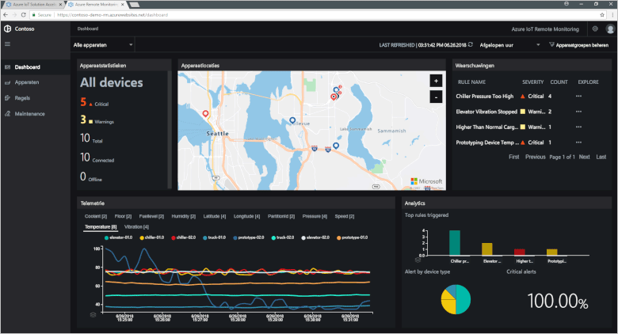

# Wat zijn Azure IoT-oplossingsversnellers?

Een IoT-cloudoplossing maakt doorgaans gebruik van aangepaste code en meerdere cloudservices om connectiviteit, gegevensverwerking en analyses en presentatie van apparaten te beheren.

De IoT-oplossingsversnellers zijn een verzameling volledige, kant-en-klare IoT-oplossingen voor het implementeren van algemene IoT-scenario's zoals externe bewaking, de verbonden factory en predictief onderhoud. Wanneer u een oplossingsversneller implementeert, bevat de implementatie alle vereiste cloudservices samen met de vereiste toepassingscode.

De oplossingsversnellers vormen het startpunt voor uw eigen IoT-oplossingen. De broncode voor alle oplossingsversnellers is open-source en beschikbaar in GitHub. U wordt aangemoedigd de oplossingsversnellers te downloaden en [aan te passen](iot-accelerators-remote-monitoring-customize.md) om te voldoen aan uw vereisten.

U kunt de oplossingsversnellers ook gebruiken als leermiddelen voordat u helemaal uw eigen IoT-oplossing gaat maken. De oplossingsversnellers implementeren bewezen procedures voor IoT-cloudoplossingen die u kunt volgen.

De toepassingscode in elke oplossingsversneller bevat een dashboard waarmee u de oplossingsversneller beheren. Met een dashboard kunt u bijvoorbeeld de telemetrie van uw verbonden apparaten bekijken, nieuwe apparaten inrichten of de firmware van uw verbonden apparaten upgraden:

## Ondersteunde IoT-scenario's

Er zijn momenteel vier oplossingsversnellers beschikbaar die u kunt implementeren:

### Externe bewaking

Gebruik deze oplossingsversneller voor het verzamelen van telemetrie van meerdere externe apparaten en om deze te beheren. Voorbeelden zijn koelingssystemen die zijn geïnstalleerd op de locatie van uw klanten of kleppen die zijn geïnstalleerd in externe pompstations.

### Verbonden factory

Gebruik deze oplossingsversneller voor het verzamelen van telemetriegegevens van industriële activa met een [OPC Unified Architecture](https://opcfoundation.org/about/opc-technologies/opc-ua/)-interface en om deze activa te beheren. Industriële activa kunnen assembly- en teststations in een productielijn bevatten.

### Predictief onderhoud

Gebruik deze oplossingsversneller om te voorspellen wanneer een extern apparaat naar verwachting defect raakt, zodat u onderhoud kunt plegen voordat het voorspelde defect zich voordoet. De oplossingsversneller maakt gebruik van machine learning-algoritmen om fouten op basis van telemetriegegevens van apparaten te voorspellen. Voorbeelden van dergelijke apparaten zijn vliegtuigmotoren en liften.

### Apparaatsimulatie

Gebruik deze oplossingsversneller voor het laten draaien van meerdere gesimuleerde apparaten die realistische telemetriegegevens genereren. U kunt deze oplossingsversneller gebruiken voor het testen van het gedrag van de andere oplossingsversnellers of voor het testen van uw eigen aangepaste IoT-oplossingen.

## Ontwerpprincipes

Alle oplossingsversnellers volgen dezelfde ontwerpprincipes en -doelen. Het ontwerp ervan is:

* **Schaalbaar**, zodat u verbinding kunt maken met miljoenen verbonden apparaten en deze kunt beheren.
* **Uitbreidbaar**, zodat u ze kunt aanpassen aan uw behoeften.
* **Begrijpelijk**, zodat u precies weet hoe ze werken en hoe ze worden geïmplementeerd.
* **Modulair**, waardoor u services voor alternatieven kunt verwisselen.
* **Veilig**, vanwege de combinatie van Azure-beveiliging met ingebouwde functies voor connectiviteit en apparaatbeveiliging.

## Architecturen en talen

De oorspronkelijke oplossingsversnellers werden geschreven met behulp van .NET en een model-view-controller (MVC)-architectuur. Microsoft werkt de oplossingsversnellers bij met een nieuwe architectuur op basis van microservices. Zowel de [Java](https://github.com/Azure/azure-iot-pcs-remote-monitoring-java)- als [.NET](https://github.com/Azure/azure-iot-pcs-remote-monitoring-dotnet)-versie van elke microservice zijn beschikbaar in GitHub. De volgende tabel toont de huidige status van de oplossingsverbeteringen:

| Oplossingsverbetering   | Architectuur  | Talen     |
| ---------------------- | ------------- | ------------- |
| Externe bewaking      | Microservices | Java en .NET |
| Predictief onderhoud | MVC           | .NET          |
| Verbonden factory      | MVC           | .NET          |

Zie [.NET Application Architecture](https://www.microsoft.com/net/learn/architecture) (.NET-toepassingsarchitectuur) en [Microservices: An application revolution powered by the cloud](https://azure.microsoft.com/blog/microservices-an-application-revolution-powered-by-the-cloud/) (Microservices: een toepassingsrevolutie aangedreven door de cloud) voor meer informatie over microservicearchitectuur.

## Implementatieopties

U kunt de oplossingsversnellers op basis van microservices implementeren in de volgende configuraties:

* **Standard:** uitgebreide infrastructuurimplementatie voor het ontwikkelen van een productie-implementatie. De Azure Container Service implementeert de microservices naar meerdere virtuele Azure-machines. Kubernetes deelt de Docker-containers in die de afzonderlijke microservices hosten.
* **Basic:** voordelige versie voor een demonstratie of het testen van een implementatie. Alle microservices worden geïmplementeerd op een enkele virtuele Azure-machine.
* **Local:** implementatie op lokale computer voor testen en ontwikkeling. Bij deze aanpak worden de microservices geïmplementeerd op een lokale Docker-container die verbinding maakt met IoT Hub, Azure Cosmos DB en Azure-opslagservices in de cloud.

De kosten voor het uitvoeren van een oplossingsversneller zijn een combinatie van de [kosten van de onderliggende Azure-services](https://azure.microsoft.com/pricing). U ziet details van de gebruikte Azure-services wanneer u uw implementatieopties kiest.

## Volgende stappen

Als u een IoT-oplossingsversneller wilt uitproberen, ga dan naar de snelstart [Een cloudoplossing voor externe bewaking implementeren](quickstart-remote-monitoring-deploy.md).
