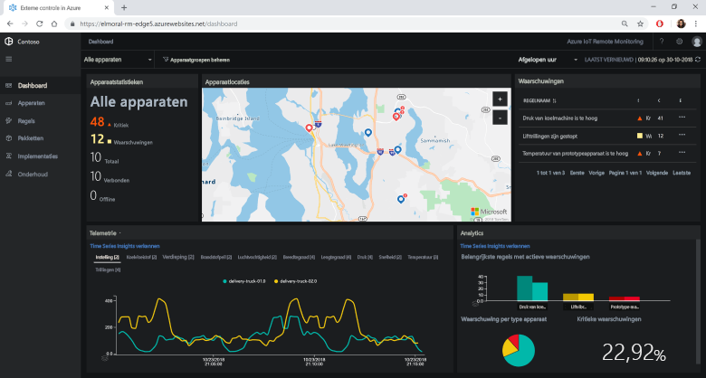
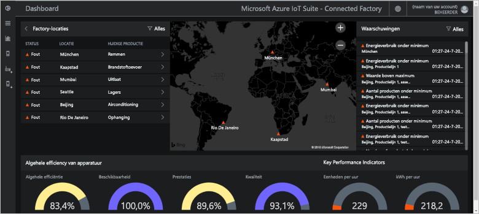
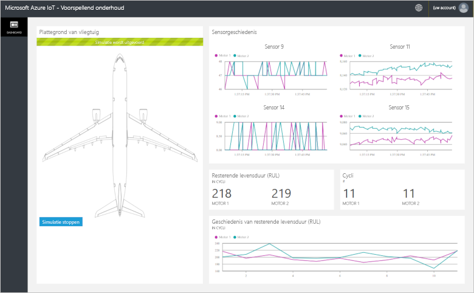
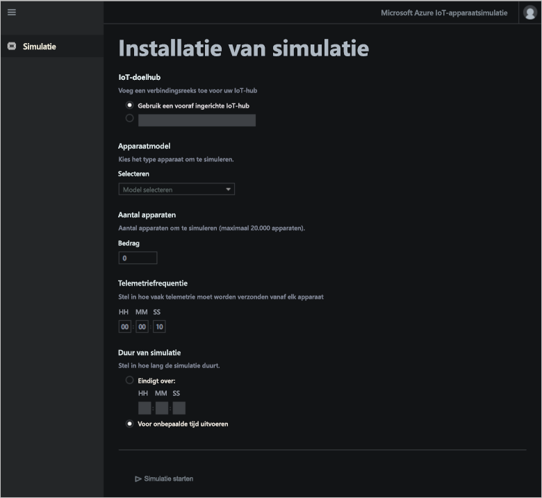

# Wat zijn Azure IoT-oplossingsverbeteringen?

Een IoT-cloudoplossing maakt doorgaans gebruik van aangepaste code en meerdere cloudservices om connectiviteit, gegevensverwerking en analyses en presentatie van apparaten te beheren.

De IoT-oplossingsverbeteringen zijn een verzameling volledige, kant-en-klare IoT-oplossingen voor het implementeren van algemene IoT-scenario's zoals externe controle, verbonden factory, predictief onderhoud en apparaatsimulatie. Wanneer u een oplossingsversneller implementeert, bevat de implementatie alle vereiste cloudservices samen met de vereiste toepassingscode.

De oplossingsverbeteringen vormen het startpunt voor uw eigen IoT-oplossingen. De broncode voor alle oplossingsverbeteringen is open-source en beschikbaar in GitHub. U wordt aangeraden om de oplossingsverbeteringen te downloaden en aan te passen zodat ze voldoen aan uw vereisten.

U kunt de oplossingsverbeteringen ook gebruiken als leermiddelen voordat u helemaal uw eigen IoT-oplossing gaat maken. De oplossingsverbeteringen implementeren bewezen procedures voor IoT-cloudoplossingen die u kunt volgen.

De toepassingscode in elke oplossingsverbetering bevat een web-app waarmee u de oplossingsverbetering beheren.

## Ondersteunde IoT-scenario's

Er zijn momenteel vier oplossingsverbeteringen beschikbaar die u kunt implementeren:

### Externe controle

Gebruik deze oplossingsversneller voor het verzamelen van telemetrie van meerdere externe apparaten en om deze te beheren. Voorbeelden zijn koelingssystemen die zijn geïnstalleerd op de locatie van uw klanten of kleppen die zijn geïnstalleerd in externe pompstations.

U kunt het dashboard voor externe controle gebruiken om de telemetrie van verbonden apparaten te bekijken, nieuwe apparaten in te richten of de firmware op verbonden apparaten bij te werken:

### Verbonden factory

Gebruik deze oplossingsversneller voor het verzamelen van telemetriegegevens van industriële activa met een [OPC Unified Architecture](https://opcfoundation.org/about/opc-technologies/opc-ua/)-interface en om deze activa te beheren. Industriële activa kunnen assembly- en teststations in een productielijn bevatten.

U kunt de verbonden factory gebruiken om industriële apparaten te controleren en te beheren:

### Predictief onderhoud

Gebruik deze oplossingsversneller om te voorspellen wanneer een extern apparaat naar verwachting defect raakt, zodat u onderhoud kunt plegen voordat het voorspelde defect zich voordoet. De oplossingsversneller maakt gebruik van machine learning-algoritmen om fouten op basis van telemetriegegevens van apparaten te voorspellen. Voorbeelden van dergelijke apparaten zijn vliegtuigmotoren en liften.

U kunt het dashboard voor predictief onderhoud gebruiken om de analyse voor predictief onderhoud te bekijken:

### Apparaatsimulatie

Gebruik deze oplossingsversneller voor het laten draaien van meerdere gesimuleerde apparaten die realistische telemetriegegevens genereren. U kunt deze oplossingsverbeteringen gebruiken voor het testen van het gedrag van de andere oplossingsverbeteringen of voor het testen van uw eigen aangepaste IoT-oplossingen.

U kunt de web-app voor apparaatsimulatie gebruiken om simulaties te configureren en uit te voeren:

## Ontwerpprincipes

Alle oplossingsverbeteringen volgen dezelfde ontwerpprincipes en -doelen. Het ontwerp ervan is:

* **Schaalbaar**, zodat u verbinding kunt maken met miljoenen verbonden apparaten en deze kunt beheren.
* **Uitbreidbaar**, zodat u ze kunt aanpassen aan uw behoeften.
* **Begrijpelijk**, zodat u precies weet hoe ze werken en hoe ze worden geïmplementeerd.
* **Modulair**, waardoor u services voor alternatieven kunt verwisselen.
* **Veilig**, vanwege de combinatie van Azure-beveiliging met ingebouwde functies voor connectiviteit en apparaatbeveiliging.

## Architecturen en talen

De oorspronkelijke oplossingsverbeteringen werden geschreven met behulp van .NET en een model-view-controller (MVC)-architectuur. Microsoft werkt de oplossingsverbeteringen bij met een nieuwe architectuur op basis van microservices. In de volgende tabel wordt de huidige status van de oplossingsverbeteringen weergegeven met koppelingen naar de GitHub-opslagplaatsen:

| Oplossingsverbetering   | Architectuur  | Talen     |
| ---------------------- | ------------- | ------------- |
| Externe controle      | Microservices | [Java](https://github.com/Azure/azure-iot-pcs-remote-monitoring-java) en [.NET](https://github.com/Azure/azure-iot-pcs-remote-monitoring-dotnet) |
| Predictief onderhoud | MVC           | [.NET](https://github.com/Azure/azure-iot-predictive-maintenance)          |
| Verbonden factory      | MVC           | [.NET](https://github.com/Azure/azure-iot-connected-factory)          |
| Apparaatsimulatie      | Microservices | [.NET](https://github.com/Azure/device-simulation-dotnet)          |

Zie [.NET Application Architecture](https://www.microsoft.com/net/learn/architecture) (.NET-toepassingsarchitectuur) en [Microservices: An application revolution powered by the cloud](https://azure.microsoft.com/blog/microservices-an-application-revolution-powered-by-the-cloud/) (Microservices: een toepassingsrevolutie aangedreven door de cloud) voor meer informatie over microservicearchitectuur.

## Implementatieopties

U kunt de oplossingsverbeteringen implementeren op de site [Microsoft Azure IoT-oplossingsverbeteringen](https://www.azureiotsolutions.com/Accelerators#) of door gebruik te maken van de opdrachtregel.

U kunt de oplossingsverbetering voor externe controle implementeren in de volgende configuraties:

* **Standard:** uitgebreide infrastructuurimplementatie voor het ontwikkelen van een productie-implementatie. De Azure Container Service implementeert de microservices naar meerdere virtuele Azure-machines. Kubernetes deelt de Docker-containers in die de afzonderlijke microservices hosten.
* **Basic:** voordelige versie voor een demonstratie of het testen van een implementatie. Alle microservices worden geïmplementeerd op een enkele virtuele Azure-machine.
* **Local:** implementatie op lokale computer voor testen en ontwikkeling. Bij deze aanpak worden de microservices geïmplementeerd op een lokale Docker-container die verbinding maakt met IoT Hub, Azure Cosmos DB en Azure-opslagservices in de cloud.

De kosten voor het uitvoeren van een oplossingsversneller zijn een combinatie van de [kosten van de onderliggende Azure-services](https://azure.microsoft.com/pricing). U ziet details van de gebruikte Azure-services wanneer u uw implementatieopties kiest.

## Volgende stappen

Raadpleeg de quickstarts om een van de oplossingsverbeteringen uit te proberen:

* [Een oplossing voor externe controle uitproberen](quickstart-remote-monitoring-deploy.md)
* [Een oplossing voor verbonden factory uitproberen](quickstart-connected-factory-deploy.md)
* [Een oplossing voor predictief onderhoud uitproberen](quickstart-predictive-maintenance-deploy.md)
* [Een oplossing voor apparaatsimulatie uitproberen](quickstart-device-simulation-deploy.md)
