# Quickstart: Een cloudgebaseerde oplossing proberen voor het beheren van mijn industriële IoT-apparaten

In deze snelstart ziet u hoe de Azure IoT-oplossingsversneller voor verbonden factory’s implementeert voor het uitvoeren van een cloudgebaseerde bewakings- en beheersimulatie voor industriële IoT-apparaten. Wanneer u de oplossingsversneller Verbonden factory implementeert, wordt deze vooraf ingevuld met gesimuleerde resources waarmee u een algemeen industrieel IoT-scenario kunt doorlopen. Verschillende gesimuleerde factory's die zijn verbonden met de oplossing rapporteren de gegevenswaarden die nodig zijn voor het berekenen van de algemene apparatuurefficiëntie (overall equipment efficiency, OEE) en de key performance indicators (KPI's). In deze snelstart leest u hoe u het dashboard van de oplossing kunt gebruiken:

* De factory, productielijnen, de OEE van stations en de KPI-waarden controleren.
* De telemetriegegevens analyseren die van deze apparaten worden gegenereerd.
* Reageren op waarschuwingen.

U hebt een actief Azure-abonnement nodig om deze snelstart te voltooien.

Als u nog geen abonnement op Azure hebt, maak dan een [gratis account](https://azure.microsoft.com/free/?WT.mc_id=A261C142F) aan voordat u begint.

## De oplossing implementeren

Wanneer u de oplossingsverbetering implementeert in uw Azure-abonnement, moet u bepaalde configuratieopties instellen.

Ga naar [Oplossingsverbeteringen van Microsoft Azure IoT](https://www.azureiotsolutions.com) en meld u aan met de referenties voor uw Azure-account.

Klik op de tegel **Verbonden factory**. Klik op de pagina **Verbonden factory** op **Nu proberen**:

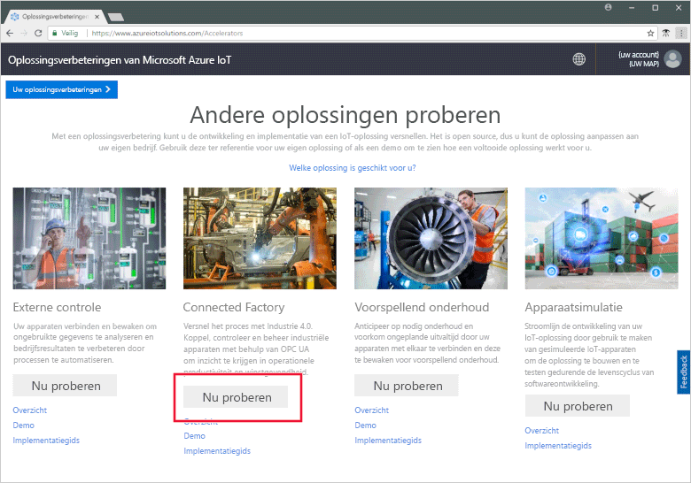

Voer op de pagina **Oplossing voor verbonden factory maken** een unieke **oplossingsnaam** in voor uw oplossingsversneller voor verbonden factory’s. Deze naam is de naam van de Azure-resourcegroep die alle resources van de oplossingsversnellerresources bevat. In deze snelstart wordt de naam **MyDemoConnectedFactory** gebruikt.

Selecteer het **Abonnement** en de **Regio** die u wilt gebruiken om de oplossingsverbetering te implementeren. U kiest meestal de regio die zich het meest in uw buurt bevindt. Voor deze snelstart gebruiken we **Visual Studio Enterprise** en **US - oost**. U moet een [globale beheerder of gebruiker](iot-accelerators-permissions.md) zijn in het abonnement.

Klik op **Maken** om de implementatie te starten. Het duurt minstens vijf minuten om dit proces uit te voeren:

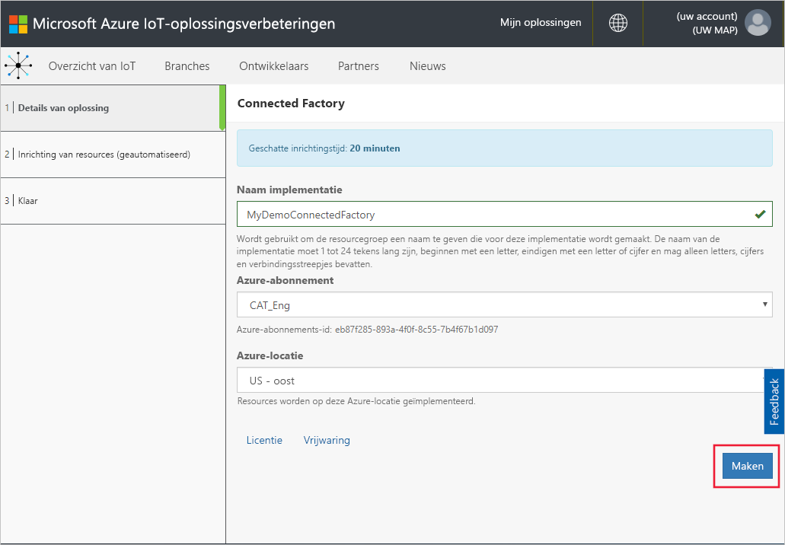

## Aanmelden bij de oplossing

Wanneer de implementatie in uw Azure-abonnement is voltooid, ziet u een groen vinkje en **Gereed** op de tegel staan. U kunt zich nu aanmelden bij het dashboard van de oplossingsversneller voor verbonden factory's.

Klik op de pagina **Ingerichte oplossingen** op de nieuwe oplossingsversneller voor verbonden factory's:

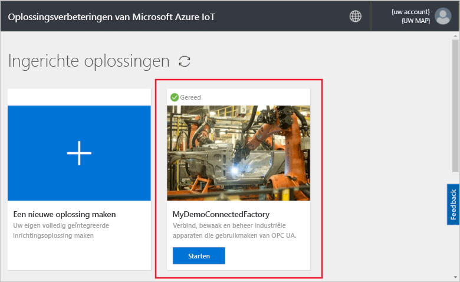

In het deelvenster dat wordt weergegeven, kunt u informatie bekijken over de oplossingsversneller voor Connected Factory. Kies **Ga naar uw oplossingsversneller** om uw oplossingsversneller voor Connected Factory weer te geven:

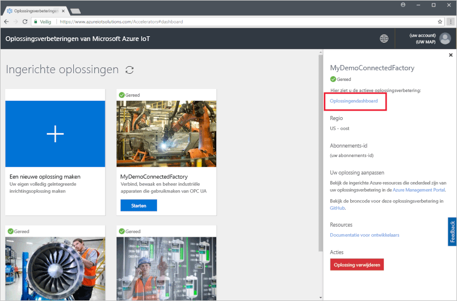

Klik op **Accepteren** om de machtigingsaanvraag te accepteren. Het oplossingsdashboard voor verbonden factory's wordt weergegeven in de browser. Er wordt een set gesimuleerde factory’s, productielijnen en stations weergegeven.

## Het dashboard weergeven

De standaardweergave is het *dashboard*. U kunt naar andere gebieden van de portal navigeren met het menu aan de linkerkant van de pagina:

[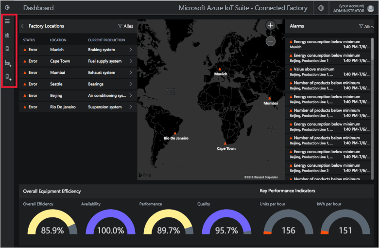](./media/quickstart-connected-factory-deploy/dashboard-expanded.png#lightbox)

U gebruikt het dashboard om uw industriële IoT-apparaten te beheren. Verbonden factory gebruikt een hiërarchie om een algemene factoryconfiguratie weer te geven. Het hoogste niveau van de hiërarchie is de onderneming die een of meer factory's bevat. Elke factory bevat productielijnen en elke productielijn bestaat uit stations. Op elk niveau kunt u OEE en KPI's weergeven, nieuwe knooppunten voor telemetrie publiceren en reageren op waarschuwingen.

Op het dashboard kunt u het volgende zien:

## Overall Equipment Efficiency

In het deelvenster **Overall Equipment Efficiency** worden de OEE-waarden weergegeven voor de hele onderneming of voor de factory, de productielijn of het station die/dat u bekijkt. Deze waarde wordt geaggregeerd van de stationsweergave naar het ondernemingsniveau. De OEE-gegevens en de bijbehorende elementen kunnen nader worden geanalyseerd.

[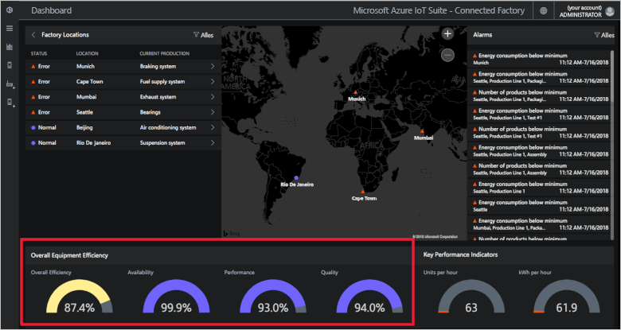](./media/quickstart-connected-factory-deploy/oee-expanded.png#lightbox)

De OEE bepaalt de efficiëntie van het productieproces met behulp van operationele parameters gerelateerd aan productie. OEE is een standaardmeeteenheid binnen de industrie die wordt berekend door de beschikbaarheidswaarde te vermenigvuldigen met de prestatiewaarde en de kwaliteitswaarde: OEE = beschikbaarheid x prestaties x kwaliteit.

Verder kunt u de OEE voor elk niveau in de hiërarchiegegevens analyseren. Klik op het percentage voor OEE, beschikbaarheid, prestaties of kwaliteit. Er wordt een contextvenster weergegeven met visualisaties die gegevens weergeven voor verschillende tijdschalen:

[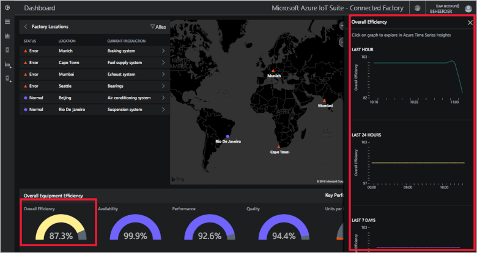](./media/quickstart-connected-factory-deploy/oeedetail-expanded.png#lightbox)

U kunt op een grafiek klikken om de gegevens verder te analyseren.

### Key Performance Indicators

In het venster **Key Performance Indicators** worden het aantal geproduceerde eenheden per uur en de energie (kWh) die wordt verbruikt door de hele onderneming of door de factory, de productielijn of het station die/dat u bekijkt weergegeven. Deze waarden worden geaggregeerd van de stationsweergave naar het ondernemingsniveau.

[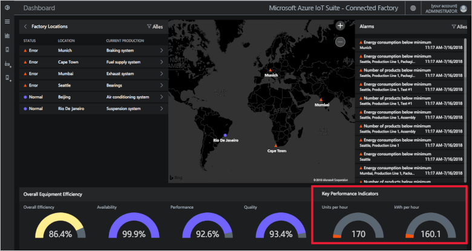](./media/quickstart-connected-factory-deploy/kpis-expanded.png#lightbox)

Verder kunt u de KPI’s voor elk niveau in de hiërarchiegegevens analyseren. Klik op het percentage voor OEE, beschikbaarheid, prestaties of kwaliteit. Er wordt een contextvenster weergegeven met visualisaties die gegevens weergeven voor verschillende tijdschalen:

[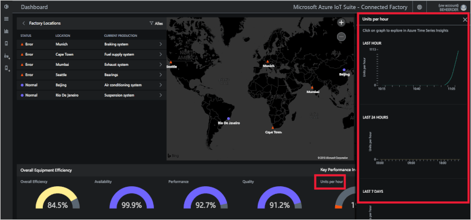](./media/quickstart-connected-factory-deploy/kpidetail-expanded.png#lightbox)

U kunt op een grafiek klikken om de gegevens verder te analyseren.

### Factory-locaties

Een paneel met een **factorylijst** waarin de status, locatie en huidige productieconfiguratie in de oplossing worden weergegeven. Wanneer u de oplossingsversneller voor het eerst uitvoert,wordt in het dashboard een gesimuleerde set met factory's weergegeven. De simulatie van elke productielijn bestaat uit drie echte OPC UA-servers die gesimuleerde taken uitvoeren en gegevens delen. Zie de [veelgestelde vragen over verbonden factory's](iot-accelerators-faq-cf.md) voor meer informatie over OPC UA:

[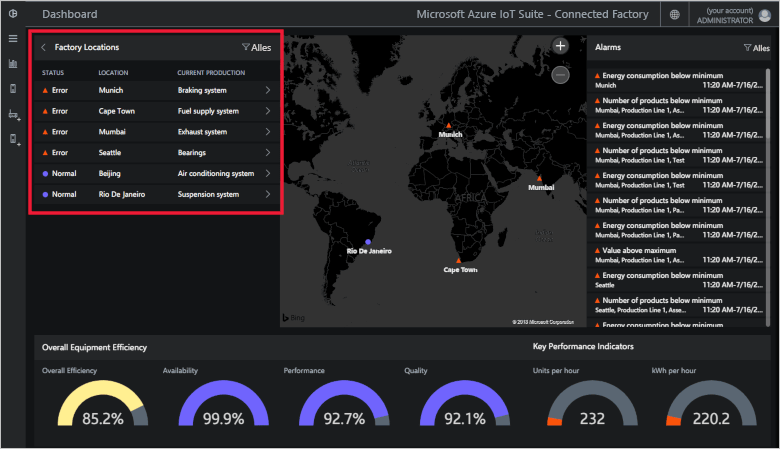](./media/quickstart-connected-factory-deploy/factorylocations-expanded.png#lightbox)

U kunt door de oplossingshiërarchie navigeren en waarden van de OEE en KPI's op elk niveau weergeven:

1. Klik in **Factorylijst** op **Mumbai**. U ziet de productielijnen op deze locatie.

1. Klik op **Productielijn 1**. U ziet de stations in deze productielijn.

1. Klik op **Verpakking**. U ziet de OPC UA-knooppunten die worden gepubliceerd door dit station.

1. Klik op **Energieverbruik**. U ziet enkele grafieken waarin deze waarde in verschillende tijdschalen is uitgezet. U kunt op een grafiek klikken om de gegevens verder te analyseren.

[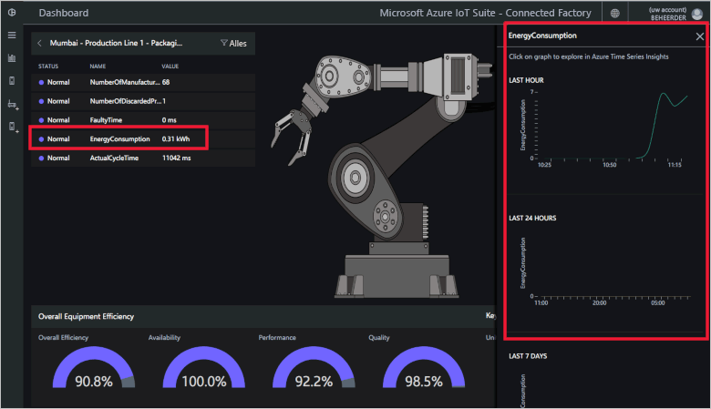](./media/quickstart-connected-factory-deploy/explorelocations-expanded.png#lightbox)

### Kaart

Als u met uw abonnement toegang hebt tot de [Bing Kaarten-API](iot-accelerators-faq-cf.md), wordt op de kaart *Factory's* de geografische locatie en de status van alle factory's in de oplossing weergegeven. Klik op de locaties op de kaart om in te zoomen op de locatiedetails.

[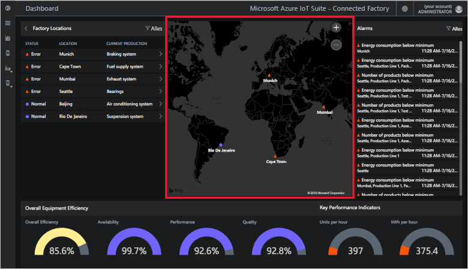](./media/quickstart-connected-factory-deploy/map-expanded.png#lightbox)

### Waarschuwingen

In het venster **Waarschuwingen** worden waarschuwingen weergegeven die worden gegenereerd wanneer een gemelde waarde of een berekende OEE-/KPI-waarde een drempelwaarde overschrijdt. In dit venster worden waarschuwingen van elk niveau van de hiërarchie weergegeven, van stationsniveau tot het gehele bedrijf. Elke waarschuwing bevat een beschrijving, datum, tijd, locatie en het aantal instanties:

[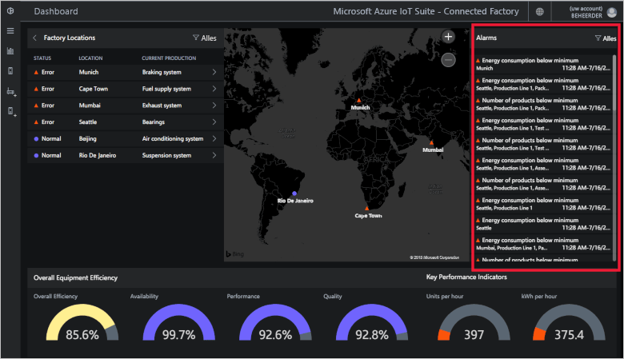](./media/quickstart-connected-factory-deploy/alarms-expanded.png#lightbox)

U kunt de gegevens die de waarschuwing hebben veroorzaakt vanuit het dashboard analyseren. Als u een beheerder bent, kunt u standaardacties uitvoeren voor de waarschuwingen, zoals:

* Sluit de waarschuwing.
* Accepteer de waarschuwing.

Klik op een van de waarschuwingen in de vervolgkeuzelijst **Kies een actie**, kies **Waarschuwing bevestigen** en klik vervolgens op **Toepassen**:

[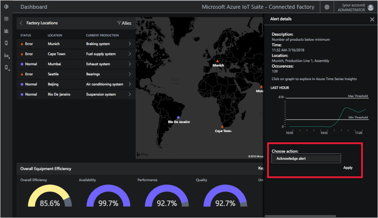](./media/quickstart-connected-factory-deploy/acknowledge-expanded.png#lightbox)

Klik op de grafiek in het paneel Waarschuwingen om de waarschuwingsgegevens verder te analyseren.

Deze waarschuwingen worden gegenereerd door regels die zijn opgegeven in een configuratiebestand in de oplossingsversneller. Deze regels kunnen waarschuwingen genereren wanneer de OEE- of KPI-gegevens of de waarden van het OPC UA-knooppunt de drempelwaarde overschrijden. U kunt deze drempelwaarde instellen.

## Resources opschonen

Laat de oplossingsversneller voor verbonden factory’s geïmplementeerd als u de functie nog meer wilt verkennen.

Als u de oplossingsversneller niet meer nodig hebt, verwijdert u deze op de pagina [Ingerichte oplossingen](https://www.azureiotsolutions.com/Accelerators#dashboard) door de oplossingsversneller te selecteren en op **Oplossing verwijderen** te klikken:

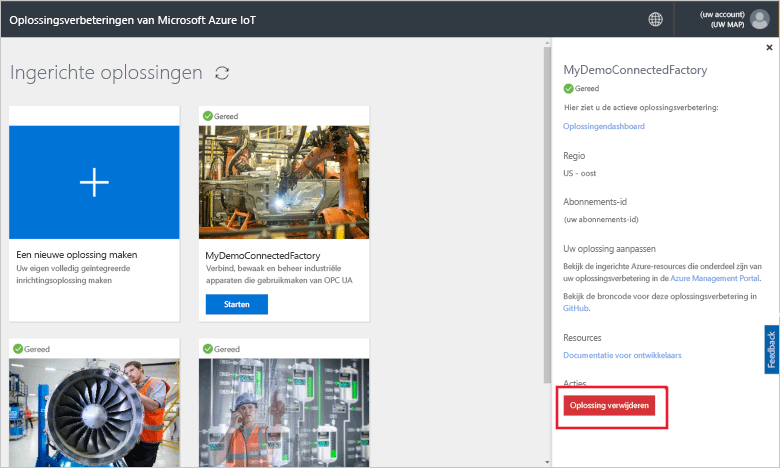

## Volgende stappen

In deze snelstart hebt u de oplossingsversneller voor verbonden factory’s geïmplementeerd en hebt geleerd hoe u kunt navigeren door uw factory's, productielijnen en stations. U hebt ook gezien hoe u de OEE en KPI-waarden op elk niveau in de hiërarchie kunt weergeven en kunt reageren op waarschuwingen.

Voor informatie over het gebruik van andere functies in het dashboard voor het beheren van uw industriële IoT-apparaten gaat u verder met de volgende handleiding:

> [!div class="nextstepaction"]
> [Het dashboard Verbonden factory gebruiken](iot-accelerators-connected-factory-dashboard.md)