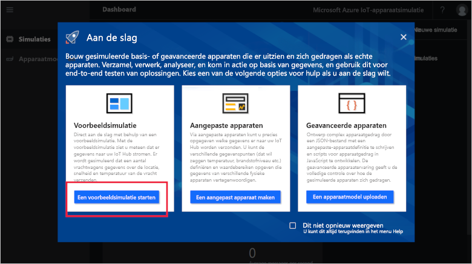
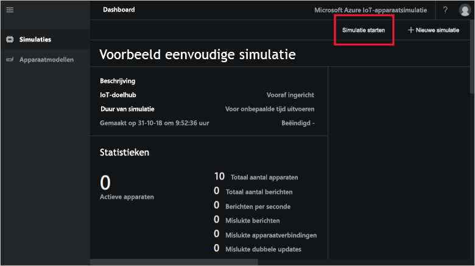
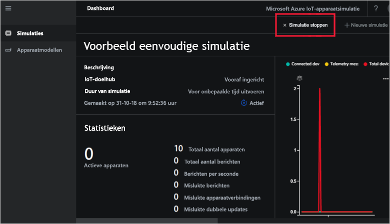

# Quickstart: een IoT-apparaatsimulatie in Azure implementeren en uitvoeren

Deze snelstart laat zien hoe u Azure IoT Apparaatsimulatie implementeert om uw IoT-oplossing te testen. Nadat u de oplossingsversneller hebt geïmplementeerd, voert u een voorbeeldsimulatie uit om aan de slag te gaan.

U hebt een actief Azure-abonnement nodig om deze snelstart te voltooien.

Als u nog geen abonnement op Azure hebt, maak dan een [gratis account](https://azure.microsoft.com/free/?WT.mc_id=A261C142F) aan voordat u begint.

## Apparaatsimulatie implementeren

Wanneer u Apparaatsimulatie implementeert in uw Azure-abonnement, moet u bepaalde configuratieopties instellen.

Meld u aan bij [azureiotsolutions.com](https://www.azureiotsolutions.com/Accelerators) met behulp van de referenties van uw Azure-account.

Klik op de tegel **Apparaatsimulatie**:

Klik op **Nu proberen** op de pagina waar Apparaatsimulatie wordt beschreven:

Voer een unieke **Oplossingsnaam** in op de pagina **Apparaatsimulatieoplossing maken**.

Selecteer het **Abonnement** en de **Regio** die u wilt gebruiken om de oplossingsverbetering te implementeren. U kiest meestal de regio die zich het meest in uw buurt bevindt. U moet een [globale beheerder of gebruiker](iot-accelerators-permissions.md) zijn in het abonnement.

Schakel het selectievakje in om een IoT-hub te implementeren voor gebruik met uw apparaatsimulatieoplossing. U kunt de IoT-hub die de simulatie gebruikt later altijd wijzigen.

Klik op **Maken** om uw oplossing in te richten. Het duurt minstens vijf minuten om dit proces uit te voeren:

## Aanmelden bij de oplossing

Wanneer het inrichtingsproces is voltooid, kunt u zich aanmelden bij uw instantie van Apparaatsimulatie door op de knop **Starten** te klikken:

Klik op **Accepteren** om de machtigingsaanvraag te accepteren. Het oplossingsdashboard voor apparaatsimulatie wordt weergegeven in de browser.

Bij eerste opening ziet u het Apparaatsimulatie-dashboard met een **Aan de slag**-handleiding. Klik op de eerste tegel om een voorbeeldsimulatie te openen. Als u de **Aan de slag**-handleiding sluit, kunt u de **Eenvoudige voorbeeldsimulatie** openen vanuit het dashboard door op de tegel ervan te klikken:

## Voorbeeldsimulatie

Omdat het een voorbeeldsimulatie is, kan deze niet worden bewerkt. De simulatie wordt geconfigureerd met de volgende instellingen:

| Instelling             | Value                       |
| ------------------- | --------------------------- |
| Doel-IoT-hub      | Vooraf ingerichte IoT-hub gebruiken |
| Apparaatmodel        | Truck                       |
| Aantal apparaten   | 10                          |
| Telemetriefrequentie | 10 seconden                  |
| Simulatieduur | Voor onbepaalde tijd uitvoeren            |

## De simulatie uitvoeren

Klik op **Simulatie starten**. Zoals geconfigureerd, wordt de simulatie voor onbepaalde tijd uitgevoerd. U kunt de simulatie op elk gewenst moment stoppen door te klikken op **Simulatie stoppen**. De simulatie toont de statistieken voor de huidige sessie.

U kunt slechts één simulatie tegelijk uitvoeren vanuit een Apparaatsimulatie-instantie.

## Resources opschonen

Laat Apparaatsimulatie geïmplementeerd als u nog meer wilt verkennen.

Als u Apparaatsimulatie niet langer nodig hebt, verwijdert u deze van de pagina [Ingerichte oplossingen](https://www.azureiotsolutions.com/Accelerators#dashboard) door op de tegel te klikken en vervolgens op **Oplossing verwijderen** te klikken:

## Volgende stappen

In deze snelstart hebt u Apparaatsimulatie geïmplementeerd en een voorbeeld-IoT-simulatie uitgevoerd.

> [!div class="nextstepaction"]
> [Een simulatie maken met een of meer apparaattypen](iot-accelerators-device-simulation-create-simulation.md)