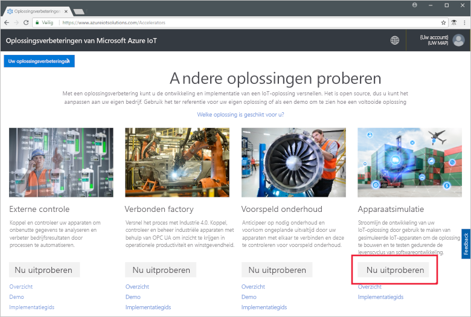
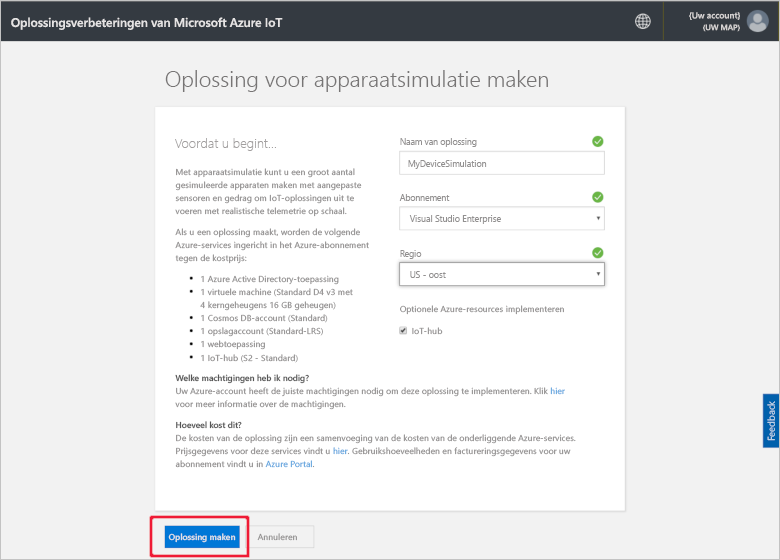
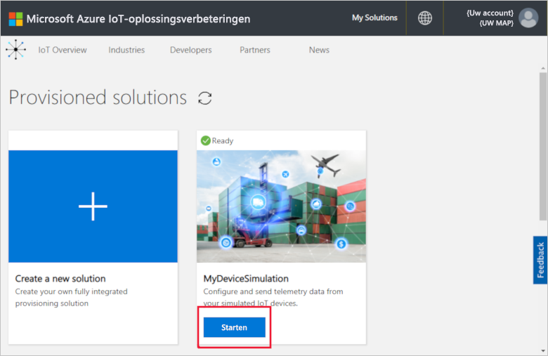
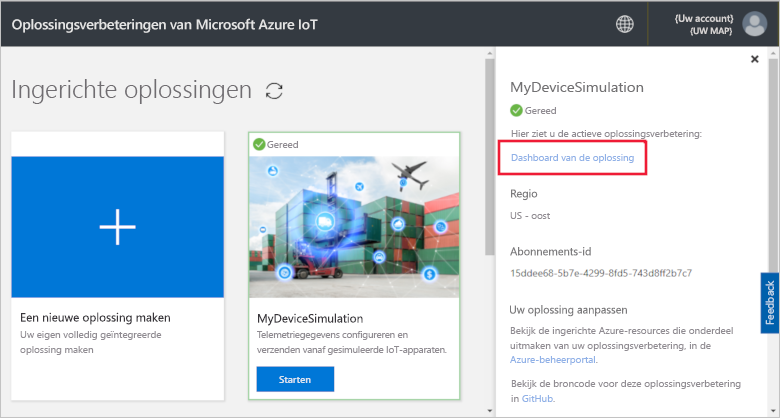
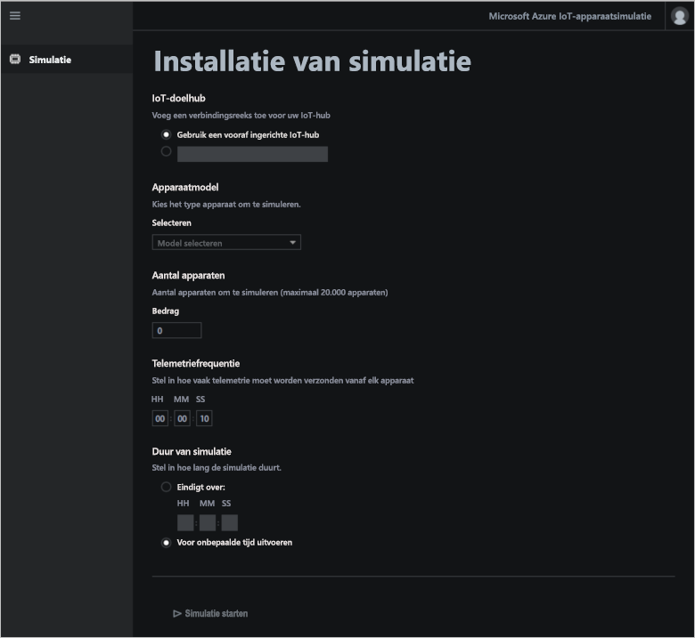
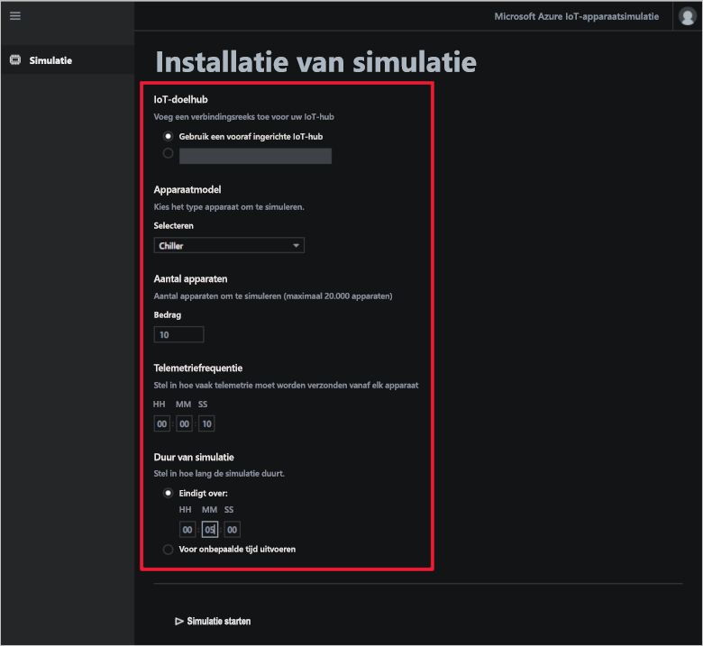
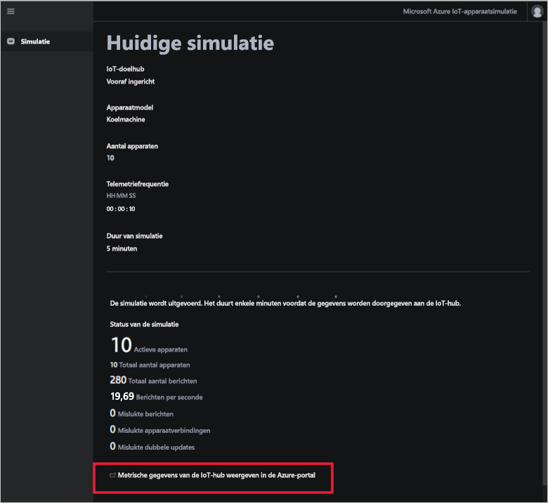
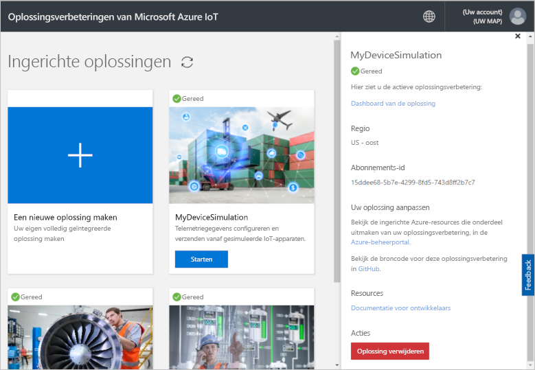

# Snelstart: Een cloudoplossing voor apparaatsimulatie implementeren en uitvoeren

In deze snelstart leert u een oplossingsverbetering voor apparaatsimulatie in Azure IoT implementeren om uw IoT-oplossing mee te testen. Nadat u de oplossingsverbetering hebt geïmplementeerd, gebruikt u de pagina **Simulatie** om een simulatie te maken en uit te voeren.

U hebt een actief Azure-abonnement nodig om deze snelstart te voltooien.

Als u nog geen abonnement op Azure hebt, maak dan een [gratis account](https://azure.microsoft.com/free/?WT.mc_id=A261C142F) aan voordat u begint.

## De oplossing implementeren

Wanneer u de oplossingsverbetering implementeert in uw Azure-abonnement, moet u bepaalde configuratieopties instellen.

Meld u aan bij [azureiotsolutions.com](https://www.azureiotsolutions.com/Accelerators) met behulp van de referenties van uw Azure-account.

Klik op **Nu proberen** op de tegel **Apparaatsimulatie**.

Voer een unieke **Oplossingsnaam** in op de pagina **Apparaatsimulatieoplossing maken**. Noteer de oplossingsnaam, dit is de naam van de Azure-resourcegroep die alle resources van de oplossing bevat.

Selecteer het **Abonnement** en de **Regio** die u wilt gebruiken om de oplossingsverbetering te implementeren. U kiest meestal de regio die zich het meest in uw buurt bevindt. U moet een [globale beheerder of gebruiker](iot-accelerators-permissions.md) zijn in het abonnement.

Schakel het selectievakje in om een IoT-hub te implementeren voor gebruik met uw apparaatsimulatieoplossing. U kunt de IoT-hub die de simulatie gebruikt later altijd wijzigen.

Klik op **Oplossing maken** om uw oplossing in te richten. Het duurt minstens vijf minuten om dit proces uit te voeren:

## Aanmelden bij de oplossing

Wanneer het inrichtingsproces is voltooid, kunt u zich aanmelden bij het dashboard van uw oplossingsverbetering voor apparaatsimulatie.

Klik op de pagina **Ingerichte oplossingen** op de nieuwe oplossingsverbetering voor apparaatsimulatie:

In het deelvenster dat wordt weergegeven, kunt u informatie bekijken over de oplossingsverbetering voor apparaatsimulatie. Kies **Oplossingsdashboard** om de oplossingsverbetering voor apparaatsimulatie weer te geven:

Klik op **Accepteren** om de machtigingsaanvraag te accepteren. Het oplossingsdashboard voor apparaatsimulatie wordt weergegeven in de browser:

## De simulatie configureren

U kunt een simulatie configureren en uitvoeren vanuit het dashboard. Gebruik de waarden in de volgende tabel om uw simulatie te configureren:

| Instelling             | Waarde                       |
| ------------------- | --------------------------- |
| Doel-IoT-hub      | Vooraf ingerichte IoT-hub gebruiken |
| Apparaatmodel        | Koelunit                     |
| Aantal apparaten   | 10                          |
| Telemetriefrequentie | 10 seconden                  |
| Simulatieduur | 5 minuten                   |

## De simulatie uitvoeren

Klik op **Simulatie starten**. De simulatie wordt uitgevoerd voor de duur die u hebt gekozen. U kunt de simulatie op elk gewenst moment stoppen door te klikken op **Simulatie stoppen**. De simulatie toont de statistieken voor de huidige sessie. Klik op **Metrische IoT Hub-gegevens weergeven in Azure Portal** om de metrische gegevens weer te geven die de IoT-hub rapporteert:

U kunt met een ingerichte exemplaar van de oplossingsverbetering slechts één simulatie tegelijk uitvoeren.

## Resources opschonen

Laat de oplossingsversneller voor apparaatsimulatie geïmplementeerd als u de functie nog meer wilt verkennen.

Als u de oplossingsverbetering niet meer nodig hebt, verwijdert u deze op de pagina [Ingerichte oplossingen](https://www.azureiotsolutions.com/Accelerators#dashboard) door de oplossingsverbetering te selecteren en op **Oplossing verwijderen** te klikken:

## Volgende stappen

In deze snelstart hebt u de oplossingsverbetering voor apparaatsimulatie geïmplementeerd en een simulatie van een IoT-apparaat uitgevoerd.

Raadpleeg voor meer informatie over het gebruik van een bestaande IoT Hub in een simulatie de volgende handleiding:

> [!div class="nextstepaction"]
> [Een bestaande IoT-hub gebruiken met de oplossingsverbetering voor apparaatsimulatie](iot-accelerators-device-simulation-choose-hub.md)
