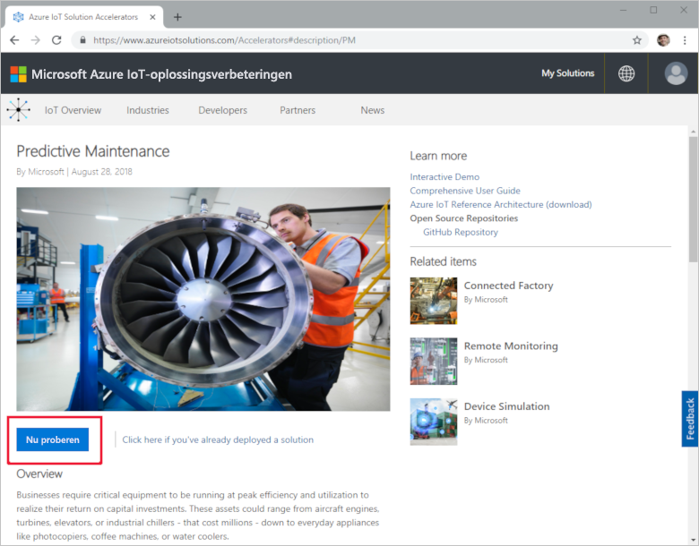
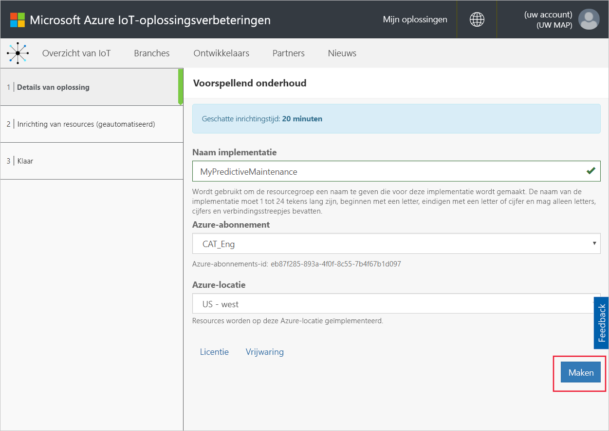
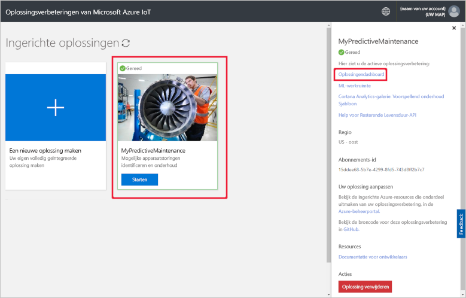
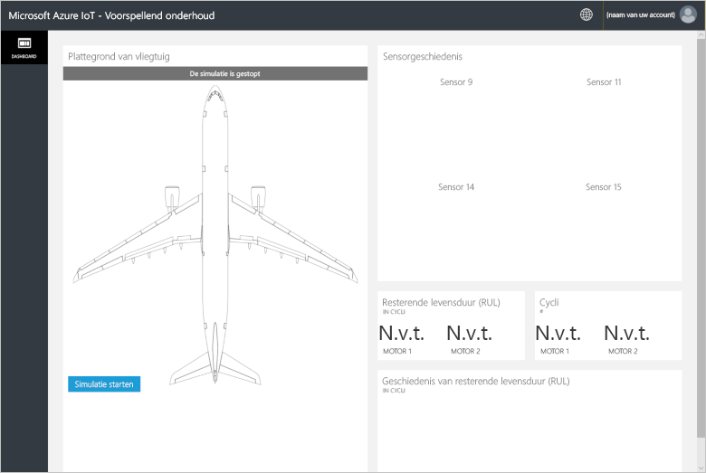
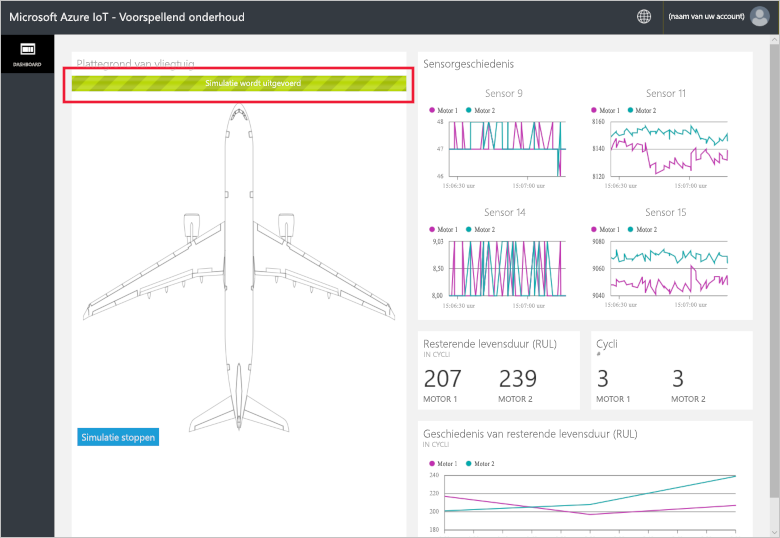
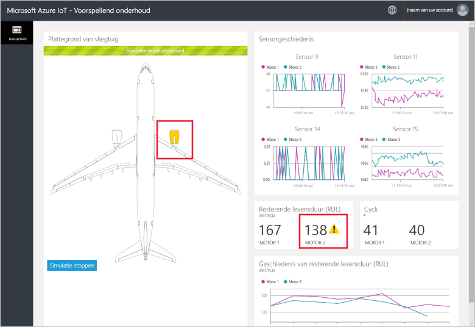
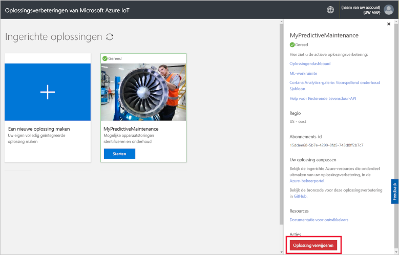

# Snelstart: Een cloudoplossing implementeren om een analyse voor predictief onderhoud uit te voeren op mijn verbonden apparaten

In deze snelstart ziet u hoe u de Azure Iot-oplossingsverbetering voor predictief onderhoud implementeert en deze gebruikt als cloudoplossing voor voorspeld onderhoud van uw IoT-apparaten. Nadat u de oplossingsverbetering hebt geïmplementeerd, gebruikt u de pagina **Oplossingsdashboard** om een simulatie uit te voeren met behulp van gegevens over vliegtuigmotoren.

Fabrikam is een regionale luchtvaartmaatschappij die zich toelegt op het leveren van een uitstekende klantervaring tegen concurrerende prijzen. Een oorzaak van vertragingen zijn onderhoudsproblemen, waarbij het onderhoud van vliegtuigmotoren een bijzondere uitdaging vormt. Motorproblemen tijdens de vlucht moeten koste wat kost worden voorkomen. Fabrikam inspecteert om die reden regelmatig de motoren en volgt een planning voor het plegen van onderhoud. Vliegtuigmotoren slijten echter niet allemaal even snel. Er wordt onnodig onderhoud uitgevoerd op motoren. En wat belangrijker is, er doen zich soms problemen voor die ervoor zorgen dat een vliegtuig aan de grond moet blijven totdat het onderhoud gereed is. Deze problemen kunnen erg kostbaar zijn, in het bijzonder als een vliegtuig zich op een locatie bevindt waar de juiste technici of onderdelen niet beschikbaar zijn.

De motoren van de vliegtuigen van Fabrikam zijn uitgerust met sensoren die de toestand van de motor tijdens de vlucht in de gaten houden. Na jarenlang operationele gegevens van engines te hebben verzameld, hebben de gegevensanalisten van Fabrikam een model ontwikkeld waarmee ze de nog resterende bruikbare levensduur van een vliegtuigmotor kunnen voorspellen. Het model gebruikt een correlatie tussen gegevens van vier van de motorsensoren en de slijtage van de motor die uiteindelijk tot problemen leidt. Hoewel Fabrikam doorgaat met de regelmatige inspecties om de veiligheid te garanderen, kan het bedrijf nu de modellen gebruiken om na elke vlucht de resterende bruikbare levensduur van elke motor te berekenen. Fabrikam kan nu toekomstige probleempunten voorspellen en onderhoud plannen om de tijd die vliegtuigen aan de grond staan te minimaliseren en de operationele kosten te verlagen, terwijl tegelijkertijd de veiligheid van de passagiers en bemanning wordt gegarandeerd.

## Vereisten

U hebt een actief Azure-abonnement nodig om deze snelstart te voltooien.

Als u nog geen abonnement op Azure hebt, maak dan een [gratis account](https://azure.microsoft.com/free/?WT.mc_id=A261C142F) aan voordat u begint.

## De oplossing implementeren

Wanneer u de oplossingsverbetering implementeert in uw Azure-abonnement, moet u bepaalde configuratieopties instellen.

Meld u aan bij [azureiotsolutions.com](https://www.azureiotsolutions.com/Accelerators) met behulp van de referenties van uw Azure-account.

Selecteer **Nu proberen** op de tegel **Predictief onderhoud**.

Voer op de pagina **Oplossing voor predictief onderhoud maken** een unieke **Oplossingsnaam** in voor de oplossingsverbetering voor predictief onderhoud.

Selecteer het **Abonnement** en de **Regio** die u wilt gebruiken om de oplossingsverbetering te implementeren. U kiest meestal de regio die zich het meest in uw buurt bevindt. U moet een [globale beheerder of gebruiker](iot-accelerators-permissions.md) zijn in het abonnement.

Klik op **Oplossing maken** om de implementatie te starten. Het duurt minstens vijf minuten om dit proces uit te voeren:

## Aanmelden bij de oplossing

Zodra de implementatie in uw Azure-abonnement is voltooid, kunt u zich aanmelden bij het dashboard van de oplossingsverbetering voor predictief onderhoud.

Klik op de pagina **Ingerichte oplossingen** op de nieuwe oplossingsverbetering voor predictief onderhoud. In het deelvenster dat wordt weergegeven, kunt u informatie bekijken over de oplossingsverbetering. Kies **Oplossingsdashboard** om de oplossingsverbetering voor predictief onderhoud weer te geven:

Klik op **Accepteren** om de machtigingsaanvraag te accepteren. Het oplossingsdashboard voor predictief onderhoud wordt weergegeven in de browser:

Klik op **Simulatie starten** om te beginnen met de simulatie. Het dashboard wordt ingevuld met de sensorgeschiedenis, de resterende levensduur, de cycli en de geschiedenis van de resterende levensduur:

Wanneer de resterende levensduur minder dan 160 is (een willekeurige drempelwaarde gekozen ter illustratie), verschijnt in de oplossingsportal een waarschuwingssymbool naast de weergegeven resterende levensduur. De oplossingsportal geeft ook de vliegtuigmotor geel gemarkeerd weer. Zoals u merkt, vertonen de waarden van de resterende levensduur een algemene neerwaartse trend, maar stijgen en dalen die waarden vaak. Dit gedrag wordt veroorzaakt door de verschillende lengten van de cycli en de nauwkeurigheid van het model.

Het duurt ongeveer 35 minuten voordat de volledige simulatie 148 cycli heeft voltooid. Na ongeveer 5 minuten wordt voor het eerst de drempelwaarde van 160 voor de resterende levensduur bereikt. De drempelwaarde voor beide motoren wordt na ongeveer 8 minuten bereikt.

De simulatie wordt uitgevoerd voor de volledige gegevensset voor 148 cycli en bepaalt dan het eindresultaat voor de resterende levensduur en het aantal cycli.

U kunt de simulatie op elk punt stoppen, maar wanneer u op **Simulatie starten** klikt, wordt de simulatie opnieuw vanaf het begin van de gegevensset uitgevoerd.

## Resources opschonen

Laat de oplossingsversneller voor predictief onderhoud geïmplementeerd als u de functie nog meer wilt verkennen.

Als u de oplossingsverbetering niet meer nodig hebt, verwijdert u deze op de pagina [Ingerichte oplossingen](https://www.azureiotsolutions.com/Accelerators#dashboard):

## Volgende stappen

In deze snelstart hebt u de oplossingsverbetering voor predictief onderhoud geïmplementeerd en een simulatie uitgevoerd.

Zie het artikel voor meer informatie over de oplossingsverbetering.

> [!div class="nextstepaction"]
> [Een overzicht van de oplossingsversneller voor Predictief onderhoud](iot-accelerators-predictive-walkthrough.md)
