# Quickstart: een cloudoplossing voor bewaking op afstand proberen

In deze snelstart ziet u hoe u de Azure IoT-oplossingsverbetering voor externe controle implementeert. In deze cloudoplossing gebruikt u de pagina **Dashboard** om gesimuleerde apparaten te visualiseren in een kaart, en de pagina **Onderhoud** om te reageren op een waarschuwing van een gesimuleerde koelunit. U kunt deze oplossingsverbetering gebruiken als uitgangspunt voor uw eigen implementatie of als leermiddel.

Met de eerste implementatie wordt de oplossingsverbetering geconfigureerd voor een bedrijf met de naam Contoso. Als operator bij Contoso beheert u een selectie met verschillende typen apparaten, zoals koelunits, geïmplementeerd in verschillende fysieke omgevingen. Vanaf een koelunit worden telemetriegegevens over de temperatuur, vochtigheid en druk verzonden naar de oplossingsverbetering voor externe controle.

U hebt een actief Azure-abonnement nodig om deze snelstart te voltooien.

Als u nog geen abonnement op Azure hebt, maak dan een [gratis account](https://azure.microsoft.com/free/?WT.mc_id=A261C142F) aan voordat u begint.

## De oplossing implementeren

Wanneer u de oplossingsverbetering implementeert in uw Azure-abonnement, moet u bepaalde configuratieopties instellen.

Meld u aan bij [azureiotsolutions.com](https://www.azureiotsolutions.com/Accelerators) met behulp van de referenties van uw Azure-account.

Klik op de tegel **Externe bewaking**. Klik op de pagina **Externe bewaking**  op **Nu proberen**:

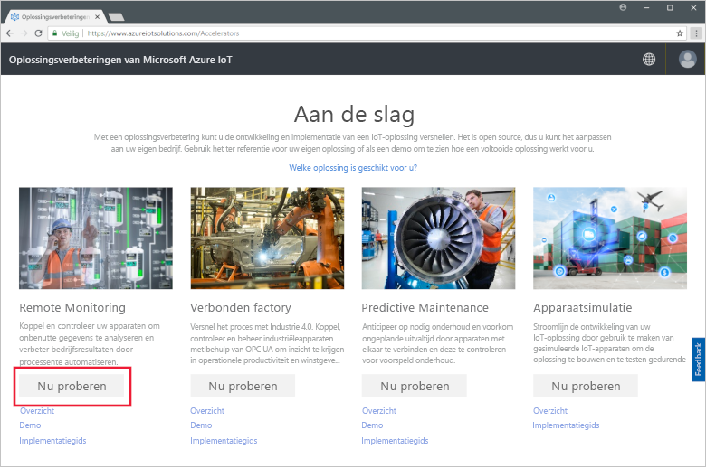

Selecteer een **basisimplementatie** op de pagina **Oplossing voor externe controle maken**. Als u de oplossingsverbetering implementeert om te leren hoe deze werkt of om een demonstratie uit te voeren, kiest u de optie **Basis** om de kosten te minimaliseren.

Kies **.NET** als de taal. De Java- en .NET-implementaties hebben dezelfde functies.

Voer een unieke **Oplossingsnaam** in voor de oplossingsverbetering voor externe controle. Voor deze quickstart noemen we die van ons **contoso-rm**.

Selecteer het **Abonnement** en de **Regio** die u wilt gebruiken om de oplossingsverbetering te implementeren. U kiest meestal de regio die zich het meest in uw buurt bevindt. Voor deze quickstart maken we gebruik van **US - oost**.
U kunt **Visual Studio Enterprise** kiezen, maar u moet een [globale beheerder of gebruiker](iot-accelerators-permissions.md) zijn om dit te doen.

Klik op **Oplossing maken** om de implementatie te starten. Het duurt minstens vijf minuten om dit proces uit te voeren:

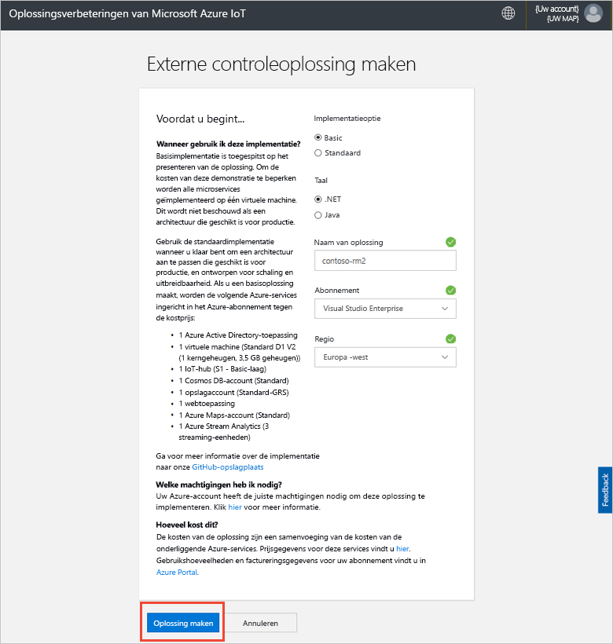

## Aanmelden bij de oplossing

Wanneer de implementatie in uw Azure-abonnement is voltooid, ziet u een groen vinkje en **Gereed** op de tegel staan. U kunt zich nu aanmelden bij het dashboard van de oplossingsverbetering voor externe controle.

Klik op de pagina **Ingerichte oplossingen** op de nieuwe oplossingsverbetering voor externe controle:

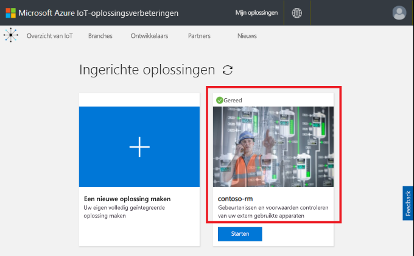

In het deelvenster dat wordt weergegeven, kunt u informatie bekijken over de oplossingsverbetering voor externe controle. Kies **Oplossingsdashboard** om de oplossingsverbetering voor externe controle weer te geven:

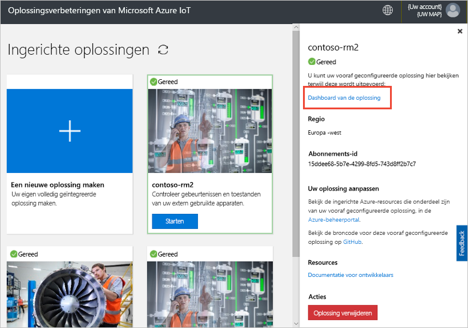

Klik op **Accepteren** om de machtigingsaanvraag te accepteren. Het oplossingsdashboard voor externe controle wordt weergegeven in de browser:

[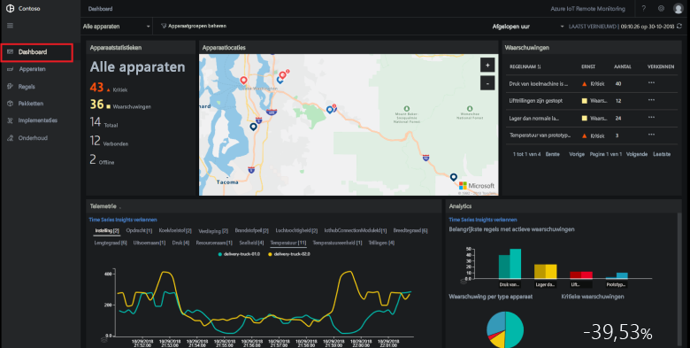](./media/quickstart-remote-monitoring-deploy/solutiondashboard-expanded.png#lightbox)

## Uw apparaten weergeven

Op het oplossingsdashboard wordt de volgende informatie weergegeven over de gesimuleerde apparaten van Contoso:

* In het paneel **Apparaatstatistieken** worden samenvattingsgegevens weergegeven over de waarschuwingen en het totale aantal apparaten. In de standaardimplementatie heeft Contoso 10 gesimuleerde apparaten van verschillende typen.

* In het paneel **Apparaatlocaties** wordt weergegeven waar uw apparaten zich fysiek bevinden. Aan de kleur van de pin ziet u wanneer op het apparaat een waarschuwing optreedt.

* In het paneel **Waarschuwingen** worden de details over waarschuwingen van uw apparaten weergegeven.

* In het paneel **Telemetrie** worden de telemetriegegevens van uw apparaten weergegeven. U kunt verschillende telemetriestromen weergeven door bovenaan op de telemetrietypen te klikken.

* In het paneel **Analyse** wordt gecombineerde informatie weergegeven over de waarschuwingen van uw apparaten.

## Reageren op een gebeurtenis

Als operator bij Contoso kunt u uw apparaten controleren vanaf het oplossingsdashboard. In het deelvenster **Apparaatstatistieken** ziet u dat er een aantal kritieke waarschuwingen is opgetreden. In het deelvenster **Waarschuwingen** ziet u dat de meeste van deze waarschuwingen afkomstig zijn van een koelunit. Voor koelunits van Contoso geeft een interne druk van meer dan 250 PSI aan dat het apparaat niet naar behoren werkt.

### Het probleem identificeren

Op de **Dashboardpagina**, in het deelvenster **Waarschuwingen**, ziet u de waarschuwing: **Druk van koelunit te hoog**. De koelunit heeft een rode pin op de kaart (mogelijk moet u de kaart pannen en zoomen):

[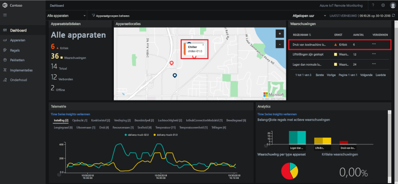](./media/quickstart-remote-monitoring-deploy/dashboardalarm-expanded.png#lightbox)

Klik in het deelvenster **Waarschuwingen**, in de kolom **Verkennen** naast de regel **Druk van koelunit te hoog** op **...**. Hiermee wordt u naar de **Onderhoudspagina** geleid waar u de details kunt bekijken van de regel op basis waarvan de waarschuwing is geactiveerd.

Op de onderhoudspagina **Druk van koelunit te hoog** worden details weergegeven van de regel op basis waarvan de waarschuwingen zijn geactiveerd. Op deze pagina wordt ook vermeld wanneer de waarschuwingen hebben plaatsgevonden en voor welk apparaat ze zijn geactiveerd:

[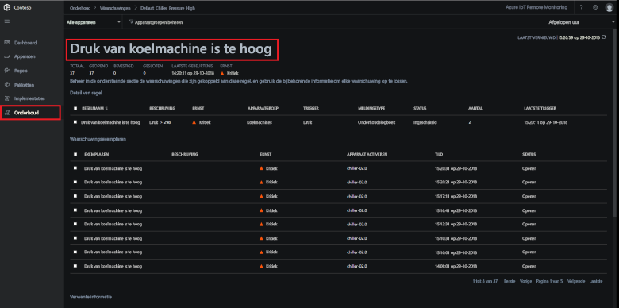](./media/quickstart-remote-monitoring-deploy/maintenancealarmlist-expanded.png#lightbox)

U hebt het probleem waardoor de waarschuwing is geactiveerd, en het bijbehorende apparaat nu geïdentificeerd. De volgende stap voor u als operator is om de waarschuwing te accepteren en het probleem op te lossen.

### Het probleem oplossen

Als u andere operators wilt laten weten dat u bezig bent met de waarschuwing, selecteert u deze en wijzigt u de **Waarschuwingsstatus** in **Geaccepteerd**:

[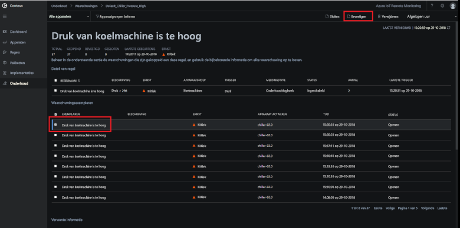](./media/quickstart-remote-monitoring-deploy/maintenanceacknowledge-expanded.png#lightbox)

De waarde in de statuskolom wordt gewijzigd in **Geaccepteerd**.

Als u wilt reageren op de koelunit, schuift u omlaag naar **Verwante informatie**, selecteert u de koelunit in de lijst **Gewaarschuwde apparaten** en kiest u vervolgens **Taken**:

[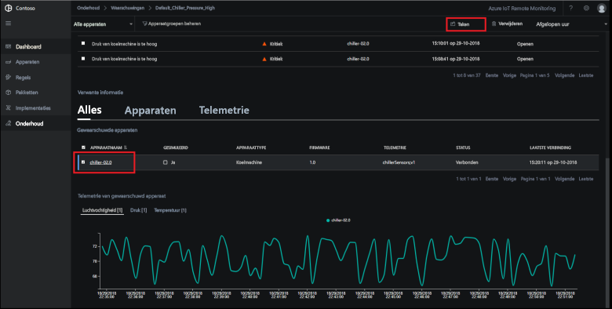](./media/quickstart-remote-monitoring-deploy/maintenanceschedule-expanded.png#lightbox)

Kies in het deelvenster **Taken** de optie **Methode uitvoeren** en vervolgens de methode **EmergencyValveRelease**. Voeg de taaknaam **ChillerPressureRelease** toe en klik op **Toepassen**. Met deze instellingen wordt een taak voor u gemaakt die onmiddellijk wordt uitgevoerd.

Als u de taakstatus wilt bekijken, gaat u terug naar de **Onderhoudspagina** en bekijkt u de lijst met taken in de weergave **Taken**. Mogelijk moet u een aantal seconden wachten voordat u ziet dat de taak wordt uitgevoerd voor het verlichten van de druk op de kleppen van de koelunit:

[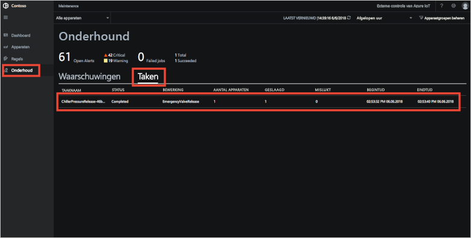](./media/quickstart-remote-monitoring-deploy/maintenancerunningjob-expanded.png#lightbox)

### Controleren of de druk weer normaal is

Als u de druktelemetrie voor de koelunit wilt bekijken, gaat u naar de **Dashboardpagina**, selecteert u **Druk** in het deelvenster Telemetrie, en kijkt u of de druk voor **koelunit-02.0** weer normaal is:

[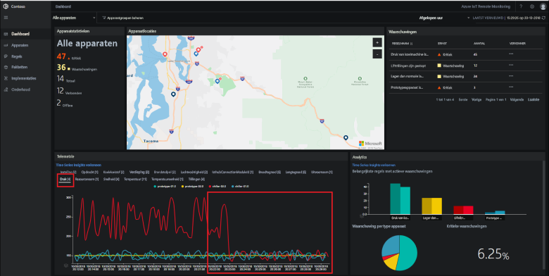](./media/quickstart-remote-monitoring-deploy/pressurenormal-expanded.png#lightbox)

Als u het incident wilt sluiten, gaat u naar de **Onderhoudspagina**, selecteert u de waarschuwing en stelt u de status in op **Gesloten**:

[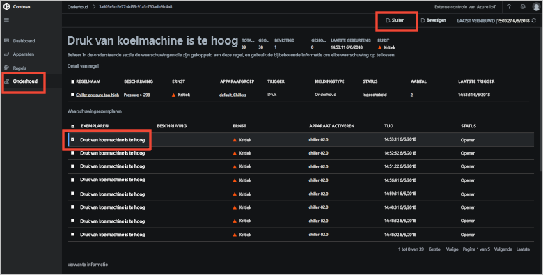](./media/quickstart-remote-monitoring-deploy/maintenanceclose-expanded.png#lightbox)

De waarde in de statuskolom wordt gewijzigd in **Gesloten**.

## Resources opschonen

Als u van plan bent verder te gaan met de zelfstudies, laat u de oplossingsverbetering voor externe controle geïmplementeerd.

Als u de oplossingsverbetering niet meer nodig hebt, verwijdert u deze op de pagina [Ingerichte oplossingen](https://www.azureiotsolutions.com/Accelerators#dashboard) door de oplossingsverbetering te selecteren en op **Oplossing verwijderen** te klikken:

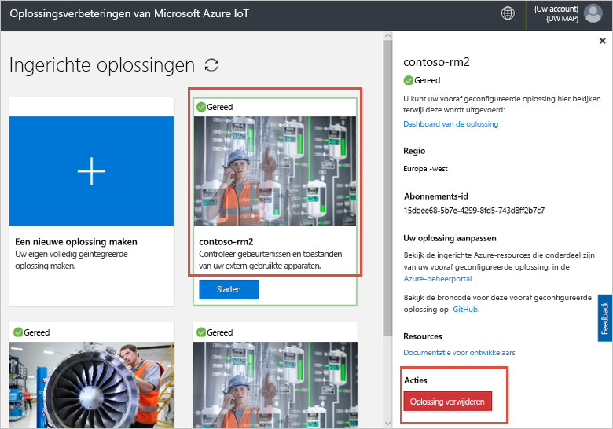

## Volgende stappen

In de snelstart hebt u de oplossingsverbetering voor externe controle geïmplementeerd en een controletaak voltooid met behulp van gesimuleerde apparaten in de Contoso-standaardimplementatie.

Ga verder naar de volgende zelfstudie voor meer informatie over de oplossingsverbetering die gebruikmaakt van gesimuleerde apparaten.

> [!div class="nextstepaction"]
> [Zelfstudie: uw IoT-apparaten bewaken](iot-accelerators-remote-monitoring-monitor.md)