# Kennismaking met de (opnieuw ontworpen) gebruikersinterface van Azure IoT Central

In dit artikel maakt u kennis met de gebruikersinterface van Microsoft Azure IoT Central. U kunt de gebruikersinterface gebruiken om een Azure IoT Central-oplossing te maken en de daarmee verbonden apparaten te beheren en gebruiken.

Als _maker_ gebruikt u de gebruikersinterface van Azure IoT Central om uw Azure IoT Central-oplossing te definiëren. U kunt de gebruikersinterface gebruiken om:

- De typen apparaten te definiëren die met uw oplossing verbinding maken.
- De regels en acties voor uw apparaten te configureren.
- De gebruikersinterface aan te passen voor een _operator_ die uw oplossing gebruikt.

Als _operator_ gebruikt u de gebruikersinterface van Azure IoT Central om uw Azure IoT Central-oplossing te beheren. U kunt de gebruikersinterface gebruiken om:

- Uw apparaten te controleren.
- Uw apparaten te configureren.
- Problemen met uw apparaten op te lossen.
- Nieuwe apparaten inrichten.

[!INCLUDE [iot-central-experimental-note](../../includes/iot-central-experimental-note.md)]

## Gebruik het linkernavigatiemenu

Gebruik het linkernavigatiemenu om toegang te krijgen tot de verschillende gebieden van de toepassing:

| Menu | Beschrijving |
| ---- | ----------- |
| 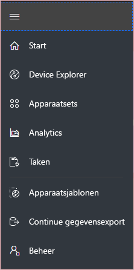 | <ul><li>De knop **Start** geeft de startpagina van uw toepassing weer. Als maker kunt u de startpagina voor uw operators aanpassen.</li><li>Met de knop **Device Explorer** ziet u een lijst met de gesimuleerde en echte apparaten die aan elke apparaatsjabloon in de toepassing zijn gekoppeld. Als operator gebruikt u de **Device Explorer** om uw verbonden apparaten te beheren.</li><li>Met de knop **Apparaatsets** kunt u apparaatsets bekijken en maken. Als operator kunt u de apparaatsets maken als een logische verzameling apparaten die door een query wordt gespecificeerd.</li><li>Met de knop **Analyse** worden analytische gegevens weergegeven die zijn afgeleid van telemetriegegevens van apparaten en apparaatsets. Als operator kunt u uw apparaatgegevens aangepast weergeven voor meer inzicht in uw toepassing.</li><li>De knop **Taken** schakelt bulksgewijs beheer van apparaten doordat u taken kunt maken en uitvoeren voor het uitvoeren van updates op schaal.</li><li>De knop **Apparaatsjablonen** geeft de hulpprogramma's weer die een opbouwfunctie gebruikt om apparaatsjablonen te maken en beheren.</li><li>Met de knop **Continue gegevensexport** kan een beheerder een continue export configureren naar andere Azure-services zoals opslag en wachtrijen.</li><li>Met de knop **Beheer** worden de beheerpagina's van de toepassing weergegeven waar een administrator de instellingen, gebruikers en rollen van een toepassing kan beheren.</li></ul> |

## Zoeken, hulp en ondersteuning

Het bovenste menu wordt op elke pagina weergegeven:

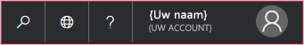

- Als u wilt zoeken naar apparaatsjablonen en apparaten, kiest u het **Zoek**-pictogram.
- Als u de taal van de gebruikersinterface wilt wijzigen, kiest u het pictogram **Taal**.
- Als u hulp en ondersteuning nodig hebt, kiest u het keuzemenu **Help** voor een lijst met bronnen.
- Als u het thema van de gebruikersinterface wilt veranderen of u wilt afmelden bij de toepassing, kiest u het **Account**-pictogram.

Voor de gebruikersinterface kunt u kiezen tussen een licht thema of een donker thema:

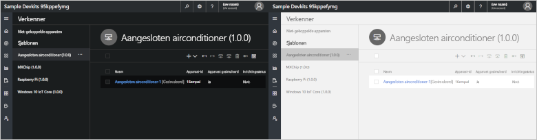

## Startpagina

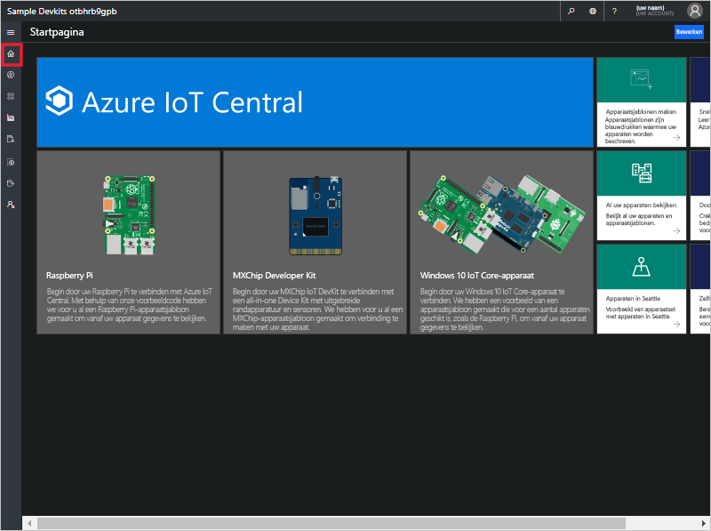

De startpagina is de eerste pagina die u ziet als u zich aanmeldt bij uw Azure IoT Central-toepassing. Als maker kunt u de startpagina voor andere gebruikers van de toepassing aanpassen door tegels toe te voegen. Raadpleeg voor meer informatie de zelfstudie [Customize the Azure IoT Central operator's view](tutorial-customize-operator-experimental.md?toc=/azure/iot-central-experimental/toc.json&bc=/azure/iot-central-experimental/breadcrumb/toc.json) (De operatorweergave van Azure IoT Central aanpassen).

## Device Explorer

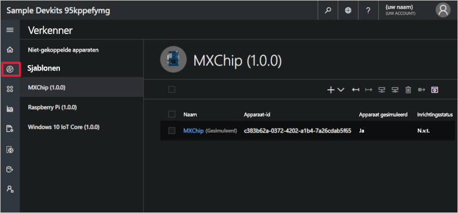

Op de Device Explorer-pagina worden de _apparaten_ in uw Azure IoT Central-toepassing gegroepeerd weergegeven op _apparaatsjabloon_.

* Met een apparaatsjabloon wordt een type apparaat gedefinieerd dat met uw toepassing verbinding kan maken. Raadpleeg voor meer informatie de zelfstudie [Define a new device type in your Azure IoT Central application](tutorial-define-device-type-experimental.md?toc=/azure/iot-central-experimental/toc.json&bc=/azure/iot-central-experimental/breadcrumb/toc.json) (Een nieuw apparaattype definiëren in uw Azure IoT Central-toepassing).
* Een apparaat vertegenwoordigt een echt of een gesimuleerd apparaat in uw toepassing. Raadpleeg voor meer informatie de zelfstudie [Add a new device to your Azure IoT Central application](tutorial-add-device-experimental.md?toc=/azure/iot-central-experimental/toc.json&bc=/azure/iot-central-experimental/breadcrumb/toc.json) (Een nieuw apparaat toevoegen aan uw Azure IoT Central-toepassing).

## Apparaatsets

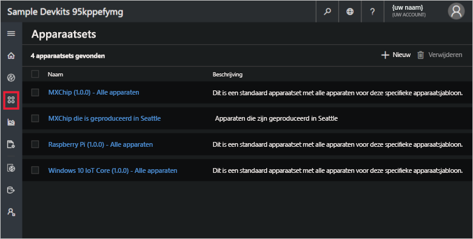

Op de pagina _Apparaatsets_ worden de apparaatsets getoond die door de maker zijn gemaakt. Een apparaatset is een verzameling verwante apparaten. Een maker definieert een query om de apparaten te identificeren die in een apparaatset zijn opgenomen. U gebruikt apparaatsets wanneer u de analytische gegevens in uw toepassing aanpast. Raadpleeg voor meer informatie het artikel [Use device sets in your Azure IoT Central application](howto-use-device-sets-experimental.md?toc=/azure/iot-central-experimental/toc.json&bc=/azure/iot-central-experimental/breadcrumb/toc.json) (Apparaatsets gebruiken in uw Azure IoT Central-toepassing).

## Analyse

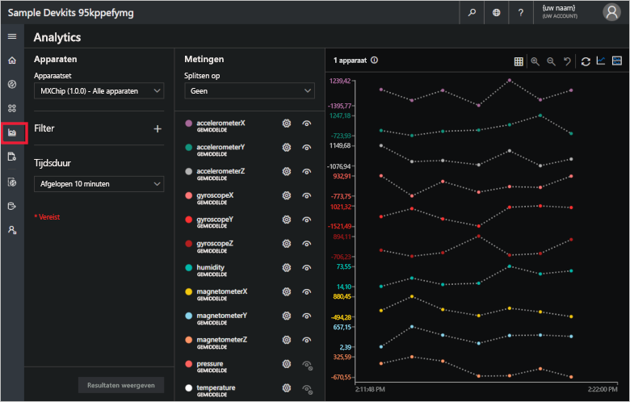

De pagina Analyse bevat diagrammen met informatie over hoe de apparaten die met uw toepassing zijn verbonden, zich gedragen. Een operator gebruikt deze pagina om problemen met de verbonden apparaten te controleren en te onderzoeken. De maker kan de diagrammen die op deze pagina worden weergegeven, definiëren. Raadpleeg voor meer informatie het artikel [Create custom analytics for your Azure IoT Central application](howto-use-device-sets-experimental.md?toc=/azure/iot-central-experimental/toc.json&bc=/azure/iot-central-experimental/breadcrumb/toc.json) (Aangepaste analyses maken voor uw Azure IoT Central-toepassing).

## Taken

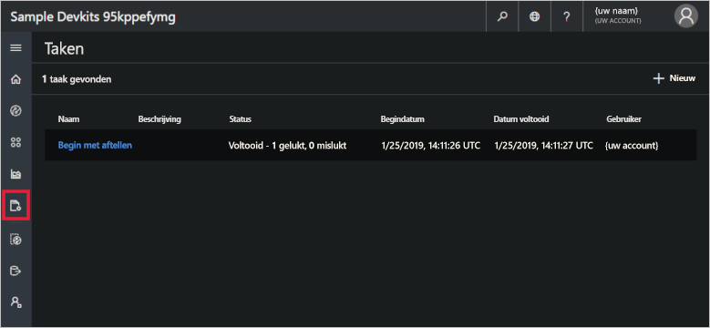

Met de taakpagina kunt u bulksgewijze beheerbewerkingen van uw apparaten uitvoeren. De opbouwfunctie maakt gebruik van deze pagina om apparaateigenschappen, instellingen en opdrachten bij te werken. Zie voor meer informatie, het artikel [Een taak uitvoeren](howto-run-a-job-experimental.md?toc=/azure/iot-central-experimental/toc.json&bc=/azure/iot-central-experimental/breadcrumb/toc.json).

## Apparaatsjablonen

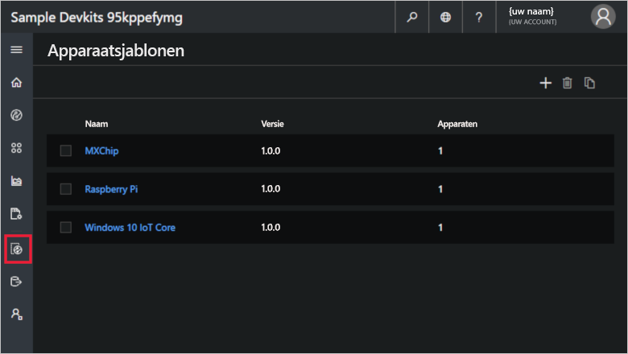

De opbouwfunctie gebruikt de pagina Apparaatsjablonen om de apparaatsjablonen in de toepassing te maken en beheren. Raadpleeg voor meer informatie de zelfstudie [Define a new device type in your Azure IoT Central application](tutorial-define-device-type-experimental.md?toc=/azure/iot-central-experimental/toc.json&bc=/azure/iot-central-experimental/breadcrumb/toc.json) (Een nieuw apparaattype definiëren in uw Azure IoT Central-toepassing).

## Continue gegevensexport

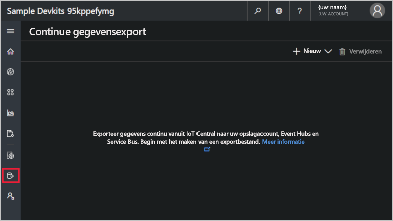

De beheerder gebruikt de pagina Continue gegevensexport om het exporteren van gegevens, zoals de telemetrie, uit de toepassing te definiëren. Andere services kunnen de geëxporteerde gegevens opslaan of die gebruiken voor analysedoeleinden. Zie het artikel [Exporteren van gegevens in Azure IoT Central](howto-export-data-experimental.md?toc=/azure/iot-central-experimental/toc.json&bc=/azure/iot-central-experimental/breadcrumb/toc.json) voor meer informatie.

## Beheer

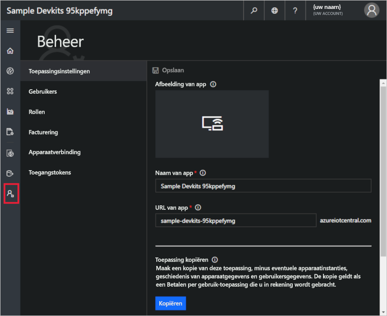

De beheerpagina bevat koppelingen naar hulpprogramma's die een administrator gebruikt, zoals het definiëren van gebruikers en rollen in de toepassing. Raadpleeg voor meer informatie het artikel [Administer your Azure IoT Central application](howto-administer-experimental.md?toc=/azure/iot-central-experimental/toc.json&bc=/azure/iot-central-experimental/breadcrumb/toc.json) (Uw Azure IoT Central-toepassing beheren).

## Volgende stappen

Nu u een overzicht hebt van Azure IoT Central en bekend bent met de indeling van de gebruikersinterface, is de voorgestelde vervolgstap om de snelstart [Create an Azure IoT Central application](quick-deploy-iot-central-experimental.md?toc=/azure/iot-central-experimental/toc.json&bc=/azure/iot-central-experimental/breadcrumb/toc.json) (Een Azure IoT Central-toepassing maken) te voltooien.