# Een Azure IoT Central-toepassing maken

Als _maker_ gebruikt u de gebruikersinterface van Azure IoT Central om uw Microsoft Azure IoT Central-toepassing te definiëren. In deze snelstartgids leert u het volgende:

- Een Azure IoT Central-toepassing maken die een voorbeeld-_apparaatsjabloon_ en gesimuleerde _apparaten_ bevat.
- De kenmerken van de apparaatsjabloon **Gekoelde verkoopautomaat** bekijken in uw toepassing.
- De telemetrie en analyse van uw gesimuleerde **Koelapparaten** bekijken.

In deze snelstart bekijkt u een gesimuleerd **Koelapparaat** van een apparaatsjabloon. Het gesimuleerde apparaat:

* Verzendt telemetrie, zoals temperatuur en druk, naar uw toepassing.
* Geeft apparaateigenschapswaarden, zoals een bewegingswaarschuwing, door aan uw toepassing.
* Heeft apparaatinstellingen, zoals ventilatorsnelheid, die u kunt instellen in de toepassing.

Wanneer u een gesimuleerd apparaat maakt op basis van een apparaatsjabloon in een Azure IoT Central-toepassing, kunt u met het gesimuleerde apparaat uw toepassing testen voordat u een echt apparaat aansluit.

## De toepassing maken

Voor het voltooien van deze snelstart moet u een Azure IoT Central toepassing maken op basis van de toepassingssjabloon **Sample Contoso**.

Navigeer naar de pagina [​​Toepassingsbeheer ](https://aka.ms/iotcentral) van Azure IoT Central. Voer vervolgens het e-mailadres en wachtwoord in dat u gebruikt om toegang te krijgen tot uw Azure-abonnement:

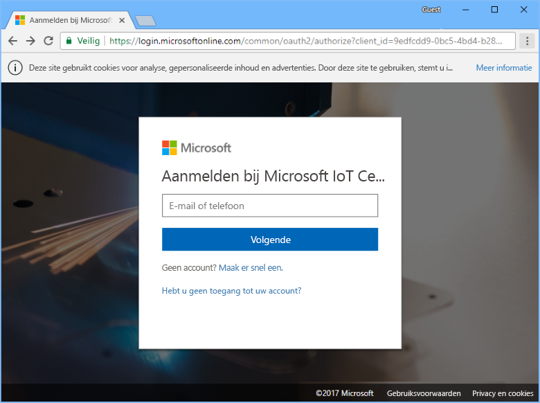

Als u wilt beginnen met het maken van een nieuwe Azure IoT Central-toepassing, kiest u **Nieuwe toepassing** :

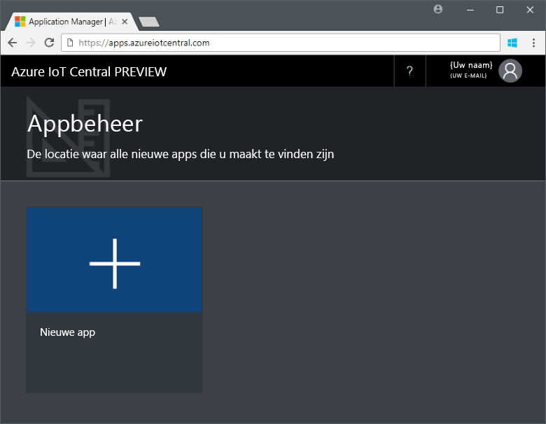

Een nieuwe Azure IoT Central-toepassing maken:

1. Kies het betalingsplan **Gratis proeftoepassing**.
1. Kies een beschrijvende toepassingsnaam, zoals **Contoso IoT**. Azure IoT Central genereert een uniek URL-voorvoegsel voor u. U kunt dit URL-voorvoegsel wijzigen in iets dat gemakkelijker te onthouden is.
1. Kies de toepassingssjabloon **Sample Contoso**.
1. Kies **Maken**.

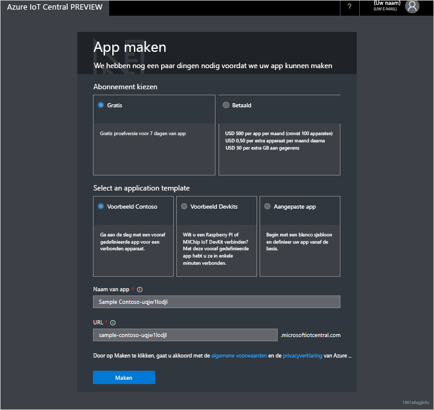

## Navigeer naar de toepassing

Wanneer uw toepassing gereed is, wordt de **Startpagina** van uw toepassing weergegeven. De _Ontwerpmodus_ rechtsboven kan worden omgeschakeld als u de startpagina wilt bewerken. De URL van de toepassing is de URL die u hebt opgegeven in de vorige stap:

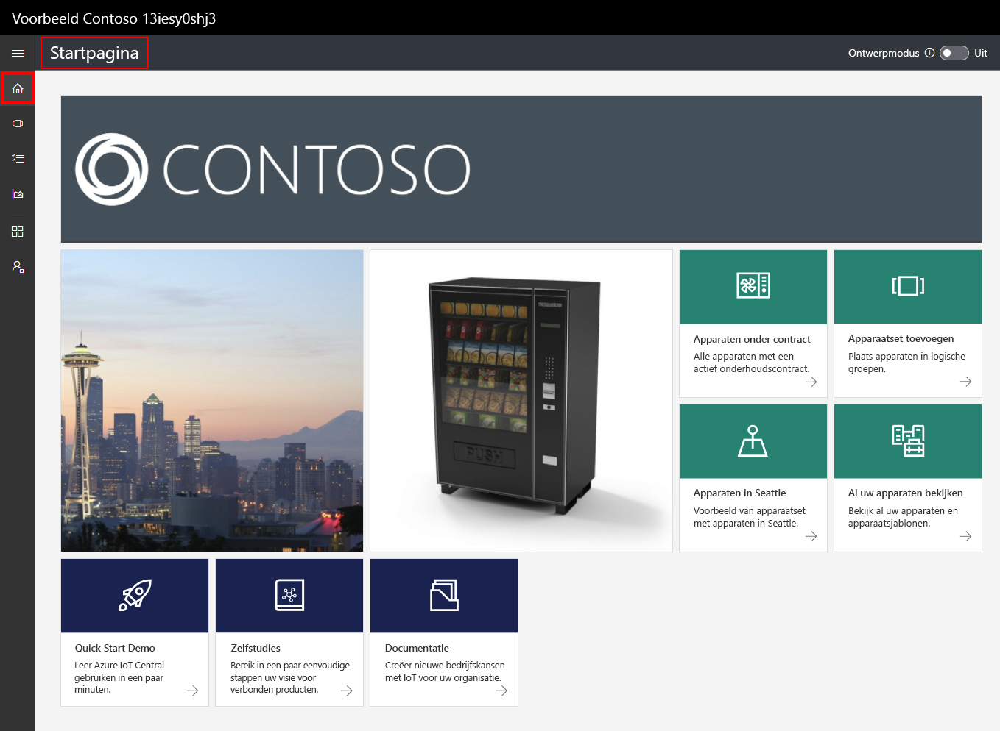

Gebruik het _linkernavigatiemenu_ om toegang te krijgen tot de verschillende gebieden van uw nieuwe Azure IoT Central-toepassing:

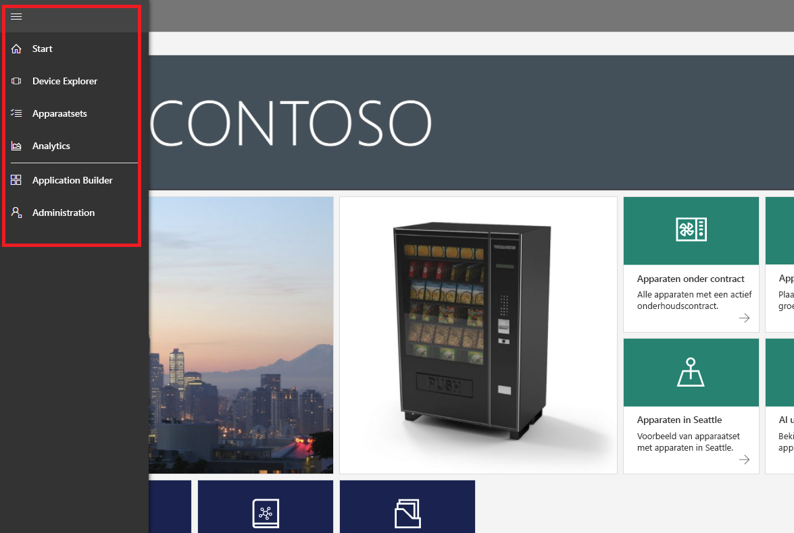

Als u de apparaatsjablonen en apparaten in uw toepassing wilt weergeven, kiest u **Device Explorer** in het navigatiemenu aan de linkerkant. De voorbeeldtoepassing bevat de apparaatsjabloon **Gekoelde verkoopautomaat**. Er zijn al drie gesimuleerde apparaten gemaakt met deze apparaatsjabloon:

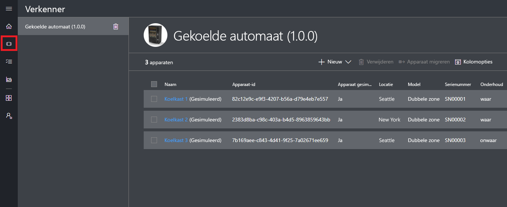

## De apparaatsjabloon en de apparaten weergeven

Gebruik de volgende stappen om een gekoeld ​​apparaat te bekijken dat is gemaakt met de apparaatsjabloon **Gekoelde verkoopautomaat**. Een apparaatsjabloon definieert:

* _Metingen_, zoals temperatuurtelemetrie, die vanaf een apparaat worden verzonden.
* _Instellingen_, zoals ventilatorsnelheid, die u in staat stellen om het apparaat te beheren.
* _Eigenschappen_, zoals serienummer, die informatie over het apparaat bevatten.
* [Regels](howto-create-telemetry-rules.md) waarmee u automatisch acties kunt uitvoeren op basis van het gedrag van het apparaat.
* Een aanpasbaar _dashboard_ dat informatie over het apparaat weergeeft.

U kunt zowel gesimuleerde als echte apparaten maken op basis van een apparaatsjabloon.

### Metingen

De pagina **Metingen**  voor het apparaat **Koelapparaat 1** wordt weergegeven. Hier ziet u de lijst met van het gesimuleerde apparaat verzonden metingen. De pagina bevat ook een aanpasbare grafiek van de zichtbare metingen:

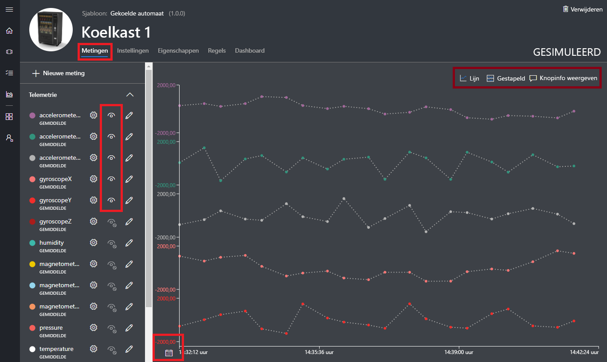

U kunt de zichtbaarheid van afzonderlijke elementen in-of uitschakelen en de grafiek aanpassen. De huidige grafiek toont telemetrie van een gesimuleerd apparaat. U kunt nieuwe metingen aan de apparaatsjabloon toevoegen als u over de juiste machtigingen beschikt.

> [!NOTE]
> U moet mogelijk even wachten voordat de gesimuleerde gegevens worden weergegeven in de grafiek.

### Instellingen

Kies **Instellingen**. Op de pagina **Instellingen** kunt u het apparaat beheren. U kunt bijvoorbeeld de snelheid van de ventilator van het koelapparaat bijwerken:

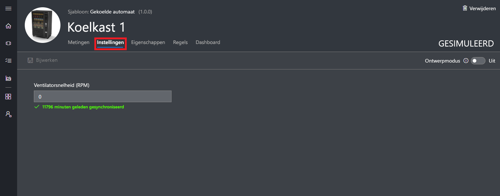

Een instelling wordt weergegeven als **gesynchroniseerd** wanneer een apparaat de wijziging bevestigt.

### Eigenschappen

Kies **Eigenschappen**. Op de pagina **Eigenschappen** kunt u:

* Informatie beheren over uw apparaat, zoals de naam van de klant.
* Door het apparaat gerapporteerde eigenschapswaarden bekijken, zoals een bewegingswaarschuwing.

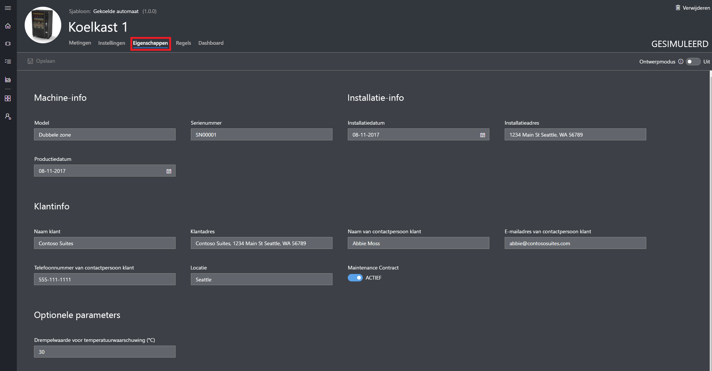

### Dashboard

Kies **Dashboard**. Het dashboard is een aanpasbare weergave van informatie over uw apparaat zoals metingen, eigenschappen en KPI's:

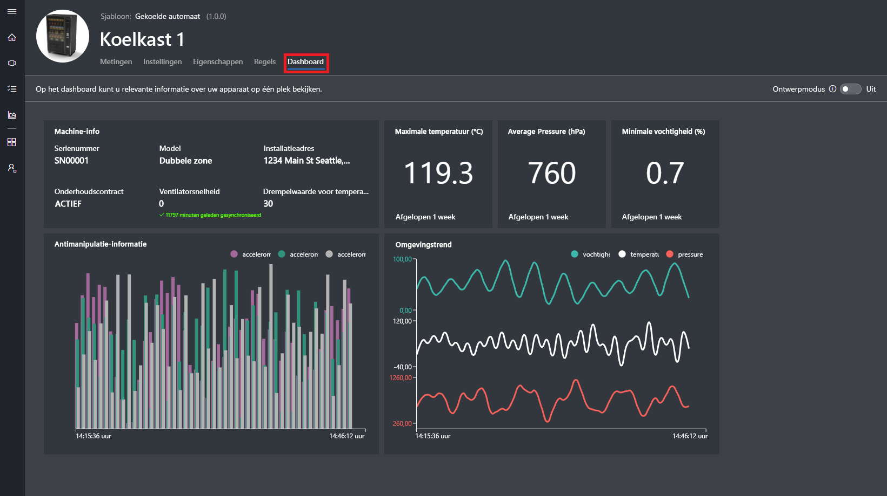

## Analytische gegevens bekijken

In het vorige gedeelte hebt u gezien hoe u informatie over een afzonderlijk apparaat kunt bekijken. U kunt [apparatensets](howto-use-device-sets.md) en [analyse](howto-create-analytics.md) gebruiken om geconsolideerde informatie van meerdere apparaten weer te geven.

Een apparatenset gebruikt een query om dynamisch een ​​set apparaten te selecteren die aan een criterium voldoen. Zo selecteert de apparatenset **Automaten in Haarlem**  bijvoorbeeld koelapparaten waarvan de locatie Haarlem is. Als u de apparatenset **Automaten in Haarlem**  wilt bekijken, kiest u **Apparatensets** in het navigatiemenu links en kiest u **Automaten in Haarlem** :

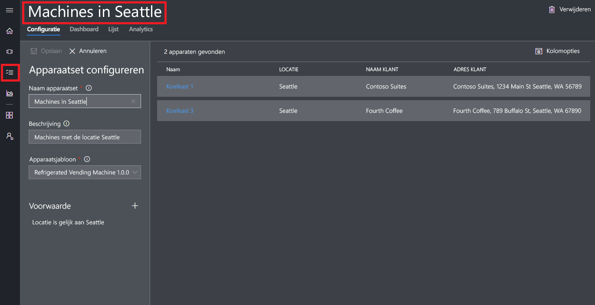

U kunt analysegegevens voor de apparaten in een apparatenset bekijken op de pagina **Analyse**:

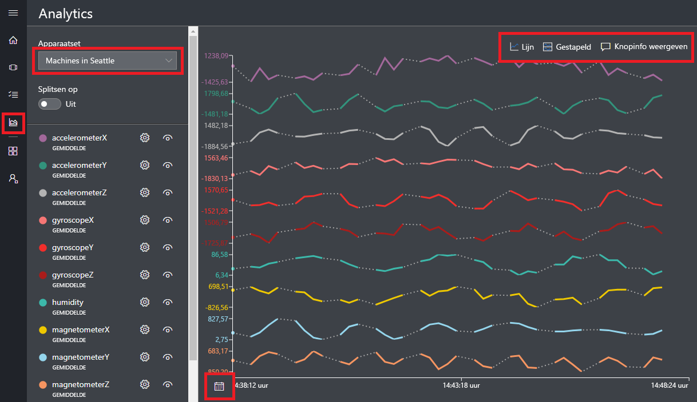

## Volgende stappen

In deze snelstart hebt u een vooraf ingevulde Azure IoT Central-toepassing gemaakt die een apparaatsjabloon voor een **Gekoelde Verkoopautomaat**  en gesimuleerde apparaten bevat. Zie [Een nieuwe apparaatsjabloon in uw toepassing definiëren](tutorial-define-device-type.md) voor meer informatie over het definiëren van uw eigen apparaatsjablonen als bouwer.
