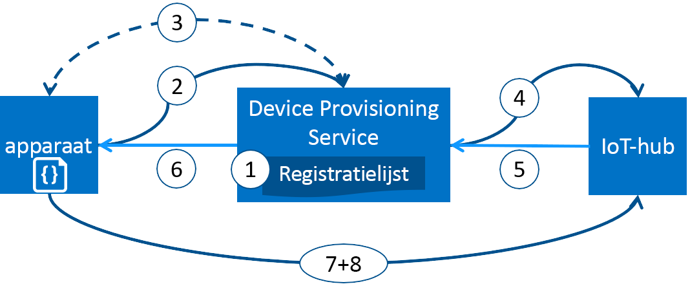

# Apparaten inrichten met Azure IoT Hub apparaat inrichten van Service
Microsoft Azure biedt een uitgebreide set geïntegreerde openbare cloud-services voor al uw IoT-oplossing. De inrichtingsservice van IoT Hub apparaat is een helper-service voor IoT-Hub die zonder tussenkomst, just in time inrichten met de juiste IoT-hub zonder menselijke tussenkomst, kunnen klanten om in te richten miljoenen apparaten op een veilige en schaalbare inschakelen manier.

## Wanneer gebruikt u inrichting Device-Service
Er zijn veel inrichting scenario's waarin de Service voor het inrichten van apparaten is een uitstekende keuze voor ophalen apparaten aangesloten en geconfigureerd met IoT Hub, zoals:

* Zonder tussenkomst inrichten van een enkele IoT-oplossing zonder hardcoderen verbindingsgegevens IoT-Hub in de fabriek (eerste installatie)
* Apparaten voor taakverdeling over meerdere hubs
* Apparaten verbinding laten maken met hun eigenaar IoT-oplossing op basis van de verkoop transactiegegevens (multitenancy)
* Apparaten verbinden met een bepaalde IoT-oplossing, afhankelijk van een gebruiksvoorbeeld (oplossing isolatie)
* Een apparaat aansluit op de iothub met de laagste latentie (geo-sharding)
* Opnieuw inrichten op basis van een wijziging in het apparaat
* De sleutels die worden gebruikt door het apparaat verbinding maakt met IoT Hub (bij X.509-certificaten niet wordt gebruikt om verbinding te) rolling

## Achter de schermen
Alle scenario's die worden vermeld in de vorige sectie kunnen worden gedaan met behulp van de inrichting service voor het inrichten van zonder tussenkomst met dezelfde stroom. Veel van de handmatige stappen oudsher voor inrichting worden automatisch met de Service apparaat inrichten in minder tijd voor het implementeren van IoT-apparaten en verlaagt het risico van handmatige fouten. Hier volgt een beschrijving van wat achter de schermen gebeurt er ophalen van een apparaat dat is ingericht. De eerste stap is handmatige, alle volgende stappen worden geautomatiseerd.

1. Apparaatfabrikant toegevoegd apparaat registratie-informatie aan de lijst van de inschrijving in de Azure portal.
2. Apparaat neemt contact op met het inrichtingsproces service-eindpunt ingesteld in de fabriek. Het apparaat de inrichting-service de identificatiegegevens voor de identiteit is geslaagd.
3. Valideert de inrichting-service de identiteit van het apparaat door het valideren van de registratie-ID en sleutel op basis van de inschrijving van vermelding in de lijst met behulp van een nonce uitdaging ([Trusted Platform Module](https://trustedcomputinggroup.org/work-groups/trusted-platform-module/)) of standaard x.509-verificatie ( X.509).
4. De inrichting service het apparaat wordt geregistreerd met een IoT-hub en vult u het apparaat [gewenst twin status](../iot-hub/iot-hub-devguide-device-twins.md).
5. De IoT-hub retourneert gegevens van een apparaat-ID en de inrichting service.
6. De inrichting service retourneert de verbindingsgegevens van de IoT-hub aan het apparaat. Het apparaat kunt nu starten voor het verzenden van gegevens rechtstreeks naar de IoT-hub.
7. Het apparaat verbinding maakt met iothub.
8. Het apparaat krijgt de gewenste status van de apparaat-twin in IoT-hub.

## Inrichtingsproces
Er zijn twee verschillende stappen in het implementatieproces van een apparaat waarop de Service voor het inrichten van apparaten neemt een deel die onafhankelijk kan worden uitgevoerd:

* De **productie stap** waarop het apparaat is gemaakt en voorbereid in de fabriek en
* De **cloud instellingsstap** in die de Service-inrichting van het apparaat is geconfigureerd voor het automatisch inrichten.

Beide volgende stappen uit past in naadloos met bestaande productie- en implementatie van processen. De Service voor het inrichten van apparaten vereenvoudigt zelfs enkele implementatieprocessen die betrekking hebben op veel handmatige werk ophalen van gegevens van de verbinding op het apparaat.

### Stap voor productie
Deze stap is alles wat er gebeurt op de regel voor productie. De rollen die zijn betrokken bij deze stap bevatten silicon designer, silicon fabrikant, integrator en/of de fabrikant van het einde van het apparaat. Deze stap is betrokken bij het maken van de hardware zelf.

De Service voor het inrichten van apparaten wordt geen een nieuwe stap in het fabricageproces; in plaats daarvan koppelt in de bestaande stap waarmee het eerste software- en (in het ideale geval) de HSM worden geïnstalleerd op het apparaat. In plaats van een apparaat-ID in deze stap maakt, is het apparaat gewoon geprogrammeerd met de Inrichtingsgegevens service zodat deze de inrichting-service roept voor de verbinding info/IoT-oplossing toewijzing bij is ingeschakeld.

In deze stap voorziet de fabrikant ook de apparaat-deployer/operator met belangrijke informatie te identificeren. Dit kan zijn net zo eenvoudig als het bevestigen van alle apparaten, hebben een X.509-certificaat dat is gegenereerd op basis van een ondertekend certificaat opgegeven door de operator/apparaat deployer, voor het openbare deel van een TPM-goedkeuringssleutel extraheren uit een TPM-apparaat. Deze services worden aangeboden door veel fabrikanten van silicon vandaag.

### Cloud-instellingsstap
Deze stap is over het configureren van de cloud voor de juiste automatische inrichting. In het algemeen er zijn twee typen van gebruikers die zijn betrokken bij de stap van de setup cloud: iemand weet hoe apparaten moeten worden ingesteld (een operator apparaat) en iemand anders die kent hoe apparaten worden om te worden verdeeld tussen de IoT-hubs (een oplossing-operator).

Er is een eenmalige eerste installatie van de inrichting moet plaatsvinden en deze taak wordt doorgaans afgehandeld door de operator oplossing. Zodra de inrichting-service is geconfigureerd, heeft deze niet worden gewijzigd, tenzij het gebruiksvoorbeeld wijzigt.

Nadat de service is geconfigureerd voor automatische inrichting, moet het worden voorbereid om apparaten te registreren. Deze stap wordt uitgevoerd door de operator apparaat, die de gewenste configuratie van de apparaten kent en verantwoordelijk ervoor te zorgen dat de inrichting service kunt goed sta in voor de apparaat-id wanneer ze op zoek naar de IoT-hub afkomstig is. De operator apparaat neemt de belangrijkste gegevens van de fabrikant en voegt het toe aan de lijst van de inschrijving. Er mag daaropvolgende updates voor de lijst van de inschrijving als nieuwe items worden toegevoegd of bestaande vermeldingen worden bijgewerkt met de meest recente informatie over de apparaten.

## Registratie en inrichting
*Inrichting* betekent dat verschillende dingen afhankelijk van de branche waarin de term wordt gebruikt. In de context van het inrichten van IoT-apparaten aan hun cloudoplossing, bestaat inrichting proces uit twee delen:

1. Het eerste deel is tot stand brengen van de eerste verbinding tussen het apparaat en de IoT-oplossing door het apparaat te registreren.
2. Het tweede gedeelte is de juiste configuratie toepassen op het apparaat op basis van de specifieke vereisten van de oplossing die is geregistreerd op.

Alleen wanneer die twee stappen hebt voltooid kunt we zeggen dat het apparaat volledig is ingericht. Sommige cloudservices wordt alleen de eerste stap van het inrichtingsproces, het registreren van apparaten met het eindpunt IoT-oplossing te bieden maar bieden niet de eerste configuratie. De Service voor het inrichten van apparaten automatiseert beide stappen om een naadloze ervaring voor de inrichting van het apparaat.

## Functies van het apparaat Service inrichten
De Service voor het inrichten van apparaten bevat veel functies die het ideaal voor inrichting apparaten te maken.

* **Attestation Secure** ondersteuning voor X.509- en op basis van TPM identiteiten.
* **Lijst van de inschrijving** met de volledige record van de apparaten/groepen van apparaten die op sommige registreren serviceverbindingspunt mogelijk. De registratie-lijst bevat informatie over de gewenste configuratie van het apparaat nadat deze is geregistreerd en deze op elk gewenst moment kan worden bijgewerkt.
* **Meerdere beleidsregels voor brontoewijzing** om te bepalen hoe apparaten in de Service voor het inrichten van apparaten naar IoT hubs ter ondersteuning van uw scenario's worden toegewezen.
* **Controle en diagnostische gegevens logboeken** om ervoor te zorgen dat alles goed werkt.
* **Ondersteuning voor meerdere hub** waarmee de apparaat-inrichtingsservice apparaten toewijzen aan meer dan één IoT-hub. De Service voor het inrichten van apparaten kunt contact opnemen met hubs over meerdere Azure-abonnementen.
* **Ondersteuning voor de regio-overschrijdende** waarmee de apparaat-inrichtingsservice apparaten toewijzen aan IoT hubs in andere regio's.

U kunt meer informatie over de concepten en functies die zijn betrokken bij de mobiele apparaten inrichten [apparaat concepten](concepts-device.md), [service concepten](concepts-service.md), en [veiligheidsconcepten](concepts-security.md).

## Ondersteuning voor meerdere platforms
De apparaat-inrichtingsservice, zoals alle Azure IoT services werkt platformoverschrijdende met tal van besturingssystemen. Azure biedt bron SDK's openen in een veelheid aan [talen](https://github.com/Azure/azure-iot-sdks) ter bevordering van de apparaten verbinding laten maken en beheren van de service. De Service voor het inrichten van apparaten ondersteunt de volgende protocollen voor het verbinden van apparaten:

* HTTPS
* AMQP
* AMQP via websockets
* MQTT
* MQTT via websockets

De Service voor het inrichten van apparaten ondersteunt alleen HTTPS-verbindingen voor servicebewerkingen.

## Regio's
De Service voor het inrichten van apparaten is beschikbaar in veel regio's. Onderhouden we een bijgewerkte lijst met bestaande en nieuwe aangekondigd regio's voor alle services op [Azure-gebieden](https://azure.microsoft.com/regions/). U kunt zien waar de Service voor het inrichten van apparaten is beschikbaar op de [Azure Status](https://azure.microsoft.com/status/) pagina.

> [!NOTE]
> De Service voor het inrichten van apparaten is globale en is niet gebonden aan een locatie. U moet echter opgeven dat een regio waarin de metagegevens gekoppeld aan uw profiel inrichtingsservice apparaat blijven staan.

## Beschikbaarheid
Onderhouden we een 99,9% serviceovereenkomst voor de Service voor het inrichten van apparaten, en u kunt [lezen van de SLA](https://azure.microsoft.com/support/legal/sla/iot-hub/). In de volledige [Azure SLA](https://azure.microsoft.com/support/legal/sla/) wordt de gegarandeerde beschikbaarheid van Azure als geheel uitgelegd.

## Quota
Elk Azure-abonnement heeft standaard de quotalimieten dat kan invloed hebben op het bereik van uw IoT-oplossing. De huidige limiet per abonnement op basis van een is 10 apparaat leveren van Services per abonnement.

Meer informatie over quotalimieten vindt u hier:

* [Azure-abonnement en servicelimieten, quota's en beperkingen](../azure-subscription-service-limits.md)

## Gerelateerde Azure-onderdelen
De Service voor het inrichten van apparaten automatiseert apparaten inrichten met Azure IoT Hub. Meer informatie over [IoT Hub](https://docs.microsoft.com/azure/iot-hub/).

## Volgende stappen
U hebt nu een overzicht van de inrichting van IoT-apparaten in Azure. De volgende stap is een end-to-end-IoT-scenario uitproberen.
> [!div class="nextstepaction"]
> [Inrichting-Service van IoT Hub apparaat instellen met de Azure-portal](quick-setup-auto-provision.md)
> [maken en een gesimuleerd apparaat in te richten](quick-create-simulated-device.md)
> [apparaat voor het inrichten van instellen](tutorial-set-up-device.md)
