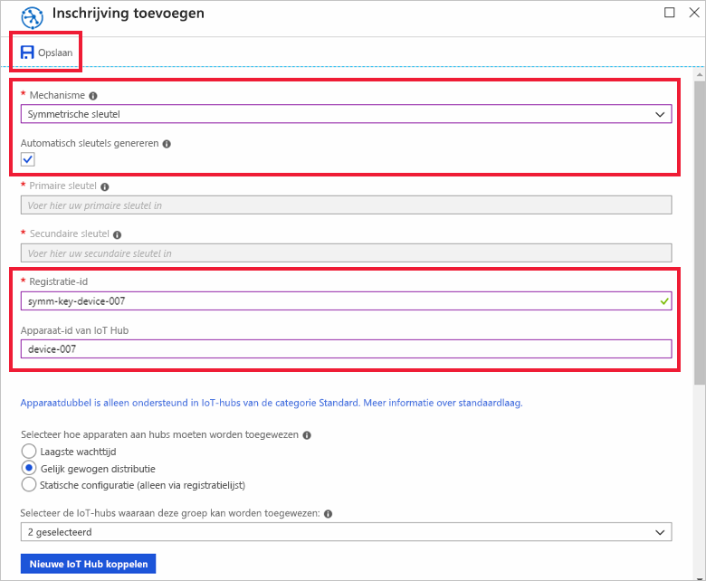

# <a name="quickstart-provision-a-simulated-device-with-symmetric-keys"></a>Snelstart: Een gesimuleerd apparaat inrichten met symmetrische sleutels

In deze snelstartgids leert u hoe u een apparaatsimulator kunt maken en uitvoeren op een Windows-ontwikkelcomputer. U configureert dit gesimuleerde apparaat om een symmetrische sleutel te gebruiken voor een verificatie met een Device Provisioning Service-exemplaar en voor toewijzing aan een IoT-hub. Er wordt voorbeeldcode van de [Azure IoT C-SDK](https://github.com/Azure/azure-iot-sdk-c) gebruikt voor het simuleren van een opstartprocedure voor het apparaat dat de inrichting initieert. Het apparaat wordt herkend op basis van een afzonderlijke inschrijving met een inrichtingsservice-exemplaar en wordt toegewezen aan een IoT-hub.

Hoewel dit artikel een inrichting met een afzonderlijke inschrijving laat zien, kunt u dezelfde procedures gebruiken bij inschrijvingsgroepen. Het enige verschil is dat u een afgeleide apparaatsleutel moet gebruiken met een unieke registratie-ID voor het apparaat. Bij inschrijvingsgroepen wordt de symmetrische sleutel op de inschrijving niet direct gebruikt. Hoewel inschrijvingsgroepen met symmetrische sleutel niet tot oudere apparaten beperkt zijn, biedt [Oudere apparaten inrichten door middel van attestation met een symmetrische sleutel](how-to-legacy-device-symm-key.md) een voorbeeld van een inschrijvingsgroep. Zie [Groepsinschrijvingen voor attestation met behulp van een symmetrische sleutel](concepts-symmetric-key-attestation.md#group-enrollments) voor meer informatie.

Als u niet bekend bent met het proces van automatische inrichting, bekijk dan de [Concepten voor automatische inrichting](concepts-auto-provisioning.md). 

Controleer ook of u de stappen in [IoT Hub Device Provisioning Service instellen met Azure Portal](./quick-setup-auto-provision.md) hebt voltooid voordat u verdergaat met deze snelstart. Voor deze snelstartgids wordt aangenomen dat u al een Device Provisioning Service-exemplaar hebt gemaakt.

Dit artikel is gericht op een Windows-gebaseerd werkstation. U kunt de procedures echter ook uitvoeren op Linux. Zie [Inrichten voor multitenancy](how-to-provision-multitenant.md) voor een Linux-voorbeeld.


[!INCLUDE [quickstarts-free-trial-note](../../includes/quickstarts-free-trial-note.md)]


## <a name="prerequisites"></a>Vereisten

* Visual Studio 2015 of [Visual Studio 2017](https://www.visualstudio.com/vs/) met de workload ['Desktopontwikkeling met C++'](https://www.visualstudio.com/vs/support/selecting-workloads-visual-studio-2017/) ingeschakeld.
* Meest recente versie van [Git](https://git-scm.com/download/) geïnstalleerd.


<a id="setupdevbox"></a>

## <a name="prepare-an-azure-iot-c-sdk-development-environment"></a>Een ontwikkelomgeving voorbereiden voor de Azure IoT C-SDK

In deze sectie bereidt u een ontwikkelomgeving voor die wordt gebruikt om de [Azure IoT C-SDK](https://github.com/Azure/azure-iot-sdk-c) te bouwen. 

De SDK bevat de voorbeeldcode voor een gesimuleerd apparaat. Dit gesimuleerde apparaat probeert de inrichting uit te voeren tijdens de opstartprocedure van het apparaat.

1. Download versie 3.11.4 van het [CMake-buildsysteem](https://cmake.org/download/). Controleer het gedownloade binaire bestand met behulp van de bijbehorende cryptografische hash-waarde. In het volgende voorbeeld is Windows PowerShell gebruikt om de cryptografische hash te controleren voor versie 3.11.4 van de x64 MSI-distributie:

    ```PowerShell
    PS C:\Downloads> $hash = get-filehash .\cmake-3.11.4-win64-x64.msi
    PS C:\Downloads> $hash.Hash -eq "56e3605b8e49cd446f3487da88fcc38cb9c3e9e99a20f5d4bd63e54b7a35f869"
    True
    ```
    
    De volgende hash-waarden voor versie 3.11.4 werden vermeld op de CMake-site ten tijde van dit schrijven:

    ```
    6dab016a6b82082b8bcd0f4d1e53418d6372015dd983d29367b9153f1a376435  cmake-3.11.4-Linux-x86_64.tar.gz
    72b3b82b6d2c2f3a375c0d2799c01819df8669dc55694c8b8daaf6232e873725  cmake-3.11.4-win32-x86.msi
    56e3605b8e49cd446f3487da88fcc38cb9c3e9e99a20f5d4bd63e54b7a35f869  cmake-3.11.4-win64-x64.msi
    ```

    Het is belangrijk dat de vereisten voor Visual Studio met (Visual Studio en de workload Desktopontwikkeling met C++) op uw computer zijn geïnstalleerd **voordat** de `CMake`-installatie wordt gestart. Zodra aan de vereisten is voldaan en de download is geverifieerd, installeert u het CMake-bouwsysteem.

2. Open een opdrachtprompt of Git Bash-shell. Voer de volgende opdracht uit voor het klonen van de GitHub-opslagplaats voor de Azure IoT C-SDK:
    
    ```cmd/sh
    git clone https://github.com/Azure/azure-iot-sdk-c.git --recursive
    ```
    De grootte van deze opslagplaats is momenteel ongeveer 220 MB. Deze bewerking kan enkele minuten in beslag nemen.


3. Maak de submap `cmake` in de hoofdmap van de Git-opslagplaats en navigeer naar die map. 

    ```cmd/sh
    cd azure-iot-sdk-c
    mkdir cmake
    cd cmake
    ```

4. Voer de volgende opdracht uit om een versie van de SDK te bouwen die specifiek is voor uw clientplatform voor ontwikkeling. Er wordt een Visual Studio-oplossing voor het gesimuleerde apparaat gegenereerd in de map `cmake`. 

    ```cmd
    cmake -Dhsm_type_symm_key:BOOL=ON -Duse_prov_client:BOOL=ON  ..
    ```
    
    Als `cmake` uw C++-compiler niet kan vinden, kunnen er fouten in de build optreden tijdens het uitvoeren van de bovenstaande opdracht. Als dit gebeurt, voert u deze opdracht uit bij de [Visual Studio-opdrachtprompt](https://docs.microsoft.com/dotnet/framework/tools/developer-command-prompt-for-vs). 

    Zodra het bouwen is voltooid, zijn de laatste paar uitvoerregels vergelijkbaar met de volgende uitvoer:

    ```cmd/sh
    $ cmake -Dhsm_type_symm_key:BOOL=ON -Duse_prov_client:BOOL=ON  ..
    -- Building for: Visual Studio 15 2017
    -- Selecting Windows SDK version 10.0.16299.0 to target Windows 10.0.17134.
    -- The C compiler identification is MSVC 19.12.25835.0
    -- The CXX compiler identification is MSVC 19.12.25835.0

    ...

    -- Configuring done
    -- Generating done
    -- Build files have been written to: E:/IoT Testing/azure-iot-sdk-c/cmake
    ```


## <a name="create-a-device-enrollment-entry-in-the-portal"></a>Een vermelding voor apparaatregistratie maken in de portal

1. Meld u aan bij Azure Portal, klik in het linkermenu op de knop **Alle bronnen** en open Device Provisioning Service.

2. Selecteer het tabblad **Registraties beheren** en klik vervolgens op de knop **Afzonderlijke inschrijvingen toevoegen** bovenaan. 

3. Voer bij **Registratie toevoegen** de volgende gegevens in en klik op de knop **Opslaan**.

    - **Mechanisme**: selecteer **Symmetrische sleutel** als *mechanisme* voor identiteitscontrole.

    - **Sleutels automatisch genereren**: schakel dit selectievakje in.

    - **Registratie-id**: voer een registratie-id in voor het identificeren van de inschrijving. Gebruik alleen kleine alfanumerieke tekens en streepjes ('-'). Bijvoorbeeld `symm-key-device-007`.

    - **Apparaat-id van IoT Hub:** voer een apparaat-id in. Bijvoorbeeld, **apparaat-007**.

    

4. Zodra u uw inschrijving hebt opgeslagen, worden de **primaire sleutel** en **secundaire sleutel** gegenereerd en aan de inschrijvingsvermelding toegevoegd. De inschrijving met symmetrische sleutel van uw apparaat wordt weergegeven als **symm-key-device-007** in de kolom *Registratie-ID* op het tabblad *Afzonderlijke registraties*. 

    Open de inschrijving en kopieer de waarde van uw gegenereerde **primaire sleutel**.


<a id="firstbootsequence"></a>

## <a name="simulate-first-boot-sequence-for-the-device"></a>Eerste opstartvolgorde voor het apparaat simuleren

In deze sectie werkt u de voorbeeldcode voor het verzenden van de opstartvolgorde van het apparaat naar uw Device Provisioning Service-exemplaar bij. Deze opstartvolgorde zorgt ervoor dat het apparaat kan worden herkend en toegewezen aan een IoT-hub die is gekoppeld aan het Device Provisioning Service-exemplaar.


1. Selecteer in Azure Portal het tabblad **Overzicht** voor uw Device Provisioning-service en noteer de waarde van het **_Id-bereik_**.

     

2. Open in Visual Studio het oplossingsbestand **azure_iot_sdks.sln** dat is gegenereerd door CMake uit te voeren. Het oplossingsbestand bevindt zich als het goed is op de volgende locatie:

    ```
    \azure-iot-sdk-c\cmake\azure_iot_sdks.sln
    ```

3. Navigeer in het deelvenster *Solution Explorer* van Visual Studio naar de map **Provision\_Samples**. Vouw het voorbeeldproject met de naam **prov\_dev\_client\_sample** uit. Vouw **Source Files** uit en open **prov\_dev\_client\_sample.c**.

4. Zoek de constante `id_scope` op en vervang de waarde door uw **Id-bereik**-waarde die u eerder hebt gekopieerd. 

    ```c
    static const char* id_scope = "0ne00002193";
    ```

5. Zoek de definitie voor de functie `main()` op in hetzelfde bestand. Zorg ervoor dat de variabele `hsm_type` is ingesteld op `SECURE_DEVICE_TYPE_SYMMETRIC_KEY`, zoals hieronder wordt weergegeven:

    ```c
    SECURE_DEVICE_TYPE hsm_type;
    //hsm_type = SECURE_DEVICE_TYPE_TPM;
    //hsm_type = SECURE_DEVICE_TYPE_X509;
    hsm_type = SECURE_DEVICE_TYPE_SYMMETRIC_KEY;
    ```

6. Zoek de aanroep naar `prov_dev_set_symmetric_key_info()` in **prov\_dev\_client\_sample.c**, waarbij een opmerking is geplaatst.

    ```c
    // Set the symmetric key if using they auth type
    //prov_dev_set_symmetric_key_info("<symm_registration_id>", "<symmetric_Key>");
    ```

    Verwijder de opmerkingen bij de functieaanroep en vervang de tijdelijke-aanduidingswaarden (inclusief de punthaken) bij uw registratie-id en primaire sleutel.

    ```c
    // Set the symmetric key if using they auth type
    prov_dev_set_symmetric_key_info("symm-key-device-007", "your primary key here");
    ```
   
    Sla het bestand op.

7. Klik met de rechtermuisknop op het **prov\_dev\_client\_sample**-project en selecteer **Set as Startup Project**. 

8. Selecteer in het menu van Visual Studio de optie **Debug** > **Start without debugging** om de oplossing uit te voeren. Klik in de prompt om het project opnieuw te bouwen op **Yes** om het project opnieuw te bouwen voordat het wordt uitgevoerd.

    De volgende output is een voorbeeld waarbij het gesimuleerde apparaat met succes opstart en verbinding maakt met het inrichtingsservice-exemplaar voor toewijzing aan een IoT-hub:

    ```cmd
    Provisioning API Version: 1.2.8

    Registering Device

    Provisioning Status: PROV_DEVICE_REG_STATUS_CONNECTED
    Provisioning Status: PROV_DEVICE_REG_STATUS_ASSIGNING
    Provisioning Status: PROV_DEVICE_REG_STATUS_ASSIGNING

    Registration Information received from service: 
    test-docs-hub.azure-devices.net, deviceId: device-007    
    Press enter key to exit:
    ```

9. Navigeer in de portal naar de IoT-hub waaraan uw gesimuleerd apparaat is toegewezen, en klik op het tabblad **IoT-apparaten**. Wanneer de inrichting van het gesimuleerde apparaat voor de hub is geslaagd, wordt de betreffende apparaat-ID weergegeven op de blade **IoT-apparaten** met de *STATUS* op **ingeschakeld**. Mogelijk moet u bovenaan op de knop **Vernieuwen** klikken. 

     


## <a name="clean-up-resources"></a>Resources opschonen

Als u wilt blijven doorwerken met het voorbeeld van de apparaatclient en deze beter wilt leren kennen, wis de resources die in deze Snelstartgids zijn gemaakt dan niet. Als u niet wilt doorgaan, gebruikt u de volgende stappen om alle resources die via deze Snelstartgids zijn gemaakt, te verwijderen.

1. Sluit het uitvoervenster van het voorbeeld van de apparaatclient op de computer.
1. Klik in het linkermenu in de Azure Portal op **Alle resources** en selecteer uw Device Provisioning Service. Open het tabblad **Inschrijvingen beheren** voor uw service en klik vervolgens op het tabblad **Afzonderlijke inschrijvingen**. Selecteer de *registratie-id* van het apparaat dat u hebt ingeschreven met behulp van deze quickstart. Klik vervolgens bovenaan op de knop **Verwijderen**. 
1. Klik in het linkermenu in de Azure Portal op **Alle resources** en selecteer vervolgens uw IoT-hub. Open **IoT-apparaten** voor uw hub, selecteer de *apparaat-id* van het apparaat dat u hebt geregistreerd in deze snelstart en klik vervolgens bovenaan op de knop **Verwijderen**.

## <a name="next-steps"></a>Volgende stappen

In deze snelstartgids hebt u een gesimuleerd apparaat op uw Windows-computer gemaakt en het ingericht voor uw IoT-hub met behulp van een symmetrische sleutel met de Azure IoT Hub Device Provisioning Service in de portal. Als u wilt weten hoe u uw apparaat programmatisch kunt inschrijven, gaat u verder met de snelstartgids voor programmatische inschrijving van X.509-apparaten. 

> [!div class="nextstepaction"]
> [Azure-quickstart: X.509-apparaat inschrijven bij Azure IoT Hub Device Provisioning Service](quick-enroll-device-x509-java.md)
