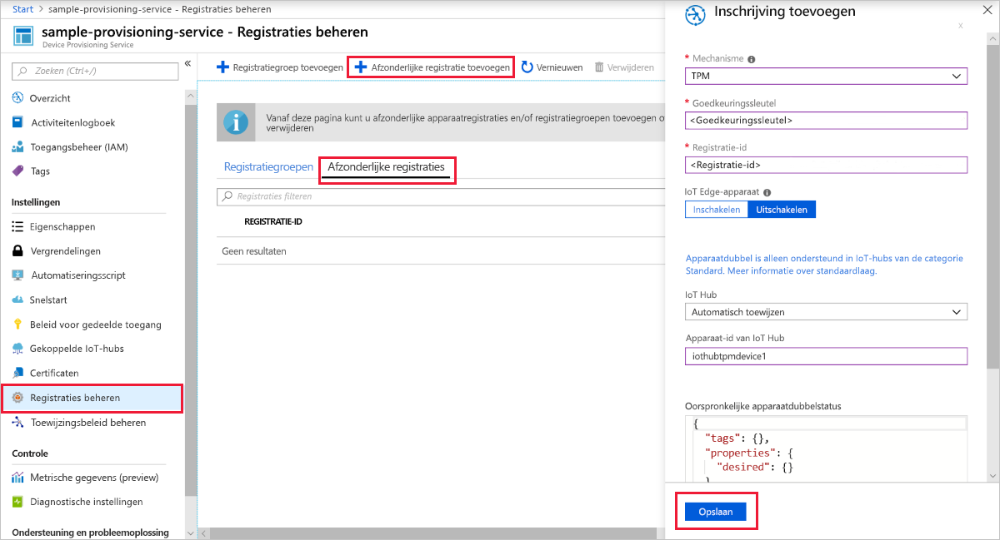

# <a name="create-and-provision-a-simulated-tpm-device-using-c-device-sdk-for-iot-hub-device-provisioning-service"></a>Een gesimuleerd TPM-apparaat met de SDK voor C# maken en inrichten voor IoT Hub Device Provisioning Service

[!INCLUDE [iot-dps-selector-quick-create-simulated-device-tpm](../../includes/iot-dps-selector-quick-create-simulated-device-tpm.md)]

Deze stappen laten u zien hoe u de [Azure IoT-voorbeelden voor C# ](https://github.com/Azure-Samples/azure-iot-samples-csharp) gebruikt om een TPM-apparaat te simuleren op een ontwikkelcomputer met het Windows-besturingssysteem. In het voorbeeld wordt het gesimuleerde apparaat ook verbonden met een IoT Hub met behulp van een apparaatinrichtingsservice. 

De voorbeeldcode gebruikt de Windows TPM-simulator als de [HSM (Hardware Security Module)](https://azure.microsoft.com/blog/azure-iot-supports-new-security-hardware-to-strengthen-iot-security/) van het apparaat. 

Als u niet bekend bent met het proces van automatisch inrichten, bekijk dan ook de [Concepten voor automatische inrichting](concepts-auto-provisioning.md). Controleer ook of u de stappen in [IoT Hub Device Provisioning Service instellen met Azure Portal](./quick-setup-auto-provision.md) hebt voltooid voordat u verdergaat. 

Azure IoT Device Provisioning Service ondersteunt twee typen inschrijvingen:
- [Inschrijvingsgroepen](concepts-service.md#enrollment-group): Wordt gebruikt om meerdere gerelateerde apparaten in te schrijven.
- [Afzonderlijke inschrijvingen](concepts-service.md#individual-enrollment): Wordt gebruikt om één apparaat in te schrijven.

In dit artikel worden afzonderlijke registraties gedemonstreerd.

[!INCLUDE [IoT Device Provisioning Service basic](../../includes/iot-dps-basic.md)]

<a id="setupdevbox"></a>
## <a name="prepare-the-development-environment"></a>De ontwikkelomgeving voorbereiden 

1. Zorg ervoor dat de [core-SDK 2.1 of hoger voor .NET](https://www.microsoft.com/net/download/windows) op uw computer is geïnstalleerd. 

1. Zorg ervoor dat `git` op de computer wordt geïnstalleerd en toegevoegd aan de omgevingsvariabelen die voor het opdrachtvenster toegankelijk zijn. Zie [Software Freedom Conservancy's Git client tools](https://git-scm.com/download/) (Git-clienthulpprogramma's van Software Freedom Conservancy) om de nieuwste versie van `git`-hulpprogramma's te installeren, waaronder **Git Bash**, de opdrachtregel-app die u kunt gebruiken voor interactie met de lokale Git-opslagplaats. 

1. Open een opdrachtprompt of Git Bash. Kloon de Azure IoT-voorbeelden GitHub-opslagplaats voor C#:
    
    ```cmd
    git clone https://github.com/Azure-Samples/azure-iot-samples-csharp.git
    ```

## <a name="provision-the-simulated-device"></a>Het gesimuleerde apparaat inrichten


1. Meld u aan bij Azure Portal. Klik in het linkermenu op de knop **All resources** en open uw Device Provisioning-service. Noteer de waarde van het **_Id-bereik_** in de blade **Overzicht**.

     


2. Ga op een opdrachtprompt naar de projectmap met de voorbeeldcode voor het inrichten van het de TPM-apparaat.

    ```cmd
    cd .\azure-iot-samples-csharp\provisioning\Samples\device\TpmSample
    ```

2. Typ de volgende opdracht om de voorbeeldcode voor het TPM-apparaat te bouwen en uit te voeren. Vervang de waarde voor `<IDScope>` door het id-bereik voor uw provisioning-service. 

    ```cmd
    dotnet run <IDScope>
    ```

    Met deze opdracht wordt de TPM-chip-simulator in een aparte opdrachtprompt gestart.  

1. In het opdrachtvenster ziet u waarden voor **_Endorsement Key_**, **_Registration ID_** en een voorgestelde **_Device ID_**. Deze waarden hebt u nodig voor registratie van het apparaat. Noteer deze waarden. U gebruikt deze waarde om een afzonderlijke inschrijving te maken in uw Device Provisioning Service-instantie. 
   > [!NOTE]
   > Verwar het venster met opdrachtuitvoer niet met het venster dat uitvoer van de TPM-simulator bevat. U moet mogelijk in het opdrachtvenster klikken om dit naar de voorgrond te halen.

     

4. Selecteer in Azure Portal **Inschrijvingen beheren** in de overzichtsblade van Device Provisioning Service. Selecteer het tabblad **Afzonderlijke registraties** en klik vervolgens op de knop **Afzonderlijke inschrijving toevoegen** bovenaan. 

5. Voer onder **Inschrijving toevoegen** de volgende gegevens in:
    - Selecteer **TPM** als *mechanisme* voor identiteitscontrole.
    - Voer de *registratie-id* en *goedkeuringssleutel* voor het TPM-apparaat in, die u eerder hebt genoteerd.
    - Selecteer eventueel een IoT-hub die is gekoppeld aan uw inrichtingsservice.
    - Voer een unieke apparaat-id in. U kunt de apparaat-id invoeren die wordt voorgesteld in de voorbeelduitvoer of u kunt uw eigen id invoeren. In het laatste geval moet u geen gevoelige gegevens gebruiken bij het benoemen van uw apparaat. 
    - Werk de **initiële status van de apparaatdubbel** bij met de gewenste beginconfiguratie voor het apparaat (optioneel).
    - Klik op de knop **Save** als u klaar bent. 

      

   Als het apparaat is ingeschreven, wordt de *Registration ID* ervan weergegeven in de lijst onder het tabblad *Individual Enrollments*. 

6. Druk op Enter in het opdrachtvenster (waarin de **_Endorsement Key_**, de **_Registration ID_** en een voorgestelde **_Device ID_** worden weergegeven) om het gesimuleerde apparaat te registreren. De gegevens van uw IoT-hub leest u in de berichten die het opstarten van het apparaat en het verbinding maken met Device Provisioning Service simuleren. 

1. Controleer of het apparaat is ingericht. Als het gesimuleerde apparaat is ingericht met de IoT-hub die is gekoppeld met de provisioning-service, wordt de apparaat-id weergegeven op de blade **IoT-apparaten** van de hub. 

     

    Als u de standaardwaarde van de *initiële status van de apparaatdubbel* hebt gewijzigd in de inschrijvingsvermelding voor uw apparaat, kan de gewenste status van de dubbel uit de hub worden gehaald en er dienovereenkomstig naar worden gehandeld. Zie [Understand and use device twins in IoT Hub](../iot-hub/iot-hub-devguide-device-twins.md) (Apparaatdubbelen begrijpen en gebruiken in IoT Hub) voor meer informatie


## <a name="clean-up-resources"></a>Resources opschonen

Als u wilt blijven doorwerken met het voorbeeld van de apparaatclient en deze beter wilt leren kennen, wis de resources die in deze Snelstartgids zijn gemaakt dan niet. Als u niet wilt doorgaan, gebruikt u de volgende stappen om alle resources die via deze Snelstartgids zijn gemaakt, te verwijderen.

1. Sluit het uitvoervenster van het voorbeeld van de apparaatclient op de computer.
1. Sluit het TPM-simulatorvenster op de computer.
1. Klik in het linkermenu in Azure Portal op **All resources** en selecteer uw Device Provisioning-service. Klik bovenaan de blade **Alle resources** op **Verwijderen**.  
1. Klik in het linkermenu in de Azure Portal op **Alle resources** en selecteer vervolgens uw IoT-hub. Klik bovenaan de blade **Alle resources** op **Verwijderen**.  

## <a name="next-steps"></a>Volgende stappen

In deze quickstart hebt u een gesimuleerd TPM-apparaat op de computer gemaakt en dit ingericht voor uw IoT-hub met IoT Hub Device Provisioning Service. Als u wilt weten hoe u uw TPM-apparaat programmatisch kunt registreren, gaat u verder met de quickstart voor programmatische registratie van een TPM-apparaat. 

> [!div class="nextstepaction"]
> [Azure-quickstart: TPM-apparaat registreren bij Azure IoT Hub Device Provisioning Service](quick-enroll-device-tpm-csharp.md)
