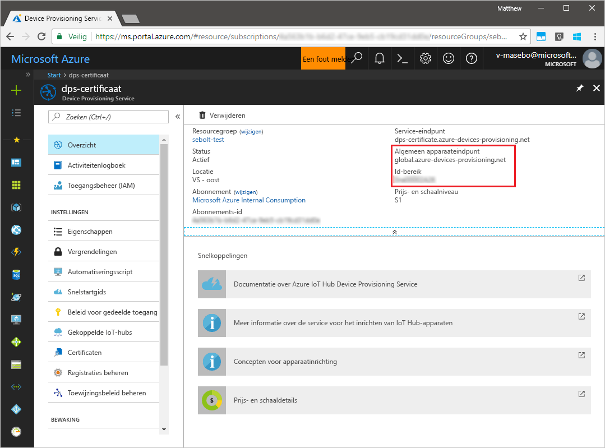
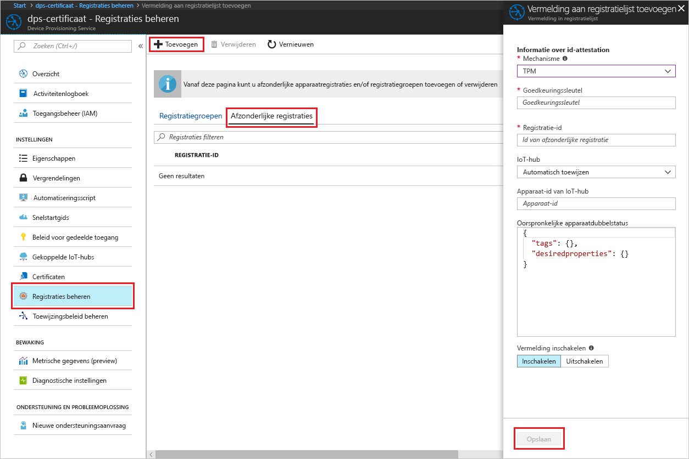
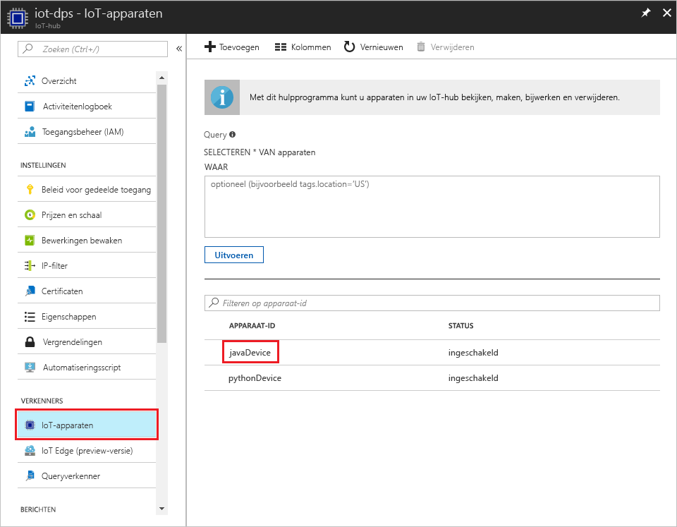

# <a name="create-and-provision-a-simulated-tpm-device-using-java-device-sdk-for-azure-iot-hub-device-provisioning-service"></a>Een gesimuleerd TPM-apparaat met de SDK voor Java maken en inrichten voor Azure IoT Hub Device Provisioning Service
> [!div class="op_single_selector"]
> * [C](quick-create-simulated-device.md)
> * [Java](quick-create-simulated-device-tpm-java.md)
> * [C#](quick-create-simulated-device-tpm-csharp.md)
> * [Python](quick-create-simulated-device-tpm-python.md)

In deze stappen wordt getoond hoe u een gesimuleerd apparaat maakt op een ontwikkelcomputer met Windows OS, de Windows TPM-simulator uitvoert als de [HSM (Hardware Security Module)](https://azure.microsoft.com/blog/azure-iot-supports-new-security-hardware-to-strengthen-iot-security/) van het apparaat en het codevoorbeeld gebruikt om dit gesimuleerde apparaat te verbinden met Device Provisioning Service en uw IoT-hub. 

Voltooi de stappen in [Set up the IoT Hub Device Provisioning Service with the Azure portal](./quick-setup-auto-provision.md) (IoT Hub Device Provisioning Service instellen met Azure Portal) voordat u verdergaat.


## <a name="prepare-the-environment"></a>De omgeving voorbereiden 

1. Zorg ervoor dat [Java SE Development Kit 8](http://www.oracle.com/technetwork/java/javase/downloads/jdk8-downloads-2133151.html) is geïnstalleerd op de computer.

1. Download en installeer [Maven](https://maven.apache.org/install.html).

1. Zorg ervoor dat `git` op de computer wordt geïnstalleerd en toegevoegd aan de omgevingsvariabelen die voor het opdrachtvenster toegankelijk zijn. Zie [Software Freedom Conservancy's Git client tools](https://git-scm.com/download/) (Git-clienthulpprogramma's van Software Freedom Conservancy) om de nieuwste versie van `git`-hulpprogramma's te installeren, waaronder **Git Bash**, de opdrachtregel-app die u kunt gebruiken voor interactie met de lokale Git-opslagplaats. 

1. Open een opdrachtprompt. Kloon het codevoorbeeld voor apparaatsimulatie uit de GitHub-opslagplaats.
    
    ```cmd/sh
    git clone https://github.com/Azure/azure-iot-sdk-java.git --recursive
    ```

1. Voer de [TPM](https://docs.microsoft.com/windows/device-security/tpm/trusted-platform-module-overview)-simulator uit. Klik op **Allow access** zodat de instellingen voor _Windows Firewall_ kunnen worden gewijzigd. Deze luistert via een socket op poorten 2321 en 2322. Sluit dit venster niet. Deze simulator moet actief blijven tot het einde van deze quickstart. 

    ```cmd/sh
    .\azure-iot-sdk-java\provisioning\provisioning-tools\tpm-simulator\Simulator.exe
    ```

    

1. Ga via een aparte opdrachtprompt naar de hoofdmap en stel de voorbeeldafhankelijkheden samen.

    ```cmd/sh
    cd azure-iot-sdk-java
    mvn install -DskipTests=true
    ```

1. Navigeer naar de voorbeeldmap.

    ```cmd/sh
    cd provisioning/provisioning-samples/provisioning-tpm-sample
    ```

1. Meld u aan bij Azure Portal, klik in het linkermenu op de knop **All resources** en open uw Device Provisioning-service. Noteer de waarden voor _Id Scope_ en _Provisioning Service Global Endpoint_.

    

1. Bewerk `src/main/java/samples/com/microsoft/azure/sdk/iot/ProvisioningTpmSample.java` om de eerder genoteerde waarden voor _Id Scope_ en _Provisioning Service Global Endpoint_ toe te voegen.  

    ```java
    private static final String idScope = "[Your ID scope here]";
    private static final String globalEndpoint = "[Your Provisioning Service Global Endpoint here]";
    private static final ProvisioningDeviceClientTransportProtocol PROVISIONING_DEVICE_CLIENT_TRANSPORT_PROTOCOL = ProvisioningDeviceClientTransportProtocol.HTTPS;
    ```

1. Maak het project. Navigeer naar de doelmap en voer het gemaakte JAR-bestand uit.

    ```cmd/sh
    mvn clean install
    cd target
    java -jar ./provisioning-tpm-sample-{version}-with-deps.jar
    ```

1. Het programma wordt uitgevoerd. Noteer de waarden voor _Endorsement Key_ en _Registration Id_ voor de volgende sectie en laat het programma draaien.

    
    

## <a name="create-a-device-enrollment-entry"></a>Een vermelding voor apparaatinschrijving maken

1. Meld u aan bij Azure Portal, klik in het linkermenu op de knop **All resources** en open uw Device Provisioning-service.

1. Selecteer **Manage enrollments** in de overzichtsblade van Device Provisioning Service. Selecteer het tabblad **Individual Enrollments** en klik bovenaan op de knop **Add**. 

1. Voer onder bij **Registratielijstitem toevoegen** de volgende gegevens in:
    - Selecteer **TPM** als *mechanisme* voor identiteitscontrole.
    - Voer de *registratie-id* en *goedkeuringssleutel* voor het TPM-apparaat in, zoals eerder genoteerd. 
    - Selecteer een IoT-hub die is gekoppeld aan uw inrichtingsservice.
    - Voer een unieke apparaat-id in. Vermijd gevoelige gegevens bij het benoemen van uw apparaat.
    - Werk de **initiële status van de apparaatdubbel** bij met de gewenste beginconfiguratie voor het apparaat.
    - Klik op de knop **Save** als u klaar bent. 

      

   Als het apparaat is ingeschreven, wordt de *registratie-id* ervan weergegeven in de lijst onder het tabblad *Individuele inschrijvingen*. 


## <a name="simulate-the-device"></a>Het apparaat simuleren

1. Klik in het opdrachtvenster met de voorbeeldcode van Java op Enter om door te gaan met het uitvoeren van de toepassing. De gegevens van uw IoT-hub leest u in de berichten die het opstarten van het apparaat en het verbinding maken met Device Provisioning Service simuleren.  

    

1. Als het gesimuleerde apparaat is ingericht met de IoT-hub die is gekoppeld met de provisioningservice, wordt de apparaat-id weergegeven op de blade **Device Explorer** van de hub.

     

    Als u de standaardwaarde van de *initiële status van de apparaatdubbel* hebt gewijzigd in de inschrijvingsvermelding voor uw apparaat, kan de gewenste status van de dubbel uit de hub worden gehaald en er dienovereenkomstig naar worden gehandeld. Zie [Understand and use device twins in IoT Hub](../iot-hub/iot-hub-devguide-device-twins.md) (Apparaatdubbelen begrijpen en gebruiken in IoT Hub) voor meer informatie


## <a name="clean-up-resources"></a>Resources opschonen

Als u wilt blijven doorwerken met het voorbeeld van de apparaatclient en deze beter wilt leren kennen, wis de resources die in deze quickstart zijn gemaakt dan niet. Als u niet wilt doorgaan, gebruikt u de volgende stappen om alle resources die via deze quickstart zijn gemaakt, te verwijderen.

1. Sluit het uitvoervenster van het voorbeeld van de apparaatclient op de computer.
1. Sluit het TPM-simulatorvenster op de computer.
1. Klik in het linkermenu in de Azure Portal op **Alle resources** en selecteer uw Device Provisioning Service. Open de blade **Inschrijvingen beheren** voor uw service en klik vervolgens op het tabblad **Afzonderlijke inschrijvingen**. Selecteer de *registratie-id* van het apparaat dat u hebt ingeschreven met behulp van deze quickstart. Klik vervolgens bovenaan op de knop **Verwijderen**. 
1. Klik in het linkermenu in de Azure Portal op **Alle resources** en selecteer vervolgens uw IoT-hub. Open de blade **IoT-apparaten** voor uw hub, selecteer de *apparaat-id* van het apparaat dat u hebt geregistreerd in deze quickstart en klik vervolgens bovenaan op de knop **Verwijderen**.

## <a name="next-steps"></a>Volgende stappen

In deze quickstart hebt u een gesimuleerd TPM-apparaat op de computer gemaakt en dit ingericht voor uw IoT-hub met IoT Hub Device Provisioning Service. Als u wilt weten hoe u uw TPM-apparaat programmatisch kunt registreren, gaat u verder met de quickstart voor programmatische registratie van een TPM-apparaat. 

> [!div class="nextstepaction"]
> [Azure-quickstart: TPM-apparaat inschrijven bij Azure IoT Hub Device Provisioning Service](quick-enroll-device-tpm-java.md)
