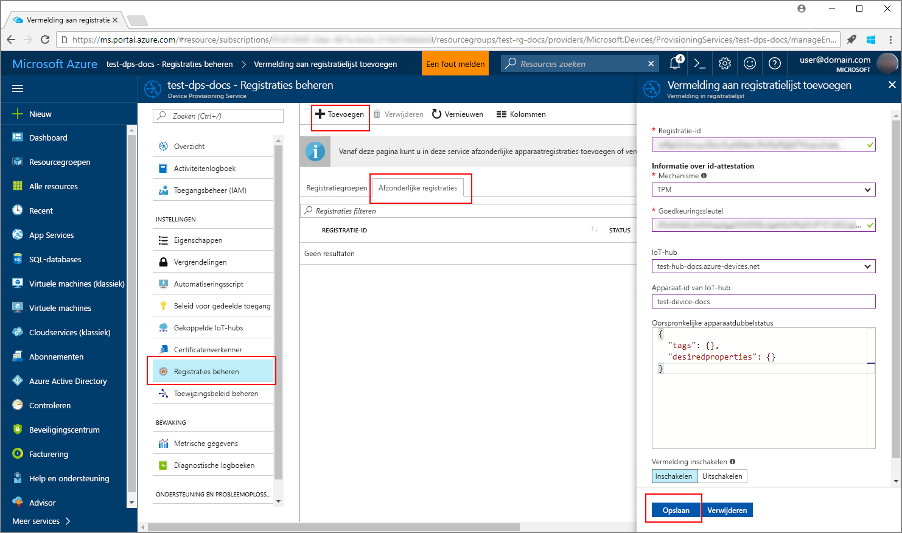
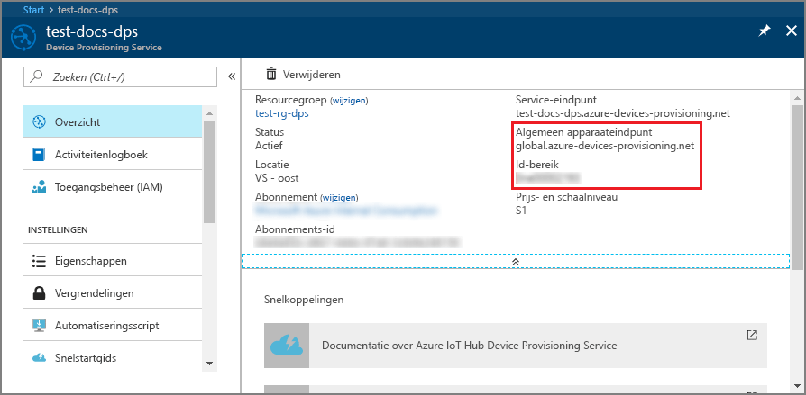
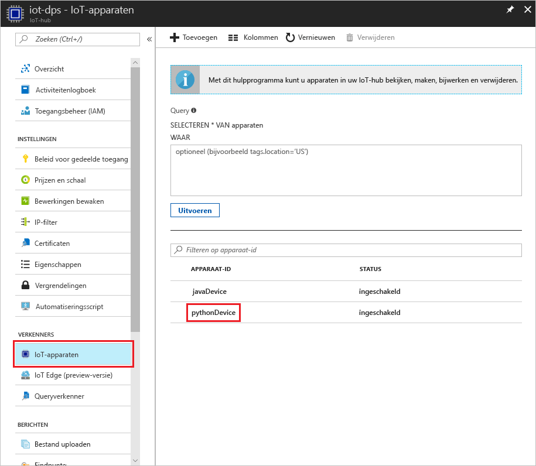

# <a name="create-and-provision-a-simulated-tpm-device-using-java-device-sdk-for-iot-hub-device-provisioning-service"></a>Een gesimuleerd TPM-apparaat met de SDK voor Java maken en inrichten voor IoT Hub Device Provisioning Service
> [!div class="op_single_selector"]
> * [C](quick-create-simulated-device.md)
> * [Java](quick-create-simulated-device-tpm-java.md)
> * [C#](quick-create-simulated-device-tpm-csharp.md)
> * [Python](quick-create-simulated-device-tpm-python.md)

In deze stappen wordt getoond hoe u een gesimuleerd apparaat maakt op een ontwikkelcomputer met Windows OS, de Windows TPM-simulator uitvoert als de [HSM (Hardware Security Module)](https://azure.microsoft.com/blog/azure-iot-supports-new-security-hardware-to-strengthen-iot-security/) van het apparaat en het Python-codevoorbeeld gebruikt om dit gesimuleerde apparaat te verbinden met Device Provisioning Service en uw IoT-hub. 

Voltooi de stappen in [IoT Hub Device Provisioning Service instellen](./quick-setup-auto-provision.md) voordat u verdergaat.


## <a name="prepare-the-environment"></a>De omgeving voorbereiden 

1. Op uw computer moet [Visual Studio 2015](https://www.visualstudio.com/vs/older-downloads/) of [Visual Studio 2017](https://www.visualstudio.com/vs/) zijn geïnstalleerd. De workload 'Desktop development with C++' (Bureaubladontwikkeling met C++) moet zijn ingeschakeld voor uw installatie van Visual Studio.

1. Download en installeer het [CMake-bouwsysteem](https://cmake.org/download/).

1. Zorg ervoor dat `git` op de computer wordt geïnstalleerd en toegevoegd aan de omgevingsvariabelen die voor het opdrachtvenster toegankelijk zijn. Zie [Software Freedom Conservancy's Git client tools](https://git-scm.com/download/) (Git-clienthulpprogramma's van Software Freedom Conservancy) om de nieuwste versie van `git`-hulpprogramma's te installeren, waaronder **Git Bash**, de opdrachtregel-app die u kunt gebruiken voor interactie met de lokale Git-opslagplaats. 

1. Open een opdrachtprompt of Git Bash. Kloon het codevoorbeeld voor de GitHub-opslagplaats voor apparaatsimulatie:
    
    ```cmd/sh
    git clone https://github.com/Azure/azure-iot-sdk-python.git --recursive
    ```

1. Maak een map in de lokale kopie van deze GitHub-opslagplaats voor het CMake-bouwproces. 

    ```cmd/sh
    cd azure-iot-sdk-python/c
    mkdir cmake
    cd cmake
    ```

1. In het codevoorbeeld wordt een Windows TPM-simulator gebruikt. Voer de volgende opdracht uit om SAS-tokenverificatie in te schakelen. Er wordt ook een Visual Studio-oplossing voor het gesimuleerde apparaat gegenereerd.

    ```cmd/sh
    cmake -Duse_prov_client:BOOL=ON -Duse_tpm_simulator:BOOL=ON ..
    ```

1. Ga door middel van een aparte opdrachtprompt naar de map van de TPM-simulator en voer de [TPM](https://docs.microsoft.com/windows/device-security/tpm/trusted-platform-module-overview)-simulator uit. Klik op **Toegang toestaan**. Deze luistert via een socket op poorten 2321 en 2322. Sluit dit opdrachtvenster niet; de simulator moet actief blijven tot u deze quickstart hebt voltooid. 

    ```cmd/sh
    .\azure-iot-sdk-python\c\provisioning_client\deps\utpm\tools\tpm_simulator\Simulator.exe
    ```

    


## <a name="create-a-device-enrollment-entry"></a>Een vermelding voor apparaatinschrijving maken

1. Open de in de map *cmake* gemaakt oplossing met de naam `azure_iot_sdks.sln` en bouw deze in Visual Studio.

1. Klik met de rechtermuisknop op het **tpm_device_provision**-project en selecteer **Set as Startup Project**. Voer de oplossing uit. In het uitvoervenster worden de voor apparaatinschrijving vereiste **_goedkeuringssleutel_** en **_registratie-id_** weergegeven. Noteer deze waarden. 

    

1. Meld u aan bij Azure Portal, klik in het linkermenu op de knop **All resources** en open uw Device Provisioning-service.

1. Selecteer **Manage enrollments** in de overzichtsblade van Device Provisioning Service. Selecteer het tabblad **Individual Enrollments** en klik bovenaan op de knop **Add**. 

1. Voer onder bij **Registratielijstitem toevoegen** de volgende gegevens in:
    - Selecteer **TPM** als *mechanisme* voor identiteitscontrole.
    - Voer de *registratie-id* en *goedkeuringssleutel* voor het TPM-apparaat in. 
    - Selecteer een IoT-hub die is gekoppeld aan uw inrichtingsservice.
    - Voer een unieke apparaat-id in. Vermijd gevoelige gegevens bij het benoemen van uw apparaat.
    - Werk de **initiële status van de apparaatdubbel** bij met de gewenste beginconfiguratie voor het apparaat.
    - Klik op de knop **Save** als u klaar bent. 

      

   Als het apparaat is ingeschreven, wordt de *Registration ID* ervan weergegeven in de lijst onder het tabblad *Individual Enrollments*. 


## <a name="simulate-the-device"></a>Het apparaat simuleren

1. [Download en installeer Python 2.x of 3.x](https://www.python.org/downloads/). Zorg ervoor dat u de 32-bits of 64-bits installatie gebruikt, zoals vereist door uw configuratie. Zorg ervoor dat u Python toevoegt aan uw platformspecifieke omgevingsvariabelen als u hierom wordt gevraagd tijdens de installatie.
    - Als u een Windows-besturingssysteem hebt, gebruikt u vervolgens het [herdistribueerbare pakket van Visual C++](http://www.microsoft.com/download/confirmation.aspx?id=48145) om het gebruik van systeemeigen DLL's van Python mogelijk te maken.

1. Volg [deze instructies](https://github.com/Azure/azure-iot-sdk-python/blob/master/doc/python-devbox-setup.md) voor het bouwen van de Python-pakketten.

    > [!NOTE]
        > Als u `build_client.cmd` uitvoert, moet u ervoor zorgen dat u de vlag `--use-tpm-simulator` gebruikt.

    > [!NOTE]
        > Als u `pip` gebruikt, zorg dan ook dat u het pakket `azure-iot-provisioning-device-client` installeert. Houd er rekening mee dat de uitgebrachte PIP-pakketten van de echte TPM gebruikmaken, niet van de simulator. Als u de simulator wilt gebruiken, moet u vanuit de bron compileren met behulp van de vlag `--use-tpm-simulator`.

1. Navigeer naar de map met voorbeelden.

    ```cmd/sh
    cd azure-iot-sdk-python/provisioning_device_client/samples
    ```

1. Gebruik Python IDE om het Python-script met de naam **provisioning\_device\_client\_sample.py** te bewerken. Wijzig de variabelen _GLOBAL\_PROV\_URI_ en _ID\_SCOPE_ in de waarden die u eerder hebt genoteerd.

    ```python
    GLOBAL_PROV_URI = "{globalServiceEndpoint}"
    ID_SCOPE = "{idScope}"
    SECURITY_DEVICE_TYPE = ProvisioningSecurityDeviceType.TPM
    PROTOCOL = ProvisioningTransportProvider.HTTP
    ```

    

1. Voet het voorbeeld uit. 

    ```cmd/sh
    python provisioning_device_client_sample.py
    ```

1. De gegevens van uw IoT-hub leest u in de berichten die het opstarten van het apparaat en het verbinding maken met Device Provisioning Service simuleren. 

    

1. Als het gesimuleerde apparaat is ingericht met de IoT-hub die is gekoppeld met de provisioningservice, wordt de apparaat-id weergegeven op de blade **Device Explorer** van de hub.

     

    Als u de standaardwaarde van de *initiële status van de apparaatdubbel* hebt gewijzigd in de inschrijvingsvermelding voor uw apparaat, kan de gewenste status van de dubbel uit de hub worden gehaald en er dienovereenkomstig naar worden gehandeld. Zie [Understand and use device twins in IoT Hub](../iot-hub/iot-hub-devguide-device-twins.md) (Apparaatdubbelen begrijpen en gebruiken in IoT Hub) voor meer informatie


## <a name="clean-up-resources"></a>Resources opschonen

Als u wilt blijven doorwerken met het voorbeeld van de apparaatclient en deze beter wilt leren kennen, wis de resources die in deze quickstart zijn gemaakt dan niet. Als u niet wilt doorgaan, gebruikt u de volgende stappen om alle resources die via deze quickstart zijn gemaakt, te verwijderen.

1. Sluit het uitvoervenster van het voorbeeld van de apparaatclient op de computer.
1. Sluit het TPM-simulatorvenster op de computer.
1. Klik in het linkermenu in de Azure Portal op **Alle resources** en selecteer uw Device Provisioning Service. Open de blade **Inschrijvingen beheren** voor uw service en klik vervolgens op het tabblad **Afzonderlijke inschrijvingen**. Selecteer de *registratie-id* van het apparaat dat u hebt ingeschreven met behulp van deze quickstart. Klik vervolgens bovenaan op de knop **Verwijderen**. 
1. Klik in het linkermenu in de Azure Portal op **Alle resources** en selecteer vervolgens uw IoT-hub. Open de blade **IoT-apparaten** voor uw hub, selecteer de *apparaat-id* van het apparaat dat u hebt geregistreerd in deze quickstart en klik vervolgens bovenaan op de knop **Verwijderen**.

## <a name="next-steps"></a>Volgende stappen

In deze quickstart hebt u een gesimuleerd TPM-apparaat op de computer gemaakt en dit ingericht voor uw IoT-hub met IoT Hub Device Provisioning Service. Als u wilt weten hoe u uw TPM-apparaat programmatisch kunt registreren, gaat u verder met de quickstart voor programmatische registratie van een TPM-apparaat. 

> [!div class="nextstepaction"]
> [Azure-quickstart: TPM-apparaat inschrijven bij Azure IoT Hub Device Provisioning Service](quick-enroll-device-tpm-java.md)
