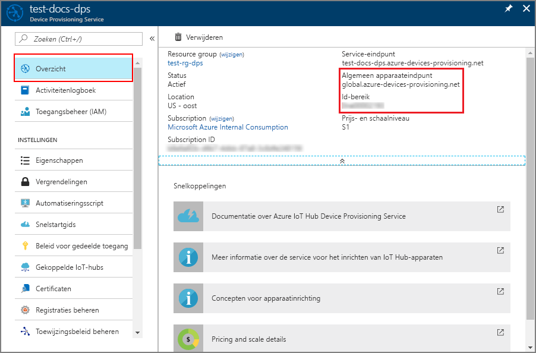
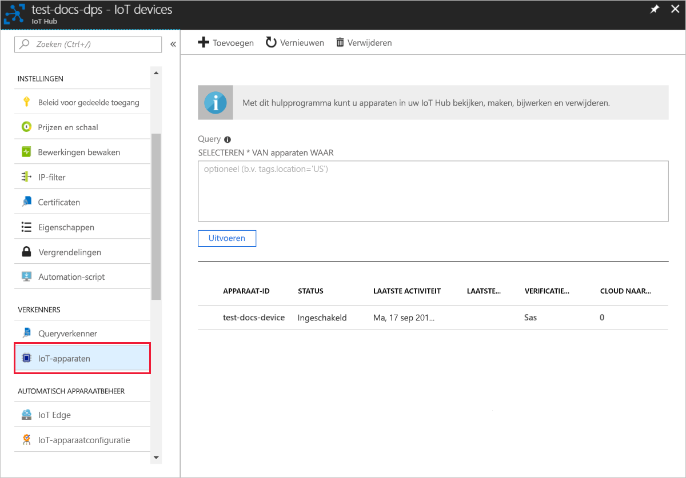

# <a name="create-and-provision-an-x509-simulated-device-using-nodejs-device-sdk-for-iot-hub-device-provisioning-service"></a>Een gesimuleerd X.509-apparaat met de SDK met Node.js maken en inrichten voor Azure IoT Hub Device Provisioning Service
[!INCLUDE [iot-dps-selector-quick-create-simulated-device-x509](../../includes/iot-dps-selector-quick-create-simulated-device-x509.md)]

Deze stappen laten zien hoe in u een vermelding voor apparaatinschrijving kunt maken in de Device Provisioning Service, hoe u een X.509-apparaat op uw ontwikkelcomputer kunt simuleren, het gesimuleerde apparaat kunt verbinden met de Device Provisioning Service en het apparaat kunt registreren op uw IoT-hub met behulp van de [apparaat-SDK voor Azure IoT Hub Node.js](https://github.com/Azure/azure-iot-sdk-node).

Als u niet bekend bent met het proces van automatische inrichting, bekijk dan ook de [Concepten voor automatische inrichting](concepts-auto-provisioning.md). Controleer ook of u de stappen in [IoT Hub Device Provisioning Service instellen met Azure Portal](./quick-setup-auto-provision.md) hebt voltooid voordat u verdergaat. 

[!INCLUDE [IoT Device Provisioning Service basic](../../includes/iot-dps-basic.md)]

## <a name="prepare-the-environment"></a>De omgeving voorbereiden 

1. Voltooi de stappen in [Set up the IoT Hub Device Provisioning Service with the Azure portal](./quick-setup-auto-provision.md) (IoT Hub Device Provisioning Service instellen met Azure Portal) voordat u verdergaat.

2. Zorg ervoor dat [Node.js v4.0 of hoger](https://nodejs.org) is geïnstalleerd op de computer.

3. Zorg ervoor dat [Git](https://git-scm.com/download/) op de computer is geïnstalleerd en is toegevoegd aan de omgevingsvariabelen die voor het opdrachtvenster toegankelijk zijn. 

4. Zorg ervoor dat [OpenSSL](https://www.openssl.org/) op de computer is geïnstalleerd en is toegevoegd aan de omgevingsvariabelen die voor het opdrachtvenster toegankelijk zijn. Deze bibliotheek kan ofwel worden gebouwd en geïnstalleerd vanuit de bron, of [van derden](https://wiki.openssl.org/index.php/Binaries) worden gedownload en geïnstalleerd zoals [deze](https://sourceforge.net/projects/openssl/). 

    > [!NOTE]
    > Als u uw _basis-_, _tussen-_ en/of _leaf_ X.509-certificaten al hebt gemaakt, kunt u deze stap en alle volgende stappen met betrekking tot het maken van certificaten overslaan.
    >

## <a name="create-a-self-signed-x509-device-certificate-and-individual-enrollment-entry"></a>Een zelfondertekend X.509-certificaat voor apparaten en een vermelding voor afzonderlijke registratie maken

In deze sectie gebruikt u een zelf-ondertekend X.509-certificaat. Het is hierbij belangrijk dat u rekening houdt met het volgende:

* Zelfondertekende certificaten zijn alleen voor testdoeleinden en moeten niet in productieomgevingen worden gebruikt.
* De standaardvervaltermijn voor een zelfondertekend certificaat is één jaar.

U gaat voorbeeldcode van de [Azure IoT C-SDK voor Node.js](https://github.com/Azure/azure-iot-sdk-node.git) gebruiken om het certificaat te maken dat moet worden gebruikt met de afzonderlijke inschrijvingsvermelding voor het gesimuleerde apparaat.


1. Open een opdrachtprompt. Kloon de GitHub-opslagplaats voor de codevoorbeelden:
    
    ```cmd/sh
    git clone https://github.com/Azure/azure-iot-sdk-node.git --recursive
    ```

2. Navigeer naar het certificaatgeneratorscript en bouw het project. 

    ```cmd/sh
    cd azure-iot-sdk-node/provisioning/tools
    npm install
    ```

3. Maak een _leaf_ X.509-certificaat door het script uit te voeren met uw eigen _certificaatnaam_. Zoals u ziet wordt de algemene naam van het leaf-certificaat de [registratie-id](https://docs.microsoft.com/azure/iot-dps/concepts-device#registration-id), dus zorg ervoor dat u alleen kleine letters en afbreekstreepjes gebruikt.

    ```cmd/sh
    node create_test_cert.js device {certificate-name}
    ```

4. Meld u aan bij [Azure Portal](https://portal.azure.com), klik in het linkermenu op de knop **Alle resources** en open het Device Provisioning Service-exemplaar.

5. Selecteer **Manage enrollments** in de overzichtsblade van Device Provisioning Service. Selecteer het tabblad **Afzonderlijke registraties** en klik vervolgens op de knop **Afzonderlijke inschrijving toevoegen** bovenaan. 

6. Voer onder het deelvenster **Inschrijving toevoegen** de volgende gegevens in:
    - Selecteer **X.509** als *mechanisme* voor identiteitscontrole.
    - Klik onder het *PEM- of CER-bestand van het primaire certificaat* op *Selecteer een bestand* om het certificaatbestand **{certificate-name}_cert.pem** te selecteren dat in de vorige stappen is gemaakt.  
    - Desgewenst kunt u de volgende informatie verstrekken:
      - Selecteer een IoT-hub die is gekoppeld aan uw inrichtingsservice.
      - Voer een unieke apparaat-id in. Vermijd gevoelige gegevens bij het benoemen van uw apparaat. 
      - Werk de **initiële status van de apparaatdubbel** bij met de gewenste beginconfiguratie voor het apparaat.
   - Klik op de knop **Save** als u klaar bent. 

    [](./media/quick-create-simulated-device-x509-node/device-enrollment.png#lightbox)

    Als het apparaat is ingeschreven, wordt uw X.509-apparaat weergegeven als **{certificatename}** onder de kolom *Registratie-id* op het tabblad *Afzonderlijke inschrijvingen*. Noteer deze waarde voor later.

## <a name="simulate-the-device"></a>Het apparaat simuleren

De [apparaat-SDK voor Azure IoT Hub Node.js](https://github.com/Azure/azure-iot-sdk-node) biedt een eenvoudige manier om een apparaat te simuleren. Zie [Apparaatconcepten](https://docs.microsoft.com/azure/iot-dps/concepts-device) voor meer informatie.

1. In Azure Portal selecteert u de blade **Overview** voor uw Device Provisioning-service en noteert u de waarden **_Global Device Endpoint_** en **_ID Scope_**.

     

2. Kopieer uw _certificaat_ en _sleutel_ naar de voorbeeldmap.

    ```cmd/sh
    copy .\{certificate-name}_cert.pem ..\device\samples\{certificate-name}_cert.pem
    copy .\{certificate-name}_key.pem ..\device\samples\{certificate-name}_key.pem
    ```

3. Navigeer naar het testscript van het apparaat en bouw het project. 

    ```cmd/sh
    cd ..\device\samples
    npm install
    ```

4. Bewerk het bestand **register\_x509.js**. Sla het bestand op nadat u de volgende wijzigingen hebt aangebracht.
    - Vervang `provisioning host` door het **_globaal apparaateindpunt_** dat u hebt genoteerd in **stap 1** hierboven.
    - Vervang `id scope` door het **_id-bereik_** dat u hebt genoteerd in **stap 1** hierboven. 
    - Vervang `registration id` door de **_registratie-id_** die u in de vorige sectie hebt genoteerd.
    - Vervang `cert filename` en `key filename` door de bestanden die u hebt gekopieerd in **stap 2** hierboven. 

5. Voer het script uit en controleer of het apparaat is ingericht.

    ```cmd/sh
    node register_x509.js
    ```   

6. Navigeer in de portal naar de IoT-hub die is gekoppeld aan uw Provisioning-service en open de blade **IoT-apparaten**. Wanneer het inrichten van het gesimuleerde X.509-apparaat voor de hub is geslaagd, wordt de apparaat-id weergegeven op de blade **IoT-apparaten** met de *STATUS* **ingeschakeld**. U moet mogelijk klikken op de knop **Vernieuwen** bovenaan als u de blade vóór het uitvoeren van de voorbeeldapparaattoepassing al hebt geopend. 

     

    Als u de standaardwaarde van de *initiële status van de apparaatdubbel* hebt gewijzigd in de inschrijvingsvermelding voor uw apparaat, kan de gewenste status van de dubbel uit de hub worden gehaald en er dienovereenkomstig naar worden gehandeld. Zie [Apparaatdubbels begrijpen en gebruiken in IoT Hub](../iot-hub/iot-hub-devguide-device-twins.md) voor meer informatie.


## <a name="clean-up-resources"></a>Resources opschonen

Als u wilt blijven doorwerken met het voorbeeld van de apparaatclient en deze beter wilt leren kennen, wis de resources die in deze Snelstartgids zijn gemaakt dan niet. Als u niet wilt doorgaan, gebruikt u de volgende stappen om alle resources die via deze Snelstartgids zijn gemaakt, te verwijderen.

1. Sluit het uitvoervenster van het voorbeeld van de apparaatclient op de computer.
2. Klik in het linkermenu in de Azure Portal op **Alle resources** en selecteer uw Device Provisioning Service. Open de blade **Inschrijvingen beheren** voor uw service en klik vervolgens op het tabblad **Afzonderlijke inschrijvingen**. Selecteer de *registratie-id* van het apparaat dat u hebt ingeschreven met behulp van deze quickstart. Klik vervolgens bovenaan op de knop **Verwijderen**. 
3. Klik in het linkermenu in de Azure Portal op **Alle resources** en selecteer vervolgens uw IoT-hub. Open de blade **IoT-apparaten** voor uw hub, selecteer de *apparaat-id* van het apparaat dat u hebt geregistreerd in deze quickstart en klik vervolgens bovenaan op de knop **Verwijderen**.


## <a name="next-steps"></a>Volgende stappen

In deze snelstartgids hebt u een gesimuleerd X.509-apparaat gemaakt en het ingericht voor uw IoT-hub met de Azure IoT Hub Device Provisioning Service op de portal. Als u wilt weten hoe u uw X.509-apparaat programmatisch kunt registreren, gaat u verder met de quickstart voor programmatische registratie van een X.509-apparaat. 

> [!div class="nextstepaction"]
> [Azure-quickstart: X.509-apparaat inschrijven bij Azure IoT Hub Device Provisioning Service](quick-enroll-device-x509-node.md)
