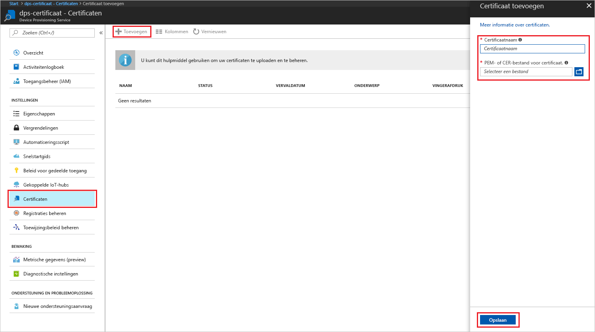
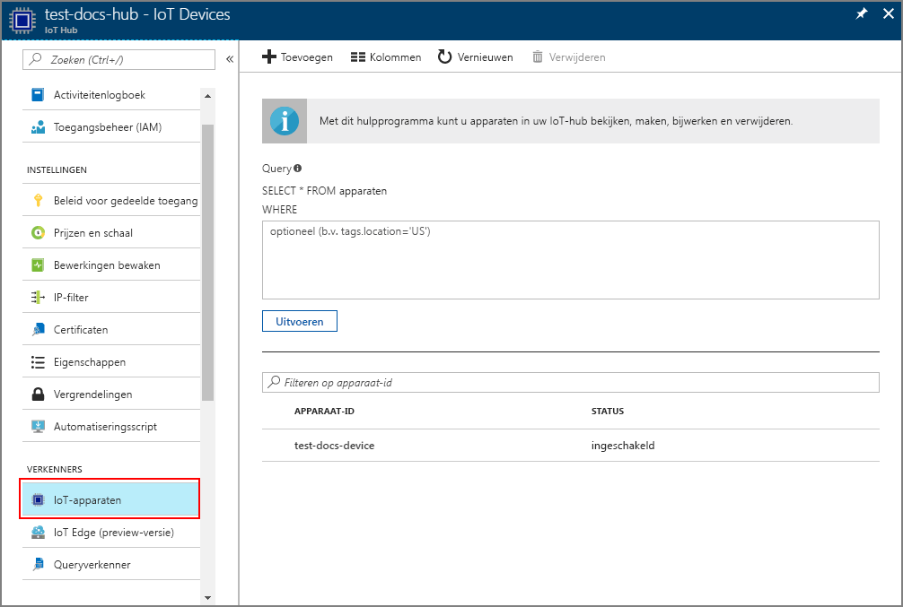

# <a name="create-and-provision-an-x509-simulated-device-using-nodejs-device-sdk-for-iot-hub-device-provisioning-service"></a>Een gesimuleerd X.509-apparaat met de SDK met Node.js maken en inrichten voor Azure IoT Hub Device Provisioning Service
[!INCLUDE [iot-dps-selector-quick-create-simulated-device-x509](../../includes/iot-dps-selector-quick-create-simulated-device-x509.md)]

De IoT Hub Device Provisioning Service is een helper-service voor IoT Hub die zero-touch-apparaatinrichting biedt voor de IoT-hub. Met de Device Provisioning Service kunt u miljoenen apparaten inrichten op een veilige en schaalbare manier.

Het inrichten van mobiele apparaten gaat in twee stappen. De eerste stap bestaat eruit om de juiste vermelding voor apparaatinschrijving te maken in de Device Provisioning Service, gebaseerd op de specifieke vereisten van de oplossing.  De tweede stap bestaat uit het tot stand brengen van een verbinding tussen het apparaat en de Device Provisioning Service voor het inrichten van apparaten, en uit het registeren van het apparaat bij de IoT-hub. Wanneer beide stappen zijn voltooid, kan het apparaat als volledig ingericht worden beschouwd. De Device Provisioning Service automatiseert beide stappen en biedt zo een naadloze ervaring voor de inrichting van het apparaat. Zie [Concepten van de Device Provisioning Service](https://docs.microsoft.com/en-us/azure/iot-dps/concepts-service) voor meer informatie.

Deze stappen laten zien hoe in u een vermelding voor apparaatinschrijving kunt maken in de Device Provisioning Service, hoe u een X.509-apparaat op uw ontwikkelcomputer kunt simuleren, het gesimuleerde apparaat kunt verbinden met de Device Provisioning Service en het apparaat kunt registreren op uw IoT-hub met behulp van de [apparaat-SDK voor Azure IoT Hub Node.js](https://github.com/Azure/azure-iot-sdk-node).

[!INCLUDE [IoT DPS basic](../../includes/iot-dps-basic.md)]

## <a name="prepare-the-environment"></a>De omgeving voorbereiden 

1. Voltooi de stappen in [Set up the IoT Hub Device Provisioning Service with the Azure portal](./quick-setup-auto-provision.md) (IoT Hub Device Provisioning Service instellen met Azure Portal) voordat u verdergaat.

1. Zorg ervoor dat [Node.js v4.0 of hoger](https://nodejs.org) is geïnstalleerd op de computer.

1. Zorg ervoor dat [Git](https://git-scm.com/download/) op de computer is geïnstalleerd en is toegevoegd aan de omgevingsvariabelen die voor het opdrachtvenster toegankelijk zijn. 

1. Zorg ervoor dat [OpenSSL](https://www.openssl.org/) op de computer is geïnstalleerd en is toegevoegd aan de omgevingsvariabelen die voor het opdrachtvenster toegankelijk zijn. Deze bibliotheek kan ofwel worden gebouwd en geïnstalleerd vanuit de bron, of [van derden](https://wiki.openssl.org/index.php/Binaries) worden gedownload en geïnstalleerd zoals [deze](https://sourceforge.net/projects/openssl/). 

    > [!NOTE]
    > Als u uw _basis-_, _tussen-_ en/of _leaf_ X.509-certificaten al hebt gemaakt, kunt u deze stap en alle volgende stappen met betrekking tot het maken van certificaten overslaan.
    >


## <a name="create-an-enrollment-entry"></a>Een vermelding voor inschrijving maken

Een inschrijving is de record met apparaten of groepen apparaten die op een bepaald moment worden geregistreerd en bewaard in de Device Provisioning Service. De inschrijvingsrecord bevat de gegevens over het apparaat of de groep apparaten, met inbegrip van details over het X.509-certificaat en aanvullende registratiegegevens. Er zijn twee soorten inschrijvingen die worden ondersteund door de Device Provisioning Service _Afzonderlijke inschrijving_ en _Inschrijvingsgroep_. Zie [Concepten voor inschrijving](https://docs.microsoft.com/en-us/azure/iot-dps/concepts-service#enrollment) voor meer informatie.

Als u uw eigen X.509-testcertificaten wilt maken, moet u [Beveiligingsconcepten](https://docs.microsoft.com/en-us/azure/iot-dps/concepts-security#x509-certificates) raadplegen als u wilt weten welke certificaten er nodig zijn voor uw oplossing, en [Hulpprogramma's voor Azure IoT Device Provisioning Device SDK voor Node.js](https://github.com/azure/azure-iot-sdk-node/tree/master/provisioning/tools) raadplegen voor implementatiegegevens.

1. Open een opdrachtprompt. Kloon de GitHub-opslagplaats voor de codevoorbeelden:
    
    ```cmd/sh
    git clone https://github.com/Azure/azure-iot-sdk-node.git --recursive
    ```

1. Navigeer naar het certificaatgeneratorscript en bouw het project. 

    ```cmd/sh
    cd azure-iot-sdk-node/provisioning/tools
    npm install
    ```

1. Maak de inschrijvingsgegevens op een van de volgende manieren, afhankelijk van de installatie:

    - **Afzonderlijke inschrijving**:

        1. Maak het_leaf_-certificaat door het script uit te voeren met uw eigen _certificaatnaam_. Zoals u ziet wordt de algemene naam van het leaf-certificaat de [registratie-id](https://docs.microsoft.com/en-us/azure/iot-dps/concepts-device#registration-id), dus zorg ervoor dat u alleen kleine letters en afbreekstreepjes gebruikt.

        ```cmd/sh
        node create_test_cert.js device {certificate-name}
        ```
         
        1. Open in **Azure Portal** de overzichtsblade **Device Provisioning Service**. Selecteer **Registraties beheren**, vervolgens het tabblad **Afzonderlijke inschrijvingen** en klik bovenaan op de knop **Toevoegen**. 

        1. Voer onder bij **Registratielijstitem toevoegen** de volgende gegevens in:
            - Selecteer **X.509** als *mechanisme* voor identiteitscontrole.
            - Gebruik de widget *Bestandenverkenner* om onder *PEM- of CER-bestand voor certificaat*, het certificaatbestand **_{certificate-name}\_cert.pem_**te selecteren dat u in de vorige stappen hebt gemaakt.
            - Desgewenst kunt u de volgende informatie verstrekken:
                - Selecteer een IoT-hub die is gekoppeld aan uw inrichtingsservice.
                - Voer een unieke apparaat-id in. Vermijd gevoelige gegevens bij het benoemen van uw apparaat. 
                - Werk de **initiële status van de apparaatdubbel** bij met de gewenste beginconfiguratie voor het apparaat.
            - Klik op de knop **Save** als u klaar bent. 

          

    Als het apparaat is ingeschreven, wordt uw X.509-apparaat weergegeven als **{certificatename}** onder de kolom *Registratie-id* op het tabblad *Afzonderlijke inschrijvingen*. Noteer deze waarde voor later.

    - **Inschrijvingsgroepen**: 

        1. Maak het_basis_certificaat door het script uit te voeren met uw eigen _basiscertificaatnaam_.

        ```cmd/sh
        node create_test_cert.js root {root-name}
        ```

        1. Open in **Azure Portal** de overzichtsblade **Device Provisioning Service**. Selecteer **Certificaten** en klik bovenaan op de knop **Toevoegen**.

        1. Voer bij **Certificaat toevoegen** de volgende gegevens in:
            - Voer een unieke certificaatnaam in.
            - Selecteer het bestand **_{root-name}\_cert.pem_** dat u eerder hebt gemaakt.
            - Klik op de knop **Save** als u klaar bent.

        

        1. Selecteer het zojuist gemaakte netwerk:
            - Klik op **Verificatiecode genereren**. Kopieer de gegenereerde code.
            - Maak het _verificatiecertificaat_. Voer de _verificatiecode_ in of klik er met de rechtermuisknop op en plak deze in het venster met het actieve Node-script met de volgende opdracht:

                ```cmd/sh
                node create_test_cert.js verification {rootname_cert} {verification code}
                ```

            - Gebruik de widget *Bestandenverkenner* om onder *PEM- of CER-bestand voor verificatiecertificaat* **_verification_cert.pem_**, het certificaatbestand te selecteren dat u in de vorige stappen hebt gemaakt. Klik op **Controleren**.

            

        1. Selecteer **Inschrijvingen beheren**. Selecteer het tabblad **Groepsinschrijvingen** en klik bovenaan op de knop **Toevoegen**.
            - Voer een unieke groepsnaam in.
            - Selecteer de uniek certificaatnaam die u eerder hebt gemaakt
            - Desgewenst kunt u de volgende informatie verstrekken:
                - Selecteer een IoT-hub die is gekoppeld aan uw inrichtingsservice.
                - Werk de **initiële status van de apparaatdubbel** bij met de gewenste beginconfiguratie voor het apparaat.

        

        Nadat de inschrijving is voltooid, wordt de X.509-apparaatgroep weergegeven in de kolom *Groepsnaam* op het tabblad *Inschrijvingsgroepen*. Noteer deze waarde voor later.

        1. Maak het _leaf_ certificaat door het script uit te voeren met uw eigen _certficate-name_ gevolgd door de _root-name_ die u eerder hebt gebruikt. De algemene naam van het leaf-certificaat wordt de [registratie-id](https://docs.microsoft.com/en-us/azure/iot-dps/concepts-device#registration-id), dus zorg ervoor dat u alleen kleine letters en afbreekstreepjes gebruikt.

            ```cmd/sh
            node create_test_cert.js device {certificate-name} {root-name}
            ```

        > [!NOTE]
        > U kunt ook _tussencertificaten_ maken met behulp van `node create_test_cert.js intermediate {certificate-name} {parent-name}`. Zorg ervoor dat u het _leaf_-certificaat als laatste maakt met behulp van het meest recente _tussencertificaat_ als basiscertificaat/bovenliggend certificaat. Zie [Apparaattoegang beheren](https://docs.microsoft.com/en-us/azure/iot-dps/concepts-security#controlling-device-access-to-the-provisioning-service-with-x509-certificates) voor meer informatie.
        >


## <a name="simulate-the-device"></a>Het apparaat simuleren

De [apparaat-SDK voor Azure IoT Hub Node.js](https://github.com/Azure/azure-iot-sdk-node) biedt een eenvoudige manier om een apparaat te simuleren. Zie [Apparaatconcepten](https://docs.microsoft.com/en-us/azure/iot-dps/concepts-device) voor meer informatie.

1. In Azure Portal selecteert u de blade **Overview** voor uw Device Provisioning-service en noteert u de waarden **_Global Device Endpoint_** en **_ID Scope_**.

     

1. Kopieer uw _certificaat_ en _sleutel_ naar de voorbeeldmap.

    ```cmd/sh
    copy .\{certificate-name}_cert.pem ..\device\samples\{certificate-name}_cert.pem
    copy .\{certificate-name}_key.pem ..\device\samples\{certificate-name}_key.pem
    ```

1. Navigeer naar het testscript van het apparaat en bouw het project. 

    ```cmd/sh
    cd ..\device\samples
    npm install
    ```

1. Bewerk het bestand **register\_x509.js**. Sla het bestand op nadat u de volgende wijzigingen hebt aangebracht.
    - Vervang `provisioning host` door het **_globaal apparaateindpunt_** dat u hebt genoteerd in **stap 1** hierboven.
    - Vervang `id scope` door het **_id-bereik_** dat u hebt genoteerd in **stap 1** hierboven. 
    - Vervang `reigstration id` door de **_registratie-id_** of **_groepsnaam_** die u in de vorige sectie hebt genoteerd.
    - Vervang `cert filename` en `key filename` door de bestanden die u hebt gekopieerd in **stap 2** hierboven. 

1. Voer het script uit en controleer of het apparaat is ingericht.

    ```cmd/sh
    node register_x509.js
    ```   

1. Navigeer in de portal naar de IoT-hub die is gekoppeld aan uw Provisioning-service en open de blade **IoT-apparaten**. Wanneer het inrichten van het gesimuleerde X.509-apparaat voor de hub is geslaagd, wordt de apparaat-id weergegeven op de blade **IoT-apparaten** met de *STATUS* **ingeschakeld**. U moet mogelijk klikken op de knop **Vernieuwen** bovenaan als u de blade vóór het uitvoeren van de voorbeeldapparaattoepassing al hebt geopend. 

     

    Als u de standaardwaarde van de *initiële status van de apparaatdubbel* hebt gewijzigd in de inschrijvingsvermelding voor uw apparaat, kan de gewenste status van de dubbel uit de hub worden gehaald en er dienovereenkomstig naar worden gehandeld. Zie [Apparaatdubbels begrijpen en gebruiken in IoT Hub](../iot-hub/iot-hub-devguide-device-twins.md) voor meer informatie.


## <a name="clean-up-resources"></a>Resources opschonen

Als u wilt blijven doorwerken met het voorbeeld van de apparaatclient en deze beter wilt leren kennen, wis de resources die in deze Snelstartgids zijn gemaakt dan niet. Als u niet wilt doorgaan, gebruikt u de volgende stappen om alle resources die via deze Snelstartgids zijn gemaakt, te verwijderen.

1. Sluit het uitvoervenster van het voorbeeld van de apparaatclient op de computer.
1. Klik in het linkermenu in de Azure Portal op **Alle resources** en selecteer uw Device Provisioning Service. Open de blade **Inschrijvingen beheren** voor uw service en klik vervolgens op het tabblad **Afzonderlijke inschrijvingen** of **Inschrijvingsgroepen**. Selecteer de *registratie-id* of *groepsnaam* van het apparaat dat u hebt ingeschreven met behulp van deze snelstartgids. Klik vervolgens bovenaan op de knop **Verwijderen**. 
1. Klik in het linkermenu in de Azure Portal op **Alle resources** en selecteer vervolgens uw IoT-hub. Open de blade **IoT-apparaten** voor uw hub, selecteer de *apparaat-id* van het apparaat dat u hebt geregistreerd in deze quickstart en klik vervolgens bovenaan op de knop **Verwijderen**.


## <a name="next-steps"></a>Volgende stappen

In deze snelstartgids hebt u een gesimuleerd X.509-apparaat gemaakt en het ingericht voor uw IoT-hub met de Azure IoT Hub Device Provisioning Service op de portal. Als u wilt weten hoe u uw X.509-apparaat programmatisch kunt registreren, gaat u verder met de quickstart voor programmatische registratie van een X.509-apparaat. 

> [!div class="nextstepaction"]
> [Azure-quickstart: X.509-apparaat inschrijven bij Azure IoT Hub Device Provisioning Service](quick-enroll-device-x509-node.md)
