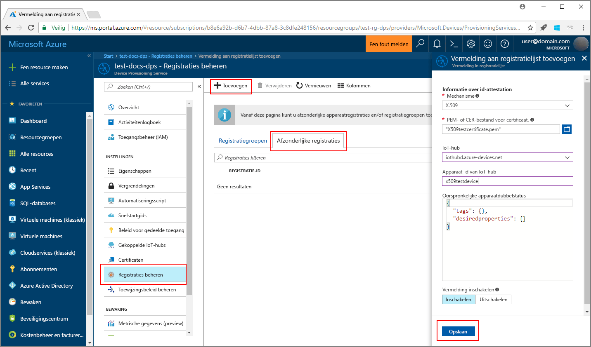
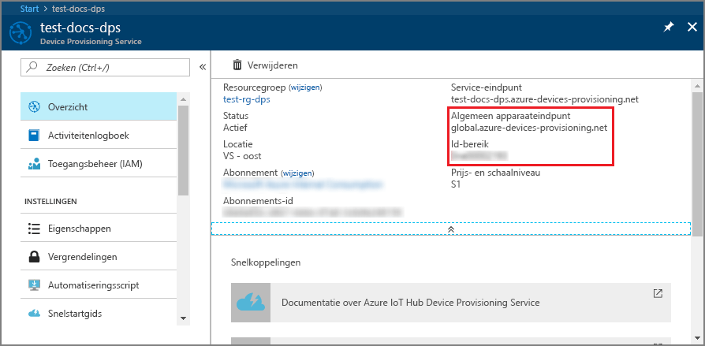
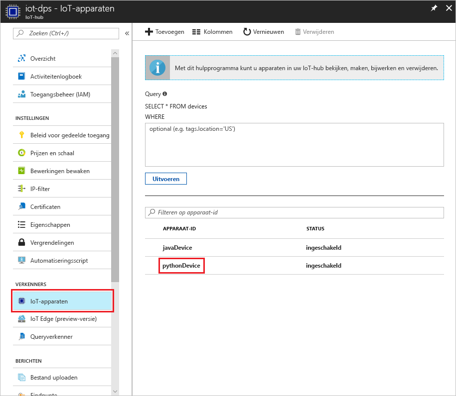

# <a name="create-and-provision-a-simulated-x509-device-using-python-device-sdk-for-iot-hub-device-provisioning-service"></a>Een gesimuleerd X.509-apparaat met de SDK voor Python maken en inrichten voor IoT Hub Device Provisioning Service
> [!div class="op_single_selector"]
> * [C](quick-create-simulated-device-x509.md)
> * [Java](quick-create-simulated-device-x509-java.md)
> * [C#](quick-create-simulated-device-x509-csharp.md)
> * [Python](quick-create-simulated-device-x509-python.md)

In deze stappen wordt getoond hoe u een gesimuleerd X.509-apparaat maakt op een ontwikkelcomputer met Windows OS en het Python-codevoorbeeld gebruikt om dit gesimuleerde apparaat te verbinden met de Device Provisioning Service en uw IoT-hub. 

Voltooi de stappen in [IoT Hub Device Provisioning Service instellen](./quick-setup-auto-provision.md) voordat u verdergaat.


## <a name="prepare-the-environment"></a>De omgeving voorbereiden 

1. Op uw computer moet [Visual Studio 2015](https://www.visualstudio.com/vs/older-downloads/) of [Visual Studio 2017](https://www.visualstudio.com/vs/) zijn geïnstalleerd. De workload 'Desktop development with C++' (Bureaubladontwikkeling met C++) moet zijn ingeschakeld voor uw installatie van Visual Studio.

1. Download en installeer het [CMake-bouwsysteem](https://cmake.org/download/).

1. Zorg ervoor dat `git` op de computer wordt geïnstalleerd en toegevoegd aan de omgevingsvariabelen die voor het opdrachtvenster toegankelijk zijn. Zie [Software Freedom Conservancy's Git client tools](https://git-scm.com/download/) (Git-clienthulpprogramma's van Software Freedom Conservancy) om de nieuwste versie van `git`-hulpprogramma's te installeren, waaronder **Git Bash**, de opdrachtregel-app die u kunt gebruiken voor interactie met de lokale Git-opslagplaats. 

1. Open een opdrachtprompt of Git Bash. Kloon het codevoorbeeld voor apparaatsimulatie uit de GitHub-opslagplaats.
    
    ```cmd/sh
    git clone https://github.com/Azure/azure-iot-sdk-python.git --recursive
    ```

1. Maak een map in de lokale kopie van deze GitHub-opslagplaats voor het CMake-bouwproces. 

    ```cmd/sh
    cd azure-iot-sdk-python/c
    mkdir cmake
    cd cmake
    ```

1. Voer de volgende opdracht uit om de Visual Studio-oplossing te maken voor de client die de inrichting verzorgt.

    ```cmd/sh
    cmake -Duse_prov_client:BOOL=ON ..
    ```


## <a name="create-a-device-enrollment-entry"></a>Een vermelding voor apparaatinschrijving maken

1. Open de in de map *cmake* gemaakt oplossing met de naam `azure_iot_sdks.sln` en bouw deze in Visual Studio.

1. Klik met de rechtermuisknop op het project **dice\_device\_enrollment** onder de map **Provision\_Tools** en selecteer **Set as Startup Project**. Voer de oplossing uit. Voer in het uitvoervenster `i` in voor individuele inschrijving wanneer u hierom wordt gevraagd. In het uitvoervenster wordt een lokaal gegenereerd X.509-certificaat weergegeven voor uw gesimuleerde apparaat. Kopieer de uitvoer naar Klembord vanaf *-----BEGIN CERTIFICATE-----* en tot *-----END CERTIFICATE-----*, en zorg er voor dat deze beide regels ook zijn opgenomen. 

    
 
1. Maak een bestand met de naam  **_X509testcertificate.pem_**  op uw Windows-computer, open het in een editor naar keuze en kopieer de inhoud van het Klembord naar dit bestand. Sla het bestand op. 

1. Meld u aan bij Azure Portal, klik in het linkermenu op de knop **All resources** en open uw Provisioning-service.

1. Selecteer **Manage enrollments** in de overzichtsblade van Device Provisioning Service. Selecteer het tabblad **Individual Enrollments** en klik bovenaan op de knop **Add**. 

1. Voer onder bij **Registratielijstitem toevoegen** de volgende gegevens in:
    - Selecteer **X.509** als *mechanisme* voor identiteitscontrole.
    - Selecteer onder *PEM- of CER-bestand voor certificaat* het certificaatbestand  **_X509testcertificate.pem_**  dat in de vorige stappen is gemaakt met behulp van de widget *Bestandenverkenner*.
    - Desgewenst kunt u de volgende informatie verstrekken:
        - Selecteer een IoT-hub die is gekoppeld aan uw inrichtingsservice.
        - Voer een unieke apparaat-id in. Vermijd gevoelige gegevens bij het benoemen van uw apparaat. 
        - Werk de **initiële status van de apparaatdubbel** bij met de gewenste beginconfiguratie voor het apparaat.
    - Klik op de knop **Save** als u klaar bent. 

      

   Als het apparaat is ingeschreven, wordt uw X.509-apparaat weergegeven als **riot-device-cert** onder de kolom *Registratie-id* op het tabblad *Afzonderlijke registraties*. 


## <a name="simulate-the-device"></a>Het apparaat simuleren

1. Selecteer **Overzicht** in de overzichtsblade van de Device Provisioning Service. Maak notitie van uw _id-bereik_ en het _globaal service-eindpunt_.

    

1. [Download en installeer Python 2.x of 3.x](https://www.python.org/downloads/). Zorg ervoor dat u de 32-bits of 64-bits installatie gebruikt, zoals vereist door uw configuratie. Zorg ervoor dat u Python toevoegt aan uw platformspecifieke omgevingsvariabelen als u hierom wordt gevraagd tijdens de installatie. Als u Python 2.x gebruikt, moet u mogelijk [pip *installeren of upgraden*, het Python-pakketbeheersysteem](https://pip.pypa.io/en/stable/installing/).
    - Als u een Windows-besturingssysteem hebt, gebruikt u vervolgens het [herdistribueerbare pakket van Visual C++](http://www.microsoft.com/download/confirmation.aspx?id=48145) om het gebruik van systeemeigen DLL's van Python mogelijk te maken.

1. Volg [deze instructies](https://github.com/Azure/azure-iot-sdk-python/blob/master/doc/python-devbox-setup.md) voor het bouwen van de Python-pakketten.

    > [!NOTE]
        > Als u `pip` gebruikt, zorg dan ook dat u het pakket `azure-iot-provisioning-device-client` installeert.

1. Navigeer naar de map met voorbeelden.

    ```cmd/sh
    cd azure-iot-sdk-python/provisioning_device_client/samples
    ```

1. Gebruik Python IDE om het Python-script met de naam **provisioning\_device\_client\_sample.py** te bewerken. Wijzig de variabelen _GLOBAL\_PROV\_URI_ en _ID\_SCOPE_ in de waarden die u eerder hebt genoteerd.

    ```python
    GLOBAL_PROV_URI = "{globalServiceEndpoint}"
    ID_SCOPE = "{idScope}"
    SECURITY_DEVICE_TYPE = ProvisioningSecurityDeviceType.X509
    PROTOCOL = ProvisioningTransportProvider.HTTP
    ```

1. Voer het voorbeeld uit. 

    ```cmd/sh
    python provisioning_device_client_sample.py
    ```

1. De toepassing zorgt dat het apparaat verbinding heeft en wordt geregistreerd. Vervolgens wordt een bericht weergegeven dat de registratie is gelukt.

    

1. Navigeer in de portal naar de IoT-hub die is gekoppeld aan uw Provisioning-service en open de blade **Device Explorer**. Wanneer het inrichten van het gesimuleerde X.509-apparaat voor de hub is geslaagd, wordt de apparaat-ID weergegeven op de blade **Device Explorer** met de *STATUS* **ingeschakeld**. U moet mogelijk klikken op de knop **Vernieuwen** bovenaan als u de blade vóór het uitvoeren van de voorbeeldapparaattoepassing al hebt geopend. 

     

> [!NOTE]
> Als u de standaardwaarde van de *initiële status van de apparaatdubbel* hebt gewijzigd in de inschrijvingsvermelding voor uw apparaat, kan de gewenste status van de dubbel uit de hub worden gehaald en er dienovereenkomstig naar worden gehandeld. Zie [Apparaatdubbels begrijpen en gebruiken in IoT Hub](../iot-hub/iot-hub-devguide-device-twins.md) voor meer informatie.
>


## <a name="clean-up-resources"></a>Resources opschonen

Als u wilt blijven doorwerken met het voorbeeld van de apparaatclient en deze beter wilt leren kennen, wis de resources die in deze quickstart zijn gemaakt dan niet. Als u niet wilt doorgaan, gebruikt u de volgende stappen om alle resources die via deze quickstart zijn gemaakt, te verwijderen.

1. Sluit het uitvoervenster van het voorbeeld van de apparaatclient op de computer.
1. Klik in het linkermenu in de Azure Portal op **Alle resources** en selecteer uw Device Provisioning Service. Open de blade **Inschrijvingen beheren** voor uw service en klik vervolgens op het tabblad **Afzonderlijke inschrijvingen**. Selecteer de *registratie-id* van het apparaat dat u hebt ingeschreven met behulp van deze quickstart. Klik vervolgens bovenaan op de knop **Verwijderen**. 
1. Klik in het linkermenu in de Azure Portal op **Alle resources** en selecteer vervolgens uw IoT-hub. Open de blade **IoT-apparaten** voor uw hub, selecteer de *apparaat-id* van het apparaat dat u hebt geregistreerd in deze quickstart en klik vervolgens bovenaan op de knop **Verwijderen**.

## <a name="next-steps"></a>Volgende stappen

In deze quickstart hebt u een gesimuleerd X.509-apparaat op uw Windows-computer gemaakt en het ingericht voor uw IoT-hub met de Azure IoT Hub Device Provisioning Service in de portal. Als u wilt weten hoe u uw X.509-apparaat programmatisch kunt registreren, gaat u verder met de quickstart voor programmatische registratie van een X.509-apparaat. 

> [!div class="nextstepaction"]
> [Azure-quickstart: X.509-apparaat inschrijven bij Azure IoT Hub Device Provisioning Service](quick-enroll-device-x509-java.md)
