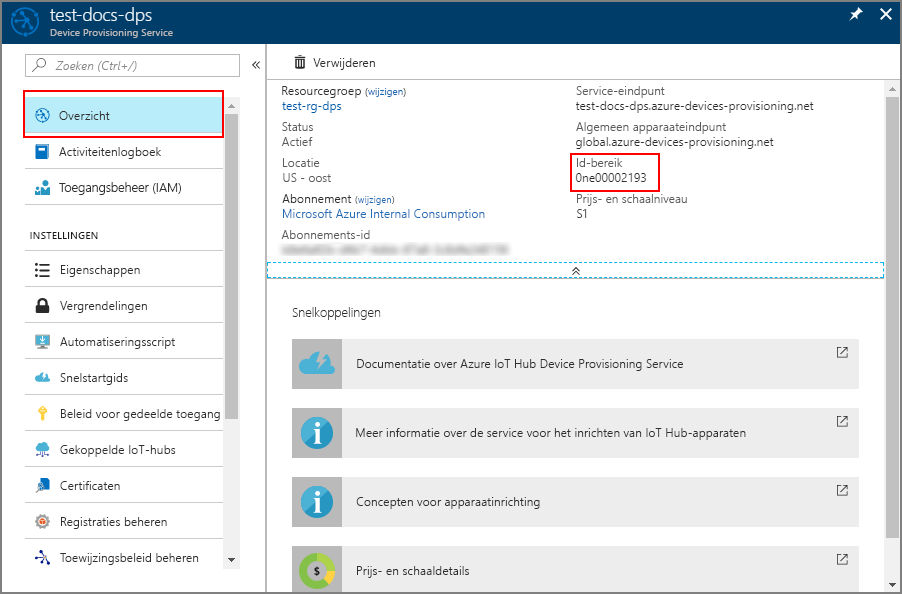

# <a name="create-and-provision-an-x509-simulated-device-using-iot-hub-device-provisioning-service-preview"></a>Een gesimuleerd X.509-apparaat maken en inrichten met IoT Hub Device Provisioning Service (preview)
> [!div class="op_single_selector"]
> * [TPM](quick-create-simulated-device.md)
> * [X.509](quick-create-simulated-device-x509.md)

In deze stappen wordt getoond hoe u een gesimuleerd X.509-apparaat maakt op een ontwikkelcomputer met Windows OS en het codevoorbeeld gebruikt om dit gesimuleerde apparaat te verbinden met de Device Provisioning Service en uw IoT-hub. 

Voltooi de stappen in [IoT Hub Device Provisioning Service instellen](./quick-setup-auto-provision.md) voordat u verdergaat.

<a id="setupdevbox"></a>
## <a name="prepare-the-development-environment"></a>De ontwikkelomgeving voorbereiden 

1. Op uw computer moet Visual Studio 2015 of [Visual Studio 2017](https://www.visualstudio.com/vs/) zijn geïnstalleerd. De workload 'Desktop development with C++' (Bureaubladontwikkeling met C++) moet zijn ingeschakeld voor uw installatie van Visual Studio.

2. Download en installeer het [CMake-bouwsysteem](https://cmake.org/download/).

3. Zorg ervoor dat `git` op de computer wordt geïnstalleerd en toegevoegd aan de omgevingsvariabelen die voor het opdrachtvenster toegankelijk zijn. Zie [Software Freedom Conservancy's Git client tools](https://git-scm.com/download/) (Git-clienthulpprogramma's van Software Freedom Conservancy) om de nieuwste versie van `git`-hulpprogramma's te installeren, waaronder **Git Bash**, de opdrachtregel-app die u kunt gebruiken voor interactie met de lokale Git-opslagplaats. 

4. Open een opdrachtprompt of Git Bash. Kloon het codevoorbeeld voor de GitHub-opslagplaats voor apparaatsimulatie:
    
    ```cmd/sh
    git clone https://github.com/Azure/azure-iot-sdk-c.git --recursive
    ```

5. Maak een map in de lokale kopie van deze GitHub-opslagplaats voor het CMake-bouwproces. 

    ```cmd/sh
    cd azure-iot-sdk-c
    mkdir cmake
    cd cmake
    ```

6. Voer de volgende opdracht uit om de Visual Studio-oplossing te maken voor de client die de inrichting verzorgt.

    ```cmd/sh
    cmake -Duse_prov_client:BOOL=ON ..
    ```


## <a name="create-a-device-enrollment-entry-in-the-device-provisioning-service"></a>Een vermelding voor apparaatinschrijving maken in Device Provisioning Service

1. Open de in de map *cmake* gemaakt oplossing met de naam `azure_iot_sdks.sln` en bouw deze in Visual Studio.

2. Klik met de rechtermuisknop op het project **dice\_device\_enrollment** onder de map **Provision\_Samples** map en selecteer **Set as Startup Project**. Voer de oplossing uit. Voer in het uitvoervenster `i` in voor individuele inschrijving wanneer u hierom wordt gevraagd. In het uitvoervenster wordt een lokaal gegenereerd X.509-certificaat weergegeven voor uw gesimuleerde apparaat. Kopieer de uitvoer naar Klembord vanaf *-----BEGIN CERTIFICATE-----* en tot *-----END PUBLIC KEY-----*, en zorg er voor dat deze beide regels ook zijn opgenomen. 
 
3. Maak een bestand met de naam  **_X509testcertificate.pem_**  op uw Windows-computer, open het in een editor naar keuze en kopieer de inhoud van het Klembord naar dit bestand. Sla het bestand op. 

4. Meld u aan bij Azure Portal, klik in het linkermenu op de knop **All resources** en open uw Provisioning-service.

4. Selecteer **Manage enrollments** in de overzichtsblade van Device Provisioning Service. Selecteer het tabblad **Individual Enrollments** en klik bovenaan op de knop **Add**. 

5. Voer onder bij **Registratielijstitem toevoegen** de volgende gegevens in:
    - Selecteer **X.509** als *mechanisme* voor identiteitscontrole.
    - Selecteer onder *PEM- of CER-bestand voor certificaat* het certificaatbestand  **_X509testcertificate.pem_**  dat in de vorige stappen is gemaakt met behulp van de widget *Bestandenverkenner*.
    - Desgewenst kunt u de volgende informatie verstrekken:
        - Selecteer een IoT-hub die is gekoppeld aan uw inrichtingsservice.
        - Voer een unieke apparaat-id in. Vermijd gevoelige gegevens bij het benoemen van uw apparaat. 
        - Werk de **initiële status van de apparaatdubbel** bij met de gewenste beginconfiguratie voor het apparaat.
    - Klik op de knop **Save** als u klaar bent. 

      

   Als het apparaat is ingeschreven, wordt uw X.509-apparaat weergegeven als **riot-device-cert** onder de kolom *Registratie-id* op het tabblad *Afzonderlijke registraties*. 


<a id="firstbootsequence"></a>
## <a name="simulate-first-boot-sequence-for-the-device"></a>Eerste opstartvolgorde voor het apparaat simuleren

1. Selecteer in Azure Portal de blade **Overzicht** voor uw Device Provisioning-service en noteer de waarde van het **_Id-bereik_**.

     

2. Navigeer op uw computer in Visual Studio naar hetzelfde project met de naam **prov\_dev\_client\_sample** onder de map **Provision\_Samples** en open het bestand **prov\_dev\_client\_sample.c**.

3. Wijs de waarde _ID Scope_ aan de `scope_id`-variabele toe. 

    ```c
    static const char* scope_id = "[ID Scope]";
    ```

4. Klik met de rechtermuisknop op het **prov\_dev\_client\_sample**-project en selecteer **Set as Startup Project**. Voet het voorbeeld uit. De gegevens van uw IoT-hub leest u in de berichten die het opstarten van het apparaat en het verbinding maken met Device Provisioning Service simuleren. Zoek naar een bericht dat een succesvolle registratie bij uw hub aangeeft: *Registration Information received from service: yourhuburl!*. Sluit het venster wanneer u daarom wordt gevraagd.

5. Navigeer in de portal naar de IoT-hub die is gekoppeld aan uw Provisioning-service en open de blade **Device Explorer**. Wanneer het inrichten van het gesimuleerde X.509-apparaat voor de hub is geslaagd, wordt de apparaat-ID weergegeven op de blade **Device Explorer** met de *STATUS* **ingeschakeld**. Let op: u moet mogelijk klikken op de knop **Vernieuwen** bovenaan als u de blade vóór het uitvoeren van de voorbeeldapparaattoepassing al hebt geopend. 

     

> [!NOTE]
> Als u de standaardwaarde van de *initiële status van de apparaatdubbel* hebt gewijzigd in de inschrijvingsvermelding voor uw apparaat, kan de gewenste status van de dubbel uit de hub worden gehaald en er dienovereenkomstig naar worden gehandeld. Zie [Apparaatdubbels begrijpen en gebruiken in IoT Hub](../iot-hub/iot-hub-devguide-device-twins.md) voor meer informatie.
>


## <a name="clean-up-resources"></a>Resources opschonen

Als u wilt blijven doorwerken met het voorbeeld van de apparaatclient en deze beter wilt leren kennen, wis de resources die in deze QuickStart zijn gemaakt dan niet. Als u niet wilt doorgaan, gebruikt u de volgende stappen om alle resources die via deze QuickStart zijn gemaakt, te verwijderen.

1. Sluit het uitvoervenster van het voorbeeld van de apparaatclient op de computer.
1. Klik in het linkermenu in de Azure Portal op **Alle resources** en selecteer uw Device Provisioning Service. Klik bovenaan de blade **Alle resources** op **Verwijderen**.  
1. Klik in het linkermenu in de Azure Portal op **Alle resources** en selecteer vervolgens uw IoT-hub. Klik bovenaan de blade **Alle resources** op **Verwijderen**.  

## <a name="next-steps"></a>Volgende stappen

In deze QuickStart hebt u een gesimuleerd X.509-apparaat op uw Windows-computer gemaakt en het ingericht voor uw IoT-hub met de Azure IoT Hub Device Provisioning Service. Voor meer informatie over device provisioning, gaat u verder met de zelfstudie voor het instellen van Device Provisioning Service in Azure Portal. 

> [!div class="nextstepaction"]
> [Zelfstudies over Azure IoT Hub Device Provisioning Service](./tutorial-set-up-cloud.md)
